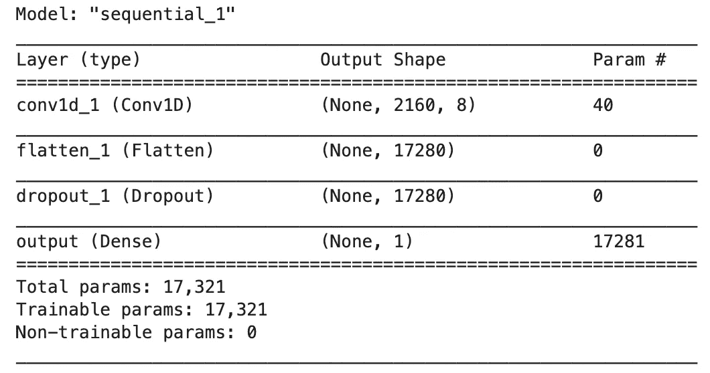
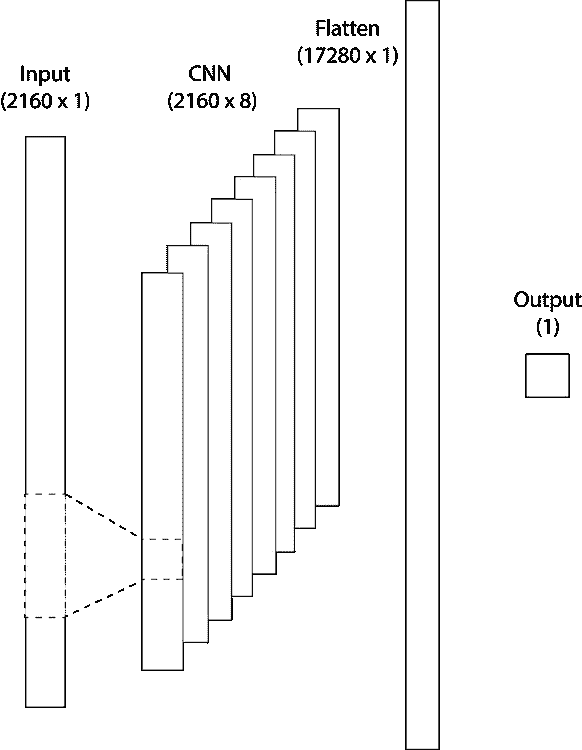
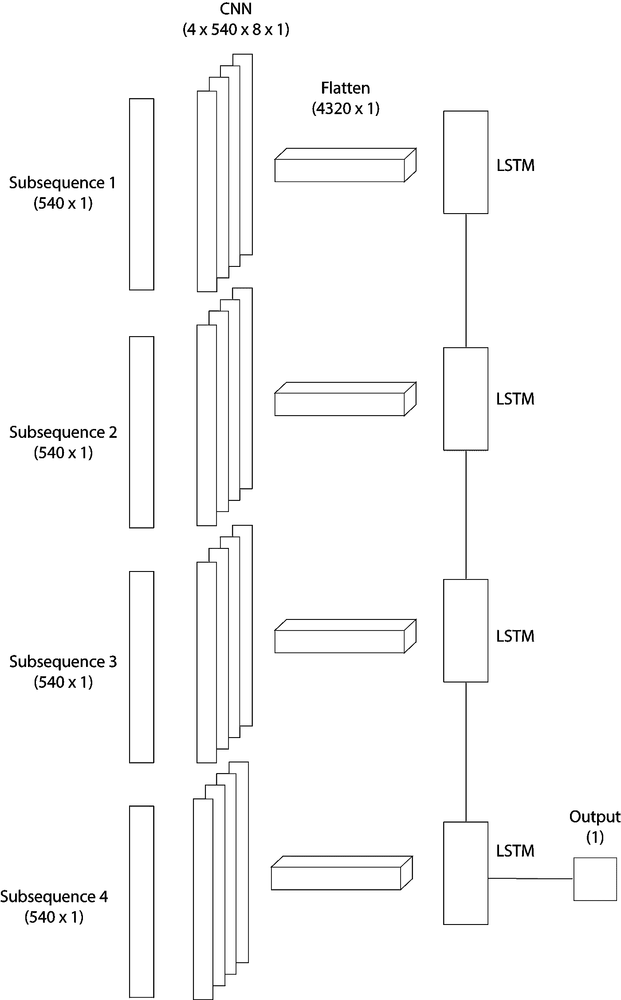
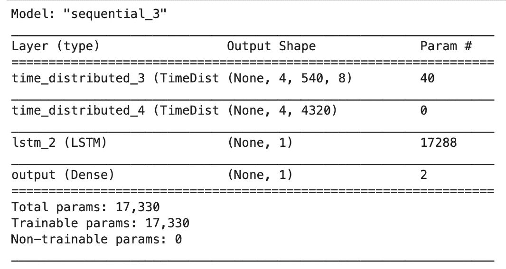

# 使用深度学习的心律失常检测

> 原文：<https://towardsdatascience.com/heart-arrhythmia-detection-using-deep-learning-a659848f2742?source=collection_archive---------12----------------------->

## *如何利用 Tensorflow / Keras 结合 CNN 和 LSTM 进行时间序列分类*


由[西蒙·米加杰](https://unsplash.com/@simonmigaj?utm_source=medium&utm_medium=referral)在 [Unsplash](https://unsplash.com?utm_source=medium&utm_medium=referral) 上拍摄的照片

深度学习最近正在帮助解决的一个常见问题涉及时间序列分类。解决这类问题的经典方法是从我们拥有的信号中生成特征，并训练一个机器学习模型。

手工制作功能的过程可能会占用您项目日程的很大一部分。就此而言，采用卷积神经网络与长短期记忆递归神经网络的组合。这种架构已被证明是有效的，可以减少花费在特征工程上的时间。

在本文中，我们将训练几个模型来检测不规则的心律。其思想是逐步展示如何为时间序列分类建立一个序列模型。如果你想深入了解这个问题，我强烈推荐[这篇来自斯坦福 ML 小组的文章](https://stanfordmlgroup.github.io/projects/ecg/)。

# 处理数据集

在这个实验中，我们将使用[麻省理工学院-BIH 心律失常数据库](https://physionet.org/content/mitdb/1.0.0/)，其中包含从 47 名受试者获得的 48 个半小时的双通道动态心电图记录摘录。心脏病专家对数据集进行了注释，所有标签和对数据收集方式的完整解释可在此处找到。

为了这个实验的目的，让我们只考虑两类:正常节拍和异常节拍。从标签中丢弃无效的节拍。这些被认为是标签，不在这些列表上的被标记为正常。

每个记录由一个信号及其注释组成。这两个文件都是通过库 [Python WFDB](https://github.com/MIT-LCP/wfdb-python) 读取的。可以使用以下方式读取记录:

```
record = wfdb.rdrecord(filename)
annotation = wfdb.rdann(filename, "atr")
```

注释包含每个节拍注释。在我们的模型中，每个样本将是一个作为目标的节拍标签和一个围绕这个节拍的序列作为输入(每边 3 秒)。

现在让我们定义两个函数来帮助我们处理记录。一个简单的分类记录，给定上面的列表，分为正常和异常的心跳。另一个函数将为我们的 CNN/LSTM·1D 模型构建一个样本。

为了更好地理解第二个函数，我们需要理解 CNN 或 LSTM 模型的输入是如何格式化的。你必须输入一个形状为*的三维数组(batch_size，sequence_size，number_of_features)。*在这种情况下，每个样本将是 *(1，序列大小，1)* ，因为我们的模型中只有一个特征。稍后，你会看到，对于 CNN 和 LSTM，我们还需要定义另一个维度(子序列)。

接下来，下面的代码将为每个患者构建一个序列列表(输入)标签列表(目标)和一个地图。其思想是根据异常心跳的比率进行分层训练和验证。

# 培训模式

让我们尝试不同的模型来训练我们的分类器。这里的主要目的是展示如何设置 keras 层，这些架构设计得不是很好。第一个是 CNN 唯一的模型。



该模型如下所示:



为了训练模型，让我们调用 keras 的 fit 方法:

使用这种架构，我们可以在验证集中实现 0.82 的准确度。这可能并不意味着一个惊人的模型，尤其是因为没有改善的时代的损失。

另一个用于序列模型的通用架构是 CNN 和 LSTM。这个想法是用 CNN 层作为特征提取层，用 LSTM 来解释子序列的顺序。

这种建筑看起来是这样的:



使用顺序 API 构建模型与上面所做的没有太大变化。



使用这种架构，验证集的精确度为 0.8。

下一步，你可以通过丢弃层或内核正则化来减少过度拟合，从而改进这些模型。

这个实验的代码在这篇文章的[报告](https://github.com/csaguiar/arrhythmia-detection)中。