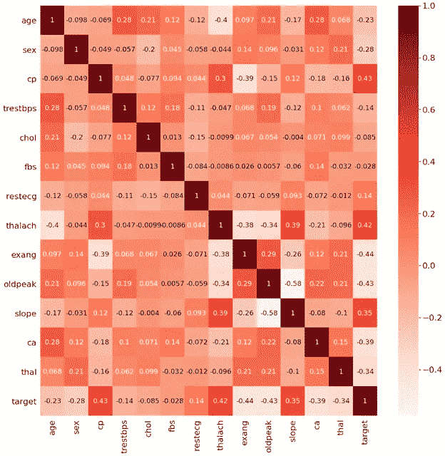
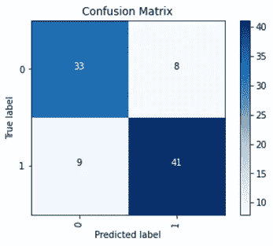
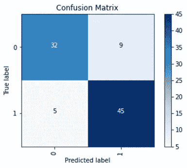
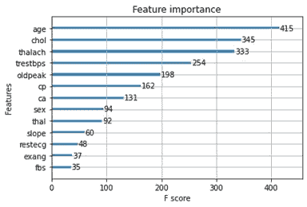
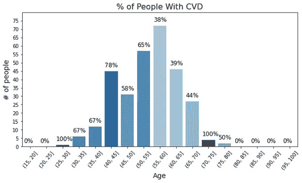
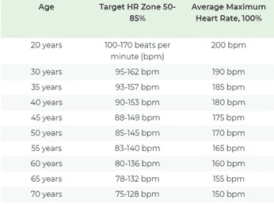
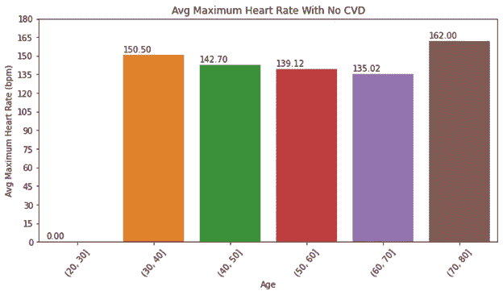

# 心脏病分类

> 原文：<https://towardsdatascience.com/heart-disease-classification-8359c26c7d83?source=collection_archive---------34----------------------->

## [深入分析](https://medium.com/towards-data-science/in-depth-analysis/home)

## XGBoost 会显示与医生使用的相同的风险因素吗？


由 [Alexander Sinn](https://unsplash.com/@swimstaralex?utm_source=medium&utm_medium=referral) 在 [Unsplash](https://unsplash.com?utm_source=medium&utm_medium=referral) 上拍摄的照片

# 介绍

心血管疾病(CVD)或心脏病是美国人死亡的主要原因之一。疾病控制预防中心估计每年有 647，000 人死亡。CVD 是一个总括术语，包含不同的心脏状况，包括血管病变(动脉粥样硬化或血管炎)、结构问题(心脏肥大)和心律不齐(心律不齐)。在心血管疾病中，美国最常见的心脏病是冠状动脉疾病。大多数时候，CVD 是“无声的”,在个体经历心脏病发作、心力衰竭或心律失常的迹象或症状之前，没有诊断。研究已经确定了与发展心血管疾病相关的危险因素。这些风险因素可以是不可修改的，其中因素不能被改变，或者是可修改的因素，其中因素可以被改变。

*不可修改的风险因素有:*

*   年龄增长
*   生物性别——男性比女性面临更大的风险
*   遗传的

*可修改的风险因素包括:*

*   吸用烟草
*   高血胆固醇
*   高血压
*   身体不活动
*   肥胖
*   糖尿病

医生可以利用这些风险因素获得洞察力，为患者建议生活方式的改变或治疗策略。我想研究的一个好奇的问题是，XGBoost 树模型能否根据医生使用的这些风险因素预测某人是否患有 CVD。

# 数据

用于进行这项分析的数据来自克利夫兰、匈牙利、瑞士和弗吉尼亚州长滩的四家医院汇编的数据集。这些数据被称为 UCI 心脏病数据集。该数据集由 303 个具有 14 种属性的个体组成，其中 138 个个体没有 CVD，165 个个体有 CVD。最初，有 76 个属性，但是发表的实验提到使用只有 14 个属性的子集。目标变量是使用任何主要血管中的直径变窄来诊断心脏病。截断百分比为 50%(见下文属性#14)。

只用了 14 个属性:
1。年龄:以年为单位的年龄
2。性别:性别(1 =男性；
0 =女性)3。cp:胸痛型— 1:典型心绞痛，2:不典型心绞痛，3:非心绞痛性疼痛，4:无症状
4。trestbps:静息血压(入院时以毫米汞柱为单位)
5。chol:血清胆固醇的毫克/分升
6。fbs:(空腹血糖> 120 mg/dl) (1 =真；
0 =假)7。restecg:静息心电图结果— 0:正常，1:ST-T 波异常(T 波倒置和/或 ST 抬高或压低> 0.05 mV)，2:根据 Estes 标准
8，显示可能或明确的左心室肥大。thalach:达到最大心率
9。exang:运动诱发心绞痛(1 =是；
0 =否)10。oldpeak =运动相对于休息诱发的 ST 段压低
11。坡度:最大运动 ST 段的坡度— 1:上坡，2:平地，3:下坡
12。ca:透视着色的主要血管数(0-3)13。thal: 3 =正常；6 =修复缺陷；7 =可逆缺陷
14。目标:心脏病的诊断(血管造影疾病状态)— 0: <直径缩小 50%，1: >直径缩小 50%

数据集和所有变量信息可以在这里找到:[https://archive.ics.uci.edu/ml/datasets/Heart+Disease](https://archive.ics.uci.edu/ml/datasets/Heart+Disease)

# 方法

使用 XGBoost 树模型有两个原因:1)该模型是通过分割特定特征创建的，2)它对其他形式的决策树 models⁴.更健壮

## 特征选择

没有进行特征工程，因为 1)只有 14 个特征，以及 2)每个特征被视为彼此独立的变量，以查看哪些特征有助于预测。此外，为了确保这一点，我检查了 14 个属性之间是否存在共线性。从皮尔逊相关性来看，变量之间不存在强相关性(图 1)。

此外，数据被分成 70:30 的比例(训练:测试比例)。这种分割是必要的，因为数据集只有 303 个人，这是一个相对较小的数据集。



图一

## 基线模型

为了验证模型是否得到了适当的调优，我使用了 XGBoost 树的默认值，目标是“binary: logistic”。然后，使用分层 k-fold 的 10 倍交叉验证以准确度作为验证的度量进行拟合。测试准确度约为 81%，每个折叠的平均验证率为 77.81%，标准偏差为 11.09%。因此，基线模型过度拟合了数据。此外，每个折叠之间的度量标准偏差为 11.09%。这表明一些折叠表现不佳。因此，超参数调整解决了这个问题。



图 2:基线模型的混淆矩阵

## 超参数调谐

使用随机搜索 10 倍交叉验证来确定 XGBoost 树的最佳参数。最佳参数为:

```
{colsample_bytree:1,
learning_rate:0.1,
max_depth:4,
min_child_weight:1e-05,
n_estimators:200,
objective:’binary:logistic’,
subsample:0.5}
```

## 超参数调谐模型

与基线模型相似，使用精确度指标对调整后的模型进行了 10 重交叉验证。每个折叠的平均准确度为 82.12%，标准偏差为 7.47%，比基线好得多。测试的准确度为 84.6%，曲线下面积度量为 0.84。XGBoost 在没有过度拟合的情况下比基线表现得更好。



图 3:超参数调整模型的混淆矩阵

# 分析

## 模型的有效性

Dinh 等人的一篇论文使用 dataset⁶.国家健康和营养调查(NHANES)的 XGBoost 模型来预测糖尿病和心血管疾病对于心血管疾病分类，他们的 XGBoost AUC 指标为 0.831。尽管这些数据集略有不同，但在我的模型的关键特征和 Dinh 等人的关键特征之间，前五个特征有一些重叠。Dinh 等人的 XGboost 确定了 1)年龄，2)收缩压，3)自我报告的体重，4)胸痛的发生，和 5)舒张压为关键因素。而在我的模型中确定的主要特征是:1)年龄，2)胆固醇(chol)，3)达到的最大心率(thalach)，4)静息血压(trestbps)，和 5)相对于静息运动诱发的 ST 段压低(oldpeak)。尽管变量不同，但我的模型和 Dinh 等人的模型在三个特征上是一致的:年龄、血压和胸痛(注意，旧峰是运动诱发的 st 段压低，这是诊断阻塞性冠状动脉粥样硬化的可靠发现，阻塞性冠状动脉粥样硬化可因血流减少而引起胸痛)

特征重要性图显示了 XGBoost 模型对特征进行分割的次数(f 分数而非 f1 分数)。因此，年龄被分成大量的时间来确定 CVD 的存在。



图 XGBoost 模型用于心脏病分类的主要特征。f 得分是模型使用特定特征进行分割的次数

# 特征分析

## 年龄

XGBoost tree 用来区分一个人是否患有心脏病的首要特征之一是年龄，这是一个不可修改的风险因素。从生理学角度来看，年龄是心血管疾病的决定性风险因素。随着年龄的增长，主动脉和颈动脉的顺应性降低。这意味着我们的主动脉和颈动脉变得更硬，从而使老年人的血压比正常人高，这是心血管疾病和动脉粥样硬化的危险因素。此外，65 岁及以上的年龄组更有可能患上 CVD⁷.图 5 描述了患有 CVD 的年龄组中的人的百分比。从这张图表中可以看出两点。首先，60 岁以上的人都有心血管疾病，但请注意，并不是所有 65 岁以上的人都有心血管疾病的风险。这可能是由于成功的老化。成功的衰老是指个体通过适当的 exercise⁸.维持身体的生理功能而通常的衰老是没有明显的心脏病理，但有一些功能下降。其次，图表显示有大量的年轻人或中年人患有心血管疾病。这可能是由于导言中提到的可变风险因素。



图 5:每个年龄组的总人数。百分比是患有心血管疾病的人数。

## 不可改变的风险因素。

根据前五个特征，胆固醇和血压是已知的心血管疾病的危险因素，医学研究已证明会导致心脏病。然而，XGBoost 用来确定某人是否患有 CVD 的一个因素是达到的最大心率(MHR)。MHR 告诉我们运动时心脏每分钟应该跳动的平均次数。数据字典没有具体说明它是如何计算的，但 MHR 通常是通过从 220 减去一个人的年龄来计算的。值得注意的趋势是最大心率随着年龄的增长而降低。这可能是由于随着年龄的增长，凋亡的窦房结细胞数量减少。下面是美国心脏协会按年龄分类的表格。



表 1 来自[10]

下面的两张图(图 6 和图 7)描绘了有或没有 CVD 的平均 MHR。描绘的结果对我来说有点奇怪。两组都没有达到美国心脏协会指出的 MHR，但是有 CVD 的组比没有 CVD 的组更有可能达到 MHR。根据学术文献，最大运动诱发心率与心血管死亡率呈负相关。所以，MHR 越高，心血管疾病的机会就越少。一种可能性是，由于心脏的代偿机制，这些人的静息心率已经设置得很高。由此需要注意的另一个重要方面是机器学习模型的性质。XGBoost 是一个数学模型，它只根据输入到模型中的数字进行分类。因此，由于两者之间存在显著差异，该模型使用 MHR 作为进行分割的特征。


图 6:患有心脏病的每个年龄组的平均最大心率



图 7:没有心脏病的每个年龄组的平均最大心率

# 限制

这种分析的局限性是不能在其他基于树的模型上运行数据，比如 light-XGBoost 或 random forest。这些模型本可以给出更好的结果。这种分析的另一个限制是数据集没有单独的测试集。因此，我必须从 303 个人中创建我的测试集，这减少了可能影响结果的训练样本的数量。

# 结论

XGBoost 模型确实揭示了与医生评估 CVD 潜在风险相似的风险因素。这个小评估证明了在医学中使用数据科学算法的有效性。在更大的心血管数据集上创建稳健的机器学习模型作为 CVD 的初步筛选工具是有效的。

# 密码

[https://github.com/DharaRan/Heart-Disease](https://github.com/DharaRan/Heart-Disease/blob/master/heart_disease.py)

**参考文献**

[1]SISON，G. (2020 年 5 月 09 日)。这就是心脏病对美国人的影响。检索于 2020 年 5 月 30 日，来自[https://www . single care . com/blog/news/heart-disease-statistics/](https://www.singlecare.com/blog/news/heart-disease-statistics/)

【2】关于心脏病。(2020 年 3 月 20 日)。于 2020 年 5 月 30 日从[https://www.cdc.gov/heartdisease/about.htm](https://www.cdc.gov/heartdisease/about.htm)检索

[3]了解你的风险，以防止心脏病发作。(2016).检索于 2020 年 5 月 30 日，来自[https://www . heart . org/en/health-topics/heart-attack/understand-your-risks-to-prevent-a-a-heart-attack](https://www.heart.org/en/health-topics/heart-attack/understand-your-risks-to-prevent-a-heart-attack)

[4]格伦，S. (2019 年 7 月 28 日)。决策树 vs 随机森林 vs 梯度提升机器:简单解释。2020 年 5 月 30 日检索，来自[https://www . datascience central . com/profiles/blogs/decision-tree-vs-random-forest-vs-boosted-trees-explained](https://www.datasciencecentral.com/profiles/blogs/decision-tree-vs-random-forest-vs-boosted-trees-explained)

[5]库马尔，A. (2020 年 01 月 04 日)。心脏病预测模型(5+模型)。2020 年 5 月 30 日检索，来自[https://medium . com/@ AK 8427916/heart-disease-prediction-model-5-models-c6aa 269 FB 74](https://medium.com/@ak8427916/heart-disease-prediction-model-5-models-c6aa269ffb74)

[6] Dinh，A .，Miertschin，s .，Young，A. *等*一种用机器学习预测糖尿病和心血管疾病的数据驱动方法。 *BMC Med 通知决策制定* 19 **，** 211 (2019)。[https://doi.org/10.1186/s12911-019-0918-5](https://doi.org/10.1186/s12911-019-0918-5)

[7]北 BJ，辛克莱·达。衰老和心血管疾病的交汇点。*保监会决议*。2012;110(8):1097‐1108.doi:10.1161/circresaha 11.246686766766

[8] UT 西南医学中心。(2018 年 1 月 8 日)。适当的锻炼可以逆转心脏老化带来的损害。*科学日报*。2020 年 5 月 29 日从 www.sciencedaily.com/releases/2018/01/180108090132.htm[检索](http://www.sciencedaily.com/releases/2018/01/180108090132.htm)

[9]弗莱彻，J. (2020 年 1 月 5 日)。不同年龄的胆固醇水平:差异和建议。).于 2020 年 5 月 30 日从[https://www.medicalnewstoday.com/articles/315900](https://www.medicalnewstoday.com/articles/315900)检索

10]美国心脏协会。(2015).了解你运动、减肥和健康的目标心率。2020 年 5 月 30 日检索，来自[https://www . heart . org/en/healthy-living/fitness/fitness-basics/target-heart-rates](https://www.heart.org/en/healthy-living/fitness/fitness-basics/target-heart-rates)

[11] Sandvik，l .，Erikssen，j .，Ellestad，m .，Erikssen，g .，Thaulow，e .，Mundal，r .，和 Rodahl，K. (1995 年)。运动时心率增加和最大心率是心血管死亡率的预测因素:一项对 1960 名健康男性的 16 年随访研究。*冠状动脉疾病*， *6* (8)，667–679。