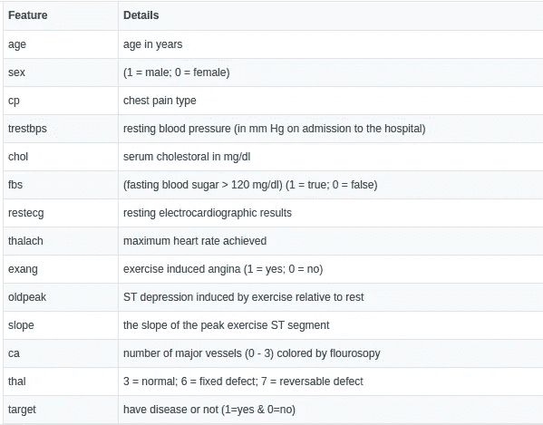
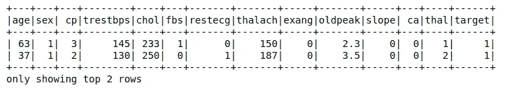
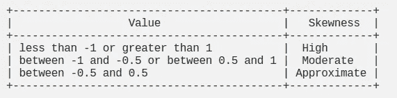

# 使用 Apache Spark ML-二进制分类进行心脏病预测

> 原文：<https://towardsdatascience.com/heart-disease-prediction-using-apache-spark-ml-808073f52495?source=collection_archive---------43----------------------->


凯利·西克玛在 [Unsplash](https://unsplash.com?utm_source=medium&utm_medium=referral) 上的照片

# 介绍

有各种医学参数影响患有心脏病的人。可能是年龄、胆固醇、血糖、静息血压等等。

这里，我们将使用机器学习中的分类来创建预测模型。分类是一项受监督的机器学习任务，我们希望自动将数据分类到一些预定义的分类方法中。基于数据集中的特征，我们将创建一个模型来预测患者是否患有心脏病。我们将在 Apache spark 中使用各种分类算法，并根据预测得分选择最佳算法。

# 关于数据集

我们有一个基于特征的心脏病患者或非心脏病患者的详细资料数据集。



作者图片

**注:数据集可以从** [**Kaggle**](https://www.kaggle.com/cdabakoglu/heart-disease-classifications-machine-learning/data) **下载。**

用的 spark 版本是 3.0.0。

# 读取数据

Spark 可以读取 CSV、Parquet、Avro 和 JSON 等不同格式的数据。这里的数据是 CSV 格式，使用下面的代码读取。



作者图片

# 机器学习的数据准备

## 我们有几节课？

对于分类任务，检查因变量中的类别不平衡很重要。如果存在严重不足或过度表示的类，模型预测的准确性可能会因为模型本质上存在偏差而受到影响。

如果我们看到类不平衡，一种常见的纠正方法是引导或重新采样数据帧。

```
df.groupBy('target').count().show()+------+-----+
|target|count|
+------+-----+
|     1|  165|
|     0|  138|
+------+-----+
```

由于班级人数差不多，我们可以继续了。

## 检查空值

我们必须查看数据帧中有多少列具有空值。如果空值的百分比非常小，我们可以丢弃数据。因为我们的数据集是干净的，没有空值，所以我们可以开始了。

## 处理偏斜度和异常值

偏斜度衡量值的分布偏离平均值的对称程度。零值意味着分布是对称的，而正偏斜度表示较小值的数量较大，负值表示较大值的数量较大。



作者图片

处理偏斜度的一个常见建议是对正偏斜数据进行对数变换，或者对负偏斜数据进行指数变换。

**异常值**
纠正异常值的一种常见方法是通过下限和上限，这意味着编辑高于或低于某个阈值(第 99 个百分点或第 1 个百分点)的任何值，使其回到该百分点的最高/最低值。例如，如果第 99 个百分位数是 96，而值是 1，000，您可以将该值更改为 96。

# 将数据分成测试和训练数据集

现在，我们可以使用随机拆分方法将数据拆分为测试和训练数据集。我们将按 70/30 的比例分割数据。

```
train,test **=** final_data.randomSplit([0.7,0.3])
```

# 训练和评估算法

既然我们已经清理和矢量化了数据，我们就可以将它输入到我们的训练算法中了。我们将测试不同的算法，如逻辑回归，随机森林分类器，梯度推进树分类器和决策树分类器。

## 交互效度分析

Spark 有一个名为 CrossValidator 的内置函数来进行交叉验证，该函数首先将训练数据集分成一组“折叠”，用作单独的训练和测试数据集。例如，当 k=5 倍时，CrossValidator 将生成 5 个不同的(训练、测试)数据集对，每个数据集对使用 4/5 的数据进行训练，1/5 的数据进行测试。为了评估一个特定的参数(在 paramgrid 中指定)，CrossValidator 计算 5 个模型的平均评估度量，这 5 个模型是通过在 5 个不同的(训练、测试)数据集对上拟合评估器而产生的，并在完成后告诉您哪个模型执行得最好。

在确定了最佳参数图之后，CrossValidator 最终使用最佳参数图和整个数据集重新拟合估计器。

现在，我们可以使用最佳模型来评估模型。fitModel 自动使用最佳模型，所以我们这里不需要使用 best model。

运行评估器后，我们将得到如下结果。

```
!!!!!Final Results!!!!!!!!
+----------------------+------+
|Classifier            |Result|
+----------------------+------+
|LogisticRegression    |89.32 |
|RandomForestClassifier|86.27 |
|GBTClassifier         |84.31 |
|DecisionTreeClassifier|80.82 |
+----------------------+------+
```

我们可以看到，逻辑回归具有最高的预测得分，因此我们可以使用逻辑回归的最佳模型来创建我们的最终模型。

我们可以通过 spark 中的特征选择技术对模型进行更多的调整。我们可以使用 ChiSqSelector 特征选择方法。ChiSqSelector 代表卡方特征选择。它对带有分类特征的标记数据进行操作。ChiSqSelector 使用[卡方独立性检验](https://en.wikipedia.org/wiki/Chi-squared_test)来决定选择哪些特性。

因此，在对数据进行特征选择、训练和评估后，我们得到以下结果作为逻辑回归分类算法的预测得分。

```
+------------------+------+
|Classifier        |Result|
+------------------+------+
|LogisticRegression|91.08 |
+------------------+------+
```

最后我们的分类算法模型得到了 91%的预测分数。我们可以通过调整 spark 提供的更多参数来提高模型的预测得分。

源代码可以在 [Github](https://github.com/lijoabraham/spark-playground/tree/master/heart_disease_classification) 上找到。

## 参考

[https://spark.apache.org/docs/latest/ml-guide.html](https://spark.apache.org/docs/latest/ml-guide.html)