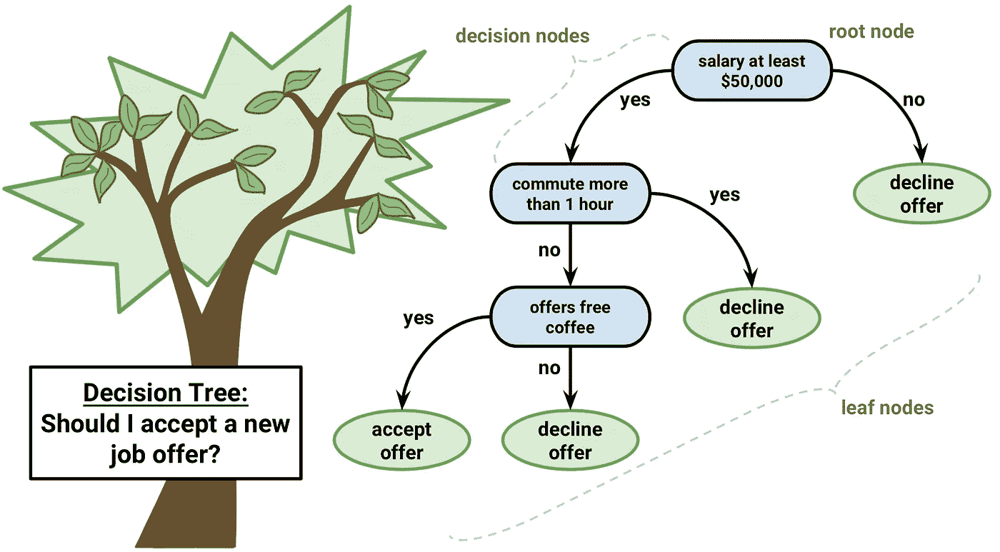

# 使用机器学习预测心脏病发作风险

> 原文：<https://towardsdatascience.com/heart-disease-risk-assessment-using-machine-learning-83335d077dad?source=collection_archive---------4----------------------->

## 用机器学习的力量预防疾病


安娜·科洛舒克在 [Unsplash](https://unsplash.com/s/photos/heart?utm_source=unsplash&utm_medium=referral&utm_content=creditCopyText) 上的照片

## 1.介绍

心脏病是全球发病率和死亡率的主要原因:它每年造成的死亡人数超过任何其他原因。根据 T4 世卫组织的数据，2016 年估计有 1790 万人死于心脏病，占全球死亡人数的 31%。超过四分之三的死亡发生在低收入和中等收入国家。

在所有心脏病中，冠心病(又名心脏病发作)是最常见也是最致命的。以美国为例，据估计每 40 秒就有一人心脏病发作，每年约有**80.5 万美国人**心脏病发作( [CDC 2019](https://www.cdc.gov/heartdisease/facts.htm) )。

令人欣慰的是，心脏病发作是高度可预防的，简单的生活方式改变(如减少酒精和烟草的使用；健康饮食和锻炼)加上早期治疗大大改善了其预后。然而，由于诸如糖尿病、高血压、高胆固醇等几个促成风险因素的多因素性质，很难识别高风险患者。这就是机器学习和数据挖掘的救援之处。

医生和科学家都转向机器学习(ML)技术来开发筛选工具，这是因为与其他传统的统计方法相比，它们在模式识别和分类方面具有优势。

在这篇文章中，我将向您介绍一种筛选工具的开发过程，该工具使用不同的机器学习技术在 [Framingham 数据集](http://biolincc.nhlbi.nih.gov/studies/framcohort/)上预测患者是否有 10 年患冠心病的风险。

这篇文章的代码可以在我的 [Github 库](https://github.com/amayomode/heart-disease-prediction/tree/master/Heart%20Disease%20Prediction)中找到，或者直接从它的伙伴 [Kaggle 笔记本](https://www.kaggle.com/amayomordecai/heart-disease-risk-prediction-machine-learning)中找到

## 2.数据集描述

该数据集在 Kaggle 网站上公开，它来自一项正在进行的对马萨诸塞州弗雷明汉镇居民的心血管研究。分类目标是预测患者是否有未来冠心病(CHD)的 10 年风险。数据集提供了患者的信息。它包括 4000 多条记录和 15 个属性。每个属性都是潜在的风险因素。既有人口统计学上的，也有行为和医学上的风险因素。

## 属性:

1.  **人口统计**:

*   性别:男性或女性(名义)
*   年龄:患者的年龄；(连续——尽管记录的年龄被截断为整数，但年龄的概念是连续的)

2.**教育**:未提供进一步信息

3.**行为**:

*   当前吸烟者:患者是否是当前吸烟者(名义上)
*   每日吸烟量:一个人一天内平均吸烟的数量。(可以认为是连续的，因为一个人可以有任何数量的香烟，甚至半支香烟。)

4.**病史信息**:

*   血压药物:患者是否在服用降压药(标称值)
*   流行性中风:患者以前是否曾患过中风(名义上)
*   流行性高血压:患者是否患有高血压(正常)
*   糖尿病:患者是否患有糖尿病(名义上)

5.**当前医疗状况信息**:

*   总胆固醇:总胆固醇水平(连续)
*   系统血压:收缩压(持续)
*   Dia BP:舒张压(持续)
*   身体质量指数:身体质量指数(连续)
*   心率:心率(连续)——在医学研究中，心率等变量虽然实际上是离散的，但由于有大量的可能值，因此被认为是连续的。)
*   葡萄糖:血糖水平(持续)

## 要预测的目标变量:

*10 年患冠心病的风险——(二进制:“1”，表示“有风险”，“0”，表示“没有风险”)*

## 3.工具开发

这篇文章的完整代码可以在[这里](https://github.com/amayomode/heart-disease-prediction/tree/master/Heart%20Disease%20Prediction)找到。它是用 Python 实现的，使用了不同的分类算法。以下是我所采用的一般方法的简要描述:

1.  **数据清理和预处理**:这里我检查并处理了数据集中缺失和重复的变量，因为这些变量会严重影响不同机器学习算法的性能(许多算法不允许缺失数据)。
2.  **探索性数据分析**:这里我想从数据中获得重要的统计见解，我检查了不同属性的分布、属性之间的相关性以及目标变量，并计算了分类属性的重要概率和比例。
3.  **特征选择**:由于数据集中不相关的特征会降低所应用模型的准确性，我使用了 Boruta 特征选择技术来选择最重要的特征，这些特征后来被用于构建不同的模型。
4.  **模型开发和比较**:我使用了四种分类模型，分别是逻辑回归、K 近邻、决策树和支持向量机，之后我使用模型的精确度和 F1 值来比较模型的性能。然后我选择了表现最好的模特。

**3.1 数据清理和预处理**


数据集的前 20 条记录

数据集中没有重复条目，但有些条目缺少值，下表给出了这些条目的汇总:


每个要素缺失值的百分比


在 9.15%的情况下，血糖条目的缺失数据百分比最高。其他功能几乎没有遗漏条目。

丢失的条目只占全部数据的 12%,因此可以在不丢失大量数据的情况下被删除。

**3.2 探索性数据分析**

第一步是检查不同属性的分布，这可以通过直方图最好地可视化


数据分布

从分布图中挑选出分类变量和连续变量是很容易的。此外，可以看出，受访者中没有人患有流行性中风，极少数人患有糖尿病、服用降压药或高血压。这些分布也引起了数据集可能不适当平衡的怀疑，为了证实这一点，我比较了阳性和阴性病例的数量，与我的怀疑相符，有 3179 名应答者没有冠心病，572 名患者有冠心病。


不平衡数据集

为了更深入地了解数据，我检查了每一类中阳性和阴性病例的比例。


分类可变比例

由于数据集的不平衡性质，很难做出结论，但根据观察到的情况，可以得出以下结论:

*   患冠心病的男性略多于女性。
*   吸烟者和不吸烟者患冠心病的比例几乎相等。
*   与没有类似疾病的人相比，糖尿病患者和高血压患者中患冠心病的比例更高。
*   更大比例的冠心病患者正在服用降压药。

我检查的另一个有趣的趋势是冠心病患者的年龄分布，患病人数通常随着年龄的增长而增加，63 岁时达到高峰。


最后一步是检查不同特征与目标变量以及彼此之间的相关性，因为这不仅可以很好地估计作为冠心病预测指标的特征强度，还可以揭示特征之间的任何[共线性](http://faculty.cas.usf.edu/mbrannick/regression/Collinearity.html)。


相关矩阵

从矩阵中可以看出，没有任何特征与 10 年内发生冠心病的风险之间的相关性超过 0.5，这表明这些特征是不良的预测因素。然而，相关性最高的特征是年龄、流行性高血压和收缩压。

此外，有几个特征彼此高度相关，使用这两个特征来构建机器学习模型是没有意义的。其中包括:血糖和糖尿病(明显)；收缩压和舒张压；吸烟和每天吸烟的数量。

**3.3 功能选择**

相关矩阵的结果提示需要进行特征选择。为此，我采用了 [Boruta 特征选择](https://www.datasciencecentral.com/profiles/blogs/select-important-variables-using-boruta-algorithm)算法，这是一种围绕[随机森林分类算法](https://en.wikipedia.org/wiki/Random_forest)构建的包装器方法。它试图捕捉与结果变量相关的数据集中所有重要的、有趣的特征。

它的工作方式如下:

*   首先，它通过创建所有特征(称为阴影特征)的混洗副本，给给定的数据集增加了随机性。
*   然后，它在扩展数据集上训练一个随机森林分类器，并应用一个特征重要性度量(默认为 [Mean Decrease Accuracy](https://www.thelearningmachine.ai/mda) )来评估每个特征的重要性，其中分数越高意味着特征越重要。
*   在每次迭代中，它会检查真实要素的重要性是否高于其最佳阴影要素(即，该要素的 Z 值是否高于其阴影要素的最大 Z 值)，并不断移除被认为非常不重要的要素。
*   最后，当所有特征被确认或拒绝时，或者当算法达到随机森林运行的指定限制时，算法停止。

点击查看完整描述

在运行该算法 100 次迭代后，最先选择的特征是:年龄、总胆固醇、收缩压、舒张压、身体质量指数、心率和血糖。

然后我计算了主要特征的优势比和十年内患冠心病的风险，结果如下:

```
CI 5%     CI 95%    Odds Ratio
age        1.011381  1.033813    1.022536
totChol    0.994963  0.999184    0.997071
sysBP      1.018236  1.031493    1.024843
diaBP      0.962258  0.984627    0.973378
BMI        0.929304  0.973798    0.951291
heartRate  0.963690  0.977730    0.970685
glucose    1.001074  1.007518    1.004291
```

在所有其他特征保持不变的情况下，年龄和收缩压每增加一个百分点，患心脏病的几率就会增加 2 个百分点。

其他因素显示没有明显的积极的可能性。

**3.4 模型开发和对比**

不建议在不平衡数据集上训练分类器，因为它可能偏向一个类别，从而实现高精度，但具有较差的灵敏度或特异性。

在我们的案例中，阴性病例的数量(3179)大大超过了阳性病例的数量(572)。例如，如果我们训练一个总是预测负面类别的模型，它将达到 84.75 %(3179/(3179+572) x 100)的高准确度，但灵敏度为 0% (0/(0+572) x 100)，因为它从不预测正面案例。

来解决这个问题。我使用合成少数过采样技术(SMOTE)平衡数据集。它是这样工作的:

> SMOTE 首先随机选择一个少数类实例 x，并找到它的 k 个最近的少数类邻居。然后，通过随机选择 k 个最近邻居 x 中的一个并连接 x 和 x 以在特征空间中形成线段来创建合成实例。合成实例是作为两个选定实例 x 和 x 的凸组合生成的。—第 47 页，不平衡学习:基础、算法和应用，2013 年。


图片由[胡风](https://www.hindawi.com/journals/mpe/2013/694809/)通过[辛达维](https://www.hindawi.com/journals/mpe/2013/694809/) (CC0)拍摄

该过程可用于根据需要为少数类创建尽可能多的合成示例。它建议首先使用随机欠采样来减少多数类中的样本数量，然后使用 SMOTE 对少数类进行过采样来平衡类分布。

使用这种技术后，得到的数据集更加平衡，有 3178 个阴性病例和 2543 个阳性病例

```
Numbers before  {positive: 3179, negative: 572} 
Numbers after   {positive: 3178, negative: 2543}
```


通过 SMOTE 平衡数据集

在平衡数据集之后，我缩放特征以加速分类器的训练，然后将数据分别以 0.8 比 0.2 的比例分成训练集和测试集

使用训练集，我训练了四个分类器，即:

1.  **逻辑回归**:对数据点属于特定类别的概率进行建模，并根据选择的阈值为该点分配适当的标签。


图片由[詹姆斯·乐](https://www.datacamp.com/profile/khanhle1013)通过[数据营](https://www.google.com/url?sa=i&url=https%3A%2F%2Fwww.datacamp.com%2Fcommunity%2Ftutorials%2Flogistic-regression-R&psig=AOvVaw1tu3giJ7dvIrJdvld1_TXt&ust=1588091566496000&source=images&cd=vfe&ved=0CAMQjB1qFwoTCIj5_LaEiekCFQAAAAAdAAAAABAI) (CC0)

**2。K-nearest neighbors** :试图通过查看一个数据点周围的数据点来确定该数据点属于哪个组。例如，给定一个数据点 C，如果它周围的大多数点都在组 A 中，那么很可能该数据点属于组 A 而不是组 B，反之亦然。


图片由[柴坦尼亚·雷迪·帕托拉](https://medium.com/@chaitanyareddypatlolla?source=post_page-----6851280d4c93----------------------)通过[媒介](https://medium.com/datadriveninvestor/machine-learning-getting-started-with-k-nearest-neighbours-6851280d4c93) (CC BY-NC-ND 2.0)

**3。决策树**:基于树状图形，节点代表我们选择属性和提出问题的位置；边代表问题的答案；树叶代表实际的输出或类别标签。决策树通过从根到某个叶节点对示例进行排序来对示例进行分类，叶节点为示例提供分类。树中的每个节点都充当某个属性的测试用例，从该节点开始向下延伸的每条边都对应于测试用例的一个可能答案。这个过程本质上是递归的，并且对以新节点为根的每个子树重复进行。



图像由 [Rahul Saxena](https://dataaspirant.com/author/rahul-saxena/) 通过 [Dataaspirant](https://www.google.com/url?sa=i&url=https%3A%2F%2Fdataaspirant.com%2F2017%2F01%2F30%2Fhow-decision-tree-algorithm-works%2F&psig=AOvVaw2edoz1eGedERpV3gamwnwj&ust=1588092099583000&source=images&cd=vfe&ved=0CAMQjB1qFwoTCOi5k5-GiekCFQAAAAAdAAAAABAU) (CCo)拍摄

**4。支持向量机**:由分离超平面形式定义的判别分类器。换句话说，给定标记的训练数据，该算法输出最佳超平面，该超平面基于新示例相对于它位于哪一侧来对新示例进行分类。在二维空间中，这个超平面是一条将平面分成两部分的线，每一类位于两边。


图片由[弗朗索瓦·德·瑞克尔](https://www.google.com/url?sa=i&url=https%3A%2F%2Ffderyckel.github.io%2Fmachinelearningwithr%2Fsvm.html&psig=AOvVaw3AyyyBipnHNdVZPkmu-3JG&ust=1588092217619000&source=images&cd=vfe&ved=0CAMQjB1qFwoTCMDqzOCGiekCFQAAAAAdAAAAABAJ)通过 [Github](https://fderyckel.github.io/machinelearningwithr/svm.html) 提供(CC BY-NC-ND 2.0)

在训练每个模型并使用[网格搜索](https://scikit-learn.org/stable/modules/grid_search.html)调整它们的[超参数](https://en.wikipedia.org/wiki/Hyperparameter_(machine_learning))之后，我使用以下指标评估并比较了它们的性能:

1.  **准确率:**正确预测数与输入样本总数之比。它衡量算法对数据进行正确分类的趋势。
2.  **F1 分数**:定义为测试[精度和召回](https://deepai.org/machine-learning-glossary-and-terms/precision-and-recall)的加权[调和平均值](https://deepai.org/machine-learning-glossary-and-terms/harmonic-mean)。通过使用精确度和召回率，它给出了测试性能的更现实的度量。(精确度，也称为阳性预测值，是真正阳性的阳性结果的比例。回忆，也称为敏感性，是一项测试正确识别阳性结果以获得真实阳性率的能力)。
3.  **[**ROC**](https://en.wikipedia.org/wiki/Receiver_operating_characteristic)**曲线下的面积(AUC):** 提供了对所有可能的分类阈值性能的综合衡量。它给出了模型对随机正例的排序高于随机负例的概率**

**结果如下:**

****

**不同型号的性能得分**

****

**精确度比较**

****

**F1 分数对比**

****

**AUC 的比较**

**支持向量机是所有指标中表现最好的模型。它的最佳参数是径向核，C 值为 10，gamma 值为 1。其高 AUC 和 F1 分数也表明该模型具有高的真阳性率，因此对于预测一个人是否具有发展为 CHD 的高风险(即在 10 年内患心脏病发作)是敏感的。**

## **4.结论**

**然后，该模型可以用作简单的筛选工具，我们所需要做的就是输入以下数据:年龄、身体质量指数、收缩压和舒张压、心率和血糖水平，然后该模型可以运行并输出预测。**

**像所有优秀的科学家一样，我决定用我的个人数据来测试这个工具，结果如下:**

****

**个人预测**

**我可以有 84%的信心说，我在未来 10 年内没有患冠心病的风险🎉🎉。我相信这些预测，因为我确实锻炼过，至少偶尔会锻炼一下。**

****

**图片由[迪伦·克尔](https://imgur.com/user/ilovecookiesandpancakes)通过 [imgur](https://imgur.com/hWyjp27) 提供**

**然而，作为健全性检查，关于阳性病例的大多数数据是使用 SMOTE 人工合成的，因此它们可能不是实际人群数据的真实代表，因此需要更多的数据，特别是关于阳性病例的数据，以建立更好的模型和更有效的筛选工具。**

**感谢您的阅读。请随意分享你的想法和主意。**