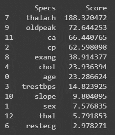
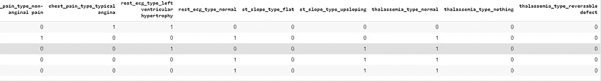
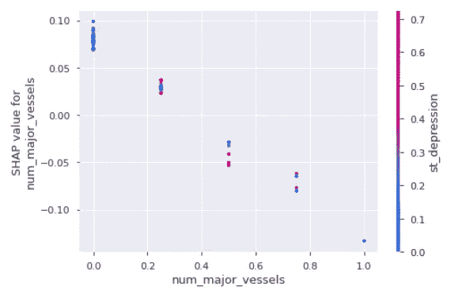

# 心脏病 UCI-诊断和预测

> 原文：<https://towardsdatascience.com/heart-disease-uci-diagnosis-prediction-b1943ee835a7?source=collection_archive---------0----------------------->

## *使用逻辑回归进行预测，准确率为 87%*


由 [Robina Weermeijer](https://unsplash.com/@averey?utm_source=medium&utm_medium=referral) 在 [Unsplash](https://unsplash.com?utm_source=medium&utm_medium=referral) 上拍摄的照片

每天，人类的平均心脏跳动约 10 万次，将 2000 加仑的血液输送到全身。在你的体内有 60，000 英里长的血管。

女性心脏病发作的迹象远不如男性明显。在女性中，心脏病发作可能会感到胸部中心挤压、压力、胀满或疼痛等不适。它也可能导致一个或两个手臂，背部，颈部，下巴或胃部疼痛，呼吸急促，恶心和其他症状。男性经历心脏病发作的典型症状，如胸痛、不适和压力。他们也可能经历其他部位的疼痛，如手臂、颈部、背部和下巴，以及呼吸急促、出汗和类似烧心的不适。

对于一个就像一个大拳头，重量在 8 到 12 盎司之间的器官来说，这是一个很大的工作量。

来源:healthblog.uofmhealth

**由 Hardik 编码:**

Google colab 笔记本链接:[https://colab . research . Google . com/drive/16 ifrpq 0 VX _ czy po 4 zyj _ qtlrvds 3 fldb？usp =分享](https://colab.research.google.com/drive/16iFRPq0vx_CZypo4ZyJ_qTLrvds3FlDb?usp=sharing)

GitHub:[https://GitHub . com/smarthardk 10/Heart-Disease-UCI-诊断-预测](https://github.com/smarthardik10/Heart-Disease-UCI-Diagnosis-Prediction)

**UCI 心脏病数据集:**

数据集来源:[https://archive.ics.uci.edu/ml/datasets/Heart+Disease](https://archive.ics.uci.edu/ml/datasets/Heart+Disease)

**数据集列:**

*   年龄:以年为单位的人员年龄
*   性别:人的性别(1 =男性，0 =女性)
*   cp:胸痛类型
    —值 0:无症状
    —值 1:不典型心绞痛
    —值 2:非心绞痛性疼痛
    —值 3:典型心绞痛
*   trestbps:患者的静息血压(入院时为毫米汞柱)
*   胆固醇:人体的胆固醇含量，单位为毫克/分升
*   fbs:人的空腹血糖(> 120 mg/dl，1 =真；0 =假)
*   restecg:静息心电图结果
    —值 0:根据 Estes 标准
    —值 1:正常
    —值 2:ST-T 波异常(T 波倒置和/或 ST 段抬高或压低> 0.05 mV)
*   thalach:人达到的最大心率
*   exang:运动诱发的心绞痛(1 =是；0 =否)
*   oldpeak:运动相对于休息诱发的 st 段压低(“ST”与心电图图上的位置有关。点击此处查看更多)
*   斜率:运动 ST 段峰值的斜率— 0:下降；1:平；2:上坡
    0:下坡；1:平；2:上坡
*   ca:主要血管的数量(0-3)
*   地中海贫血:一种称为地中海贫血的血液疾病值 0:空(从先前的数据集中删除
    值 1:固定缺陷(心脏的某些部分没有血流)
    值 2:正常血流
    值 3:可逆缺陷(观察到血流但不正常)
*   目标:心脏病(1 =否，0=是)

**语境:**

这是多变量类型的数据集，这意味着提供或涉及各种单独的数学或统计变量，多变量数值数据分析。它由 14 个属性组成，即年龄、性别、胸痛类型、静息血压、血清胆固醇、空腹血糖、静息心电图结果、达到的最大心率、运动诱发的心绞痛、运动相对于静息诱发的老峰-st 段压低、运动 ST 段峰值斜率、主要血管数和地中海贫血。该数据库包括 76 个属性，但所有发表的研究都涉及其中 14 个属性的子集的使用。克利夫兰数据库是迄今为止 ML 研究人员唯一使用的数据库。该数据集的主要任务之一是基于患者的给定属性来预测该特定人是否患有心脏病，其他任务是实验性任务，以诊断并从该数据集找出各种见解，这有助于更好地理解问题。

**数据集由:-** 创建

1.匈牙利心脏病研究所。布达佩斯:医学博士安朵斯·雅诺西。瑞士苏黎世大学医院:William Steinbrunn，医学博士。瑞士巴塞尔大学医院:医学博士马蒂亚斯·普菲斯特勒。弗吉尼亚医疗中心，长滩和克利夫兰诊所基金会:罗伯特·德特拉诺，医学博士，哲学博士。

## 目录

1.  [导入和读取数据集](#a3db)
2.  [数据描述](#1257)

*   [描述](#0140)
*   [空值](#de14)

3.[数据分析](#d39b)

*   [1)单变量选择](#70b1)
*   [2)特征选择](#70f9)
*   [3)与热图的关联矩阵](#2bcc)

4.[数据可视化](#82cd)

*   1) [计数图](#61e6)
*   2) [距离图](#ecb0)
*   3) [接头图](#077e)
*   4) [矩形图/紫色图](#23b0)
*   5) [集群地图](#c467)
*   6) [Pairplot](#36ad)
*   [分类树](#3ec5)

5.[数据预处理](#ba87)

*   1) [预处理](#5ada)
*   2) [一个热编码](#3cd8)

6.[逻辑回归](#7e86)

*   1) [聚集列](#2bd0)
*   2) [拆分数据](#f346)
*   3) [正常化](#1edc)
*   4) [拟合入模型](#b904)
*   5) [预测](#c22c)
*   6) [模型评估](#0621)

7.[结论](#7f6e)

*   1) [系数](#4600)
*   2) [分析](#da70)
*   3) [结论](#d3f0)

# 1.导入和读取数据集

```
import numpy as np
import pandas as pd
import seaborn as sns
import matplotlib.pyplot as plt
%matplotlib inlinedf = pd.read_csv('/content/drive/My Drive/dataset/heart.csv')df.head()
```


heart.csv

# 2.数据描述

## 形容

关于元数据有很多混乱，因为有各种不同的元数据可用。下面我从 kaggle 得到了两个最常用的元数据描述。所以我们要遵循第二个描述(2 —描述)。

1 —描述

```
•    age: The person's age in years
•    sex: The person's sex (1 = male, 0 = female)
•    cp: The chest pain experienced (Value 1: typical angina, Value 2: atypical angina, Value 3: non-anginal pain, Value 4: asymptomatic)
•    trestbps: The person's resting blood pressure (mm Hg on admission to the hospital)
•    chol: The person's cholesterol measurement in mg/dl
•    fbs: The person's fasting blood sugar (> 120 mg/dl, 1 = true; 0 = false)
•    restecg: Resting electrocardiographic measurement (0 = normal, 1 = having ST-T wave abnormality, 2 = showing probable or definite left ventricular hypertrophy by Estes' criteria)
•    thalach: The person's maximum heart rate achieved
•    exang: Exercise induced angina (1 = yes; 0 = no)
•    oldpeak: ST depression induced by exercise relative to rest ('ST' relates to positions on the ECG plot. See more here)
•    slope: the slope of the peak exercise ST segment (Value 1: upsloping, Value 2: flat, Value 3: downsloping)
•    ca: The number of major vessels (0-3)
•    thal: A blood disorder called thalassemia (3 = normal; 6 = fixed defect; 7 = reversable defect)
•    target: Heart disease (0 = no, 1 = yes)
```

2 —描述

```
 cp: chest pain type
-- Value 0: asymptomatic
-- Value 1: atypical angina
-- Value 2: non-anginal pain
-- Value 3: typical angina

restecg: resting electrocardiographic results
-- Value 0: showing probable or definite left ventricular hypertrophy by Estes' criteria
-- Value 1: normal
-- Value 2: having ST-T wave abnormality (T wave inversions and/or ST elevation or depression of > 0.05 mV)

slope: the slope of the peak exercise ST segment
0: downsloping; 1: flat; 2: upsloping

thal
Results of the blood flow observed via the radioactive dye.

Value 0: NULL (dropped from the dataset previously)
Value 1: fixed defect (no blood flow in some part of the heart)
Value 2: normal blood flow
Value 3: reversible defect (a blood flow is observed but it is not normal)
This feature and the next one are obtained through a very invasive process for the patients. But, by themselves, they give a very good indication of the presence of a heart disease or not.

target : 0 = disease, 1 = no diseasedf.info()
```


```
df.describe()
```


## 空

检查空值

```
df.isnull().sum()
```


```
#visualizing Null values if it exists 
plt.figure(figsize=(22,10))plt.xticks(size=20,color='grey')
plt.tick_params(size=12,color='grey')plt.title('Finding Null Values Using Heatmap\n',color='grey',size=30)sns.heatmap(df.isnull(),
            yticklabels=False,
            cbar=False,
            cmap='PuBu_r',
            )
```


数据集没有空值

## 熊猫-侧写

```
!pip install https://github.com/pandas-profiling/pandas-profiling/archive/master.zipimport pandas_profiling as pp
pp.ProfileReport(df)
```


详细查看:[https://colab . research . Google . com/drive/16 ifrpq 0 VX _ czypo 4 zyj _ qtlrvds 3 fldb # scroll to = 5 cribqgn 9 fii&line = 1&uniqifier = 1](https://colab.research.google.com/drive/16iFRPq0vx_CZypo4ZyJ_qTLrvds3FlDb#scrollTo=5crIBqgn9FiI&line=1&uniqifier=1)

# 3.数据分析

**功能选择**

1.  单变量选择—统计测试可用于挑选与性能变量有最佳关系的某些特征。
    sci kit-learn 库提供了 SelectKBest 类，可用于在一套不同的统计测试中选择特定数量的特征。
    以下示例使用非负特征的卡方(chi2)统计测试从数据集中选择 13 个最佳特征。

```
from sklearn.feature_selection import SelectKBest
from sklearn.feature_selection import chi2
data = df.copy()
X = data.iloc[:,0:13]  #independent columns
y = data.iloc[:,-1]    #target column 
#apply SelectKBest class to extract top best features
bestfeatures = SelectKBest(score_func=chi2, k=10)
fit = bestfeatures.fit(X,y)
dfscores = pd.DataFrame(fit.scores_)
dfcolumns = pd.DataFrame(X.columns)
#concat two dataframes for better visualization 
featureScores = pd.concat([dfcolumns,dfscores],axis=1)
featureScores.columns = ['Specs','Score']  #naming the dataframe columns
print(featureScores.nlargest(12,'Score'))  #print best features
```



2.要素重要性-通过使用模型特征属性，可以获得数据集每个要素的重要性。
特征值为您的结果的每个功能给出一个分数，分数越高，性能变量越重要或合适。
特征重要性是基于树的分类器自带的内置类，我们将使用额外的树分类器来提取数据集的顶部特征。

```
from sklearn.ensemble import ExtraTreesClassifiermodel = ExtraTreesClassifier()
model.fit(X,y)
print(model.feature_importances_) #use inbuilt class feature_importances of tree based classifiers
#plot graph of feature importances for better visualization
feat_importances = pd.Series(model.feature_importances_, index=X.columns)
feat_importances.nlargest(13).plot(kind='barh')
plt.show()
```


3.带热点图的关联矩阵-关联表示要素之间或要素与目标变量之间的关联方式。
相关性可能是正的(增加一个特性值会增加目标变量的值)或负的(增加一个特性值会减少目标变量的值)
热图可以很容易地对与目标变量最相关的特性进行分类，我们将使用 seaborn 库绘制热图的相关特性。

相关性显示特征是否相互关联或与目标变量相关。相关性可以是正的(增加一个值，目标变量的值增加)或负的(增加一个值，目标变量的值减少)。从该热图中，我们可以观察到“cp”胸痛与目标变量高度相关。与其他两个变量之间的关系相比，我们可以说胸痛在预测心脏病的存在方面贡献最大。医疗急救是心脏病发作。当血块阻塞了流向心脏的血液时，通常会发生心脏病。组织在没有血液的情况下失去氧气并死亡，导致胸痛。

```
plt.figure(figsize=(12,10))
sns.heatmap(df.corr(),annot=True,cmap="magma",fmt='.2f')
```


```
for i in df.columns:
    print(i,len(df[i].unique()))
```


# 4.数据可视化

**Seaborn**

```
sns.set_style('darkgrid')
sns.set_palette('Set2')
```

准备数据

```
df2 = df.copy()def chng(sex):
    if sex == 0:
        return 'female'
    else:
        return 'male'df2['sex'] = df2['sex'].apply(chng)def chng2(prob):
    if prob == 0:
        return ‘Heart Disease’
    else:
        return ‘No Heart Disease’df2['target'] = df2['target'].apply(chng2)
```

## 1.计数图

```
df2['target'] = df2['target'].apply(chng2)
sns.countplot(data= df2, x='sex',hue='target')
plt.title('Gender v/s target\n')
```


根据克利夫兰的数据，男性比女性更容易患心脏病。男性比女性更容易患心脏病。70% — 89%的男性经历过突发心脏病。女性可能会在完全没有胸部压力的情况下经历心脏病发作，她们通常会经历恶心或呕吐，这往往与胃酸倒流或流感相混淆。

```
sns.countplot(data= df2, x='cp',hue='target')
plt.title('Chest Pain Type v/s target\n')
```


有四种类型的胸痛，无症状、非典型心绞痛、非心绞痛性疼痛和典型心绞痛。大多数心脏病患者被发现有无症状的胸痛。这些人群可能会出现非典型症状，如消化不良、流感或胸肌劳损。与任何心脏病发作一样，无症状的发作会导致流向心脏的血流受阻，并可能对心肌造成损害。无症状心脏病发作的危险因素与有心脏病症状的相同。这些因素包括:

年龄

糖尿病

过重

心脏病家族史

高血压

高胆固醇

缺乏锻炼

先前心脏病发作

烟草使用

无症状的心脏病发作会增加你再次心脏病发作的风险，这可能是致命的。再次心脏病发作也会增加并发症的风险，如心力衰竭。没有测试来确定你无症状心脏病发作的可能性。判断你是否有无症状发作的唯一方法是通过心电图或超声心动图。这些测试可以揭示预示心脏病发作的变化。

```
sns.countplot(data= df2, x='sex',hue='thal')
plt.title('Gender v/s Thalassemia\n')
print('Thalassemia (thal-uh-SEE-me-uh) is an inherited blood disorder that causes your body to have less hemoglobin than normal. Hemoglobin enables red blood cells to carry oxygen')
```


β地中海贫血性心肌病主要以两种不同的表型为特征，扩张型伴有左心室扩张和收缩性受损，而限制性表型伴有限制性左心室感觉、肺动脉高压和右心衰竭。心脏问题、充血性心力衰竭和心律异常可能与严重的地中海贫血有关。

```
sns.countplot(data= df2, x='slope',hue='target')
plt.title('Slope v/s Target\n')
```


```
sns.countplot(data= df2, x='exang',hue='thal')
plt.title('exang v/s Thalassemia\n')
```


## 2.距离图

```
plt.figure(figsize=(16,7))
sns.distplot(df[df['target']==0]['age'],kde=False,bins=50)
plt.title('Age of Heart Diseased Patients\n')
```


心脏病在 60 岁及以上年龄组的老年人中非常常见，在 41 至 60 岁年龄组的成年人中也很常见。但是在 19 到 40 岁的年龄组中很少见，在 0 到 18 岁的年龄组中非常少见。

```
plt.figure(figsize=(16,7))
sns.distplot(df[df['target']==0]['chol'],kde=False,bins=40)
plt.title('Chol of Heart Diseased Patients\n')
```


*   总胆固醇
*   低密度脂蛋白——“坏胆固醇”
*   高密度脂蛋白——“好胆固醇”

在成人中，总胆固醇水平低于 200 毫克/分升(mg / dL)被认为是理想的。在 200 至 239 毫克/分升和 240 毫克/分升及以上之间的边界线被认为是高的。低密度脂蛋白应含有少于 100 毫克/分升的胆固醇。对于没有任何健康问题的人来说，100 mg / dl 的剂量率是合适的，但对于有心脏问题或有心脏病风险因素的人来说可能更合适。水平介于 130 至 159 毫克/分升和 160 至 189 毫克/分升之间。读数很高，达到或超过 190 毫克/分升。高密度脂蛋白水平应保持在较高水平。心血管疾病的危险因素被称为读数低于 40 毫克/分升。临界低被认为是在 41 毫克/分升和 59 毫克/分升之间。高密度脂蛋白水平最高可达 60 毫克/分升。

```
plt.figure(figsize=(16,7))
sns.distplot(df[df['target']==0]['thalach'],kde=False,bins=40)
plt.title('thalach of Heart Diseased Patients\n')
```


## 3.接合图

准备数据

```
df3 = df[df['target'] == 0 ][['age', 'sex', 'cp', 'trestbps', 'chol', 'fbs', 'restecg', 'thalach',
       'exang', 'oldpeak', 'slope', 'ca', 'thal', 'target']] 
#target 0 - people with heart diseasepal = sns.light_palette("blue", as_cmap=True)print('Age vs trestbps(Heart Diseased Patinets)')
sns.jointplot(data=df3,
              x='age',
              y='trestbps',
              kind='hex',
              cmap='Reds'

              )
```


```
sns.jointplot(data=df3,
              x='chol',
              y='age',
              kind='kde',
              cmap='PuBu'
              )
```


seaborn 的联合图有助于我们理解两个特征之间的趋势。从上面的图中可以看出，大多数 50 多岁或 60 多岁的心脏病患者的胆固醇含量在 200 毫克/分升到 300 毫克/分升之间。

```
sns.jointplot(data=df3,
              x='chol',
              y='trestbps',
              kind='resid',

              )
```


## 4.箱线图/紫线图

```
sns.boxplot(data=df2,x='target',y='age')
```


```
plt.figure(figsize=(14,8))
sns.violinplot(data=df2,x='ca',y='age',hue='target')
```


```
sns.boxplot(data=df2,x='cp',y='thalach',hue='target')
```


```
plt.figure(figsize=(10,7))
sns.boxplot(data=df2,x='fbs',y='trestbps',hue='target')
```


```
plt.figure(figsize=(10,7))
sns.violinplot(data=df2,x='exang',y='oldpeak',hue='target')
```


```
plt.figure(figsize=(10,7))
sns.boxplot(data=df2,x='slope',y='thalach',hue='target')
```


```
sns.violinplot(data=df2,x='thal',y='oldpeak',hue='target')
```


```
sns.violinplot(data=df2,x='target',y='thalach')
```


## 5.聚类图

```
sns.clustermap(df.corr(),annot=True)
```


## 6.配对图

```
sns.pairplot(df,hue='cp')
```


## 分类树

```
from sklearn.tree import DecisionTreeClassifier # Import Decision Tree Classifier
from sklearn.model_selection import train_test_split # Import train_test_split function
from sklearn import metrics #Import scikit-learn metrics module for accuracy calculation
X = df.iloc[:,0:13] # Features
y = df.iloc[:,13] # Target variable
X_train, X_test, y_train, y_test = train_test_split(X, y, test_size=0.3, random_state=1) # 70% training and 30% test# Create Decision Tree classifer object
clf = DecisionTreeClassifier()# Train Decision Tree Classifer
clf = clf.fit(X_train,y_train)#Predict the response for test dataset
y_pred = clf.predict(X_test)print("Accuracy:",metrics.accuracy_score(y_test, y_pred))
```

`Accuracy: 0.7142857142857143`

```
feature_cols = ['age', 'sex', 'cp', 'trestbps','chol', 'fbs', 'restecg', 'thalach','exang', 'oldpeak', 'slope', 'ca', 'thal']from sklearn.tree import export_graphviz
from sklearn.externals.six import StringIO  
from IPython.display import Image  
import pydotplusdot_data = StringIO()
export_graphviz(clf, out_file=dot_data,  
                filled=True, rounded=True,
                special_characters=True,feature_names = feature_cols  ,class_names=['0','1'])
graph = pydotplus.graph_from_dot_data(dot_data.getvalue())  
graph.write_png('diabetes.png')
Image(graph.create_png())
```


```
# Create Decision Tree classifer object
clf = DecisionTreeClassifier(criterion="entropy", max_depth=3)# Train Decision Tree Classifer
clf = clf.fit(X_train,y_train)#Predict the response for test dataset
y_pred = clf.predict(X_test)# Model Accuracy, how often is the classifier correct?
print("Accuracy:",metrics.accuracy_score(y_test, y_pred))
```

`Accuracy: 0.7362637362637363`

```
from sklearn.externals.six import StringIO  
from IPython.display import Image  
from sklearn.tree import export_graphviz
import pydotplus
dot_data = StringIO()
export_graphviz(clf, out_file=dot_data,  
                filled=True, rounded=True,
                special_characters=True, feature_names = feature_cols,class_names=['0','1'])
graph = pydotplus.graph_from_dot_data(dot_data.getvalue())  
graph.write_png('diabetes.png')
Image(graph.create_png())
```


# 5.数据预处理

## 预处理

更改列的名称

```
df.columns = ['age', 'sex', 'chest_pain_type', 'resting_blood_pressure', 'cholesterol', 'fasting_blood_sugar', 'rest_ecg_type', 'max_heart_rate_achieved',
       'exercise_induced_angina', 'st_depression', 'st_slope_type', 'num_major_vessels', 'thalassemia_type', 'target']df.columns
```

`Index([‘age’, ‘sex’, ‘chest_pain_type’, ‘resting_blood_pressure’, ‘cholesterol’, ‘fasting_blood_sugar’, ‘rest_ecg_type’, ‘max_heart_rate_achieved’, ‘exercise_induced_angina’, ‘st_depression’, ‘st_slope_type’, ‘num_major_vessels’, ‘thalassemia_type’, ‘target’], dtype=’object’)`

我们有 4 个分类列，如使用 pandas profiling 的数据描述所示:

cp —胸痛类型

restecg — rest_ecg_type

坡度 st _ slope _ type

地中海贫血型

生成分类列值

```
#cp - chest_pain_type
df.loc[df['chest_pain_type'] == 0, 'chest_pain_type'] = 'asymptomatic'
df.loc[df['chest_pain_type'] == 1, 'chest_pain_type'] = 'atypical angina'
df.loc[df['chest_pain_type'] == 2, 'chest_pain_type'] = 'non-anginal pain'
df.loc[df['chest_pain_type'] == 3, 'chest_pain_type'] = 'typical angina'#restecg - rest_ecg_type
df.loc[df['rest_ecg_type'] == 0, 'rest_ecg_type'] = 'left ventricular hypertrophy'
df.loc[df['rest_ecg_type'] == 1, 'rest_ecg_type'] = 'normal'
df.loc[df['rest_ecg_type'] == 2, 'rest_ecg_type'] = 'ST-T wave abnormality'#slope - st_slope_type
df.loc[df['st_slope_type'] == 0, 'st_slope_type'] = 'downsloping'
df.loc[df['st_slope_type'] == 1, 'st_slope_type'] = 'flat'
df.loc[df['st_slope_type'] == 2, 'st_slope_type'] = 'upsloping'#thal - thalassemia_type
df.loc[df['thalassemia_type'] == 0, 'thalassemia_type'] = 'nothing'
df.loc[df['thalassemia_type'] == 1, 'thalassemia_type'] = 'fixed defect'
df.loc[df['thalassemia_type'] == 2, 'thalassemia_type'] = 'normal'
df.loc[df['thalassemia_type'] == 3, 'thalassemia_type'] = 'reversable defect'
```

## 一个热编码

```
data = pd.get_dummies(df, drop_first=False)
data.columns
```

`Index([‘age’, ‘sex’, ‘resting_blood_pressure’, ‘cholesterol’, ‘fasting_blood_sugar’, ‘max_heart_rate_achieved’, ‘exercise_induced_angina’, ‘st_depression’, ‘num_major_vessels’, ‘target’, ‘chest_pain_type_asymptomatic’, ‘chest_pain_type_atypical angina’, ‘chest_pain_type_non-anginal pain’, ‘chest_pain_type_typical angina’, ‘rest_ecg_type_ST-T wave abnormality’, ‘rest_ecg_type_left ventricular hypertrophy’, ‘rest_ecg_type_normal’, ‘st_slope_type_downsloping’, ‘st_slope_type_flat’, ‘st_slope_type_upsloping’, ‘thalassemia_type_fixed defect’, ‘thalassemia_type_normal’, ‘thalassemia_type_nothing’, ‘thalassemia_type_reversable defect’], dtype=’object’)`

```
df_temp = data['thalassemia_type_fixed defect']
data = pd.get_dummies(df, drop_first=True)
data.head()
```



由于一个热编码删除了“地中海贫血 _ 类型 _ 固定缺陷”列，与空列“地中海贫血 _ 类型 _ 无”相比，这是一个有用的列，因此我们删除了“地中海贫血 _ 类型 _ 无”和串联的“地中海贫血 _ 类型 _ 固定缺陷”

```
frames = [data, df_temp]
result = pd.concat(frames,axis=1)
result.drop('thalassemia_type_nothing',axis=1,inplace=True)
resultc = result.copy()# making a copy for further analysis in conclusion section
```

# 6.逻辑回归

## 1.收集列

```
X = result.drop('target', axis = 1)
y = result['target']
```

## 2.拆分数据

```
from sklearn.model_selection import train_test_splitX_train, X_test, y_train, y_test = train_test_split(X, y, test_size=0.2, random_state=0)
```

## 3.正常化

最小-最大归一化法用于归一化数据。此方法将数据范围缩放到[0，1]。在大多数情况下，标准化也是基于特性的。


```
X_train=(X_train-np.min(X_train))/(np.max(X_train)-np.min(X_train)).valuesX_test=(X_test-np.min(X_test))/(np.max(X_test)-np.min(X_test)).values
```

## 4.适合模型

```
from sklearn.linear_model import LogisticRegression
logre = LogisticRegression()
logre.fit(X_train,y_train)
```

`LogisticRegression(C=1.0, class_weight=None, dual=False, fit_intercept=True, intercept_scaling=1, l1_ratio=None, max_iter=100, multi_class=’auto’, n_jobs=None, penalty=’l2', random_state=None, solver=’lbfgs’, tol=0.0001, verbose=0, warm_start=False)`

## 5.预言；预测；预告

```
y_pred = logre.predict(X_test)
actual = []
predcition = []for i,j in zip(y_test,y_pred):
  actual.append(i)
  predcition.append(j)dic = {'Actual':actual,
       'Prediction':predcition
       }result  = pd.DataFrame(dic)import plotly.graph_objects as go

fig = go.Figure()

fig.add_trace(go.Scatter(x=np.arange(0,len(y_test)), y=y_test,
                    mode='markers+lines',
                    name='Test'))
fig.add_trace(go.Scatter(x=np.arange(0,len(y_test)), y=y_pred,
                    mode='markers',
                    name='Pred'))
```


红点代表 0 或 1 的预测值，蓝线和点代表特定患者的实际值。红点和蓝点不重叠的地方是错误的预测值，而红点和蓝点重叠的地方是正确的预测值。

## 6.模型评估

```
from sklearn.metrics import accuracy_score
print(accuracy_score(y_test,y_pred))
```

`0.8688524590163934`

```
from sklearn.metrics import classification_report
print(classification_report(y_test,y_pred))
```


该模型的分类报告显示，91%的无心脏病预测被正确预测，83%的有心脏病预测被正确预测。

```
from sklearn.metrics import confusion_matrix
print(confusion_matrix(y_test,y_pred))
sns.heatmap(confusion_matrix(y_test,y_pred),annot=True)
```


混乱矩阵


混淆矩阵真正值是 24，真负值是 29。假阳性是 3，假阴性是 5。

**ROC 曲线**

ROC 曲线总结了使用不同概率阈值的预测模型的真阳性率和假阳性率之间的权衡。

ROC 曲线的准确性为 87.09%。

```
from sklearn.metrics import roc_curve
fpr, tpr, thresholds = roc_curve(y_test, y_pred)
plt.plot(fpr,tpr)
plt.xlim([0.0, 1.0])
plt.ylim([0.0, 1.0])
plt.title('ROC curve for Heart disease classifier')
plt.xlabel('False positive rate (1-Specificity)')
plt.ylabel('True positive rate (Sensitivity)')
plt.grid(True)
```


```
import sklearn
sklearn.metrics.roc_auc_score(y_test,y_pred)
```

`0.8709150326797386`

# 7.结论

## 1.系数

```
print(logre.intercept_)
plt.figure(figsize=(10,12))
coeffecients = pd.DataFrame(logre.coef_.ravel(),X.columns)
coeffecients.columns = ['Coeffecient']
coeffecients.sort_values(by=['Coeffecient'],inplace=True,ascending=False)
coeffecientsts
```


## 2.分析

准备用于分析的数据

```
df4 = df[df['target'] == 0 ][['age', 'sex', 'chest_pain_type', 'resting_blood_pressure','cholesterol', 'fasting_blood_sugar', 'rest_ecg_type', 'max_heart_rate_achieved', 'exercise_induced_angina', 'st_depression','st_slope_type', 'num_major_vessels', 'thalassemia_type', 'target']] #target 0 - people with heart disease
```

心脏病患者的可视化

```
plt.figure(figsize=(16,6))
sns.distplot(df4['max_heart_rate_achieved'])
```


正常的心率在 60 到 100 次/分之间。在心脏病发作期间，由于缺乏血液，心肌的一些区域将开始死亡。一个人的脉搏可能会变得更慢(心动过缓)或更快(心动过速)，这取决于他们所经历的心脏病发作的类型。

```
plt.figure(figsize=(20,6))
sns.boxenplot(data=df4,x='rest_ecg_type',y='cholesterol',hue='st_slope_type')
```


在正常类型的休息心电图证明是重要的预测模型，随着向下倾斜的 st 斜率。由这两种特征组成的病人通常胆固醇水平在 170-225mg/dl 之间。其余心电图的其他类型的偏差似乎更分散，更不简洁。

```
plt.figure(figsize=(20,6))
sns.boxenplot(data=df4,x='chest_pain_type',y='max_heart_rate_achieved',hue='thalassemia_type')
```


## Shap

形状值

```
!pip install shap 
import shap
explainer = shap.TreeExplainer(model)
shap_values = explainer.shap_values(X_test,check_additivity=False)shap.summary_plot(shap_values[1], X_test, plot_type="bar")
```


模型解释的形状值

```
shap.summary_plot(shap_values[1], X_test)
```


```
def patient_analysis(model, patient):
  explainer = shap.TreeExplainer(model)
  shap_values = explainer.shap_values(patient)
  shap.initjs()
  return shap.force_plot(explainer.expected_value[1], shap_values[1], patient)
```

两个病人的报告

```
patients = X_test.iloc[3,:].astype(float)
patients_target = y_test.iloc[3:4]
print('Target : ',int(patients_target))
patient_analysis(model, patients)
```

`Target : 0`


```
patients = X_test.iloc[33,:].astype(float)
patients_target = y_test.iloc[33:34]
print('Target : ',int(patients_target))
patient_analysis(model, patients)
```

`Target : 1`


```
# dependence plotshap.dependence_plot('num_major_vessels', shap_values[1], X_test, interaction_index = "st_depression")
```



```
shap_values = explainer.shap_values(X_train.iloc[:50],check_additivity=False)shap.initjs()shap.force_plot(explainer.expected_value[1], shap_values[1], X_test.iloc[:50])
```


## 3.结论

*   ROC 曲线下的面积为 87.09%，这是令人满意的。
*   模型预测准确率为 86.88%。该模型更具体而非敏感。
*   根据该模型，有助于预测模型精度的主要特征在热图中按升序显示。

```
plt.figure(figsize=(10,12))coeffecients = pd.DataFrame(logre.coef_.ravel(),X.columns)coeffecients.columns = ['Coeffecient']coeffecients.sort_values(by=['Coeffecient'],inplace=True,ascending=False)sns.heatmap(coeffecients,annot=True,fmt='.2f',cmap='Set2',linewidths=0.5)
```


有助于预测准确性的重要特征通过热图以降序显示。在银色码中，最有贡献的特征、胸痛类型和达到的最大心率被证明更有价值 1.28 至 1.03 个单位。

## 参考

【https://www.kaggle.com/ronitf/heart-disease-uci/kernels 号

# 鳍。