# Seaborn 的热图基础

> 原文：<https://towardsdatascience.com/heatmap-basics-with-pythons-seaborn-fb92ea280a6c?source=collection_archive---------0----------------------->

## 如何使用 Matplotlib 和 Seaborn 创建热图的指南

这个想法很简单，用颜色代替数字。

现在，这种可视化风格已经从简单的彩色编码表格发展到现在。它被广泛用于地理空间数据。它通常用于描述变量的密度或强度，可视化模式，方差，甚至异常。

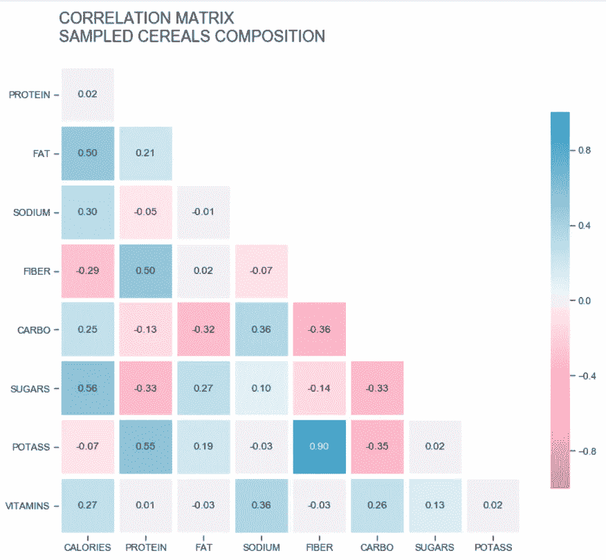

相关矩阵——谷物样品的成分

有了这么多的应用，这个基本方法值得注意。本文将介绍热图的基础知识，并了解如何使用 Matplotlib 和 Seaborn 创建它们。

# 亲自动手

我们将使用熊猫和 Numpy 来帮助我们处理数据争论。

```
import pandas as pd
import matplotlib.pyplot as plt
import seaborn as sb
import numpy as np
```

本例中的[数据集](https://www.kaggle.com/brunotly/foreign-exchange-rates-per-dollar-20002019)是一个对美元汇率的时间序列。

我不想用通常的折线图来表示一段时间内的值，而是想用一个彩色编码的表来显示这些数据，以月份为列，以年份为行。

我将尝试绘制折线图和热图，以了解这将是什么样子。

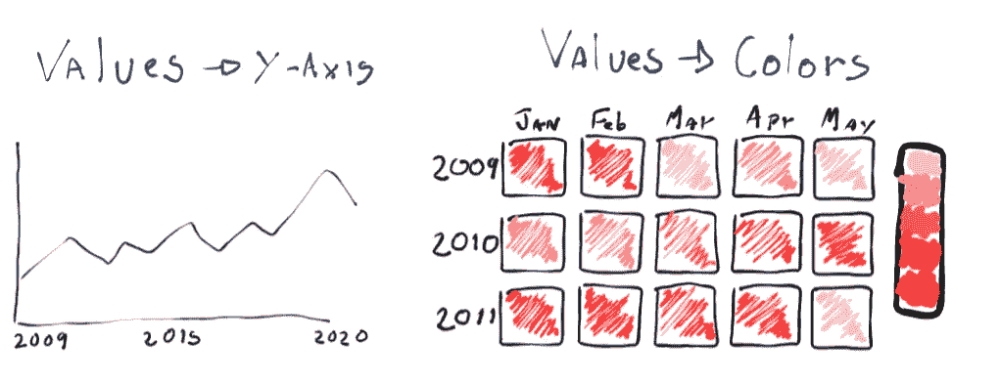

用[画板. app](https://sketchpad.app/) 绘制

折线图在显示数据方面会更有效；比较一个点在直线上的高度比区分颜色更容易。

热图将产生更大的影响，因为它们不是显示此类数据的传统方式。它们会失去一些准确性，特别是在这种情况下，因为我们需要在几个月内合计这些值。但总的来说，他们仍然能够显示模式并总结我们数据中的时期。

让我们[读取数据集](https://medium.com/python-in-plain-english/reading-data-with-pythons-pandas-2715ff925b1d)并根据草图重新排列数据。

```
# read file
df = pd.read_csv('data/Foreign_Exchange_Rates.csv', 
                 usecols=[1,7], names=['DATE', 'CAD_USD'], 
                 skiprows=1, index_col=0, parse_dates=[0])
```

对于这个示例，我们将使用第 1 列和第 7 列，它们是'*时间序列'*和'*加拿大—加元/美元'*。

让我们将这些列重命名为'*DATE '*和'*CAD _ USD '，T15，因为我们要传递标题，所以我们也需要跳过第一行。*

我们还需要解析第一列，所以值是日期时间格式，我们将日期定义为我们的索引。

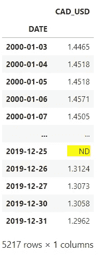

数据框。

让我们确保所有的值都是数字，并删除空行。

```
df['CAD_USD'] = pd.to_numeric(df.CAD_USD, errors='coerce')
df.dropna(inplace=True)
```

我们需要按月汇总这些值。让我们为月和年创建单独的列，然后我们对新列进行分组并获得平均值。

```
# create a copy of the dataframe, and add columns for month and year
df_m = df.copy()
df_m['month'] = [i.month for i in df_m.index]
df_m['year'] = [i.year for i in df_m.index]# group by month and year, get the average
df_m = df_m.groupby(['month', 'year']).mean()
```

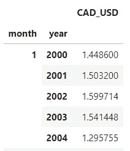

前五行分组。

剩下要做的就是拆分索引，这样我们就有了自己的表。

```
df_m = df_m.unstack(level=0)
```

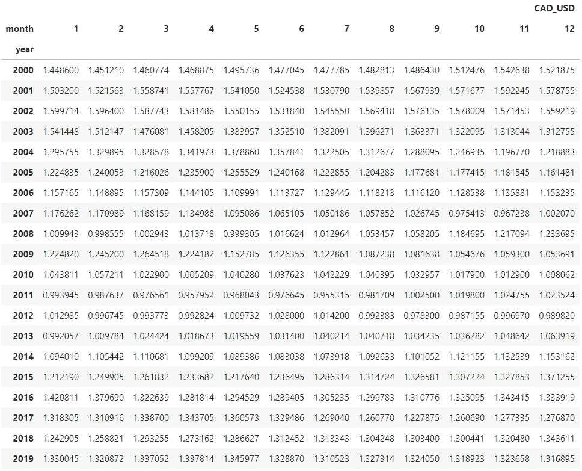

经过整形的数据框。

## 彩色地图

一切就绪。现在我们可以使用 Seaborn 的`.heatmap`绘制我们的第一张图表。

```
fig, ax = plt.subplots(figsize=(11, 9))sb.heatmap(df_m)plt.show()
```

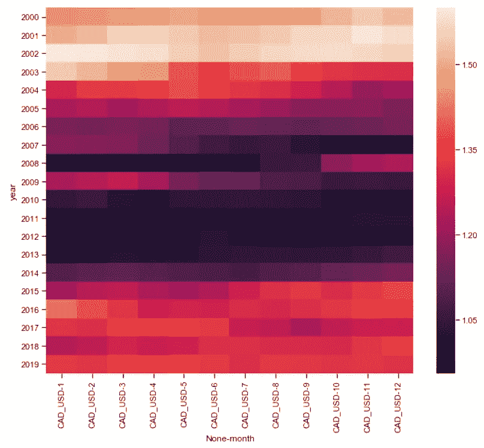

第一张热图。

好了，在这个可视化准备好之前，还有很多事情要做。

颜色是我们图表中最重要的部分，颜色图有点过于复杂。我们不需要这个。相反，我们可以使用只有两种颜色的序列`cmap`。

我们也可以通过定义`vmin`和`vmax`来明确色图的界限。熊猫`.min`和`.max`可以帮助我们找出它们的最佳价值。

```
fig, ax = plt.subplots(figsize=(11, 9))# plot heatmap
sb.heatmap(df_m, cmap="Blues", vmin= 0.9, vmax=1.65,
           linewidth=0.3, cbar_kws={"shrink": .8})plt.show()
```

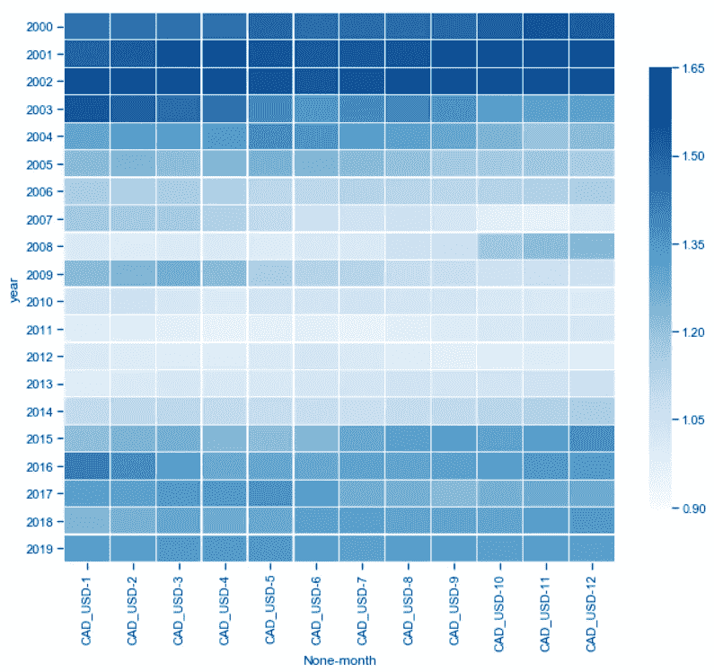

第二张热图。

## 定制的

使用`.heatmap`还有很多其他的论点可以探讨。

例如`linewidth`定义了框之间的线的大小，我们甚至可以用`cbar_kws`将参数直接传递给颜色栏。

颜色看起来不错，现在我们可以把注意力转移到蜱上了。我不认为 CAD_USD-1 是一月的正确名称。让我们用一些更友好的文字来代替它们。

将刻度移动到图表的顶部会提高可视化效果，使它看起来更像一个表。我们也可以去掉 x 和 y 标签，因为我们的轴中的值是不言自明的，标题也会使它们变得多余。

```
# figure
fig, ax = plt.subplots(figsize=(11, 9))# plot heatmap
sb.heatmap(df_m, cmap="Blues", vmin= 0.9, vmax=1.65, square=True,
           linewidth=0.3, cbar_kws={"shrink": .8})# xticks
ax.xaxis.tick_top()
xticks_labels = ['Jan', 'Feb', 'Mar', 'Apr', 'May', 'Jun',
                'Jul', 'Aug', 'Sep', 'Oct', 'Nov', 'Dec']
plt.xticks(np.arange(12) + .5, labels=xticks_labels)# axis labels
plt.xlabel('')
plt.ylabel('')# title
title = 'monthly Average exchange rate\nValue of one USD in CAD\n'.upper()
plt.title(title, loc='left')plt.show()
```

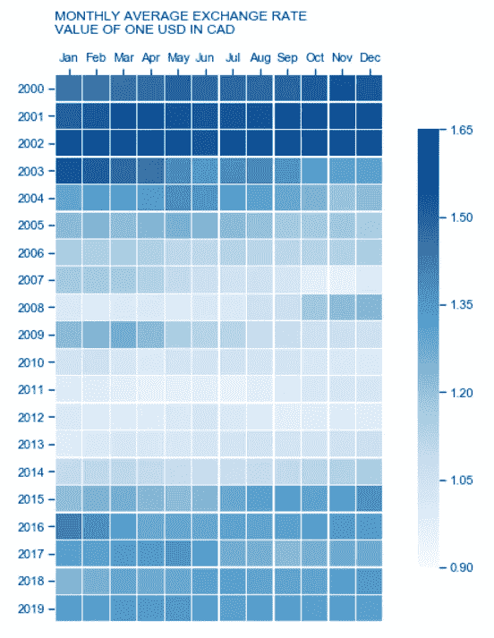

最终热图。

我传递给热图的最后一个参数是`square`。这将使我们的矩阵的细胞呈正方形，而不管图形的大小。

总的来说，看起来不错。我们可以看到，在 21 世纪初，美元比加拿大元高出近 50%，这种情况在 2003 年左右开始改变。这种美元贬值一直持续到 2014 年末，在 2008 年金融危机期间有所变化。

到 2015 年，它已经稳定在 1.20~1.40 左右，直到 2019 年，即我们的记录结束时，月平均值的变化相对较小。

# 相关矩阵

在下面的例子中，我将通过一个关联矩阵来查看 Seaborn 热图的更多功能。

[数据集](https://www.kaggle.com/crawford/80-cereals)是 80 种不同谷物的样本，我想看看它们的成分。

为了构建相关矩阵，我们可以使用 Pandas `.corr()`。

```
# read dataset
df = pd.read_csv('data/cereal.csv')# get correlations
df_corr = df.corr()# irrelevant fields
fields = ['rating', 'shelf', 'cups', 'weight']# drop rows
df_corr.drop(fields, inplace=True)# drop cols
df_corr.drop(fields, axis=1, inplace=True)
```

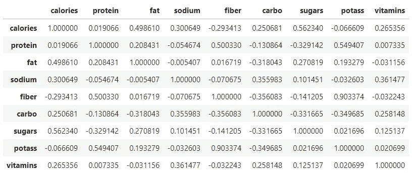

谷物数据框。

相关矩阵中有很多冗余。表格上部的三角形与下部的三角形具有相同的信息。

## 面具

幸运的是，我们可以在 Seaborn 的热图中使用遮罩，Numpy 有建立一个遮罩的功能。

```
np.ones_like(df_corr, dtype=np.bool)
```

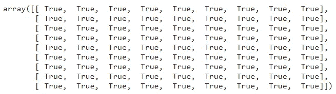

一的矩阵(布尔型)

Numpy `.ones_like`可以创建一个与我们的数据框形状相同的布尔矩阵，而`.triu`将只返回该矩阵的上三角。

```
mask = np.triu(np.ones_like(df_corr, dtype=np.bool))
```

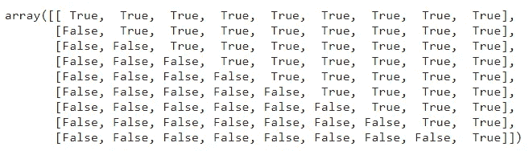

面具

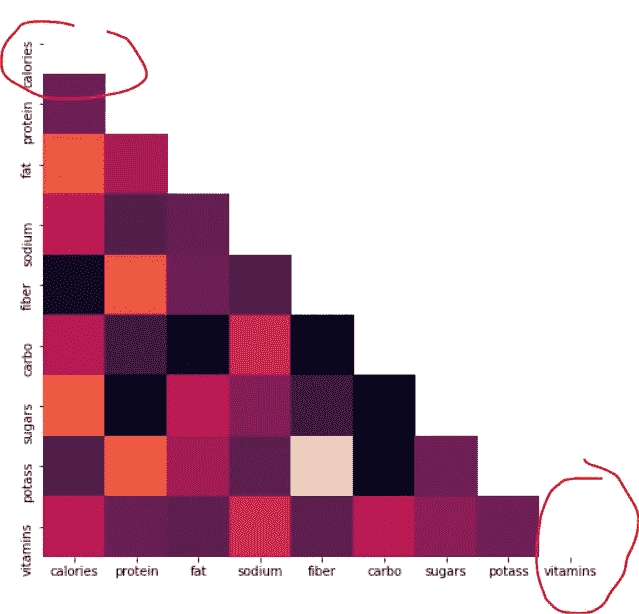

第一相关矩阵。

面具可以有所帮助，但在我们的矩阵中仍有两个空细胞。

没什么不好。这些值可以增加我们绘图的对称性，也就是说，如果两个列表以相同的值开始和结束，就更容易知道它们是相同的。

如果像我一样，你对此感到困扰，你可以在绘图时过滤掉它们。

```
fig, ax = plt.subplots(figsize=(10, 8))# mask
mask = np.triu(np.ones_like(df_corr, dtype=np.bool))# adjust mask and df
mask = mask[1:, :-1]
corr = df_corr.iloc[1:,:-1].copy()# plot heatmap
sb.heatmap(corr, mask=mask, annot=True, fmt=".2f", cmap='Blues',
           vmin=-1, vmax=1, cbar_kws={"shrink": .8})# yticks
plt.yticks(rotation=0)plt.show()
```

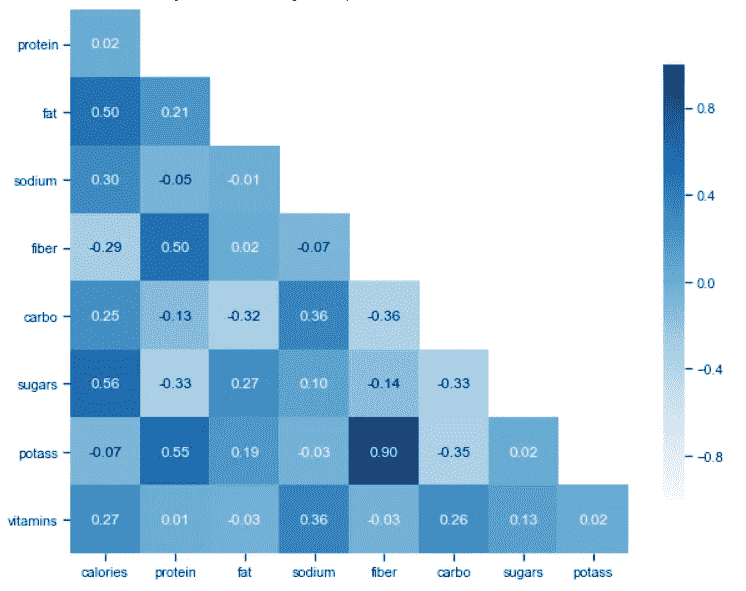

第二相关矩阵。

酷，唯一没有提到的是注释。我们可以用参数`annot`来设置它们，并且我们可以用`fmt`传递一个格式化函数给它。

## 发散调色板

我们仍然需要一个标题，大写的刻度会更好看，但这还不是最重要的。

相关性范围从-1 到 1，所以它们有两个方向，在这种情况下，发散调色板比顺序调色板更好。


[Seaborn 发散调色板](https://seaborn.pydata.org/generated/seaborn.diverging_palette.html)。

Seaborn 有一个有效的方法，叫做`.diverging_palette`，它用来建立我们需要的彩色地图，每边一种颜色，在中间会聚成另一种颜色。

那种方法使用 HUSL 颜色，所以你需要*色相*、*饱和度*和*明度。*我用[hsluv.org](https://www.hsluv.org/)来选择这张图表的颜色。

```
fig, ax = plt.subplots(figsize=(12, 10))# mask
mask = np.triu(np.ones_like(df_corr, dtype=np.bool))# adjust mask and df
mask = mask[1:, :-1]
corr = df_corr.iloc[1:,:-1].copy()# color map
cmap = sb.diverging_palette(0, 230, 90, 60, as_cmap=True)# plot heatmap
sb.heatmap(corr, mask=mask, annot=True, fmt=".2f", 
           linewidths=5, cmap=cmap, vmin=-1, vmax=1, 
           cbar_kws={"shrink": .8}, square=True)# ticks
yticks = [i.upper() for i in corr.index]
xticks = [i.upper() for i in corr.columns]plt.yticks(plt.yticks()[0], labels=yticks, rotation=0)
plt.xticks(plt.xticks()[0], labels=xticks)# title
title = 'CORRELATION MATRIX\nSAMPLED CEREALS COMPOSITION\n'
plt.title(title, loc='left', fontsize=18)plt.show()
```

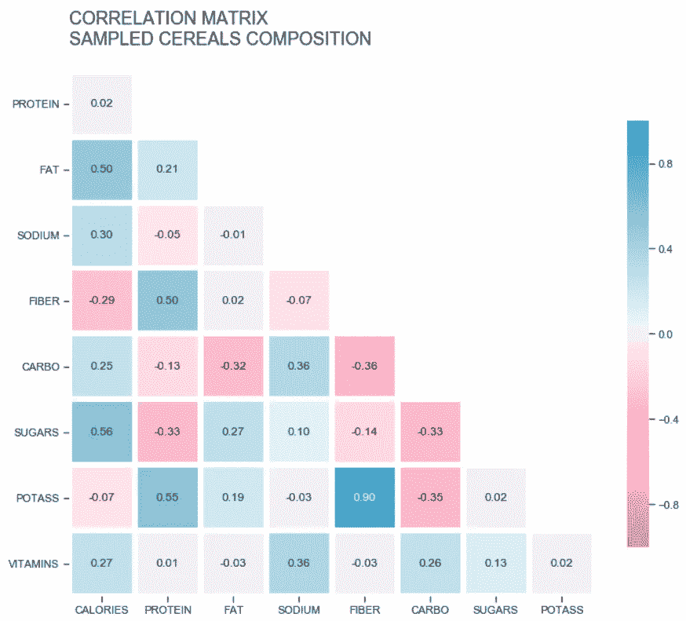

最终相关矩阵。

非常酷，我们为相关矩阵建立了一个漂亮的可视化。现在更容易看到最显著的相关系数，比如纤维和钾。

# 密度

通常，在一个相关矩阵之后，我们可以更好地了解具有强关系的变量。

在这种情况下，我们没有太多的数据来研究，所以散点图将足以开始调查这些变量。

散点图的问题是，如果数据太多，它们会变得难以阅读，因为点开始重叠。这时，热图会回到场景中来可视化密度。

```
fig, ax = plt.subplots(1, figsize=(12,8))sb.kdeplot(df.potass, df.fiber, cmap='Blues',
           shade=True, shade_lowest=False, clip=(-1,300))plt.scatter(df.potass, df.fiber, color='orangered')
```

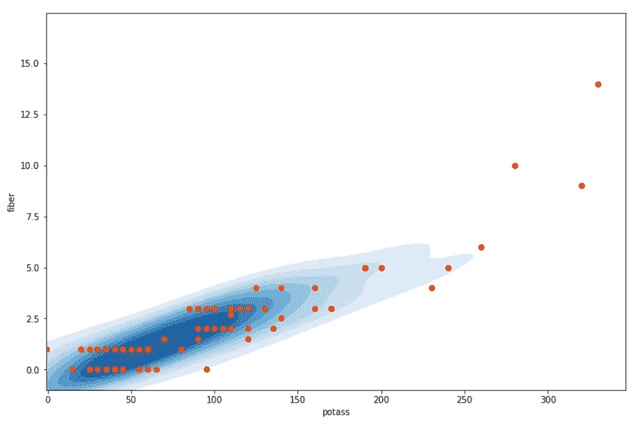

密度估计

如果你有兴趣更多地了解 KDE，我建议你看看马修·康伦关于这个话题的文章。

我们探索了热图中的大多数基础知识，并研究了它们如何通过彩色地图、条形图、蒙版和密度估计来增加复杂性。

感谢阅读我的文章。我希望你喜欢它。
[更多教程](https://linktr.ee/thiagobc23) | [推特](https://twitter.com/thiagobc231)

**资源:**
[Seaborn 示例—相关矩阵](https://seaborn.pydata.org/examples/many_pairwise_correlations.html)；
[海鸟选择颜色托盘](https://seaborn.pydata.org/tutorial/color_palettes.html)；
[Seaborn 发散调色板](https://seaborn.pydata.org/generated/seaborn.diverging_palette.html)；
[Seaborn 核密度估计图](https://seaborn.pydata.org/generated/seaborn.kdeplot.html)；