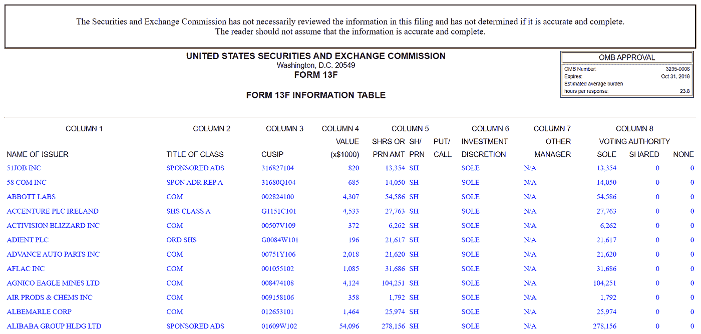
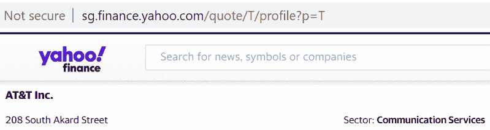
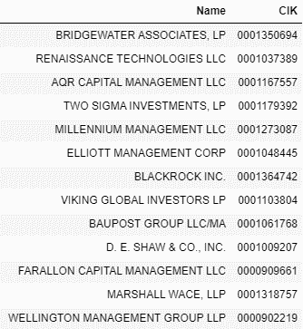
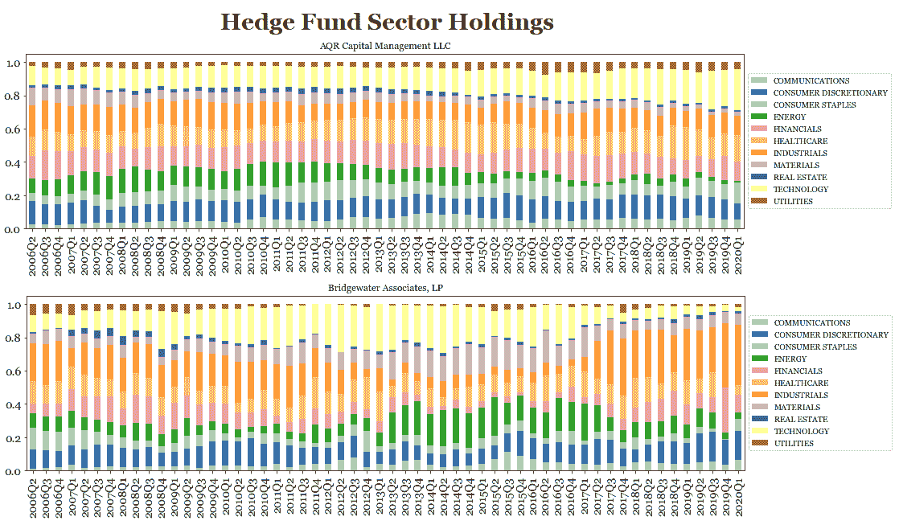
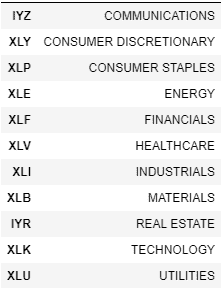
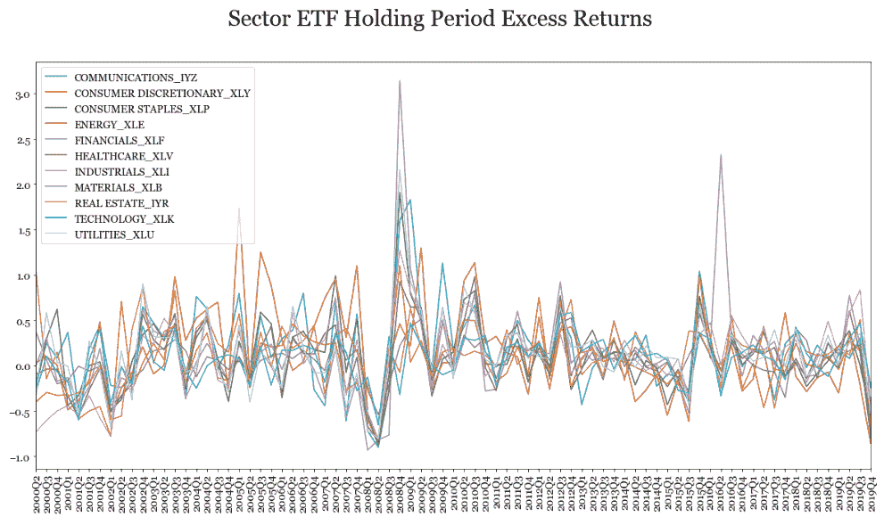
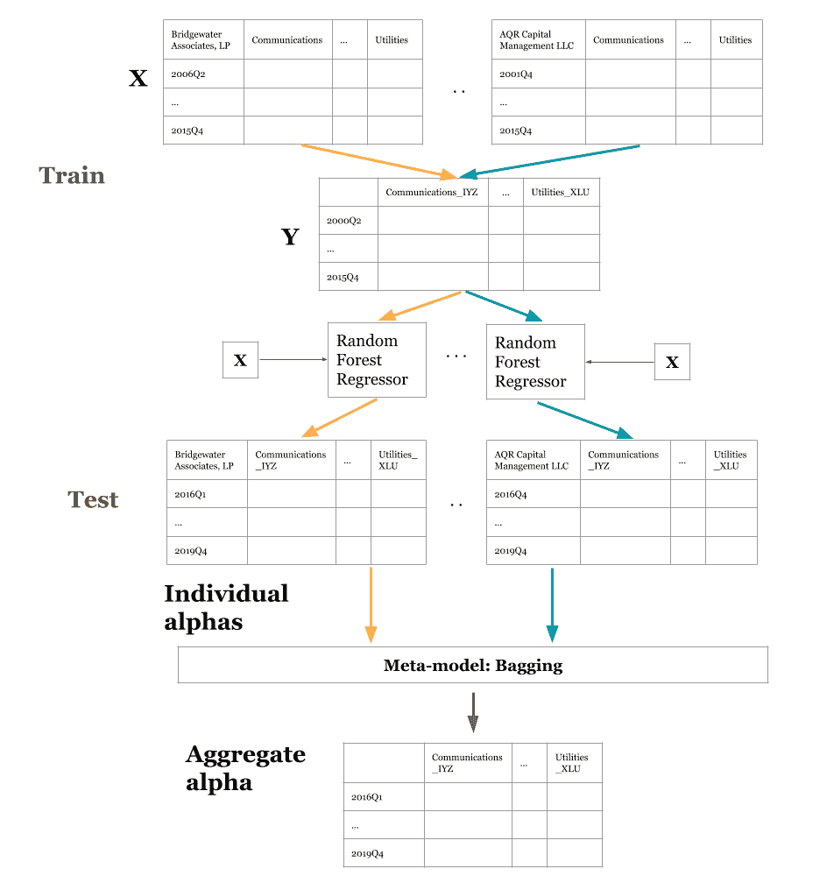
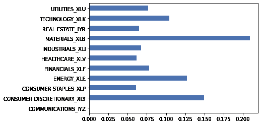

# 对冲基金复制 ETF 策略

> 原文：<https://towardsdatascience.com/hedge-fund-replication-etf-strategy-634068ed6629?source=collection_archive---------37----------------------->

## 美国股市的系统性板块轮动策略

# 目标

与传统资产管理相比，对冲基金的投资者可能普遍担心流动性较低、杠杆利用率较高以及费用较高。通过使用行业 ETF，我的目标是模仿对冲基金在行业配置中的风险/回报状况，但同时享受使用低成本高流动性资产的好处。板块轮动策略允许投资者从市场周期的不同阶段获取回报，同时通过增加(减少)上涨(下跌)板块的权重来分散投资。行业 ETF 提供了一种投资不同行业数百只股票的廉价工具。

# 战略

其策略是训练一个模型来预测代表每个行业的 11 只 ETF 的未来回报，方法是利用最大对冲基金过去的行业配置，基于它们最新的 13F 股票申报文件。测试期间的预期回报将用于均值-方差优化，以获得每个部门的最佳权重。这些权重将被分配到 11 只行业 ETF 的投资中。

# 数据

## 美国 SEC 13F 文件

Form 13F 是由 AUM 超过 1 亿美元的机构投资经理向美国 SEC 提交的季度报告，列出了管理的所有股票资产。该表格需要在一个日历季度结束后的 45 天内提交，它提供了对冲基金持仓的滞后快照，将用于预测未来行业 ETF 回报的模型中。虽然有专门提供高质量备案数据的数据供应商，但我采用了免费但肮脏的方式，从 [SEC 记录](https://www.sec.gov/cgi-bin/browse-edgar?action=getcurrent)中搜集顶级对冲基金的所有持股。

投资经理会得到一个 CIK id，我们可以通过这个 id 查询他们的档案。以下是 Bridgewater Associates，LP (CIK: 0001350694)在 2020 年 5 月 14 日提交的 2020 年第一季度文件的示例。



【https://www.sec.gov/cgi-bin/browse-edgar?action=getcompany】T4&CIK = 0001350694&所有者=包括&计数=40

## 将股票的 CUSIP 映射到 ticker

将 CUSIP 映射到 ticker 允许我们查询每只股票的板块。我无法访问任何付费服务，所以我使用了 [SEC 的未能交付数据](https://www.sec.gov/data/foiadocsfailsdatahtm)，其中包含 CUSIP 和股票代码列。我用历史失败数据创建了一个映射表，并通过查询 CUSIP(例如 00206R102)和从 Investing.com 抓取符号(例如 T)来补充它。


## 从 ticker 获取扇区

现在我们已经有了每只股票的股票代码，我们可以通过查询股票代码并从 Yahoo Finance 中抓取 sector 来将 SECTOR 列添加到映射表中。我补充了对 marketbeat.com 的搜索。



## 对冲基金的行业持股



我根据我的映射表汇总了每个部门的持股价值，需要注意的是，我排除了在雅虎财经和 marketbeat.com 找不到的股票。因此，结果的质量取决于输入数据和使用的映射。我选择了 AUM 的 13 个顶级高频交易，但我们肯定可以研究更多，以找到重要的美国股票交易者。



这些文件最早可以追溯到 1998 年，但我们受到行业 ETF 价格范围的限制。

## 行业 ETF 回报



我使用 yfinance API 得出了自 2000 年以来每个领域最大的 ETF 的价格。在 0.02 的无风险利率下，我计算了每个 ETF 的年化持有期超额回报，其中持有期由以下因素决定:

*   条目:当我们列表中的最后一个 HF 已经为最后一个季度提交时，当天的收盘价
*   退出:当我们的名单中的第一个 HF 为当前季度提交时，当天的收盘价



# 生成阿尔法

## 方法

这个想法是为每个 HF 训练一个预测模型，其中输入是 HF 的最后一个季度的部门分配，输出是部门 ETF 的持有期超额收益。



基本模型是一个多变量多输入随机森林回归器，能够纳入因变量(部门阿尔法值)之间的关系。元模型是 13 个 HF 模型中每一个的预测输出的打包，以预测最终输出。由于一些基金是在 2000 年之后开始的，13 个 HF 模型中的每一个都有不同的培训开始日期，从 2000 年第二季度到 2006 年第四季度，到 2015 年第四季度结束。因此，培训周期从 37 到 60 个季度不等。从 2016 年第一季度到 2019 年第四季度(16 个季度)，所有 13 款 HF 车型的测试周期一致。整体 bagging 模型预测样本外测试期间的 alphas 值。

## 假设

我想使用状态空间/混合模型来解释每个 HF 中部门持股的嵌套结构，但是样本大小对于这样一个高参数空间来说太小了。bagging 方法假设每个 HF 的部门轮换对市场的影响相等。虽然我们无法与 HFs 一起先行或投资，但我们可以尝试预测市场对其分配的延迟影响。一个很大的假设是，市场对 HFs 行业轮动的反应很慢，而且它们的波动足够大，足以影响市场。

# 结果

然后，将测试季度 x 部门 ETF 的总体 alphas 值输入均值-方差优化，以获得每个部门的最佳权重。

```
Test Period from 2016Q1 to 2019Q4
---------------------------------
Expected annual return: 14.4%
Annual volatility: 10.1%
Sharpe Ratio: 1.43
```

分配给每个行业 ETF 的权重:



然后，在最新季度报告(2020 年第一季度)的延期集合中，对分配的权重进行测试，并与所有部门的权重平均分配进行比较。

```
Allocated Weights
-----------------
Annualized Expected Return: -48.76%
Annualized Volatility: 64.11%
Annualized Sharpe Ratio: -1.042Equal Weights
-----------------
Annualized Expected Return: -52.82%
Annualized Volatility: 67.19%
Annualized Sharpe Ratio: -1.116
```

尽管通过降低风险和提高回报，该策略的表现略好于同等权重，但很明显，该策略仍严重暴露于美国股市整体低迷的风险之中。在上面的图表中，行业 ETF 的历史回报率似乎也是高度相关的。

如果模型足够精确，对冲基金回报能否成功复制的问题可以归结为市场风险因素(贝塔)与基金优势(阿尔法)。尽管如此，回报是出了名的难以预测，尤其是当我们的 alpha 可能会随时间而丢失，并且由于模型的数据和稳健性而质量相当差的时候。