# 你好 PyTorch —安装和数量比较

> 原文：<https://towardsdatascience.com/hello-pytorch-installation-numpy-comparison-9879fd677af3?source=collection_archive---------33----------------------->

## 在进入深度学习之前掌握基础知识

如果你没有生活在岩石下，你很可能听说过深度学习现在是一件事。为了执行深度学习任务而不太令人头疼，需要一个复杂的库。

这就是 PyTorch 的用武之地——它是一个用于 NLP 和计算机视觉等任务的**开源机器学习库**。它主要是由脸书开发的，最重要的是，它有一个完善的 Python 接口。

照片由[伊戈尔·莱皮林](https://unsplash.com/@ilepilin?utm_source=medium&utm_medium=referral)在 [Unsplash](https://unsplash.com?utm_source=medium&utm_medium=referral) 上拍摄

在开始编写代码之前，首先需要在您的机器上安装这个库。安装本身会因用户而异，这取决于你是否有一个 **GPU** 。如果你有，那么请参考这篇文章，它演示了如何安装 **CUDA** 和**cud nn**——如果你想在 GPU 上训练深度学习模型，这是一个先决条件:

 [## 在 Windows 10 上安装 Tensorflow-GPU 2.0 的简单指南

### 根据你的网速，不会超过 15 分钟。

towardsdatascience.com](/an-utterly-simple-guide-on-installing-tensorflow-gpu-2-0-on-windows-10-198368dc07a1) 

我知道它说的是“张量流”，所以你只需要遵循文章的第一部分。

***CUDA 和 cuDNN 装了？*** 很好，可以进行了。

# PyTorch 装置

请导航至[该网站](https://pytorch.org/get-started/locally/)并点击与您的机器相关的选项:

正如你所看到的，PyTorch.org 的人会生成一个终端命令，你必须执行这个命令。GPU 版本大约有 750MB，所以下载和安装可能需要一段时间。

一旦完成，你就可以打开一个 Jupyter 笔记本环境。

导入方面，唯一需要的两个库是 *Numpy* 和 *Torch* ，它们可以很容易地导入，如下所示:

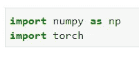

# 声明数组/张量

在 Numpy 库中，**数组**的概念是已知的，与数组是一维还是多维无关。在 Torch 中为相同的概念，但是名字**张量**被使用并且被用来概括一个 n 维数组的概念。

下面是如何在 Numpy 中声明一个二维数组:

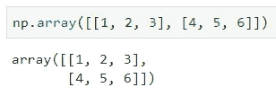

下面是如何在 PyTorch 中做同样的事情:

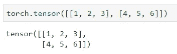

可以看出，如果不考虑不同的方法名，声明背后的思想或多或少是相同的。

但是还有什么可以从 Numpy 转移到 Torch 呢？让我们看看如何声明随机数**的数组**。Numpy 实现优先:

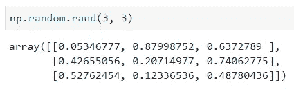

现在在火炬中:

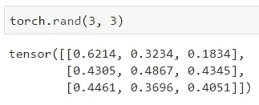

语法还是差不多一样。

数据科学家发现他们自己一直在做的一件更常见的事情是检查数组的形状。在这个领域，形状不匹配的错误是很常见的，为了避免这种错误，我们需要知道是什么原因造成的。

下面是如何在 Numpy 中检查数组的形状:

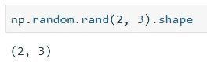

这一次在 Torch 中，语法实际上是相同的，这对加速您的学习过程很有帮助:

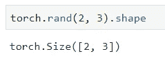

太好了。展示了一些基本的东西，希望你现在对这个库感觉更舒服了。让我们在下一节检查更多的常见任务。

# 矩阵乘法

要在 Numpy 中执行矩阵乘法，首先需要创建两个可以相乘的矩阵**—因此第一个矩阵的列数必须与第二个矩阵的行数相同。**

让我们看看 Numpy 是怎么做的:

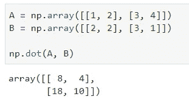

与 Numpy 不同，Torch 使用`.mm()`方法来乘矩阵:

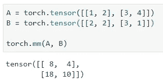

然而，如果`.mm()`听起来不像你想的那样具有描述性，也可以使用`.matmul()`方法:

如果目标不是执行矩阵乘法，而是逐元素执行乘法**，则矩阵可以像任何其他常规数一样相乘，并且 Numpy 和 Torch 的语法是相同的:**

**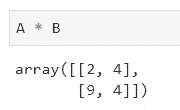**

# **用矩阵还能做什么？**

**其他一些常见的操作是声明一个具有特定形状的零数组。在两个库中，这样做的语法是相同的:**

**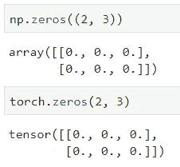**

**然而，如果您希望创建一个任意的具有特定形状的一个的**数组，您可以使用方便的`.ones()`函数。两个库的语法也是相同的:****

**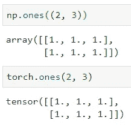**

# **从 Numpy 转换到 Torch，反之亦然**

**借助于`.from_numpy()`函数，可以很容易地将任意数量的数组转换成 Torch 张量:**

**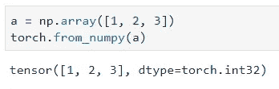**

**以类似的方式，Torch 张量可以转换为 Numpy 数组。语法有点不同，所以请记住:**

**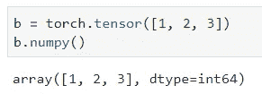**

# **下一步是什么？**

**本文的目的是介绍 PyTorch，并将其与您可能熟悉的东西 Numpy 库进行比较。**

**Numpy 很棒，但是不像 PyTorch in 不能在 GPU 上运行，所有的深度学习都需要 GPU 在**合理的时间内进行训练**。接下来的文章将更加面向深度学习，如果你对此感兴趣，请继续关注。**

**然而，在实际使用它们来解决现实世界的问题之前，您应该了解您正在使用的库的基础知识，所以这就是本文试图涵盖的内容。**

**感谢阅读，敬请期待更多内容。**

**喜欢这篇文章吗？成为 [*中等会员*](https://medium.com/@radecicdario/membership) *继续无限制学习。如果你使用下面的链接，我会收到你的一部分会员费，不需要你额外付费。***

** [## 通过我的推荐链接加入 Medium-Dario rade ci

### 作为一个媒体会员，你的会员费的一部分会给你阅读的作家，你可以完全接触到每一个故事…

medium.com](https://medium.com/@radecicdario/membership)**