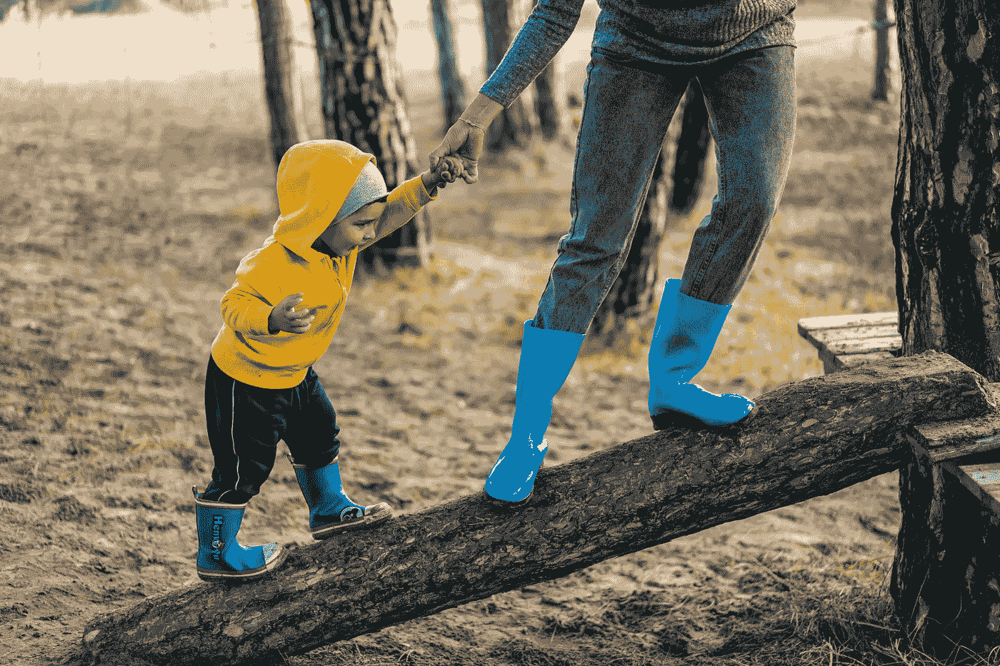
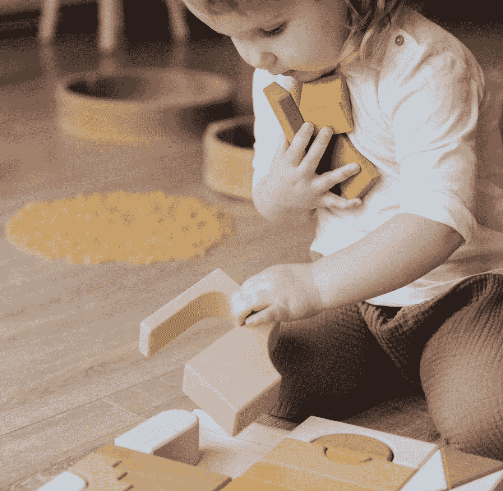
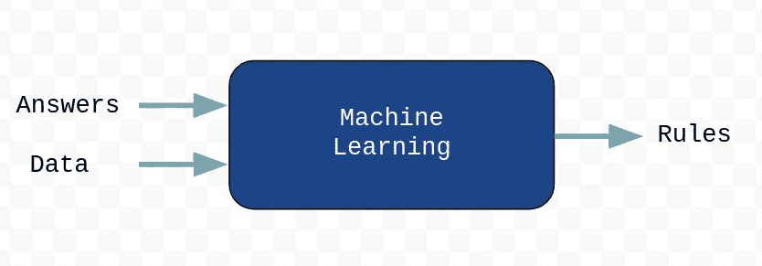
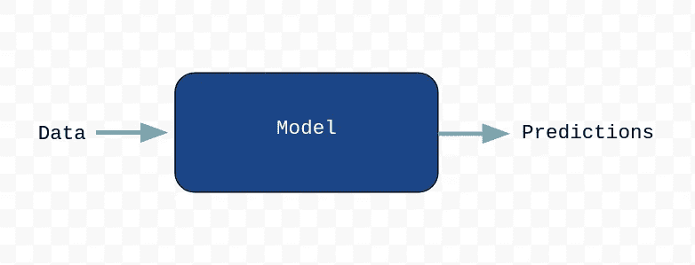
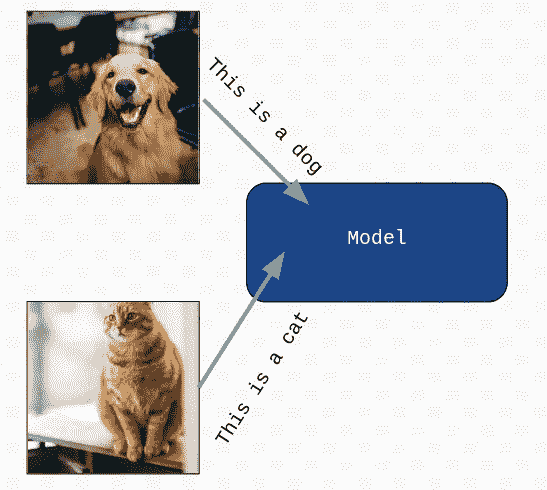
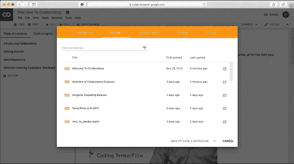
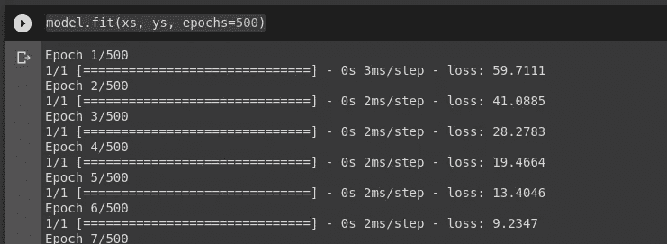

# 你好世界！为了机器学习

> 原文：<https://towardsdatascience.com/hello-world-for-machine-learning-4dc9af0a7430?source=collection_archive---------31----------------------->

## 从零开始构建您的第一个模型，开始机器学习！



图片由 [VisionPic 提供。来自](https://www.pexels.com/@freestockpro?utm_content=attributionCopyText&utm_medium=referral&utm_source=pexels)[的网](https://www.pexels.com/photo/blue-jeans-3036405/?utm_content=attributionCopyText&utm_medium=referral&utm_source=pexels)像素

我不断被问到的最常见的问题是“ ***”我如何开始机器学习？*** ”。我知道这可能会让人不知所措——网上有各种各样的工具和资源，你不知道从哪里开始。相信我，我也经历过。因此，在本文中，我将尝试让您开始构建机器学习模型，并让您熟悉行业中正在使用的实践。

我希望你知道一个小 python，我们将用它来编码我们的模型。如果没有，这里是你开始的好地方:[https://www.w3schools.com/python/](https://www.w3schools.com/python/)

# 什么是机器学习？

机器学习为系统提供了自动学习和改进的能力，而无需显式编程。

***“哎呀！那似乎很复杂……"***

简单来说，机器学习就是模式识别而已。就是这样！

想象一个婴儿在玩玩具。他必须把积木放在正确的槽里，否则就放不进去了。他试着把方砖粘到圆孔上。没用！他又试了几次，最终把方块放进了方孔。现在，每当他看到一个方块，他就会知道把它放进方孔里！



来自 [Pexels](https://www.pexels.com/photo/photo-of-child-holding-wooden-blocks-3933276/?utm_content=attributionCopyText&utm_medium=referral&utm_source=pexels) 的 [Tatiana Syrikova](https://www.pexels.com/@tatianasyrikova?utm_content=attributionCopyText&utm_medium=referral&utm_source=pexels) 的照片

这是机器学习如何工作的一个非常简单的想法。机器学习(显然)更复杂，但让我们从简单的开始。

在机器学习中，不是试图定义规则并用编程语言表达，而是你提供答案(通常称为标签)和数据，机器将推断出确定答案和数据之间关系的规则。



这些数据和标签用于创建机器学习算法(“规则”)，通常称为**模型**。

使用这种模型，当机器获得新数据时，它可以预测或正确地**标记**它们。



例如，如果我们**用猫和狗的标签图像训练**模型，模型将能够预测何时显示一张新图像，它是猫还是狗。



如何训练一个模特！

现在我们有了基本的了解，让我们开始编码吧！

# 创建您的第一个机器学习模型

考虑下面一组数字。你能弄清楚他们之间的关系吗？

```
X: -1 0 1 2 3 4 5

Y: -1 1 3 5 7 9 11
```

当你从左向右阅读时，你可能会注意到 X 值增加了 1，相应的 Y 值增加了 2。所以你可能会想 **Y=2X** 加减什么的。然后你可能会看到 X 上的 0，看到 Y = 1，你会得出关系 **Y=2X+1** 。

现在如果给我们一个 X 的值 6，我们可以准确的预测出 Y 的值为 **2*6 + 1 = 13。**

对你来说想明白这一点一定很容易。现在让我们试着用电脑来解决这个问题。戴上你的编码帽子，因为我们即将编码我们的第一个机器学习模型！

# 设置环境

我们将使用 [Google Colab](https://colab.research.google.com/) 来编写我们的代码。

**那么 Google Colab 是什么？**

这是一个令人难以置信的基于浏览器的在线平台，允许我们免费在机器上训练我们的模型！听起来好得难以置信，但多亏了谷歌，我们现在可以处理大型数据集，建立复杂的模型，甚至与他人无缝共享我们的工作。

所以基本上这就是我们训练和使用模型的地方。你需要一个谷歌账户来使用 Colab。一旦完成，创建一个新的笔记本。瞧啊。你有了你的第一个笔记本。



如果你以前没有使用过 Google Colab，请查看本教程,了解如何使用它。

现在我们真正地写代码了！

# 让我们开始编码吧

完整的笔记本可以在[这里](https://colab.research.google.com/drive/1GD7JFL1cOqDbCHGA_a9xVa3EeRAGTmDw?usp=sharing)和[这里(GitHub)](https://github.com/navendu-pottekkat/ml-hello-world) 获得。

**进口**

我们正在导入 TensorFlow，为了方便使用，将其命名为 tf。

接下来，我们导入一个名为 numpy 的库，它帮助我们轻松快速地将数据表示为列表。

将模型定义为一组连续层的框架称为 keras，所以我们也导入了它。

**创建数据集**

如前所示，我们有 7x 和 7y，我们发现它们之间的关系是 **Y = 2X + 1** 。

一个名为 numpy 的 python 库提供了许多数组类型的数据结构，这实际上是一种标准的方法。我们通过使用 np.array[]在 numpy 中将值指定为数组来声明我们想要使用这些

**定义模型**

接下来，我们将创建尽可能简单的神经网络。它有一层，那层有一个神经元，它的输入形状只是一个值。

你知道在函数中，数字之间的关系是 **y=2x+1** 。

当计算机试图“学习”时，它会进行猜测…也许是 **y=10x+10** 。损失函数根据已知的正确答案来衡量猜测的答案，并衡量它做得好或坏。

接下来，该模型使用优化器函数进行另一次猜测。基于损失函数的结果，它将尝试最小化损失。此时，它可能会得出类似于 **y=5x+5** 的结果。虽然这仍然很糟糕，但它更接近正确的结果(即损失更低)。

这个模型将会重复这个过程，你很快就会看到。

但首先，我们告诉它如何对损失使用均方差，对优化器使用随机梯度下降(sgd)。你还不需要理解这些的数学，但是你可以看到它们是有效的！:)

随着时间的推移，你将了解不同的和适当的损失和优化功能不同的情况。

**训练模型**

训练是模型学习的过程，就像我们之前说的那样。model.fit 函数用于将我们创建的训练数据拟合到模型中。

当您运行这段代码时，您会看到每个时期的损失都会打印出来。



您可以看到，对于最初的几个时期，损失值相当大，并且随着每一步的进行，损失值越来越小。

**使用训练好的模型进行预测**

终于！我们的模型已经训练好了，准备好面对现实世界了。让我们看看，给定 x，我们的模型能多好地预测 Y 的值。

我们使用 model.predict 方法计算出 x 的任意值。

所以，如果我们取 X 的值为 8，那么我们知道 Y 的值是 **2*8 + 1 = 17** 。让我们看看我们的模型是否能做好。

```
[[17.00325]]
```

这比我们预期的值多了一点。

机器学习处理概率，所以给定我们提供给模型的数据，它计算出 X 和 Y 之间的关系很有可能是 **Y=2X+1** ，但只有 7 个数据点我们无法确定。因此，8 的结果非常接近 17，但不一定是 17。

就是这样！您已经介绍了可以在不同场景中使用的机器学习的核心概念。


pettergra 的照片来自 [Meme Economy](https://knowyourmeme.com/memes/meme-economy)

我们在这里使用的过程/步骤是您在构建复杂模型时会做的。

如果你已经建造了你的第一个模型，那么提升一个等级，用你的新技能建造一个 ***计算机视觉*** 模型怎么样？

[](/classifying-fashion-apparel-getting-started-with-computer-vision-271aaf1baf0) [## 时尚服装分类-计算机视觉入门

### 通过创建一个对时尚服装图像进行分类的模型，开始学习计算机视觉。

towardsdatascience.com](/classifying-fashion-apparel-getting-started-with-computer-vision-271aaf1baf0) 

编码快乐！