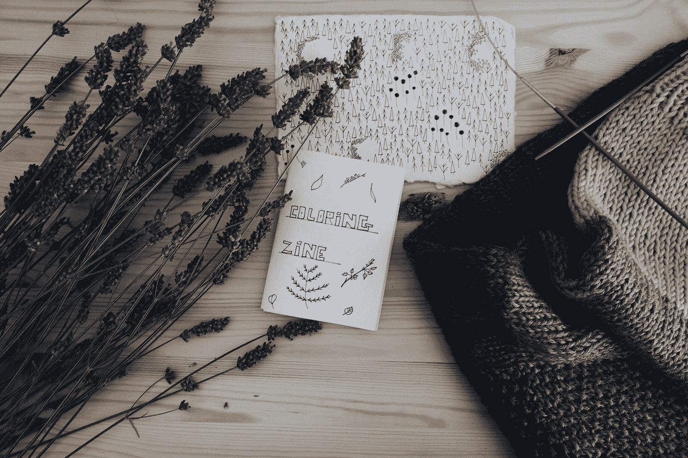
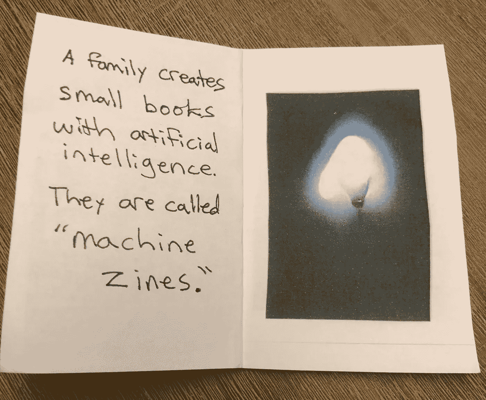
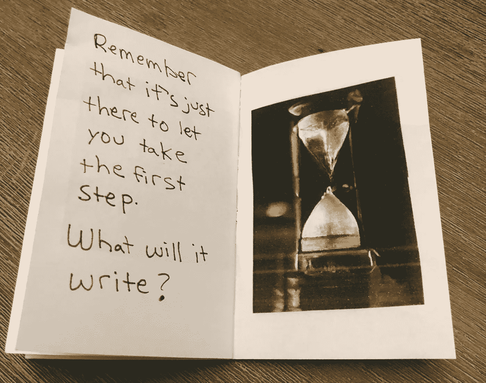
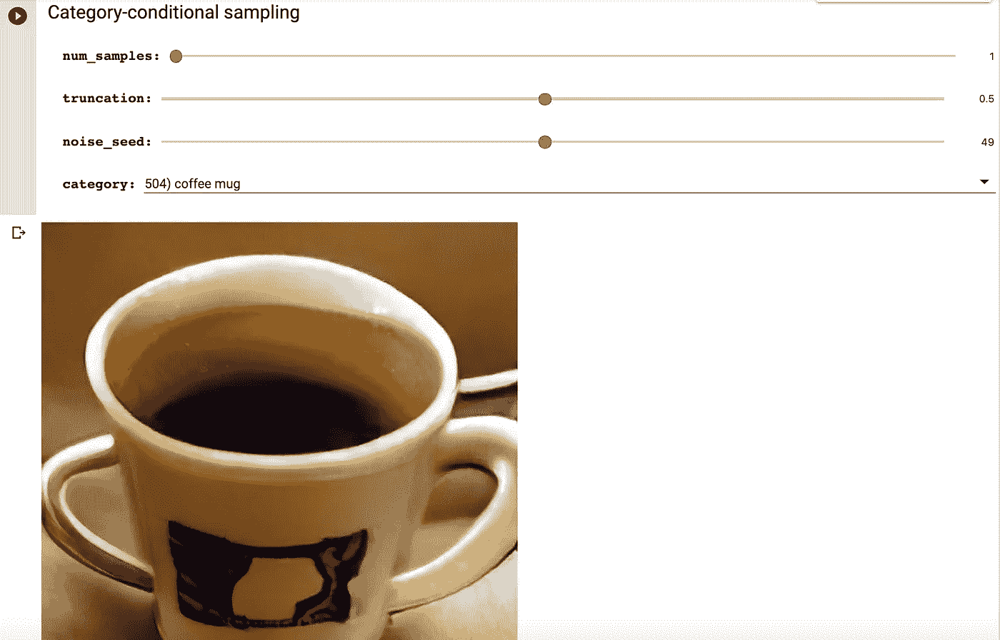
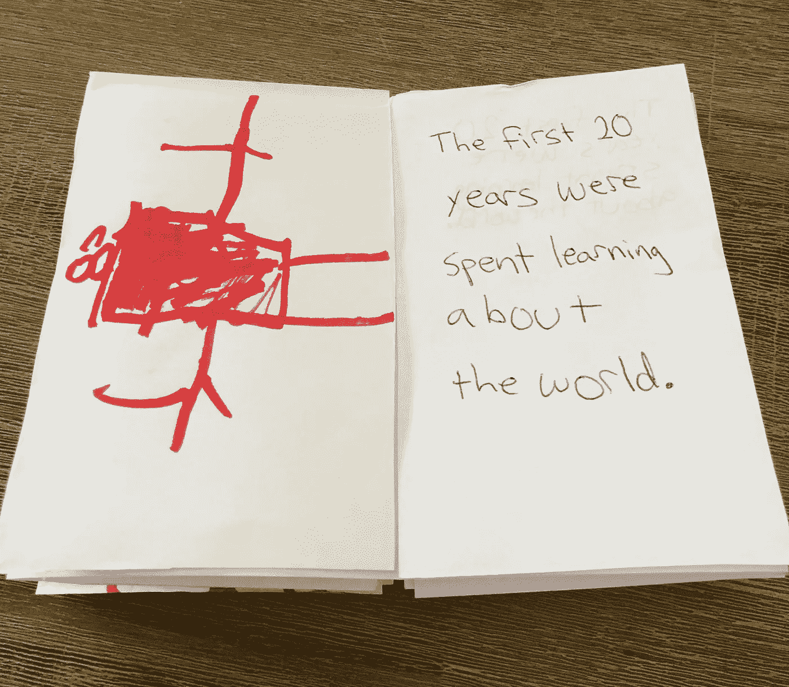

# 帮助孩子们玩人工智能

> 原文：<https://towardsdatascience.com/helping-kids-play-with-artificial-intelligence-68af8f8ba280?source=collection_archive---------25----------------------->

## 杂志如何教授最先进的技能



茱莉亚·贝尔泰利在 [Unsplash](https://unsplash.com?utm_source=medium&utm_medium=referral) 上的照片

每天，我们的孩子都被算法席卷了整个世界。

YouTube 算法决定他们观看什么视频，GPS 算法绘制他们去学校的路线，Spotify 算法选择他们听到什么歌曲，Siri 和 Alexa 等个人助理为他们提供建议——所有这些都是由人工智能驱动的。

儿童(和成人！)让这些与人工智能的被动接触没有任何物理产品——只是源源不断的被动消费。

教师、父母和护理人员不应该被这些数字潮流冲昏头脑，而是应该向孩子们展示如何使用机器学习和神经网络等强大的工具进行实验。

我们必须培养能够在工作场所与人工智能并肩工作的孩子。在技术的帮助下，未来最优秀的员工将能够更好地听写、书写、聊天和做梦。

未来的工人将需要展示创造力、灵活性，以及对机器学习和算法工具的适应。通过玩耍，我们可以在不牺牲模拟创造力的情况下培养这些技能。

我们可以向孩子们展示，人工智能不是他们生活中的一个被动特征。人工智能是一种工具，就像铅笔或纸张一样。真正的诀窍是知道特定问题何时以及为什么需要特定的数字工具。

# 机器杂志！


照片由[克里斯蒂安·威迪格](https://unsplash.com/@christianw?utm_source=medium&utm_medium=referral)在 [Unsplash](https://unsplash.com?utm_source=medium&utm_medium=referral) 上拍摄

我花了六个月的时间学习足够的代码，这样我就可以使用超能力的 [GPT-2 语言模型来写故事](/how-to-fine-tune-gpt-2-so-you-can-generate-long-form-creative-writing-7a5ae1314a61)。

我从我的 AI 写作伙伴那里浮现出 5 万字的奇怪而精彩的故事。我喜欢这一切，但从未找到与新读者分享的完美方式。该文本太过奇怪，无法以传统方式发布，也太过笨拙，无法以直观的 PDF 格式阅读。

我的女儿最终为我解决了这个问题，带回了安德鲁·克莱门斯的《午餐费》,这是一本经典的中级小说，讲述了一个孩子在小学开始卖杂志的故事。

你应该读完整本小说，但是这个谷歌图书链接将直接带你进入这本书的核心:用两张纸制作一个简单的 16 页杂志的食谱…

[](https://books.google.com/books?id=4TITOhPP-gsC&lpg=PA30&vq=Write%20a%20story&pg=PA30#v=onepage&q&f=true) [## 午餐钱

### 见见格雷格·肯顿，未来的亿万富翁。格雷格肯顿有两个痴迷-赚钱和他的长期…

books.google.com](https://books.google.com/books?id=4TITOhPP-gsC&lpg=PA30&vq=Write%20a%20story&pg=PA30#v=onepage&q&f=true) 

假期里，我和女儿开始一起制作杂志。在这些小本子上剪、贴、涂，真是太可爱了。

每本杂志都是人工智能生成的图像和文本的组合，但它们是由人类编辑、转录和手写的。

这是人类和人工智能创造力的完美结合——我们称之为“机器杂志”



我和女儿一起创作的机器杂志中的一页。

这个简单的过程是一个启示。当我花时间手写我的 GPT-2 输出时，我成为了写作过程的参与者，而不是一个被动的家伙按下“开始”按钮，而 GPT-2 做所有的工作。

我认为杂志是迄今为止分享 GPT-2 产出的最佳媒介。你可以快速阅读杂志，读者不会陷入人工智能生成的文本有时尴尬的语法中。

如果你有自己的杂志，写信给我。我很乐意与更多的读者分享你的作品！

# 如何用人工智能写杂志


安迪·凯利在 [Unsplash](https://unsplash.com?utm_source=medium&utm_medium=referral) 上的照片

你不必花六个月的时间学习如何用 GPT-2 或其他人工智能语言模型编写代码。遵循这些简单的步骤，到本文结束时，您就可以编写自己的机器杂志了！

## 1.开始一个故事

和你生活中的孩子一起工作，写一两个句子——一个故事的开头，一首诗的前几行，或者一篇个人文章的开头。这就是你所需要的。我们是这样开始的:

```
A family creates small books with artificial intelligence. They are called "machine zines."
```

## 2.与变压器对话

一旦你完善了你的前几个句子，去[和变形金刚](https://talktotransformer.com/)对话。由 [@AdamDanielKing](https://twitter.com/adamdanielking) 创建的这个网站让你可以即时访问 GPT-2，一个在 800 万个网页上训练出来的超能力语言模型。OpenAI 公司训练了 GPT-2，并逐渐向公众提供了强大的预测文本生成器。

## 3.输入你写的句子。

GPT-2 有一套看似简单的技能:它可以根据给定的写作样本预测接下来会发生什么。一旦你输入你写的句子，与 Transformer 对话就像智能手机上的自动完成功能一样工作。

## 4.点击“完成文本”

一旦你按下那个按钮，GPT-2 就会自动完成你的句子。输出的内容从几个句子到几个段落不等。继续点击“完整文本”,直到你得到足够的句子来填满你的杂志。

## 5.手写你的 AI 作品！

既然 GPT-2 发挥了它的魔力，是时候让你手写出文本了。这给杂志增加了人情味，给你一个机会来编辑你喜欢的故事。

删去没有意义的句子，组合句子，移动段落，添加任何你喜欢的单词。你是人类！你是这本杂志的老板！

以下是我们对文本进行剪裁和移动以帮助表达 GPT-2 关于人类和人工智能创造力的信息后的最终文本:

```
The first thing you need to do is stop. And think about what you want to see.Why not have the book do the talking? Why not have the machine sing? Why not have the machine write?A machine can talk to you.A machine can write you stories.They do not understand you.Sometimes a machine will do more. It will follow you from behind, writing stories for you.What will it write if you don't?What will it write if you try to stop it?Remember that it's just there to let you take the first step.What will it write?
```



我和女儿一起做的机器杂志的一页。

## 6.折叠你的机器杂志！

现在是时候做一些只有人类才能做的东西了。

根据你有多少页，选择你最喜欢的杂志风格。杂志的折叠方式有很多种，都有很惊艳的视频来说明。

例如，8 页的杂志格式真的很容易，而且一旦你正确地折叠起来，真的很令人满意…

这个 14 页的模型有点复杂…

我女儿和我用安德鲁·克莱门斯方法用了很棒的午餐钱。

这个谷歌图书链接将带你直达这本书的核心:用两张纸制作一份简单的 16 页杂志的食谱…

[](https://books.google.com/books?id=4TITOhPP-gsC&lpg=PA30&vq=Write%20a%20story&pg=PA30#v=onepage&q&f=true) [## 午餐钱

### 见见格雷格·肯顿，未来的亿万富翁。格雷格肯顿有两个痴迷-赚钱和他的长期…

books.google.com](https://books.google.com/books?id=4TITOhPP-gsC&lpg=PA30&vq=Write%20a%20story&pg=PA30#v=onepage&q&f=true) 

# 如何用人工智能来说明你的杂志

一旦你制作了你的杂志，你就可以开始添加文字了。但是很快，你就会意识到一些事情——你需要一些插图！

我是一个糟糕的艺术家，我永远也不可能创造出一个足够引人注目的图像来配合这些计算机生成的故事。

## 1.运行一个比根的副本

BigGAN 是一个生成性对抗网络，是两个独立的神经网络一起工作创造新事物的强大合成。BigGAN 最擅长图像生成，创建从未存在过的动物、物体和人的图像——它们是由 AI 模型本身生成的。

[SyncedReview 写了更多关于比根的:](https://medium.com/syncedreview/biggan-a-new-state-of-the-art-in-image-synthesis-cf2ec5694024)

> *万众瞩目围绕论文，*大规模甘训练高保真自然图像合成，*最近在社交网络上冒出来的。这篇论文是赫瑞瓦特大学的安德鲁·布洛克与 DeepMind 的杰夫·多纳休和卡伦·西蒙扬合作的实习项目……该模型能够生成高保真度和低变化差距的非常令人印象深刻的图像。”*

*你可以在家里用这台[谷歌 Colab 笔记本](https://colab.research.google.com/github/tensorflow/hub/blob/master/examples/colab/biggan_generation_with_tf_hub.ipynb)试试，这是一种向孩子介绍人工智能的超级简单的方法。只需运行笔记本，然后使用滑块和对象列表来创建新的东西。*

## *2.为您的机器杂志选择计算机生成的图像。*

**

*我女儿和我花了整整一个下午运行 BigGAN 代码，并生成家用物品的计算机版本，以说明我们的机器杂志。*

## *3.打印图像*

*一旦我的女儿选择了杂志的图片，我们就把它们打印出来并粘贴在杂志上。*

*最终的产品是弯曲的，自制的，完美的人类艺术品，一种与人类同胞分享 GPT-2 作品的方式。*

## *额外加分:让一个孩子来画插图*

*当然，你不需要用 AI 来说明你的机器 Zine！*

*另一天，我让我 4 岁的儿子给一本机器杂志画插图。我会大声朗读 GPT-2 产生的文本，然后他画了一幅画。*

*我喜欢他的绘画和人工智能文字的混合效果。我的孩子帮助我把这个故事从冰冷的数字环境中剥离出来，并把它重新定义为温暖、友好和人性化的东西。*

*这不仅仅是按下“开始”按钮。我们合作，我的家人和人工智能。*

*人类和人工智能关系的巨大变化是无法回避的。*

*变化已经开始，我们需要让我们的孩子做好准备，在一个被机器学习、神经网络和其他 21 世纪数字工具破坏的世界中茁壮成长。*

*我们可以增加孩子们的想象力，扩展他们梦想的一切，而不是害怕这些变化。*

**

*我的儿子讲述了一个由 GPT-2 产生的故事*