# 用混合整数规划(MIP)帮助圣诞老人计划

> 原文：<https://towardsdatascience.com/helping-santa-plan-with-mixed-integer-programming-mip-1951386a6ba5?source=collection_archive---------27----------------------->

## 关于我们如何在 Kaggle 组织的“2019 年圣诞老人工作室之旅”比赛中获得银牌的报道

今年， [Bram Steenwinckel](https://bsteenwi.github.io/) 和我作为第 28 个团队(1600 多名参与者),为圣诞老人的年度 100 天研讨会提供了最佳时间表，确保了我们的圣诞礼物。这篇博客文章包含了一个问题描述和我们为达到这个最佳解决方案所采取的不同步骤。

**免责声明:**布拉姆和我绝不是优化方面的专家。然而，我们玩得很开心，也学到了很多东西。

# 问题定义

每年，圣诞老人都会组织一个为期 100 天的圣诞工作坊，让 5000 个家庭参加。每个家庭(由一定数量的家庭成员组成)可以提供他们最喜欢参加的 10 天的列表。由于研讨会场地容量有限(每天必须有 125 至 300 名与会者)，因此不可能让每个人都有自己的首选。因此，向没有获得第一选择权的家庭提供补偿。一个 N 口之家，没有得到他们的第一个选择会得到:

*   50 美元礼品卡，如果他们有第二选择的话
*   每位家庭成员获得 50 美元礼品卡和圣诞老人自助餐 25%的折扣(价值 9 美元),如果他们有第三个选择的话
*   第四种选择的家庭成员每人 100 美元礼品卡和圣诞老人自助餐 25%的折扣(价值 9 美元)
*   如果他们得到第五个选择，每位家庭成员可获得 200 美元礼品卡和圣诞老人自助餐 25%的折扣(价值 9 美元)
*   第六种选择对应的每位家庭成员 200 美元礼品卡和圣诞老人自助餐 50%折扣(价值 18 美元)
*   第七选择每位家庭成员 300 美元礼品卡和免费圣诞老人自助餐(价值 36 美元)
*   第八个选择的家庭成员每人 400 美元礼品卡和免费圣诞老人自助餐(价值 36 美元)
*   每位家庭成员可获得 500 美元的礼品卡、免费的圣诞老人自助餐(价值 36 美元)，如果他们获得第九个选择，每位家庭成员可享受 50%的北极直升机之旅(价值 199 美元)
*   每位家庭成员可获得 500 美元的礼品卡、免费的圣诞老人自助餐(价值 36 美元)，否则每位家庭成员可免费乘坐一次北极直升机(价值 398 美元)

哦，天啊，我不介意从我的十大清单中选不到一个。我已经可以想象自己坐在圣诞老人旁边，乘坐直升机飞越北极。另外，500 美元和一顿免费晚餐也不算太寒酸。

史蒂文斯家庭的未着色图像被分配到第十个选择。

但这还不是全部…如果我们不在 100 天内统一分配出席人数，还会有会计处罚:

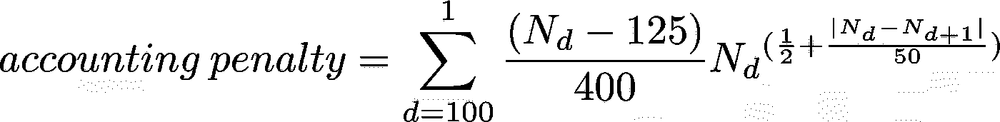

未统一分配服务员人数的会计处罚。N_d 是第 d 天的服务员人数，N_(d+1)是第 d+1 天的服务员人数

最终目标是将这 5000 个家庭分配到 100 天中的一天，使偏好和会计成本的总和最小化。

# 检查数据和成本

让我们仔细看看提供的 5000 个家庭的数据。首先，让我们检查一下家庭规模:

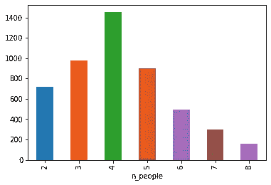

5000 个家庭的规模遵循某种正态分布

因此，看起来家庭规模有点正态分布，规模 4 是众数。现在，让我们看看作为首选的日期:

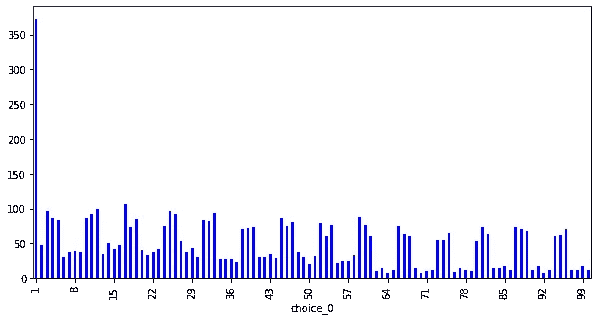

将某一天作为首选的家庭数量。

显然，第一天是非常受欢迎的一天。实际上，日子是倒着算的，d 日是指圣诞节前 d 天。因此，第一天正好是圣诞节的前一天，这解释了为什么它如此受欢迎。此外，我们看到对应于周末的周期性峰值。让我们创建一个偏好成本(的对数)热图，作为家庭规模和指定选择的函数:

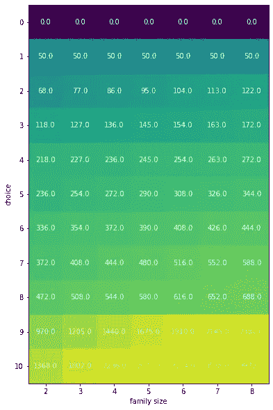

一张偏好成本的热图，它是家庭指定选择及其规模的函数

最后，让我们来看看会计成本日志的热图:

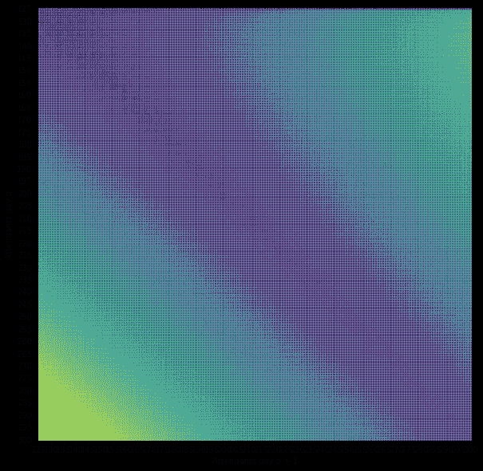

当当天的服务人员数量等于 125 时，会计成本始终为零，当当天的服务人员数量为 300 而第二天为 125 时，会计成本最大。

# 第一种方法:贪婪，匈牙利方法，遗传算法和模拟退火

## 贪婪算法

我们的第一次尝试非常幼稚。由于每天的出席人数必须至少达到 125 人，我们保留了一个没有 125 人出席的日期列表。然后，我们遍历每个系列，并将其分配给列表中的一个选项。如果这个家庭的选择都不在这个列表中，我们就把它分配给最佳选择，确保那天的服务员不超过 300 人。

## 匈牙利方法

比赛开始后不久，opensourc.es 发表了一篇博文,获得了比我们目前所获得的分数好得多的分数。他的策略是忽略会计成本，使用匈牙利方法最小化偏好成本。普通实现试图统一分配家庭(每天 50 个)。我们很快扩展了这种方法，将更多的家庭分配到更受欢迎的日子。我们实际上试图解决下面的优化问题有一段时间了:找到一个 100 维的向量 **V** ，它的元素总和为 5000(家族的数量),当提供给匈牙利算法时，它产生最小的成本。**V**【I】将是分配给第一天的家庭数量。不幸的是，这是一个有点“昂贵”的问题，对于每个新的 **V** ，我们必须重新运行匈牙利方法，这需要一些时间。使用我们的最终向量，获得了 *95441* 的分数，而不是原始提案获得的 *144287* 。下面可以找到这方面的代码片段。

匈牙利算法的代码片段

## 贪婪局部搜索

然后，我们实现了一些算法(或者使用了通过公共笔记本提供给我们的一些很棒的实现)来对解决方案做一些小的调整。每次适应后，我们重新计算分数，检查是否有进步。很明显，快速评分功能至关重要。我们将进一步讨论这个问题。我们使用的策略是:

*   尝试将一个族移动到它的选择之一。
*   尝试交换两个系列(取一个系列(=f1)，选择其中一个(=d1)，然后选择当前分配给 d1 的第二个系列(=f2)，并将其分配给其中一个(=d2))。
*   与上面类似，但有三个家庭。
*   [随机搜索](https://www.kaggle.com/golubev/c-stochastic-product-search-65ns):取若干个家族(=F)，强行分配他们的前 K 个选择。这是每次迭代的 K**F 次调整。这个策略被证明是最有效的。在比赛即将结束时，这个算法的一个 C++实现[已经推出。
    →如果我们将匈牙利方法创建的 95441 个解决方案输入该算法，45 分钟后我们可以获得大约 *75000* 的分数。](https://www.kaggle.com/golubev/c-stochastic-product-search-65ns)

## 遗传算法和模拟退火

我们还使用了一些元启发式方法。我们首先想到的是遗传算法会在这场竞争中胜出。比赛开始后，我们很快专注于遗传算法，但很快就放弃了，因为我们的种群总是收敛到一个非常糟糕的分数。模拟退火更成功，因为它有时能帮助我们摆脱贪婪的局部搜索无法摆脱的局部最小值。模拟退火的要点是，它允许解决方案暂时恶化，以逃避深度局部最优。

## 成本的快速计算

如上所述，快速成本函数非常重要，因为这允许在相同的时间框架内进行更多的局部搜索。人们很快提供了可以在几纳秒内运行的 python 中使用的 C 实现。由于本地搜索的性质，这些实现甚至可以进一步优化:由于每次迭代中的适应是最小的，我们不需要计算每天[的偏好&记账成本，而只需要计算受影响的那些](https://www.kaggle.com/khahuras/the-elegant-prize)。

# 非线性优化的局部求解器

随着比赛的进行，很明显，顶尖选手实际上取得了最佳成绩(68888.04)。随着时间的推移，越来越多的人实现了最佳价值。12 月 6 日(在比利时是" [Sinterklaas](https://en.wikipedia.org/wiki/Sinterklaas) ")，来自 LocalSolver(一个非线性求解器)的人给了我们一份礼物。他们[在推特](https://twitter.com/localsolver/status/1203002028282257409)上发布了一个简化版的解决方案，使用他们的工具实现了前 50 名的位置。解决方案是一个非线性目标的公式，可以用他们的工具进行优化。我们给自己弄了一个学术许可证，运行了这个工具，结果当时的分数大概是 *71000* 。下面是一段代码片段:

用 LocalSolver 求解非线性整数规划

简而言之，我们创建了一个 5000x100 的二进制矩阵 **x** ，其中包含了各个家庭对日期的分配。如果**x【f】【d】= 1**，则 f 族被分配给 d 日。由此，创建一个 100 维的 **N** 向量，其中包含每天的入住率。然后，我们设置约束条件，即每个家庭应该被分配恰好 1 天，并且每天的入住人数不能低于 125 人，也不能超过 300 人。使用 **x** 和 **N** 我们可以直接制定我们的非线性目标，并让 LocalSolver 发挥他的魔力，找到最佳的**x**-矩阵。

# 使用 Gurobi 的混合整数规划

虽然与使用贪婪的局部搜索相比，使用 LocalSolver 是一个直接的改进，但它仍然离最优值很远。因此，我们转向求解一个(线性)混合整数规划(使用 Gurobi，一个强大的商业求解器)。为此，我们必须运用一些技巧。

## 使目标线性

首先，LP 或 MIP 求解器期望约束和目标至多是二次的，最好是线性的。当查看会计罚款的公式时，很明显这是一个非线性函数。但是，由于一天的占用率被限制在 125 到 300 之间，因此该记帐功能的输入数量是有限的。从公式中我们可以看到两个因变量:当天的占有率和 d + 1 天(在这个框架中是前一天)的占有率。因此，我们可以创建一个(查找)176x176 矩阵，其中包含该会计成本的所有可能值(我们通过在会计成本热图中创建网格线暗示了这一点)。总之，一个名为 **occ** 的 100×176×176 矩阵用于存储所有这些信息。 **occ[d][k][l]** 如果在 d 日入住率等于 k，在 d + 1 日入住率等于 l，则 occ[d][k][l]等于 1。这个矩阵非常庞大，但我们可以轻松地删除一些变量。我们知道最佳解决方案的会计成本大约是 6020，因为与高于此的成本相关联的二元变量可以立即被丢弃。

## 每个家族仅使用 10 个二元变量

在我们的 LocalSolver 公式中，我们使用一个 5000x100 的二进制矩阵来存储我们的赋值。在检查我们的解决方案时，我们很快发现，最佳解决方案绝不会让一个家庭做出糟糕的选择。因此，我们可以将二进制矩阵的大小减少到 5000x10。如果家族 f 被赋予选择 c，那么 x[f][c]将是 1。

总之，我们有以下变量:

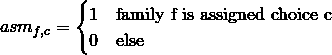

赋值变量

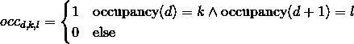

占用变量

当然，我们也可以从分配矩阵中计算占用变量:

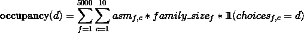

根据分配矩阵计算占用率

这里，family_size 包含每个系列的大小，choices 是一个矩阵，包含每个系列的选项。为了更具体，让我们看一个简单的例子。假设我们有 5 个家庭，选择矩阵如下:

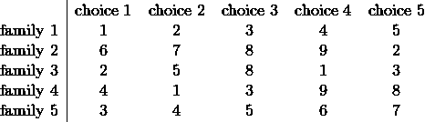

家庭选择矩阵的一个简单例子

那么第 1 天的占用率(occupancy(1))将等于:

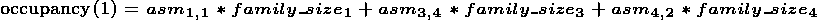

基于分配矩阵计算占用率的实例

然后，我们添加约束条件，即占用率应该在 125 和 300 之间，每个家庭必须准确地分配一个选择，并且二进制占用率矩阵中的 1 位必须与计算的占用率值一致。最后，我们优化以下目标:

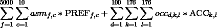

我们的医疗保险计划的目标

PREF 和 ACC 两个矩阵包含相应的费用。可以在下面找到可以提供给 Gurobi 的代码:

我们为 Gurobi 设计的 MIP 配方

我们让它运行了 1 周。！)并最终输出最优解。可以添加一些技巧来加快收敛速度，最明显的是添加约束条件，将求解器导向 68888.04 的最优解(带有求解器的相应“最优性证明”)。如果你成功地使你的求解器在一周内收敛，请在评论中告诉我们！

## 可视化我们的结果

使用一个[公共内核](https://www.kaggle.com/ghostskipper/visualising-results)，我们可以为我们的最优解创建一个很好的可视化:

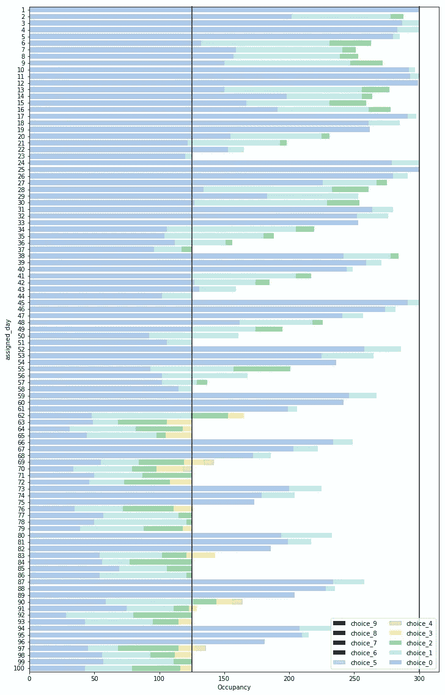

我们的最优解的可视化。在 x 轴上，您可以看到每天的护理人数(显示在 y 轴上)。每个条形中的颜色表示那天被分配了特定选择的家庭的比例。

# 总结词

Bram 和我是找到这个最优解的第 28 个团队。鉴于我们没有线性编程的经验，我们对最终的结果感到非常自豪。我们现在都获得了银牌，我被提升为“竞赛专家”。