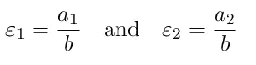

# 金融市场中的羊群效应模型

> 原文：<https://towardsdatascience.com/herding-model-in-financial-markets-668d7f2b0e8f?source=collection_archive---------23----------------------->

本文主要研究股票的羊群效应。我根据文章:
1) [基于主体模型的估计:不对称羊群行为模型的案例](https://www.researchgate.net/publication/5144598_Estimation_of_Agent-Based_Models_The_Case_of_an_Asymmetric_Herding_Model)，阿尔法拉诺等人。艾尔。(2005)

2) [蚂蚁、理性和招募](https://www.jstor.org/stable/2118498?seq=1)，科曼(1993)

在第一部分，我提出了文章中概述的理论模型。接下来，我将其应用于几只股票:苹果、通用电气和特斯拉

# **第一部分。型号**

该模型基于两个群体的相互作用:

了解资产“真实”价格的原教旨主义者。把他们视为自助餐型投资者，他们能够把握资产的真正价值

投机交易者对“真实”价格一无所知，而是基于“非理性”情绪进行买卖。

总的来说，市场上有 **N** 个交易者， **Ns** —投机(‘吵闹’)交易者的数量， **Nf** —基本面分析者。

**Nf+Ns = N**

现在最有趣的部分来了:互动。互动意味着原教旨主义者可能会转向投机交易者，反之亦然。

为了表示转换的概率，我们使用下面的等式( **n** 代表“嘈杂”交易者的数量)

转向“吵闹”交易者的可能性

转向原教旨主义者的可能性

**a1** 和 **a2** 为切换趋势， **b** 为羊群行为参数。因此， **a1** 、 **a2** 和 **b** 越多，切换的概率越大。

到目前为止，一切顺利。现在我们引入**z**——市场中噪音交易者的比例。

该模型的最后一部分是均衡条件:过剩需求满足过剩供应，在每个时刻，我们都有一个清算市场的价格。原教旨主义者的过度需求由下式给出。

公平价格 Pf 和市场 P 之间的正差值越大，它们的过度需求就越大。另一方面，投机者的过度需求

**ξ** 代表情绪， **r0** 是均衡 **EDf** 和 **EDc** 的比例因子。

从等式 **Edc+EDf=0** 我们得到价格形成的结果:

有趣的是，与“公平”价格的偏离可归因于自由因素 1)**r0**——吵闹的交易者的力量，2)投机者相对于基本面分析者的普遍程度，3)随机情绪系数。

现在，假设 **r0** 是常数，我们得到的回报是两个函数的乘积:

在哪里

和

**η(t)** 代表情绪的演变 **ξ** 。

现在，我们需要了解如何处理所有这些希腊字母。但是 int 统计，估计是和分布联系在一起的，所以我们需要一个 **r(t)** 的分布表达式，它本身是两个分布 **σ(t)** 和 **η(t)** 的乘积。

先说 **σ(t)。**经过长时间的推导，我们一致认为这是正确的分布函数:

B(ε1，ε2)是一个[β分布](https://en.wikipedia.org/wiki/Beta_distribution)(链接)，ε1，ε2 被定义为

现在，唯一缺少的就是随机情绪 **η(t)** 。在这里，我们简单地假设噪声在[-1，1]范围内是[均匀的](https://en.wikipedia.org/wiki/Uniform_distribution_(continuous))。给定**η(t)**的对称分布，我们现在可以通过取绝对值来处理正回报。

绝对退货

对派生的另一个深入研究，最终的发行版如下:

其中β是[不完全β函数](http://mathworld.wolfram.com/IncompleteBetaFunction.html)。r0 可以推导为

在我的研究中，我只处理均匀噪声。接下来，我们用极大似然法估计绝对收益的分布。

# 第二部分。判断

我用这个模型投资了几只股票:苹果(APPL)、特斯拉(TSLA)和通用电气(GE)。选择不是随机的。特斯拉被认为是最令人讨厌的股票之一，尽管有大量空头头寸，它的股价仍在上涨。苹果是 [FAANG](https://en.wikipedia.org/wiki/Facebook,_Apple,_Amazon,_Netflix_and_Google) 之一，其资本总额[大于整个能源行业，](https://markets.businessinsider.com/news/stocks/apple-market-cap-higher-than-us-energy-sector-baml-analysts-2019-11-1028693047)和通用电气— [是美国经济中倒下的巨人](https://www.bloomberg.com/graphics/2019-general-electric-rise-and-downfall/)。

我从雅虎财经获取了 5 年的每日报价。此外，对绝对回报进行了调整，因此 E(r)=1。

我的最大似然估计器的实现:

为了得到ε1 和ε2 的稳健估计，我对 500 个每日收益进行了 100 次随机子采样。

**葛**

ε2> ε1 暗示平均而言，市场由原教旨主义者主导。对于股票来说，这是一个常见的情况。红星指向中值ε1，ε2。

当价格出现大幅波动时，例如在 2018 年底，我们可以看到嘈杂交易者的集中度出现峰值。

**苹果**

更大的参数绝对值意味着苹果比通用电气更倾向于在投机和原教旨主义方法之间转换。

同样，在下跌趋势中，吵闹的交易者更加集中。

**特尔萨**

让我感到惊讶的是，尽管最近出现了天文数字般的增长，但并没有那么多投机交易者(至少根据模型是这样的)。

# 结论

蚂蚁模型是在近 30 年前提出的，1993 年，Alfarano 的《应用于市场的蚂蚁模型》是在 15 年前写的，然而，我还没有看到多少例子。然而，今天在历史上最大的牛市中，特别重要的是检查你在哪里:是否从众。

如果你想和我分享一些想法，请用电报写:@ maninoffice。