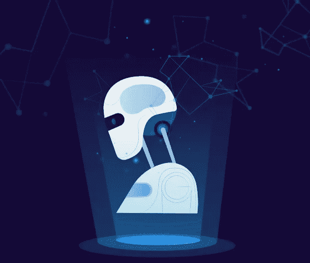

# 这里有 5 门来自顶尖大学的免费自然语言处理课程

> 原文：<https://towardsdatascience.com/here-are-5-free-natural-language-processing-courses-from-top-universities-f108e2456dce?source=collection_archive---------9----------------------->

## 斯坦福、伯克利等大学的顶级课程。

由 freepik 创建的背景向量—[www.freepik.com](http://www.freepik.com)

数据科学仍然是一个热门话题，但更具体地说，自然语言处理(NLP)的需求正在增加。

广义地说，NLP 是人工智能和机器学习的子集，帮助计算机理解、解释和操纵人类语言。它有许多应用，包括语音识别、自动聊天机器人、情感分析等等。

以下是几门免费的关于自然语言处理的高质量课程:

# 1.从语言到信息(斯坦福大学)

如果你在寻找 NLP 的介绍，这门课就是你要找的。请记住，本课程甚至是为那些没有任何 Python 经验的人设计的，因此有了 Python 教程。就我个人而言，我觉得这在理论上肯定涵盖了很多，但肯定还有其他更适合应用的课程。

本课程涵盖文本处理、情感分析、信息检索、聊天机器人等基础知识。如果你是编程新手或者对 NLP 一无所知，我强烈推荐这门课程。

 [## CS124 —从语言到信息(2020 年冬季)

### 欢迎来到 CS124！！一些 FAQ 等等，103，107，109 的前提条件是否严格执行？:没有。参加课程…

web.stanford.edu](https://web.stanford.edu/class/cs124/) 

# 2.深度学习的自然语言处理(斯坦福大学)

这门课也是斯坦福大学的，但是更高级一点。你应该精通 Python，并对基础微积分、统计学和机器学习有很好的理解。这门课程更多的是数学，所以确保你对向量和矩阵有很好的理解。

请记住，课程的很大一部分集中在向量、矩阵运算和神经网络上，因为这些概念构成了许多 NLP 概念的基础。所以如果你觉得自己不具备所需的数学技能，我建议你从上面的第一门课程开始。

 [## 斯坦福 CS 224N |深度学习的自然语言处理

### 自然语言处理(NLP)是人工智能(AI)的重要组成部分，模拟人们如何分享…

web.stanford.edu](http://web.stanford.edu/class/cs224n/) 

# 3.自然语言处理的深度学习(牛津大学)

引用他们的话，这是 NLP 上的高级课程。

> “这将是一门应用课程，侧重于使用递归神经网络分析和生成语音和文本的最新进展。我们将介绍相关机器学习模型的数学定义，并推导出它们相关的优化算法。该课程将涵盖神经网络在自然语言处理中的一系列应用，包括分析文本中的潜在维度、将语音转换为文本、语言之间的翻译以及回答问题。

与第二门课程相似，这门课程非常强调神经网络，因此，强烈建议你理解基本的线性代数、连续数学和概率概念。这个课程也非常实用，应用性很强，所以你也应该是一个熟练的程序员。

 [## 自然语言处理的深度学习

### 这是一门关于自然语言处理的高级课程。自动处理自然语言输入和…

www.cs.ox.ac.uk](https://www.cs.ox.ac.uk/teaching/courses/2016-2017/dl/) 

# 4.自然语言处理(华盛顿大学)

这是一门独特的课程，最初关注的是通常不关注的东西，比如隐马尔可夫模型、概率上下文无关语法等等。课程的后半部分主要关注向量和神经网络。

就我个人而言，我觉得课程材料为某些主题提供了很好的总结，比如神经网络。然而，通过类似的作业/实践，我觉得这更像是一种资源，你可以用来浏览或刷新你的记忆。

 [## CSE 517 —自然语言处理—2017 年冬季

### CSE 517 —自然语言处理—2017 年冬季讲座:WF 下午 1:30–2:50，205 华氏度

courses.cs.washington.edu](https://courses.cs.washington.edu/courses/cse517/17wi/) 

# 5.应用自然语言处理(加州大学伯克利分校)

这是一门相当广泛的研究生课程。它强调了 scikit-learn、keras、gensim 和 spacy 的使用。就原始理论而言，本课程有顶级的幻灯片和额外的阅读材料来加深你的知识。它还涵盖了上述一些课程没有涉及的几个主题。

唯一不幸的是，他们不分享他们的任何作业/实践或测验，所以没有任何机会让你测试你的知识。

引自他们，*“主题包括文本驱动的预测和预报(对涉及分类或回归的问题使用文本)；实验设计；文本的表示，包括从语言结构(如词类、命名实体、句法和共指)导出的特征和从单词、句子和文档的低维表示导出的特征；以聚类为目的探索文本相似性；信息提取(提取文本中提到的实体之间的关系)；和人在回路中的交互式自然语言处理*

 [## 应用自然语言处理

### 本课程考察了自然语言处理作为一套探索和推理文本的方法的使用…

people.ischool.berkeley.edu](http://people.ischool.berkeley.edu/~dbamman/info256.html) 

# 感谢阅读！

我希望你能找到适合自己需求的课程，并祝你在数据科学之旅中一切顺利。

## 特伦斯·申

*   *查看* [*我的免费数据科学资源*](https://docs.google.com/document/d/1UV6pvCi9du37cYAcKNtuj-2rkCfbt7kBJieYhSRuwHw/edit#heading=h.m63uwvt9w358) *每周都有新资料！*
*   *如果你喜欢这个，* [*在 Medium 上关注我*](https://medium.com/@terenceshin) *获取更多*
*   *我们来连线上* [*LinkedIn*](https://www.linkedin.com/in/terenceshin/)