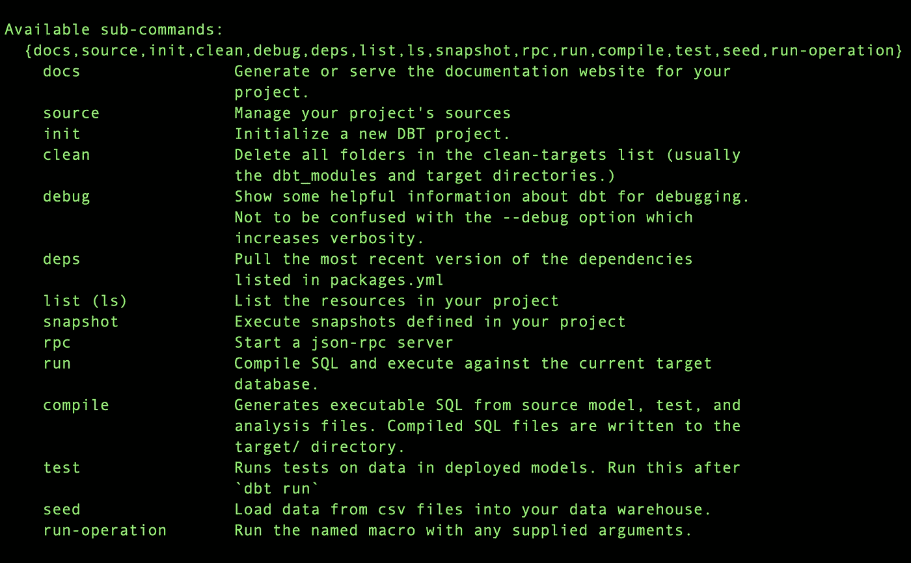
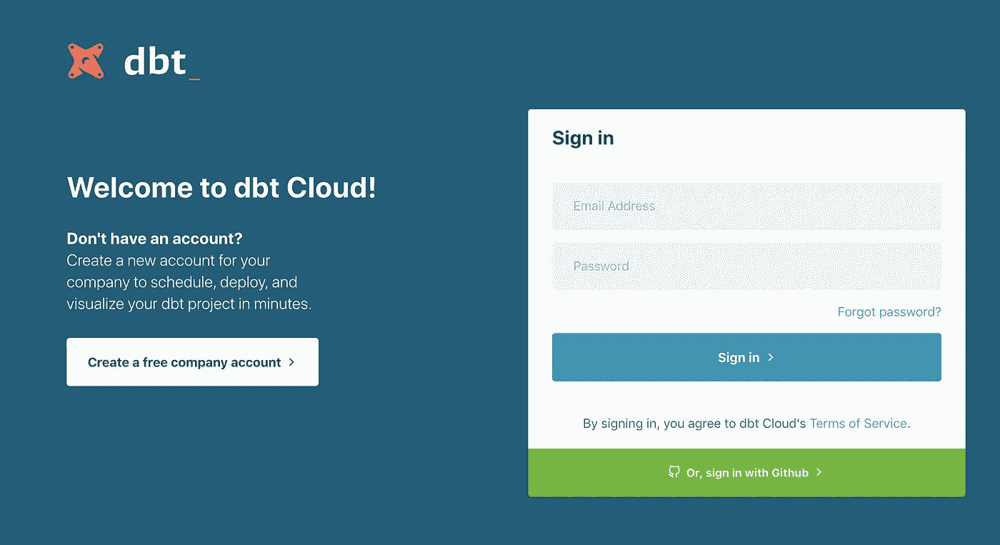
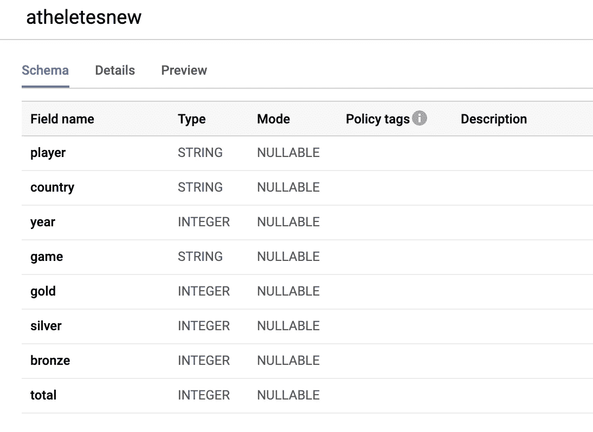
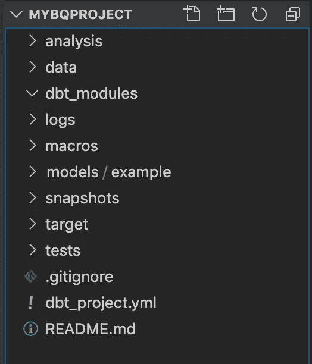
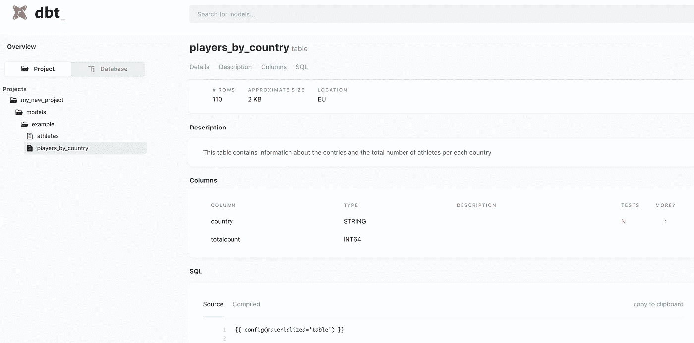
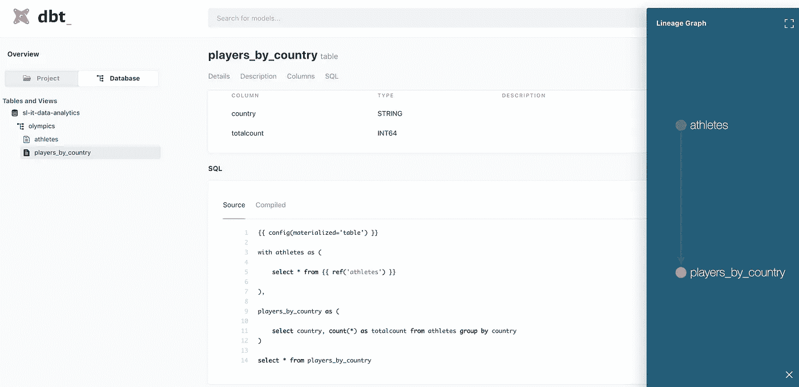
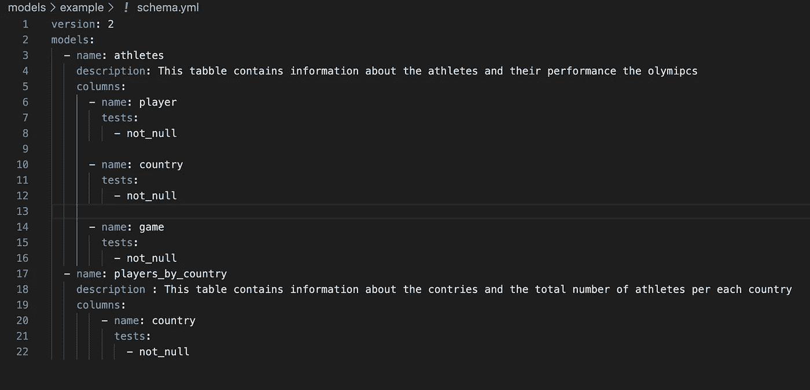
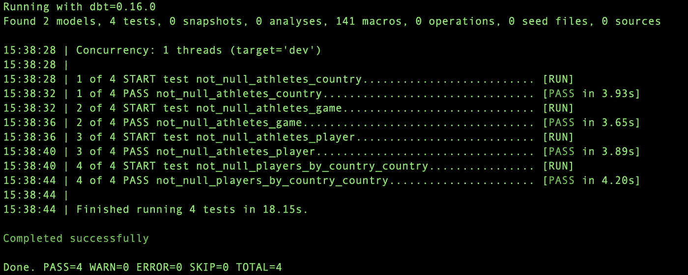
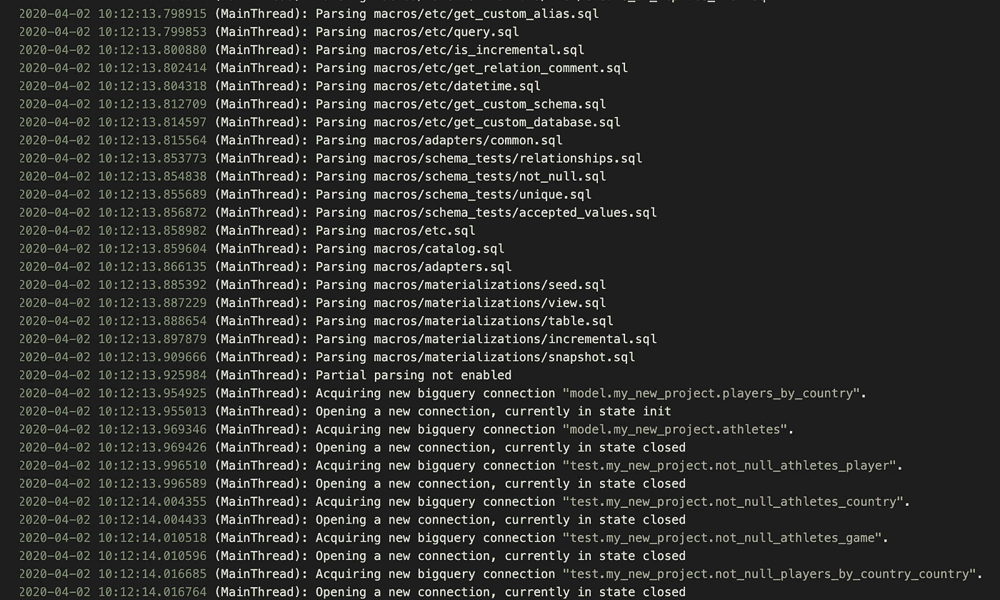

# 以下是如何将软件开发最佳实践应用于分析管道的方法

> 原文：<https://towardsdatascience.com/here-is-how-you-can-apply-software-development-best-practices-to-analytics-pipelines-8d65ba43bc9c?source=collection_archive---------36----------------------->

## 使用数据构建工具— dbt


Alex Kotliarskyi 在 [Unsplash](https://unsplash.com/s/photos/programming?utm_source=unsplash&utm_medium=referral&utm_content=creditCopyText) 上的照片

我已经与数据&分析领域密切合作了近十年，已经看到了许多关于分析、大数据和数据工程的有趣趋势。作为一名铁杆软件工程师，我一直想知道如何将软件工程最佳实践的原则引入分析领域。最近我偶然发现了一个非常有趣的开源工具——dbt(数据构建工具)。

dbt 将以下软件工程原则应用于分析代码—

*   版本控制和代码审查
*   自动化测试
*   沙盒和环境
*   证明文件
*   模块性
*   包装管理

dbt 是 Apache 2.0 [许可](https://docs.getdbt.com/docs/about/license)下的开源项目。

> 您需要注意的一点是，dbt 不能帮助您获取数据。当您的数据已经在您的数据仓库中时，dbt 的魔力就显现出来了。

dbt 目前支持(通过核心和社区贡献)以下数据库/数据仓库—

*   红移
*   BigQuery
*   雪花
*   很快
*   火花
*   Postgres
*   Microsoft SQL Server

本文的重点是展示如何根据软件开发最佳实践构建 dbt。

# dbt CLI

dbt 允许您使用简单的命令行选项来转换数据。根据您的操作系统，dbt 网站上的[提供了](https://docs.getdbt.com/docs/running-a-dbt-project/using-the-command-line-interface/installation/)安装说明。一旦安装了 dbt CLI，您可以通过运行一个简单的命令进行验证

```
$dbt
```

你将会看到这样的选项—



# dbt 云

dbt 最初是由一家名为 [Fishtown Analytics](https://www.fishtownanalytics.com/) 的公司创建的。他们还提供基于云的 dbt 服务—[https://cloud.getdbt.com/](https://cloud.getdbt.com/)



您可以根据自己的选择使用 CLI 或云服务。

# 先决条件

在本教程中，我将转换一个加载到大查询中的非常简单的数据。我正在使用的数据集可以在我的 [GitHub repo](https://github.com/deshpandetanmay/hadoop-real-world-cookbook/blob/master/data/OlympicAthletes.csv) 上获得。可以下载上传到大查询。

表格方案如下所示



样本数据看起来像这样—


# 配置大查询凭据

您可以使用 [dbt 站点](https://docs.getdbt.com/docs/supported-databases/profile-bigquery)上描述的方法来配置大型查询凭证。这里我使用的是服务帐户 JSON 键方法。您需要确保服务帐户拥有以下权限—

*   BigQuery 数据编辑器
*   BigQuery 作业用户
*   BigQuery 用户

然后，您需要确保设置了 dbt 配置文件`$HOME/.dbt/profile.yml`，并更新了服务帐户的详细信息，如下所示

```
my-bigquery-db:target: devoutputs:dev:type: bigquerymethod: service-accountproject: my-projectdataset: olympicsthreads: 1keyfile: /path/to/service-account.jsontimeout_seconds: 300priority: interactiveretries: 1
```

您可以分别设置`dev`和`prod`的配置文件，而不会影响任何代码更改。**这是 dbt 的特性之一，它允许我们轻松地进行沙盒和环境管理。**

# 创建项目

您可以使用简单的 CLI 命令创建 dbt 项目

```
$ dbt init [project-name]
```

该命令创建一个示例 dbt 项目，其中包含所有必需的文件和文件夹。典型的结构如下图所示-



查看文件夹结构，您可以看到软件开发原则的含义，其中您可以分别看到用于测试、日志、模块、数据的文件夹。这允许代码结构的整体可管理性和可读性。这是非常友好的版本控制，易于遵循。

你可以在 [dbt 站点](https://docs.getdbt.com/docs/building-a-dbt-project/dbt-projects)上阅读文件夹结构的细节和它们的含义。

在`dbt_project.yml`中，您需要设置您在前面部分配置的概要文件。


# 创建模型

我正在创建两个简单的模型来处理数据并获得一些见解。

`models/example/athletes.sql`看起来像这样—

```
{{ config(materialized='table') }}with athletes as (select * from olympics.atheletesnew)
select * from athletes
```

`model/example/players_by_country.sql`看起来像这样—

```
{{ config(materialized='table') }}with athletes as (select * from {{ ref('athletes') }}),players_by_country as (select country, count(*) as totalcount from athletes group by country)select * from players_by_country
```

在这里您可以看到 dbt 特性，您可以在一个文件中定义一个模型，并在其他模型中引用它。这有助于重用。此外，如果您需要更改基本模型中的任何内容，您可以在一个地方完成。就像任何典型的软件工程语言一样。

模型还有其他特征，比如—

*   启用/禁用带标志的模型
*   使用别名
*   使用变量
*   使用标签
*   等等。

您可以在特定的文件夹中创建模型。这允许您实现模块化。这类似于用某些编程语言创建包/名称空间。

# 文件

dbt 允许您为模型自动生成文档。让团队更容易理解并更好地合作

您可以通过运行命令来生成文档

```
$ dbt docs generate
```

您将能够通过运行一个命令来查看文档—

```
$dbt docs serve
```



你甚至可以在文档网站上查看血统信息，如下所示—



# 测试

dbt 允许您对生成的模型进行一些测试。默认情况下，您可以配置像唯一检查、空检查、参照完整性等测试。作为模特。在这个例子中，我运行样本模式测试来验证模型的结果是否为空。我可以在`schema.yml`中配置这些测试，如下所示—



您可以通过运行一个简单的命令来运行这个项目的测试，比如

```
$dbt test
```

看到这样的输出—



你甚至可以运行一些复杂的测试，如 [dbt 网站](https://docs.getdbt.com/docs/running-a-dbt-project/command-line-interface/test)上所描述的。

# 日志

每当您编译和运行 dbt 项目时，它都会为您生成详细的日志。如果您遇到任何问题，这些日志对于追溯错误非常有用。



# 与 CI/CD 管道集成

所有 dbt 命令都给出正确的退出代码，如 0、1、2。您可以在 CI/CD 管道中使用此功能，以便了解特定步骤是成功还是失败。

```
Hey, if you enjoyed this story, check out [Medium Membership](https://deshpandetanmay.medium.com/membership)! Just $5/month!*Your membership fee directly supports me and other writers you read. You’ll also get full access to every story on Medium.*
```