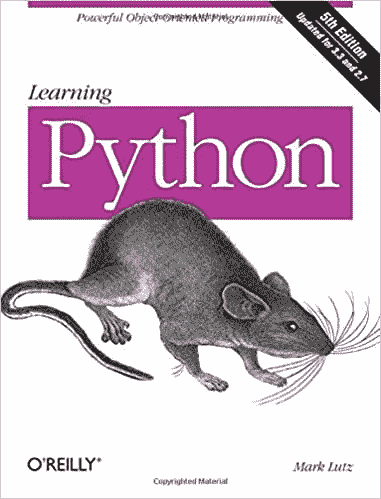
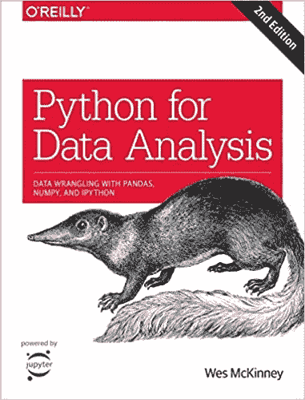

# 以下是我如何学习足够的数据科学编程

> 原文：<https://towardsdatascience.com/heres-how-i-learned-just-enough-programming-for-data-science-58389f50c570?source=collection_archive---------7----------------------->

## 如何学习编程和我推荐的最佳书籍

毫无疑问，数据科学需要良好的编程技能，但是多少才够呢？你应该和一个普通的软件工程师知道一样多吗？本文旨在回答这个问题，以及更多问题。

阿尔瓦罗·雷耶斯在 [Unsplash](https://unsplash.com?utm_source=medium&utm_medium=referral) 上拍摄的照片

用一句话来总结——不，不需要了解中高级后端开发人员的编程水平。目标是比一般的统计学家知道更多，你会没事的。随着你职业生涯的进展，总会有时间去学习更多。

文章分为三个部分:

1.  数据科学需要多少编程？
2.  选哪种编程语言？
3.  我推荐的入门资源

请记住，在本文中，您将找到推荐资源的附属链接，以便开始使用。这对你来说没什么，因为价格是一样的，但是如果你决定购买，我会得到一点佣金。此外，我只展示我自己经历过的材料，并可以保证 100%的质量。

事不宜迟，让我们从第一部分开始。

# 数据科学需要多少编程？

嗯，很多——但这取决于你的角色和你工作的公司。小公司不一定有开发和数据科学的结构化团队，因此需要对这两者都很熟悉。

简而言之，你在编程和数据科学方面都不会是最好的。这不一定是件坏事，因为你会更好地理解公司提供的产品/服务。

由于更正式的结构，大公司会以不同的方式对待你。你将只处理数据科学问题(作为一名数据科学家)，通常看不到**的全局**。你是来做工作的，不是来问太多问题的。

请记住，这只是一个经验法则——从我的经验和许多其他人的经验中得出的。

# 选哪种编程语言？

老实说，这不是一个简单的问题。大多数网站都将 Python 和 R 作为首选语言，但这并不是唯一的选择。

一些公司需要数据科学解决方案，但没有任何数据科学家——以 web/移动开发为中心的软件开发公司。

虽然 Python 和 R 很棒，但我发现越来越多的资源是用 Java ，甚至是用 Go(lang)来解决[机器学习任务的。见鬼，我甚至就这个话题写了一整篇文章:](https://amzn.to/3hYLtAY)

 [## 去学数据科学？让我们试试。

### 谷歌的 Golang 能搞定数据科学吗？让我们找出答案。

towardsdatascience.com](/go-for-data-science-lets-try-46850b12a189) 

我并不是说像 Java 和 Go 这样的语言非常适合原型开发，但是对于不了解 Python 或者只是不想使用它的软件开发人员来说，它们仍然是一个可行的选择。随着我深入软件开发，或者开发使用机器学习的应用程序，我可以理解为什么有人想要远离 Python。

总结一下:

*   如果你只关心数据科学和机器学习，那就学习 Python/R 吧
*   如果你是软件开发人员，不想切换语言，可以试试 Java 和 Go(以及其他语言)

# 我推荐的入门资源

我猜您已经选择了 Python 路线，这很好，有几个原因:

*   这种语言很容易学习——比 Java/Go 对初学者更友好
*   它是数据科学中使用最广泛的语言
*   它是一种通用语言——不限于统计任务

作为一名有抱负的数据科学家，Python 非常适合你。你没有必要去探索其他更难的语言，因为编码不应该是你主要关心的事情。

*但是如何入门呢？*我为你准备了两本很棒的书，它们帮助我学好了 Python，既有纯编程方面的，也有数据分析任务方面的。让我们从基础开始。

## 《学习 Python 》,作者马克·卢茨(奥莱利)

https://amzn.to/3nrnZtp

这是一本很棒的处女作——这一点毋庸置疑。请注意，这是一篇将近 1500 页的文章，所以不要期望在一天内完成。

尽管篇幅很长，我认为这是一本学习和掌握这门语言的必不可少的书。它以一种易于理解的方式涵盖了语言的各个方面。

一些主要的主题是数据类型、语句、循环、函数、函数作用域和参数、模块、类和面向对象的编程、异常、生成器、装饰器以及更多高级的主题。正如我所说的，这不是一夜之间的阅读，但你应该能够在 2-3 个月内完成。这些时间足够我们学习基础知识，并准备好进入更高级、更实用的主题。

这就是下一本书出现的地方。

## 用于数据分析的 Python，作者 Wes McKinney (O'Reilly)

【https://amzn.to/3fthEJu 

正如您所料，对于一名有抱负的数据科学家来说，这是合乎逻辑的下一步。这一次我们有一本更短的书——大约 500 页。如果你把它作为一个优先事项，你肯定能在一个月内覆盖它。

前 100 多页是对 Python 编程语言的复习，所以可以跳过它。

之后，这本书涵盖了你期望从一本伟大的数据分析书中得到的几乎所有东西。通过基本的例子和后来更现实的数据清理和准备任务，像 *Numpy* 和 *Pandas* 这样的基础库被很好地覆盖了。

这本书还介绍了数据可视化和处理时间序列，这是一个不错的奖励，但不是你应该购买这本书的东西——因为这些主题有更好的选择。

总的来说，这是一本很好的读物，也是第一本书的后续。

# 在你走之前

学习编程并不是最容易的任务，但对于像数据科学这样的职业来说是必须的。你要做多少编程工作将取决于你工作的公司的类型——小公司的环境更面向开发者，大公司则相反。

总会有例外，但我发现这是一个很好的经验法则，来自我的经验和我交谈过的许多其他人的经验。如果我们谈论的是小型人工智能初创公司，这条规则没有任何意义，所以请记住这一点。

关于语言，Python 是一个很好的起点。它很容易学习，并完成工作。如果你是 web/移动开发者，不想学习 Python，Java 和 Go 有不错的机器学习选项。

对于其他人来说，学习足够的 Python 和数据分析足以轻松处理更困难的问题，所以请确保您已经掌握了基础知识。上面的两本书应该会创造奇迹。

喜欢这篇文章吗？成为 [*中等会员*](https://medium.com/@radecicdario/membership) *继续无限制学习。如果你使用下面的链接，我会收到你的一部分会员费，不需要你额外付费。*

 [## 通过我的推荐链接加入 Medium-Dario rade ci

### 作为一个媒体会员，你的会员费的一部分会给你阅读的作家，你可以完全接触到每一个故事…

medium.com](https://medium.com/@radecicdario/membership) 

加入我的私人邮件列表，获取更多有用的见解。