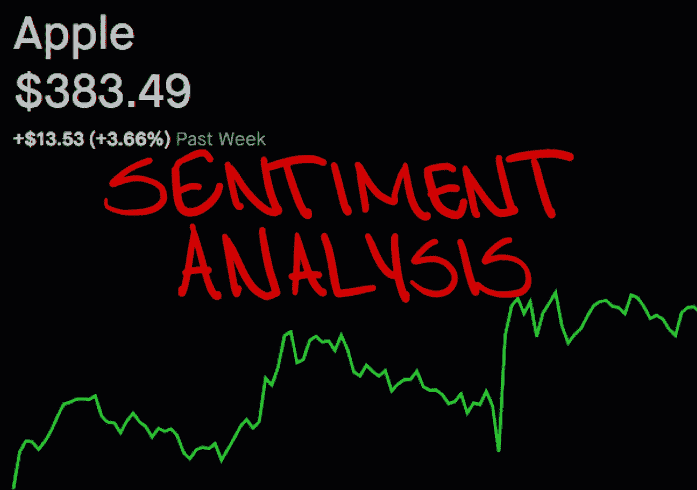
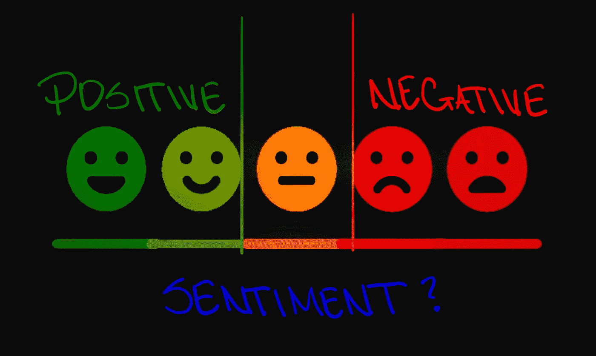
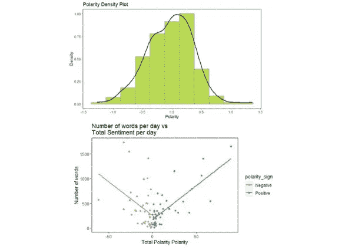
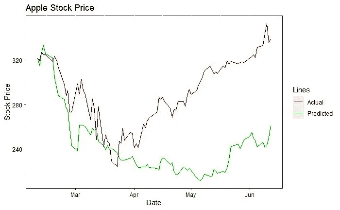
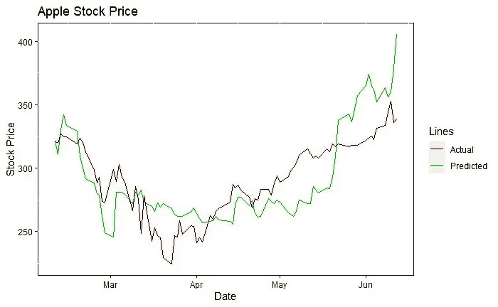

# 以下是我如何使用自然语言处理预测苹果股价的

> 原文：<https://towardsdatascience.com/heres-how-i-predicted-apple-s-stock-price-using-natural-language-processing-13a578c41b8e?source=collection_archive---------16----------------------->

## 利用情绪分析预测苹果股价走势的 NLP 研究

图片作者:特里斯特·约瑟夫

股票市场预测是指试图确定在交易所交易的公司股票(或其他金融工具)的未来价值的行为。准确预测股市就像能够预见未来。如果一个人能做到这一点，那么他们无疑会从事对自己有实质好处的行动。想象一下，知道明天苹果的股票将从每股 300 美元上涨 80%，目前有能力购买 10 股。这将保证在一天内以最小的努力获得 2400 美元的回报。如果一个人能坚持这样做至少一年呢？哇哦。

然而不幸的是，准确预测股票价格并不那么简单。有许多因素需要考虑，这些因素会影响股票的价格，建立一个包含所有这些因素的模型很可能会导致对样本外数据的预测不佳。但股市也往往具有前瞻性，这意味着它反映了投资者对经济的看法。正因为如此，我使用了自然语言处理(NLP)，并试图通过使用前一个交易日的市场情绪来创建一个预测苹果股价的模型。

图片作者:特里斯特·约瑟夫

NLP 通常是指软件对自然语言(如文本)的操作。NLP 的一些最常见的应用包括语音识别、聊天机器人、自动更正、虚拟助手和情感分析。对于这个项目，我使用了情感分析。这是指对文本中的情感进行解释和分类，并允许对特定事物的情感(或感觉)进行识别。使用情感分析的模型通常关注文本的极性(消极或积极)。

许多文章每天发表，提供有关市场的信息或上市公司的最新消息。提供的信息可以说服个人购买或出售他们的股票，当大规模进行时，可以影响股票的价格。文章被称为非结构化数据(或无组织数据)，这使得它们难以理解、分析和排序。

情感分析特别有用，因为它通过高效处理大量数据并自动按极性标记数据，使非结构化数据变得有意义。情感分析的输出也是一致的，这很重要，因为个人对情感的解释偏向于他们的观点。事实上，在确定一段文字的情绪时，估计人们只同意大约 65%的时间。因此，情感分析的过程包括提炼文档和提取关键词，然后通过将这些词与包含极性的预定义词典进行比较来对这些关键词进行排序。

图片作者:特里斯特·约瑟夫

为了这个项目，我收集了 2020 年 2 月 20 日至 2020 年 6 月 12 日期间发表在 MarketWatch.com 上的 267 篇与苹果相关的文章。文章不仅在一周或交易日发表；一篇文章在周末或非交易日发表是很常见的，这些也需要考虑。因此，在非交易日发表的任何文章都被记录为下一个可用交易日。

通常，对极性的快速检查可以让你设定对问题的期望，或者帮助你更多地了解问题。通过这样做，我注意到文章的极性集中在略高于零的位置。一个可能的原因是作者倾向于利用负面的标题，而在文章的主体中呈现正面的信息。

我还发现，文章中的字数和文章极性的大小之间的关系在消极和积极的文章中是不同的。数据显示，消极文章的字数与消极文章的极性负相关，而积极文章的字数与积极文章的极性正相关。我认为这是有意义的，它表明了在使一篇文章更消极或更积极方面所付出的努力。考虑一个无动于衷的人写一篇关于他们遇到的负面经历的文章；他们的经历越糟糕，他们很可能会留下更长的评论。

图片来自格力软件技术有限公司

了解到这一点，我决定创建一个比较词云，以确定哪些词与消极和积极的文章最相关。我发现“亏损”、“收益”和“供给”是负面文章中的关键词，而“流”和“收益”是立场文章中的关键词。鉴于很大一部分文章是在冠状病毒封锁期发表的，所以为什么“流”会与积极的文章相关联，“供应”会与消极的文章相关联是有道理的。许多个人订阅了新的流媒体服务，包括 Apple TV+，这有可能让投资者对苹果的未来有更好的展望。然而，许多人担心封锁将影响苹果即将推出的产品的生产和现有产品的供应，这有可能给投资者带来苹果未来不太乐观的前景。

虽然极性和努力之间的关系，以及比较词云，都产生了似是而非的结果，但我相信，通过使用更合适的金融词汇，它们可以变得更好。对于这个分析，我使用了 AFINN 词典；这会给单词一个介于-5 和 5 之间的分数，负分表示负面情绪。我发现 AFINN 比 NRC 和 Bing 词典都更合适。NRC 将单词分为“愤怒”和“厌恶”等类别，而 Bing 将单词分为“积极”和“消极”。尽管 AFINN 是最合适的，但我相信，创建一个精心策划的、能够对单词进行适当分类的金融词典会产生更好的结果。

图片作者:特里斯特·约瑟夫

通过观察标准化价格和极性之间的关系，我注意到极性对苹果股价有滞后的累积效应。正因为如此，我假设股价可以用递归函数`**明天股价=(今日价格)+常数*(今日价格)*(今日情绪)**来建模。该函数通过接受初始股票价格和情绪向量来运行，然后使用递归关系来预测每个后续价格。要强调的是，第 0 天的股票价格作为模型的初始价格输入，然后预测明天(第 1 天)的价格。当模型需要预测第 2 天的价格时，第 1 天的预测值将自动用作输入价格；在第 3 天，第 2 天的预测价格将自动用作输入价格，以此类推。通过选择最小化平均绝对预测误差的值来确定最佳“T2”常数。

直到 4 月份，该模型的输出遵循与苹果实际股价相似的趋势，但此后完全背离。分析了背离的点，才知道不断的负面消息的作用，造成了从正面消息到奋斗的价格上涨。因此，我更新了模型，使积极情绪从“**常数**”项中获得的权重高于消极情绪。然后，通过选择最小化平均绝对预测误差的常数对，再次优化该函数。这种模型的使用大大减少了预测和实际股票价格之间的差异。

最后，我研究了一个递归模型:明天的**股票价格=(今天的价格)+价格常数*(今天的价格)*(今天的情绪)-交易量常数*(今天的交易量)*(今天的情绪)**。与本项目期间创建的其他模型相比，该模型的预测误差最低，预测值如下所示。

图片作者:特里斯特·约瑟夫

我仍在从事这个项目，目前我正在对高盛和埃克森美孚的股票进行类似时期的模型框架测试，以确定我是否会看到类似的结果。到目前为止，我很喜欢对这项工作的任何反馈，如果有兴趣，我愿意让其他人和我一起工作。请随时指出我可能犯的任何错误，或者提出任何可能被忽略的问题。

**参考文献:**

[machinelearningmastery.com/natural-language-processing/](https://machinelearningmastery.com/natural-language-processing/)

[monkey learn . com/情操-分析/#:~:text =情操% 20 分析% 20 is % 20 解读% 20，或% 20 服务% 20in %在线% 20 反馈。](https://monkeylearn.com/sentiment-analysis/#:~:text=Sentiment%20analysis%20is%20the%20interpretation,or%20services%20in%20online%20feedback.)

[netapp.com/us/info/what-is-unstructured-data.aspx](https://www.netapp.com/us/info/what-is-unstructured-data.aspx)

[the balance . com/how-market-prices-move-through-buy-and-selling-1031049](https://www.thebalance.com/how-market-prices-move-through-buying-and-selling-1031049)

[arxiv.org/pdf/1806.09533.pdf](https://arxiv.org/pdf/1806.09533.pdf)

**其他有用的材料:**

[algorithm ia . com/blog/introduction-自然语言-处理-自然语言处理](https://algorithmia.com/blog/introduction-natural-language-processing-nlp)

quora . com/为什么股市如此难以预测#:~:text = It % 20 真的% 20 不可能% 20 那么，在% 20 未来% 20 会发生% 20 吗？

[researchgate . net/publication/228892903 _ 使用 _ 新闻 _ 文章 _ 预测 _ 股票 _ 价格 _ 走势](https://www.researchgate.net/publication/228892903_Using_news_articles_to_predict_stock_price_movements)

[NLP . Stanford . edu/courses/cs 224n/2007/FP/timmonsr-kylee 84 . pdf](https://nlp.stanford.edu/courses/cs224n/2007/fp/timmonsr-kylee84.pdf)