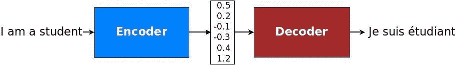
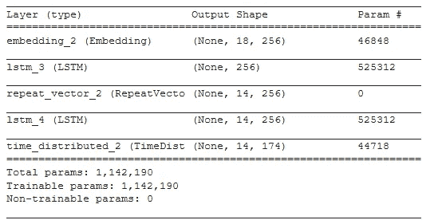

# 以下是如何使用 Keras 用几行代码构建一个语言翻译器

> 原文：<https://towardsdatascience.com/heres-how-to-build-a-language-translator-in-few-lines-of-code-using-keras-30f7e0b3aa1d?source=collection_archive---------21----------------------->

## AI 能让濒危语言不消失吗？

您将学习如何使用编码器-解码器 seq2seq 架构和 5 分钟的时间从头开始创建一个语言翻译器。

波尔斯基在 [Pixabay](https://pixabay.com/photos/dog-maltese-puppy-sleep-sweet-1027549/) 拍摄的照片

据联合国教科文组织称，约有 2500 种语言面临消失的危险。在数字化时代，少数民族社区的年轻人往往会放弃他们的母语。

在这篇文章中，我们展示了人工智能可以弥合这些语言和世界其他地方之间的翻译差距。

让我们来发现 [*叶姆巴*](http://yemba.net) ，一种非洲语言，如今只有几千人流利地说这种语言。与几十年前记录的数十万发言者相比，这是一个巨大的下降。

> **我们将建立一个从英语到 *Yemba* 翻译句子的序列到序列模型。该代码可以适用于任何其他语言对！**

本文中使用的说明性数据集[由 51 个句子对组成。](https://gist.github.com/michelkana/b9ab95e1e44ee297e51ef163dd7302ca#file-yemba_french_sentences-txt)

鉴于单词的分类性质，应该为每种语言建立一个词汇表。通常，词汇表的大小是固定的，只有最常用的单词才被视为唯一的。所有其他单词通常被转换为“未知”标记。在我们的例子中，我们考虑所有的单词。我们定义了英语和 *Yemba* 的最大长度和词汇量。使用 Keras *Tokenize* 类，我们将单词映射到整数。

每个输入和输出序列必须编码成整数，并填充到最大短语长度。这是因为我们将对输入序列使用单词嵌入，并对输出序列进行一次性编码。输出序列需要被一次性编码，因为模型将预测词汇表中每个单词作为输出的概率。我们进一步将数据集分成 40 个句子用于训练，剩下的 11 个句子用于测试。

我们的序列到序列模型使用**单层单向 LSTM** 进行编码和解码。这种模型的基本机制在我们下面提到的文章中有详细介绍。

 [## 基于序列对序列模型的自然语言理解

### 如何预测客户询问背后的意图？Seq2Seq 型号说明。在 ATIS 数据集上演示的槽填充…

towardsdatascience.com](/natural-language-understanding-with-sequence-to-sequence-models-e87d41ad258b) 

编码器中的**第一层是嵌入层，它将我们的英语句子向量转换成嵌入向量(word2vec)。 *src_vocab* 是英语词汇量的大小。 *embedding_dim* 是 emdedded 后的向量的维数。 *source_steps* 是每个句子中的标记数，即一个英语句子的最大字数。**

编码器中的**第二层是一个 LSTM 层，其单元数与嵌入值一样多。LSTM 图层的输出是一个矢量。在 LSTM 层的输出到达解码器之前，我们必须确保解码器的 LSTM 层将接收到 3D 输入。我们通过使用 *RepeatVector* 创建与目标序列中的步骤一样多的编码器 LSTM 层输出副本来实现这一点。**

[来源](https://github.com/tensorflow/nmt)

**解码器**由一个 LSTM 层制成。通过将 *return_sequences* 属性设置为 True，我们指示所有 LSTM 单元(在每个时间步长)返回隐藏状态输出。我们需要完整的序列，在我们的例子中，需要完整的句子。解码器还使用*时间分布式*包装函数将*密集*层应用于每个 *tar_vocab* 时间步长，即目标 *Yemba* 词汇表中的每个单词。通过应用 softmax 激活，模型将预测目标句子中的每个 *Yemba* 单词。

使用 *Adam* 优化器训练该模型，以最小化分类交叉熵损失。我们在 1000 个纪元后达到 6.9863e-04 损耗。

现在，我们可以使用训练好的模型将一个英语句子翻译成 *Yemba* 。 *predict_sentence()* 函数接受一个英语句子作为单词向量，在其上运行模型。这就产生了一个向量，通过使用 *word_for_id()* 函数将其转换成 *Yemba* 字。

我们使用函数 evaluate_model()评估整个训练集或测试集。 [BLEU 算法](https://en.wikipedia.org/wiki/BLEU)(双语评估替角)用于通过比较候选译文和参考译文之间的 n 元语法数量来衡量译文的质量。

我们得到了 49%的 BLEU 分数，考虑到训练集的小规模，这是一个很好的结果。

> 在判断一种语言是否濒危时，说这种语言的人的数量不如他们的年龄分布重要。据报道，印度尼西亚现在有多达 200 万母语为英语的人，但他们都年事已高，很少或根本没有传给年轻人。

耶姆巴国王登基— [来源](https://www.artmajeur.com/en/horiel-zangue/artworks/11463278/bamileke-king-enthronement-jpg)

# 结论

AI 能让濒危语言不消失吗？联合国去年宣布 2019 年为[国际土著语言年](https://en.iyil2019.org/)，以提高人们对濒临灭绝的语言的关注。

如果你对 LSTM 被用来构建少数民族语言的词性标注器感到好奇，可以看看这篇文章。

 [## 非洲语言的位置标记

### 我们如何为耶姆巴语建立世界上第一个 LSTM 分类器。

towardsdatascience.com](/lstm-based-african-language-classification-e4f644c0f29e) 

有一个应用人工智能的项目吗？请在下面写下您的评论。

谢谢你。