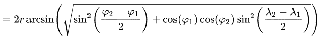
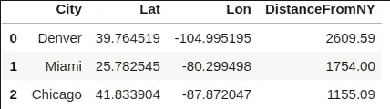

# 以下是如何用 Python 计算两个地理位置之间的距离

> 原文：<https://towardsdatascience.com/heres-how-to-calculate-distance-between-2-geolocations-in-python-93ecab5bbba4?source=collection_archive---------8----------------------->

## 想用 Python 按地理位置过滤？还是找一定半径内的地方？从这里开始。

地理位置数据无处不在——许多可下载的数据集都有以某种形式表示的位置数据，最常见的是以普通的纬度和经度对表示。


在 [Unsplash](https://unsplash.com?utm_source=medium&utm_medium=referral) 上由 [Brett Zeck](https://unsplash.com/@iambrettzeck?utm_source=medium&utm_medium=referral) 拍照

如果你做过任何机器学习，将原始纬度和经度视为**特征**可能听起来不是一个好主意。想象一下，你的整个数据集位于一个城市，地理位置的差异非常小，因此机器学习算法不太可能很好地挑选差异。

要解决这个问题，有一个清晰的解决方案——你可以使用一些(可能)付费或免费的 API**。如果你对道路距离感兴趣，这可能会派上用场——但在本文中，我们将处理一个**直线距离**。**

**我们会用一点数学来做所有这些——用**哈弗线距离**公式。如果您从未听说过它，请不要担心，当您第一次看到它时，也不要害怕——因为用 Python 实现它相当简单。**

**事不宜迟，让我们开始吧。**

# **引入哈弗线距离**

**根据维基百科的官方页面，哈弗辛公式确定了给定经度和纬度的球体上两点之间的大圆距离。[1]**

**下面是我们将在 Python 中实现的公式，它位于维基百科文章的中间:**

****

**资料来源:https://en.wikipedia.org/wiki/Haversine_formula**

**我们需要的另一件事是地球的半径，这可以通过简单的谷歌搜索找到。谷歌报告说是 6471 公里。**

**太好了，让我们用 Python 实现这个公式吧！**

**下面是代码，因为我希望这篇文章尽可能实用:**

```
def haversine_distance(lat1, lon1, lat2, lon2):
   r = 6371
   phi1 = np.radians(lat1)
   phi2 = np.radians(lat2)
   delta_phi = np.radians(lat2 — lat1)
   delta_lambda = np.radians(lon2 — lon1)
   a = np.sin(delta_phi / 2)**2 + np.cos(phi1) * np.cos(phi2) *   np.sin(delta_lambda / 2)**2
   res = r * (2 * np.arctan2(np.sqrt(a), np.sqrt(1 — a)))
   return np.round(res, 2)
```

**我知道这看起来很糟糕，但是只要把它粘贴到你的代码编辑器中，不要看它(如果你不想看的话)。好了，现在当这个完成后，我们可以进行更实际的部分。**

# **让我们计算一些距离**

**首先，我决定在纽约宣布一个起点，坐标是:**

*   **纬度:40.6976637**
*   **经度:-74.1197643**

**或者在代码中:**

```
start_lat, start_lon = 40.6976637, -74.1197643
```

**接下来，我声明了一个 Pandas DataFrame(确保首先导入 Numpy 和 Pandas ),其中包含 3 个美国城市的名称和地理位置——*丹佛*、*迈阿密*和*芝加哥*。下面是代码，因此您不必手动操作:**

```
cities = pd.DataFrame(data={
   'City': ['Denver', 'Miami', 'Chicago'],
   'Lat' : [39.7645187, 25.7825453, 41.8339037],
   'Lon' : [-104.9951948, -80.2994985, -87.8720471]
})
```

**太好了，现在我们有了开始计算距离所需的一切。我们可以通过一个简单的循环来实现，将距离临时存储在一个列表中:**

```
distances_km = []for row in cities.itertuples(index=False):
   distances_km.append(
       haversine_distance(start_lat, start_lon, row.Lat, row.Lon)
   )
```

**完成后，我们可以将这个列表转换成 DataFrame 中的一个新的**列**:**

```
cities['DistanceFromNY'] = distances_km
```

**如果您已经完成了上述所有工作，您应该会得到如下所示的数据框架:**

****

**这意味着现在你有一个专门的以千米为单位的距离栏。干得好！**

# **在你走之前**

**想象一下这个公式有多有用。例如，您可以使用它来查找位于您当前位置**半径**范围内的感兴趣的物体。您也可以使用它来定位离兴趣点最近的**。有很多可能性，主要取决于你正确构建问题的能力。****

**你也可以使用像[这个](https://www.freemaptools.com/how-far-is-it-between.htm)这样的网站来检查我们计算的距离有多准确。上次我检查(丹佛)时，我们有 7 或 8 公里的差异，这对于大多数使用情形来说并不显著。**

**感谢阅读，我希望你喜欢它。**

***喜欢这篇文章吗？成为* [*中等会员*](https://medium.com/@radecicdario/membership) *继续无限制学习。如果你使用下面的链接，我会收到你的一部分会员费，不需要你额外付费。***

**[](https://medium.com/@radecicdario/membership) [## 通过我的推荐链接加入 Medium-Dario rade ci

### 作为一个媒体会员，你的会员费的一部分会给你阅读的作家，你可以完全接触到每一个故事…

medium.com](https://medium.com/@radecicdario/membership)** 

# **参考**

**[1][https://en.wikipedia.org/wiki/Haversine_formula](https://en.wikipedia.org/wiki/Haversine_formula)**