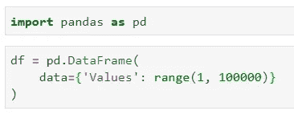
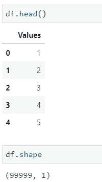
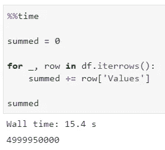
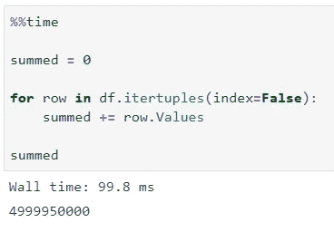

# 以下是如何让熊猫的迭代速度提高 150 倍

> 原文：<https://towardsdatascience.com/heres-how-to-make-pandas-iteration-150x-faster-20ccb5477128?source=collection_archive---------6----------------------->

## 不，这不是诱饵。

一段时间以来，我一直在质疑 Python 的快速处理能力。让我们面对现实吧，与其他语言相比，有很多关于 Python 速度的垃圾言论——比如 C 或 Go。

图片由 [janjf93](https://pixabay.com/users/janjf93-3084263/?utm_source=link-attribution&amp;utm_medium=referral&amp;utm_campaign=image&amp;utm_content=3614766) 发自 [Pixabay](https://pixabay.com/?utm_source=link-attribution&amp;utm_medium=referral&amp;utm_campaign=image&amp;utm_content=3614766)

现在，我试着用 Go 来做数据科学——这是可能的——但是一点也不像用 Python 那样令人愉快，主要是因为语言的**静态**本质和数据科学主要是探索性的领域。我并不是说在 Go 中重写已完成的解决方案不能提高性能，但这是另一篇文章的主题。

到目前为止，我所忽略的，至少可以说是 Python 处理事情更快的能力。我一直患有“视野狭窄”——一种只看到一个解决方案而忽视其他解决方案的综合症。我相信我并不孤单。

这就是为什么今天我想简单介绍一下如何让熊猫更快更愉快地工作。更准确地说，这个例子将关注行的迭代，并在这个过程中进行一些数据操作。所以事不宜迟，让我们进入正题。

# 让我们制作一个数据集

最简单的方法是声明一个单列数据框对象，其整数值范围为 1 到 100000:

我们真的不需要更复杂的东西来解决熊猫的速度问题。为了验证一切顺利，下面是我们数据集的前几行和整体形状:

好了，准备工作已经完成，现在让我们看看如何以及如何不遍历数据框的行。首先，我们将讨论**如何不选择**选项。

# 以下是你不应该做的事情

啊，我一直为使用(和过度使用)这个方法而感到内疚。默认慢得要命，但是你懂的，我为什么要费心去寻求替代品(隧道视野)。

为了证明您不应该使用`iterrows()`方法来迭代数据帧，我将做一个简单的例子——声明一个变量并在开始时将其设置为 0——然后在每次迭代时用`Values`属性的当前值递增。

如果你想知道，`%%time` magic function 将返回一个单元格完成所有操作所用的秒数/毫秒数。

让我们来看看实际情况:

现在您可能会想，15 秒对于遍历 100000 行并增加某个外部变量的值来说并不算多。但实际上是——让我们在下一节看看为什么。

# 这是你应该做的

现在出现了一种神奇的拯救方法。顾名思义，`itertuples()`遍历数据帧的行并返回一个名为 tuple 的**。这就是为什么你不能用括号符号`[]`访问这些值，而是需要使用点符号`.`的原因。**

我现在将演示与几分钟前相同的例子，但是使用`itertuples()`方法:

瞧啊。做同样的计算`itertuples()`要快大约 154 倍！现在想象一下您的日常工作场景，您正在处理几百万行数据— `itertuples()`可以为您节省大量时间。

# 在你走之前

在这个微不足道的例子中，我们看到了对代码进行一点点调整会对整体结果产生巨大的影响。

这并不意味着在每种情况下`itertuples()`都将比`iterrows()`快 150 倍，但它肯定意味着每次都会在某种程度上更快。

感谢阅读，我希望你喜欢它。

*喜欢这篇文章吗？成为* [*中等会员*](https://medium.com/@radecicdario/membership) *继续无限制学习。如果你使用下面的链接，我会收到你的一部分会员费，不需要你额外付费。*

 [## 通过我的推荐链接加入 Medium-Dario rade ci

### 作为一个媒体会员，你的会员费的一部分会给你阅读的作家，你可以完全接触到每一个故事…

medium.com](https://medium.com/@radecicdario/membership)