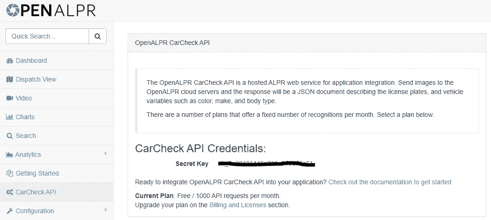
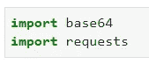
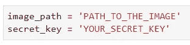
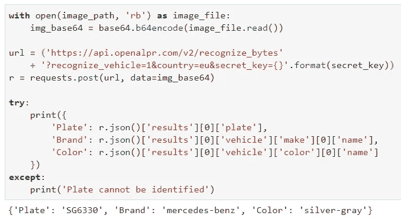

# 下面是如何用 10 行 Python 代码读取车牌

> 原文：<https://towardsdatascience.com/heres-how-to-read-license-plate-with-10-lines-of-python-cc9b7a3b4b7c?source=collection_archive---------9----------------------->

## 从车牌中提取文本的最快指南，还有更多

任何类型的计算机视觉都不是一项简单的任务，车牌检测也不例外。

乔纳森·加莱戈斯在 [Unsplash](https://unsplash.com?utm_source=medium&utm_medium=referral) 上拍摄的照片

如果你花点时间想一想，对我们人类来说，对图像上的内容进行分类是非常容易的——但是当你想自动化这个过程时，问题就出现了。计算机不能像我们一样“看”，因为它们只能理解数字，并且定义数字数组的规则基本上是任何计算机视觉任务的归结点(极度简化)。

因此，在今天的文章中，我将快速演示一下 **OpenALPR API** 的强大功能，以完成以下任务:

1.  从牌照上读取文本
2.  确定汽车的品牌
3.  确定汽车的颜色

再一次，我们很容易看到一辆车的图像，并且在一秒钟内我们就可以得到以上所有的信息。对于计算机来说，这个任务要复杂得多——如果你不同意我的观点，我敢打赌你会安装 **OpenCV** 并尝试自己实现这个逻辑。

事不宜迟，让我们看看如何正确设置，我将使用什么图像，最后是源代码。

# 一点小小的设置

首先，你需要一个 OpenALPR 账户，你可以在这里注册。我正在使用一个免费计划**，如果我没有错的话，它可以让你每个月提出 1000 个请求。这对于商业目的来说还不够，但对于探索来说肯定会很适合你。**

如果在某个时候你需要更多，你可以选择以下计划:

*   基本:25，000 个请求/月=**$ 99/月**
*   优点:125，000 个请求/月=**$ 395/月**
*   企业:100 万次请求/月=**$ 1995/月**

无论如何，这都不便宜，但如果你有一个每月能停放 100 万辆汽车的停车场，那么我想对于一个最先进的车牌读取系统来说，2000 万英镑并不算多。

无论如何，一旦注册，您将可以访问您的仪表板，在其中，您可以转到 **CarCheck API** 部分获取 API 密钥:

我们稍后在发出请求时会用到它，稍后会详细介绍。

很好，现在让我们来看看我们将用来测试 API 的图像。

# 让我们得到图像

我在网上搜索带有非商业用途免费牌照的汽车图片(实际上很难找到牌照不模糊的图片)。过了一段时间，我发现了一张相当不错的图片，你可以从[这个链接](https://p0.piqsels.com/preview/82/793/156/transportation-vehicle-automobile-sports-car.jpg)下载:

[https://P0 . piqsels . com/preview/82/793/156/transportation-vehicle-automobile-sports-car . jpg](https://p0.piqsels.com/preview/82/793/156/transportation-vehicle-automobile-sports-car.jpg)

很好，现在我们已经创建了帐户，并且有了图像。我们已经准备好了。让我们进入正题吧。

# 阅读车牌

说到导入，我们只需要两个库:

*   `base64`
*   `requests`

是的，你没看错。**你不需要安装任何库**就可以使用 OpenALPR，这使得以后的潜在部署更加容易。

现在我们将声明两个变量，一个保存汽车图像的路径，另一个保存由 OpenALPR 的优秀人员获得的密钥:

现在我们期待已久的部分来了。为了从给定的图像中读取牌照，我们需要采取以下步骤:

1.  读入图像，用`base64`编码
2.  向 API 发出 POST 请求，参数`data`是编码图像
3.  挖掘 JSON 响应以获得我们关心的值

**看起来很容易吧？**下面是完整的代码:

请记住，我已经将`url`变量分成两行，这样图像对您来说更易读。另外，如果您事先知道车牌属于哪个国家，请注意如何在 URL 中指定`country`参数以获得更好的结果。

如您所见，仅用几行代码，我们就从图像中获得了如此多的有用信息。对于一个不熟悉计算机视觉的人来说，开发这样一个解决方案可能需要**个月**个月的工作，而且你对最终结果的满意程度也是值得怀疑的。

# 在你走之前

这就是你要做的——只用几行代码，我们就完成了最先进的计算机视觉工作(可以说，我们只是调用了 API)。

我认为汽车的颜色是黑色，而不是银灰色，但这与我们的情况无关。

免费计划很适合你去探索，但是考虑一下**自己开发完整的解决方案**，只是为了好玩。也许这将是另一个时间的主题，所以让我知道你是否对此感兴趣。

感谢阅读。

喜欢这篇文章吗？成为 [*中等会员*](https://medium.com/@radecicdario/membership) *继续无限制学习。如果你使用下面的链接，我会收到你的一部分会员费，不需要你额外付费。*

 [## 通过我的推荐链接加入 Medium-Dario rade ci

### 作为一个媒体会员，你的会员费的一部分会给你阅读的作家，你可以完全接触到每一个故事…

medium.com](https://medium.com/@radecicdario/membership)