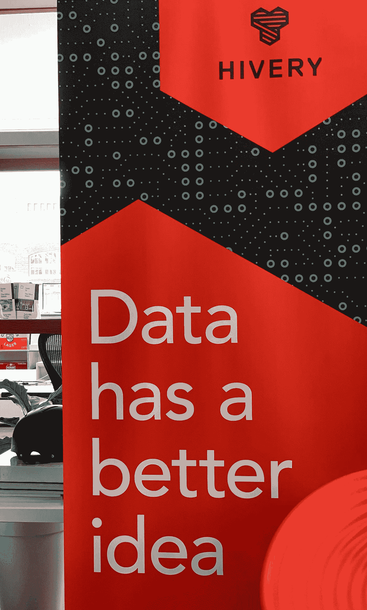

# 这就是你一直在寻找的专家数据分析师。

> 原文：<https://towardsdatascience.com/heres-the-expert-data-analyst-you-ve-been-looking-for-2af8384bf81e?source=collection_archive---------49----------------------->

## 目前，对数据分析师的需求很高，他们需要审查大量关于新冠肺炎及其对企业影响的信息。以下是你需要了解的关于成为或雇佣数据分析师的信息。

图片来源:弗兰基·查马基·昂斯普拉什

狮子被认为是丛林之王。这是因为狮子在他的游戏中处于领先地位。想象一下，如果您也能掌控大数据游戏，那该多好！我有消息告诉你，你可以。这一切都归结于拥有合适的数据分析师。

最近，我的一个客户试图读取他公司的数据，但我们都不知道我们在看什么。

他想确切地知道新冠肺炎·疫情对他的业务产生了怎样的影响，以及未来的发展轨迹是怎样的。

为此，我建议他聘请一名数据分析师。

我们在谷歌上搜索了优秀数据分析师应该具备的素质，可以说，我对此一无所知！

所以，我做了我最擅长的事情，开始研究。以下是我学到的一些东西。

数据分析师着眼于数据的大型基本度量，以检测隐藏的模式、统计数据和洞察力。以现在的技术，你的数据几乎可以马上被分析，可以得到答案。

数据分析师的关键品质包括创造力和好奇心等。一个伟大的分析师将会有坚实的统计方法基础，并且渴望找到更好的解释，一旦数据被分析，接下来会发生什么。

在对收集的原始数据进行优先排序时，应用正确的算法和特定的公式有助于公司做出明智的决策。

数据的概念已经存在很多年了；大多数组织现在都明白，如果他们能够捕获流入其业务的所有数据，就可以应用分析并从中获得巨大价值。

# 数据分析师的工作描述

数据分析师的一些基本工作职能包括:

为市场确定新材料的价格

决定是裁员还是雇佣员工

销售时机和降低运输费用，同时估算市场份额。

数据分析师将轨迹、趋势和数字转化为可访问和可消化的信息。

当一家公司正在收集其数据，如销售数字、库存、利润率和市场研究时，分析师可以对每个项目进行细分，以获得具体信息，如:

区分模式和趋势。

收集、评估和报告以满足业务需求。

确定改进数据收集、报告和分析的新方法。

确定与数据分析和收集过程以及报告设计有关的技术问题。

估计所提出的挑战，并评估这些挑战是否可以通过数据来回答。

以可重复且全面的方式报告数据。

分析师收集、处理和分析数据。这是通过使用系统和标准的方法和公式来评估必要的信息。然后，他们根据分析结果准备详细的报告。

数据分析师执行基本统计，例如特定时间段内给定项目的平均值和变化。此外，他们预测收益率，并解释一组连续数据的潜在分布频率。

他们在完成活动时使用标准的分析、收集和报告技术，并将始终保护业务数据，确保数据结果产生一致且可回收的指导。

# 如何成为一名数据分析师

数据分析师负责理解大型数据集中显示的见解和趋势。因此，他们受雇于公司，以改善各种商业行为，并帮助做出更好的决策。

开展数据分析师职业有三个关键步骤。

## 第一步

教育和学位要求。

获得统计学、计算机科学或信息技术学士学位。应用统计学研究或辅修数据科学。参加强调数据库管理和项目管理的计算机科学课程也是必要的。

## 第二步

获取数据分析师经验。

没有任何经验的数据分析师是不容易找到有意义的工作的。在校期间实习是获得必要知识和技能的正确途径。尽管如此，许多从事技术职业的人还是从初级职位做起，比如技术员或统计助理。这些职位提供了宝贵的在职经验和培训。接受一些内部培训是非常必要的，尤其是在大数据管理和分析软件程序方面。学习的意愿、知识和专长可以帮助一个人达到他们期望的水平。

## 第三步

推进你的职业发展。

有必要考虑证书课程或硕士学位，这将提供更多的就业机会，从而促进你的职业发展。雇主希望求职者拥有丰富的知识，更熟悉最新的工具和技术。因此，你应该考虑大数据管理、商业数据分析或数据科学的硕士学位。

# 数据分析师工资

[数据分析师的平均年薪为 75，588 美元。](https://www.salary.com/research/salary/listing/data-analyst-salary)影响薪水的因素很多，包括教育水平、在专业机构的参与度、证书和工作经验。

数据分析经理的平均薪酬为 109，954 美元。在这个职位的头三至十年，收入会有所增加；尽管如此，一些人选择继续从事其他工作，比如数据架构师、数据科学家或数据工程师，只要他们在这个行业积累了十年的经验。

直销公司会寻找有商业数据分析师或数据科学家工作经验的数据分析师。他们还将专注于与数据模型、数据挖掘、分割技术和数据库设计开发有关的技术专长。

他们将寻找一个对业务对象、编程和数据库、技术数据方法有深刻理解的人，加上对用于数据集分析的统计程序的丰富经验，如 [SAS](https://www.sas.com/en_us/home.html?utm_source=google&utm_medium=cpc&utm_campaign=brand-global&utm_content=GMS-88251&keyword=sas&matchtype=e&publisher=google&gclid=CjwKCAjwvtX0BRAFEiwAGWJyZOh2SbLtdWaexO1oEn17cxTeUIsHiNosTz-wW1wAEjvTd4X0vSOkJRoC-dkQAvD_BwE) 、 [SPSS](https://www.ibm.com/analytics/spss-statistics-software) 和 [Excel](https://products.office.com/en-us/excel) 。

图片来源:Scott Winterroth Unsplash

# 数据分析师与数据科学家

数据分析师类似于数据科学家。然而，数据分析师负责开发用于数据获取和发现的算法。数据分析师将发现他们自己在使用可用的工具、数据集和系统处理特定的业务活动，而不是制定他们的数据项目。

这两种职业有一个共同的目标，那就是发现如何利用信息来解决问题和回答问题，为他们的行业或商业带来好处。

数据科学家制定统计方法，应用科学技术解释数据，并做出预测，而数据分析师收集和分析数据。

例如，数据分析师可以获得大气压力、湿度和温度，而数据科学家可以应用这些数据并预测飓风是否会在大气中聚集。

数据分析用于医疗保健、游戏、旅游、能源管理和直销等行业。

数据科学算法用于互联网搜索、数字广告和搜索推荐等行业。

# 为什么要为您的企业选择数据分析师？

数据分析师带来的好处是速度和效率。几年前，企业可能已经收集了信息，进行了分析，并挖掘出了可用于未来决策的信息，而现在，公司可以识别洞察力以立即做出决策。

提高工作效率和保持敏捷的能力为组织创造了前所未有的竞争优势。

在你的团队中有一个分析师还有其他一些好处。

## 成本降低

数据分析师使用数据技术，如 [Hadoop](https://hadoop.apache.org/) 和基于云的分析，在存储大量数据时带来显著的成本优势，此外，他们还可以确定更高效的业务方式。

## 更快、更好地做出决策

凭借 [Hadoop](https://hadoop.apache.org/) 和内存分析的速度，以及分析新数据源的能力，企业能够立即分析信息，并根据他们所了解的情况做出决策。

## 新产品和服务

有了通过分析来衡量客户需求和满意度的能力，就有能力满足客户的需求。

数据分析师帮助组织利用他们的数据，并使用它来识别新的机会。这反过来又会导致更聪明的商业行为、更高效的运营、更高的利润和更满意的客户。

随着各行各业的公司专注于构建数据分析战略，以在以数字为中心的全球环境中保持竞争力，他们将需要各种能够以多种方式对业务数据进行切片、切块和操作的数据科学工具。

精心规划和执行的数据策略将使您的企业能够更快地做出业务关键型决策，并更准确地预测这些决策的结果。

这种在数据科学领域的持续愿景和创新有利于现在几乎完全基于数据的商业世界，推动从最小的日常改进到最具挑衅性和前瞻性的想法的任何事情。

以下是您需要了解的关于最佳可用数据分析工具的信息，这些工具有助于收集、存储、分析和可视化您的数据，并融入机器学习能力和可能性。

每个数据策略的起点是收集可以转化为丰富分析的高质量数据。正确的数据收集工具可以减少错误和重复，提供更高的准确性，并保持所有来源的数据完整性。

以下用于收集数据的工具非常突出:

[GoSpotCheck](https://www.gospotcheck.com/)

[IBM Datacap](https://www.ibm.com/us-en/marketplace/data-capture-and-imaging/resources)

[莫曾达](https://www.mozenda.com/home-mobile/)

[Octoparse](https://www.octoparse.com/)

[OnBase by Hyland](https://www.onbase.com/en)

所有数据分析的核心是发现数据的意义并从中提取价值。

让您能够轻松理解数据并从中获得真正意义的工具，可以帮助您做出改变游戏规则的业务决策，从而影响收入、竞争力、创新、客户体验和运营效率。

查看这些领先的数据分析工具和平台:

[Alteryx](https://www.alteryx.com/)

[多米诺数据实验室](https://www.dominodatalab.com/)

[KNIME 分析平台](https://www.knime.com/)

[RapidMiner](https://rapidminer.com/)

数据仓库特性，如组合和集成的多源和异构数据存储库，为可用性而标准化。您可以实时和批量搜索任何业务主题的干净和稳定的数据。

像亚马逊雅典娜和 S3 这样的解决方案，在全球最大的云结构上工作，允许数据的存储、收集和执行，而不需要分析系统。

当今存储数据的一些顶级工具有:

[亚马逊红移](https://aws.amazon.com/redshift/)

[谷歌大查询](https://cloud.google.com/bigquery)

微软 Azure

MySQL

[雪花](https://www.snowflake.com/)

可视化分析工具可以识别数据中的模式和趋势，并帮助最终用户理解和消化复杂的概念。

以图表、图形和地图的形式访问、理解和共享数据的可视化表示要容易得多。

以下是一些高性能的数据可视化工具:

[谷歌融合表](https://support.google.com/fusiontables/answer/9551050?hl=en&visit_id=637225050694746805-519602953&rd=1)

Jinfonet 的报告

[微软 Power BI](https://powerbi.microsoft.com/en-us/)

[Qlik](https://www.qlik.com/us)

[SAS](https://www.sas.com/en_us/home.html?utm_source=google&utm_medium=cpc&utm_campaign=brand-global&utm_content=GMS-88251&keyword=sas&matchtype=e&publisher=google&gclid=CjwKCAjwvtX0BRAFEiwAGWJyZOh2SbLtdWaexO1oEn17cxTeUIsHiNosTz-wW1wAEjvTd4X0vSOkJRoC-dkQAvD_BwE)

数据科学的目的和承诺是分析数据，从中学习，并对您的公司做出预测。今天的机器学习工具使用各种算法来表示、评估和优化您的数据，以便正确解释归纳和异常。

以下是一些最好的机器学习工具:

[蟒蛇](https://www.anaconda.com/)

[数据块](https://databricks.com/)

[数据机器人](https://www.datarobot.com/)

[功能实验室](https://www.featurelabs.com/)

[H2O。艾](https://www.h2o.ai/)

任何现代数据分析师策略的成功都依赖于对所有数据的完全访问。

数据分析师必须能够访问一套专有的 ETL 工具(提取、转换、加载)，以便优化和扩展将来自任何来源的任何形式的海量数据加载到云数据仓库或基于云的存储中，如亚马逊 S3。

一旦你的信息被传输到数据仓库，你就可以实施任何你纳入的机器学习模型，以增强你对客户或其他重要举措的理解和承诺。

现在，您已经更好地了解了如何成为一名数据分析师，或者在为您的企业招聘数据分析师时需要寻找什么，您将在竞争中遥遥领先。