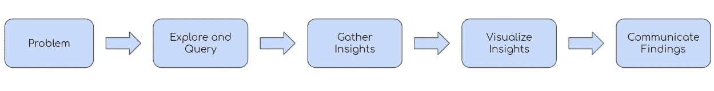

# 这是数据分析师实际做的事情

> 原文：<https://towardsdatascience.com/heres-what-a-data-analyst-actually-does-42c31c08ade2?source=collection_archive---------29----------------------->

## 从实践经验来看，数据分析师工作的本质

图片由[穆罕默德·哈桑](https://pixabay.com/users/mohamed_hassan-5229782/?utm_source=link-attribution&utm_medium=referral&utm_campaign=image&utm_content=4453011)拍摄，来自[皮克斯拜](https://pixabay.com/?utm_source=link-attribution&utm_medium=referral&utm_campaign=image&utm_content=4453011)

我读过几篇文章，这些文章给了我一个数据分析师所做事情的清单，但从最简单的意义上来说，**你正在分析和可视化数据**。每个公司都有自己的数据库，你可以从中查询。这些公司也有自己的数据可视化工具，比如 Tableau，你可以用它来可视化你的见解和发现。

在商业中，有许多类型的数据，如产品数据、营销数据和运营数据，同样，也有几种类型的数据分析师，如产品分析师、营销分析师和运营分析师。这些工作的不同之处在于与每个类别相关的领域知识，但最终，它们与术语“数据分析师”同义。

数据分析师的一般工作流程

数据分析师的工作范围最终取决于你工作的公司，但一般来说，数据分析师会经历上图中的以下工作流程。让我们走一遍。

## 问题

每次分析都从一个问题或一项任务开始。这些任务的难度会有很大差异。一个简单任务的例子是，如果要求您编写一个查询来提供统计数据，比如昨天的销售额。更困难的任务的一个例子是当答案不清楚时，你被要求探索数据。例如，如果让你找出为什么上个月的销售额比其他月份差得多。

## 探索和查询

一旦您收到一个问题，您通常会编写一个或多个查询来探索和收集解决问题所需的信息。这意味着您可能需要了解 SQL 或 Python(或者两者都了解)来收集您需要的信息。

继续前面的例子，如果要求您找出为什么上个月的销售比其他月份差得多，您可能会查询上个月的平均客户评论评级，以查看产品是否有问题，或者您可能会查询上个月的营销支出与其他月份相比，以查看营销支出是否有显著减少。

## 收集见解

下一步是收集你的见解。有时，收集您的见解意味着将您的见解复制并粘贴到 Excel 表格中。其他时候，这意味着保存您用来查找下一步所需信息的查询。

## 可视化见解

一旦你收集了你的见解，你可能需要将你的发现形象化。有时，这就像在 Excel 中制作条形图一样简单。其他时候，这意味着创建一个广泛的仪表板，供高管们使用。这一步需要的技能取决于公司和项目。它包括但不限于 Powerpoint、Excel、Tableau、Matplotlib 等…

## 传达你的发现

最后，您需要传达您的结果，无论是通过带有几个静态图表的幻灯片还是带有几个 KPI 指标的仪表板。类似于回答行为问题的星形方法，你将走过问题、任务、你采取的方法和最终结果。

我知道我是通过简化来概括的，我知道这并没有涵盖数据分析师日常工作中的每一件事。然而，对于那些完全不知道数据分析师做什么的人来说，就像你们中的一些人不知道语言病理学家做什么一样，这为他们做什么提供了一个体面的想法。

# 感谢阅读！

如果你喜欢我的工作，想支持我…

1.  支持我的最好方式就是在**媒体**T2 上关注我。
2.  在**推特** [这里](https://twitter.com/terence_shin)成为第一批关注我的人之一。我会在这里发布很多更新和有趣的东西！
3.  此外，成为第一批订阅我的新 **YouTube 频道** [这里](https://www.youtube.com/channel/UCmy1ox7bo7zsLlDo8pOEEhA?view_as=subscriber)！*目前还没有视频，但即将推出！*
4.  在 **LinkedIn** [这里](https://www.linkedin.com/in/terenceshin/)关注我。
5.  在我的**邮箱列表**上报名[这里](https://forms.gle/UGdTom9G6aFGHzPD9)。
6.  查看我的网站，[**terenceshin.com**](https://terenceshin.com/)。