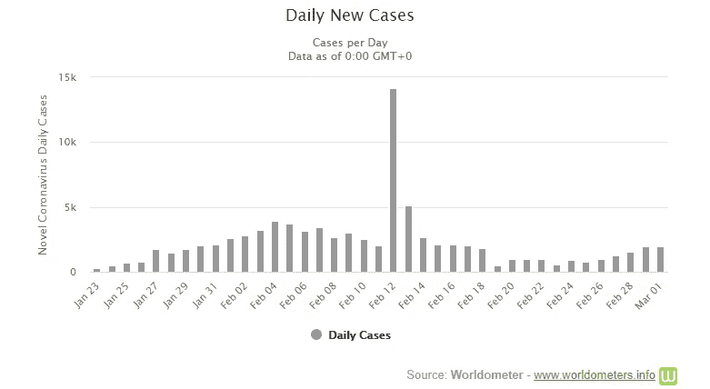

# 在这里你可以看到冠状病毒的实时更新和统计数据

> 原文：<https://towardsdatascience.com/heres-where-you-can-see-data-visualizations-live-updates-and-statistics-on-the-coronavirus-dff8b2986b39?source=collection_archive---------4----------------------->

## 以下是你需要了解的关于冠状病毒 Worldometer 的信息

[疾控中心](https://unsplash.com/@cdc?utm_source=unsplash&utm_medium=referral&utm_content=creditCopyText)在 [Unsplash](https://unsplash.com/s/photos/virus?utm_source=unsplash&utm_medium=referral&utm_content=creditCopyText) 拍摄的照片

***如果这是你喜欢的那种东西，成为第一批订阅*** [***我的新 YouTube 频道在这里***](https://www.youtube.com/channel/UCmy1ox7bo7zsLlDo8pOEEhA?view_as=subscriber) ***！虽然还没有任何视频，但我会以视频的形式分享很多像这样的精彩内容。感谢大家的支持:)***

Worldometer 是一个由工程师和研究人员运营的令人惊叹的网站，其目标是为每个人提供实时的世界统计数据。

最近，他们在其网站上增加了一个新的组件，专门针对新型冠状病毒。这是一个令人惊叹的仪表板式网站，提供关于冠状病毒的实时统计、数据可视化和更新！

**这里** **可以查看网站** [**。**](https://www.worldometers.info/coronavirus/)

Worldometer 网站截图

以下是一些提示，可以帮助你找到我认为网站中最有趣的部分。

# 按国家分列的确诊病例和死亡人数

如果你点击上面的链接，向下滚动一点，你可以找到按国家分列的病例数、新增病例、死亡人数、新增死亡人数、活跃病例和已恢复病例。这是每天更新的，如果你想了解病毒是如何在全球传播的，你可能会感兴趣。

网站截图

# 最新更新

如果你再向下滚动一点，你可以看到实时更新，提供新病例和死亡的警报，以及新的旅行警告。如果你或你亲近的人即将旅行，你可能会对此感兴趣。

来自 Worldometer 的截图

# 案件详情

如果您想了解有关病例的更多信息，如每日新增病例数、增长因素或中国境外的病例分布，请点击导航栏中的“病例”或点击此处的。

来自 Worldometer 的截图

# 死亡详情

与“案例”类似，如果您想了解更多关于死亡的详细信息，请点击导航栏中的“死亡”或点击[此处](https://www.worldometers.info/coronavirus/coronavirus-death-toll/)。

来自 Worldometer 的截图

# 还有更多。

查看导航栏，查看其他主题，如“国家”、“孵化”、“年龄”、“症状”或“观点”。

导航栏的屏幕截图

如果你错过了，该网站的链接如下:

 [## 冠状病毒病例:

### 实时统计和冠状病毒新闻，跟踪确诊病例、康复患者和死亡人数，按…

www.worldometers.info](https://www.worldometers.info/coronavirus/) 

# 感谢阅读！

如果你喜欢我的工作，想支持我…

1.  支持我的最好方式就是在**媒体** [这里](https://medium.com/@terenceshin)关注我。
2.  在 **Twitter** [这里](https://twitter.com/terence_shin)成为首批关注我的人之一。我会在这里发布很多更新和有趣的东西！
3.  此外，成为第一批订阅我的新 **YouTube 频道** [这里](https://www.youtube.com/channel/UCmy1ox7bo7zsLlDo8pOEEhA?view_as=subscriber)！
4.  在 **LinkedIn** [这里](https://www.linkedin.com/in/terenceshin/)关注我。
5.  在我的**邮箱列表**上报名[这里](https://forms.gle/UGdTom9G6aFGHzPD9)。
6.  查看我的网站，[**terenceshin.com**](https://terenceshin.com/)。

# 更多相关文章

 [## 使用 Plotly 实现冠状病毒数据可视化

### 新型冠状病毒 2019 数据集分析及代码

towardsdatascience.com](/coronavirus-data-visualizations-using-plotly-cfbdb8fcfc3d)  [## 9 种有趣的新型冠状病毒统计和数据可视化

### 以下是你应该知道的关于冠状病毒的知识

towardsdatascience.com](/9-fascinating-novel-coronavirus-statistics-and-data-visualizations-710cfa039dfd)