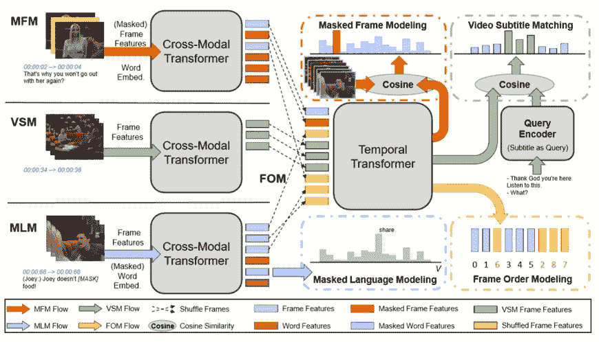

# 英雄:你再也不用看长视频了

> 原文：<https://towardsdatascience.com/hero-youll-never-have-to-watch-long-videos-again-ee0d5e2ba4fd?source=collection_archive---------41----------------------->

## 理解视频及其字幕的模型，帮助您快速浏览视频

乔伊·尼克特拉在 [Unsplash](https://unsplash.com?utm_source=medium&utm_medium=referral) 上的照片

你曾经在考试前一天晚上看了 15 节课的材料吗？或者提交一份关于你在接下来的一个小时内没有观看的 2 小时电影的报告？我知道我有。幸运的是，我的演讲视频标有内容开始和结束的地方，所以我可以快速浏览。但是如果那些标记不在那里呢？不要害怕:英雄来救你了！

“什么是英雄，它将如何拯救我？”，你可能会问。你的问题会得到回答，但首先，让我给你一些背景。如果你读过我以前的一些帖子，你可能会知道机器学习正朝着大规模预训练模型的方向发展，这些模型最初被给予大量数据，并从中学习。然后，这些模型可以将这些知识应用于特定的任务，以实现比大多数其他模型更好的性能。

像 BERT、RoBERTa 和 ALBERT 这样的预训练模型已经接管了 NLP 领域，多模态领域也开始发展它们。像 [UNITER](/uniter-d979e2d838f0) 和 Unicoder-VL 这样的模型已经在图像+文本预处理领域取得了长足的进步。

然而，还有一个空间没有被充分发掘，那就是视频+文本空间。理想情况下，这应该是一个非常自然的扩展。毕竟，视频只是一系列图像。已经有一些尝试通过 CBT 和 UniViLM 这样的模型来解决这个问题，但是他们没有抓住视频的一个关键方面:它们的顺序。相反，他们将视频及其字幕视为一堆图像和文本，而没有考虑到字幕只与某些帧相关，帧的顺序也很重要。

为了补救这一点，微软 Dynamics 365 AI Research 的研究人员提出了**H**I archical**E**ncode**R**用于**O**m 表示学习( **HERO** )。与以前的视频+文本模式不同，HERO 考虑了视频的顺序以及文本如何映射到视频。

为了做到这一点，HERO 使用了一个 2 层的层次结构。第一层使用一个融合文本和图像的*“跨模态”*转换器。它将字幕中的每个句子与视频的相应部分进行匹配。这个*【跨模态】*变换器的输出然后被*【时间】*变换器用来学习视频的不同帧的顺序。这种分层次的学习是通过 4 个主要的培训前任务实现的。

[英雄](https://arxiv.org/abs/2005.00200)的模型架构。

1.  *蒙面语言造型(MLM)*

在 *MLM* 中，主人公被给予一个带有一些缺失单词的字幕句子和相应的视频帧，主人公被期望生成那些缺失的单词。

2.*蒙版帧建模(MFM)*

*MFM* 类似于 *MLM* 的图像，除了它是以整个视频为背景完成的。输入的是所有的字幕句子和大部分的视频帧。HERO 的工作是生成丢失的帧。

3.*视频字幕匹配(VSM)*

VSM 在很大程度上就是它听起来的样子。给英雄一个来自字幕的句子作为查询，上下文是所有字幕句子和所有视频帧。HERO 必须学习局部对齐，即识别查询语句对应的视频帧。

但是有一个问题。提供的视频甚至可能与字幕不匹配。这有助于 HERO 了解一个句子应该是什么样子，反之亦然。

4.*帧顺序建模(FOM)*

*MLM* 、 *MFM* 、 *FOM* 都是用来训练*【跨模态】*变压器的， *FOM* 是用来训练*【时态】*变压器的。它采用前三个任务的输出和一组混乱的帧来预测帧的正确顺序。

在预训练任务发挥作用后，他们的魔法和英雄被训练出来，研究人员在几个不同的任务上测试了它的能力，包括视频字幕，视频问题回答，视频瞬间检索(根据句子检索视频的特定部分)和[视频语言推理](https://medium.com/swlh/violin-do-you-really-understand-videos-fe07f7affd9e)。HERO 能够在所有这些任务中击败最佳模特，甚至在[**【TVR】**](https://tvr.cs.unc.edu/index.html)**(电视检索)**[**【TVC】**](https://tvr.cs.unc.edu/tvc.html)**【电视字幕】**排行榜上取得了**第一的位置。**********

**所以不要等待，让英雄救你从那些最后一分钟讲座/纪录片/电影观看！**

**如果你想了解更多关于英雄模型的信息，这里有一个[链接](https://arxiv.org/pdf/2005.00200.pdf)到论文，一个[链接](https://github.com/linjieli222/HERO)到你自己训练的代码，点击[这里](https://aka.ms/mmai)查看更多我们的出版物和其他工作。**

****参考文献****

1.  **雷、杰、余立成、塔玛拉·l·伯格和莫希特·班萨尔。 **Tvr:用于视频字幕瞬间检索的大规模数据集。arXiv 预印本 arXiv:2001.09099 (2020)。****
2.  **陈、颜春、、于立成、艾哈迈德·科利、费萨尔·艾哈迈德、甘哲洙、于成和。统一者:学习通用的图像-文本表示。 arXiv 预印本 arXiv:1909.11740 (2019)。**
3.  **李，根，南段，，，，大新江，。Unicoder-VL:通过跨模态预训练的视觉和语言通用编码器。见 *AAAI* ，第 11336–11344 页。2020.**
4.  **罗怀绍，，，史，黄浩洋，段楠，，陈锡林，。2020.**unifilm:统一的视频和语言预训练模型，用于多模态理解和生成。arXiv 预印本 arXiv:2002.06353。****
5.  **李、、颜、俞成、柘淦、俞立成、。 **HERO:视频+语言全表示预训练的分层编码器。** EMNLP 2020。**