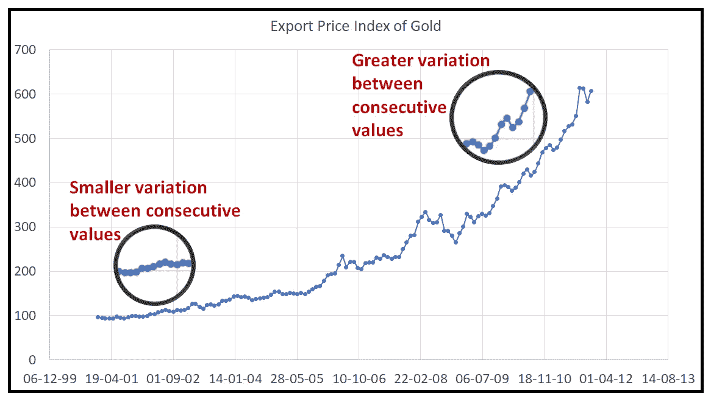
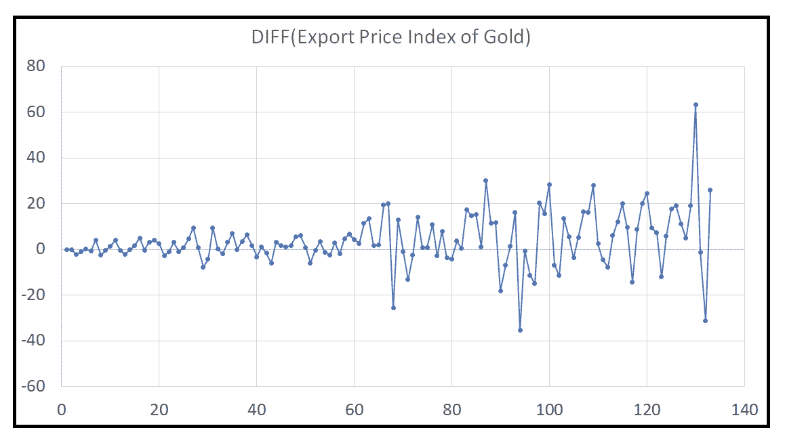
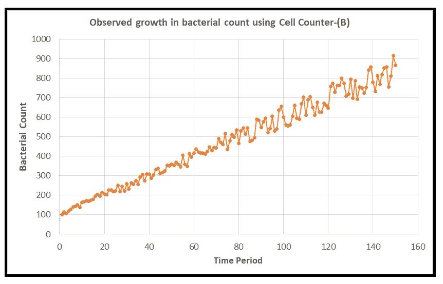
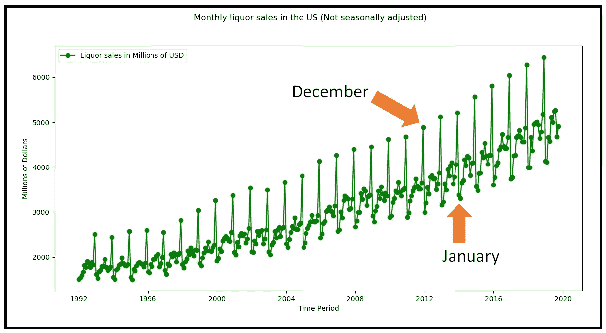
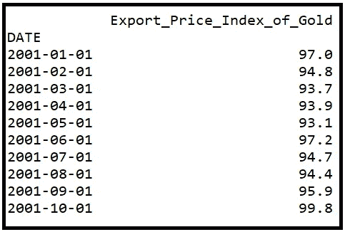
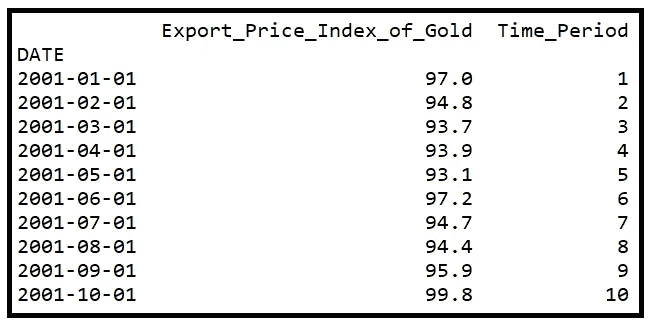
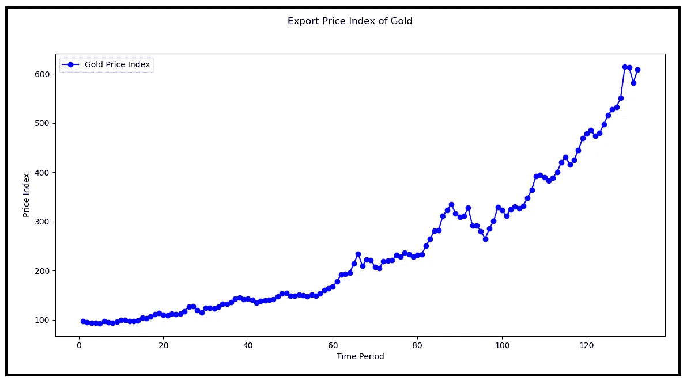
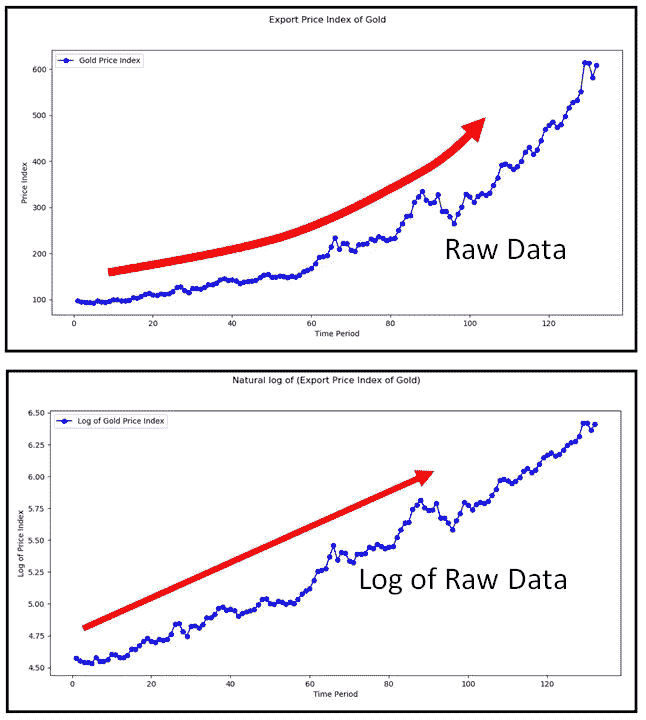
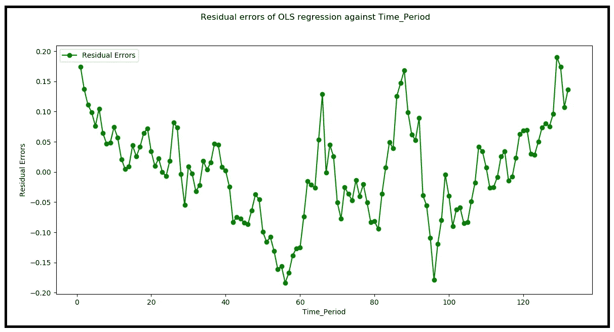
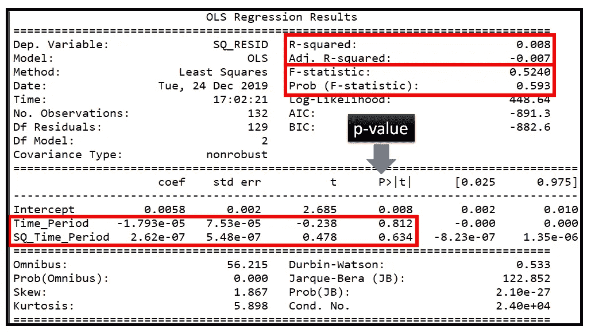

# 异方差没有什么可怕的

> 原文：<https://towardsdatascience.com/heteroscedasticity-is-nothing-to-be-afraid-of-730dd3f7ca1f?source=collection_archive---------4----------------------->


(图片由[作者](https://sachin-date.medium.com/)提供)

## 使用 Python 的原因、影响、测试和解决方案

回归建模环境中的异方差，是指当数据中的*条件方差*不恒定时，数据中的异方差。条件方差是你在因变量 ***y*** 中看到的解释变量 ***X*** 的每一个值，或者时间段*的每一个值的可变性(对于时间序列数据)。*

*条件方差表示为*方差(****y****|****X****)、Var(****y****|****×σ(****y****|*)并且对于给定的***【X】***(或 ***t*** )值，读取为 ***y*** 中看到的方差。*****

当您的数据是异方差的:

*方差(****y****|****X****)= f(****X****)*

其中 *f* 是**X的某个函数。异方差的反义词是**同方差**，其中方差是常数，即:**

*方差(****y****|****X****)=σ…一个常数值。*

下图说明了异方差数据集:


异方差(图片由[作者](https://sachin-date.medium.com/)提供)

下图说明了一个同质数据集:


同方差(图片由[作者](https://sachin-date.medium.com/)提供)

## 异方差时间序列

下面的黄金价格指数图说明了异方差时间序列。请注意，当指数值较高时，后期的变化会更大。



出口价格指数(最终用途):非货币黄金(来源:[美国弗雷德](https://fred.stlouisfed.org/series/IQ12260#0))(图片由[作者](https://sachin-date.medium.com/)提供)

黄金价格指数的第一个差异带来了异方差:



不同的时间序列(图片由[作者](https://sachin-date.medium.com/)提供)

## 异方差的原因和形式

异方差的一种常见形式是波动量是值的一部分。货币数据通常会出现这种情况，例如:

*   价格(股票价格、商品价格、医疗程序成本)，
*   支出(家庭支出、雇员工资、租金)，
*   价格指数(上面举例说明的黄金价格指数)。

## 测量过程引入的异方差

创建数据集时，可能会无意中引入异方差。让我们用一个例子来说明这一点:

假设您正在测量注入抗生素的样本中的细菌生长。我们假设样本中的细菌呈线性增长，如下所示:

```
*Actual_Bacterial_Count = 100 + 5*Time_Period*
```

假设你的细胞计数器计数误差≤ 10%。可以将其操作特性建模如下:

```
*Observed_Bacterial_Count = 100 + 5*Time_Period +* ***ROUND( (-1.0+2*RAND(0,1))*0.1*True_Bacterial_Count,0)***
```

计数器引入的误差(在 MS Excel 语法中)为:
***ROUND((-1.0+2 * RAND(0，1))*0.1*True_Bacterial_Count，0)***

术语 ***( -1.0+2*RAND(0，1) )*** 表示具有*(-1，1)* 均匀分布的随机变量，乘以真实计数的 10%。

运行计数器 150 个时间周期会产生下面的图，显示由计数器的误差特性引入的异方差:



测量误差引入的异方差(图片由[作者](https://sachin-date.medium.com/)提供)

**如何解决问题:**

*   对数转换 ***y*** 变量以‘抑制’一些异方差，然后为*对数(****y****)*建立一个 OLSR 模型。
*   使用一个 **G** 一般化 **L** 线性 **M** 模型( **GLM** )，例如负二项式回归模型，它不假设数据集是同质的。如果你的数据是离散的和非负的，NB 回归模型会特别有效。
*   使用一个 **W** 八个 **L** 东 **S** 方( **WLS** )或一个 **G** 一般化 **L** 东 **S** 方( **GLS** )模型——这两个模型不假设均方误差。 *Python statsmodels* 包支持[*stats models . API*](https://www.statsmodels.org/stable/index.html)包中的两种模型。

## 异方差引入了季节性异常值和通货膨胀

以下酒类销售的时间序列图说明了由 12 月和 1 月的异常值以及月度价格上涨的影响引起的缓慢增长的差异:



零售:啤酒、葡萄酒和酒类商店。(图片来源:美国弗雷德)(图片由[作者](https://sachin-date.medium.com/))

**如何解决问题:**

*   季节性影响可以通过对数据集进行季节性调整来抵消。
*   通货膨胀的影响可以通过对时间序列进行通货膨胀调整来消除。

```
**Related post:** [How to Deflate Your Time Series](/the-what-and-why-of-inflation-adjustment-5eedb496e080)
```

在处理诸如销售量、成本、价格指数等货币数据时，应该始终考虑这两个数据转换步骤。

## 缺失指定模型引入的异方差

即使在执行季节调整、紧缩和对数转换之后，如果您的模型无法充分解释经*转换的*数据集中的方差，无法解释的方差将会泄漏到模型的剩余误差中，潜在地使它们成为异方差的。

**如何解决问题:**

*   检查您的模型中是否缺少重要的解释变量，并将它们添加进来。
*   切换到 GLM、WSS 或 GLS 模式
*   *接受你目前的模型。如果您的模型在其他方面表现良好，那么模型残差中的少量异方差是可以接受的。*

## 异方差的实际后果

如果线性回归模型的残差是异方差的，例如线性回归模型的残差是异方差的，那么 OLSR 模型就不再是 T42 有效的，也就是说，它不能保证是数据的最佳无偏线性估计。有可能构造具有更好拟合优度的不同估计量。

如果您的数据包含异方差，OLSR 模型可能会低估或高估*总体*中的方差，这取决于它在训练样本中看到的方差类型。

这导致了一系列问题:模型参数的标准误差变得不正确，导致它们的 p 值出错，置信区间过窄或过宽。这可能会误导您相信某些参数值是重要的，而实际上它们并不重要，反之亦然。整个模型变得不可靠。

这个问题不仅限于 OLSR 车型。任何假设均方数据或均方残差的模型都容易受到这些问题的影响。

## 如何检测异方差

首先绘制因变量与自变量或时间的关系图，寻找因变量变化遵循某种模式的迹象。

另一种方法是根据数据训练一个合适的模型，并根据因变量绘制其残差，再次寻找可变性的模式。

第三种更好的方法是使用以下异方差统计测试之一:

*   [停车测试](https://en.wikipedia.org/wiki/Park_test)
*   [格雷泽测试](https://en.wikipedia.org/wiki/Glejser_test)
*   [布鲁赫-异教徒测试](https://en.wikipedia.org/wiki/Breusch%E2%80%93Pagan_test)
*   [白色测试](https://en.wikipedia.org/wiki/White_test)
*   [戈德菲尔德–匡特测试](https://en.wikipedia.org/wiki/Goldfeld%E2%80%93Quandt_test)

> 我们很快就会看到如何在黄金价格数据集上运行**Python**中的**异方差白色测试。**

同时，让我们看看这些测试是如何工作的。他们中的大多数使用下面的标准方法来检测异方差:

1.  根据数据训练一个合适的*主*回归模型。
2.  接下来，在主模型的残差平方上拟合一个*辅助*回归模型，解释变量是主模型的解释变量，或者这些变量的某种组合。上述测试使用以下一个或多个回归表达式作为辅助模型:
    ***ϵ****=****β_ 0****+****β_ 1*********x****+****γ*******x****+****β_ 2*********x****+****γ
    ϵ****=****β_ 1* **√****+****γ
    【ϵ】****=****β_ 0****+****β_ 1/x****+* ******β_ 1***是回归系数的向量，
    ***X*** 是主模型的解释变量矩阵，
    ***γ*** 是误差项的向量。*******
3.  对于拟合的辅助模型，计算合适的拟合优度统计量，例如用于回归分析的 **R** 或 [**F 统计量**](/fisher-test-for-regression-analysis-1e1687867259) ，以查看残差与主模型的解释变量的拟合程度。
4.  如果检验统计量**没有**显示显著的拟合优度，则接受残差是同方差的零假设。否则，接受残差是异方差的替代假设，这反过来意味着 1)主要模型的 ***y*** 的条件方差是异方差的，或者 2)我们的主要模型是未指定的，或者 3)(1)和(2)都成立。

## 使用 Python 和 statsmodels 测试异方差性

让我们使用 Python 在黄金价格指数数据集上运行**白色测试**来检验异方差性(在这里找到)。

导入所有必需的包。

```
import pandas as pdimport numpy as npfrom matplotlib import pyplot as plt
```

## 加载数据集并绘制因变量

将数据集加载到 pandas 数据框中，并打印前 10 行:

```
df = pd.read_csv('monthly_gold_price_index_fred.csv', header=0, infer_datetime_format=True, parse_dates=[0], index_col=[0])print(df.head(10))
```



(图片由[作者](https://sachin-date.medium.com/))

我们将向名为 **Time_Period** 的数据帧添加一个新列，包含从 1 到 132 的整数。

```
df['Time_Period'] = range(1, len(df)+1)print(df.head(10))
```



(图片由[作者](https://sachin-date.medium.com/)提供)

绘制数据:

```
**#Create a new mpyplot figure to plot into**
fig = plt.figure()**#Set the title of the plot** fig.suptitle('Export Price Index of Gold')#Set the X and Y axis labels
plt.xlabel('Time Period')
plt.ylabel('Price Index')**#plot the time series and store the plot in the *actual* variable. We'll need that later for the legend.** actual, = plt.plot(df['Time_Period'], df['Export_Price_Index_of_Gold'], 'bo-', label='Gold Price Index')**#Set up the legend. There is only one time series in the legend.** plt.legend(handles=[actual])**#Show everything** plt.show()
```

这是我们得到的图:



从 2001 年 1 月到 2011 年 12 月连续 132 个月的黄金出口价格指数(图片由[作者](https://sachin-date.medium.com/)提供)

```
**The price data appears to be both heteroscedastic and nonlinear.**
```

## 取因变量的对数变换

对因变量进行对数变换是最常用的技术之一，不仅可以使因变量*线性化，还可以抑制 ***y*** *中的异方差(如果存在)。**

*让我们向名为 LOG _*Export _ Price _ Index _ of _ Gold*的数据框添加一个新列，其中包含。我们将使用 *numpy.log()* 来完成这项工作。*

```
*df['LOG_Export_Price_Index_of_Gold'] = np.log(df['Export_Price_Index_of_Gold'])*
```

*原始数据和对数变换数据的并排比较揭示了对数变换降低了时间序列中的非线性:*

**

*原始和对数转换价格指数数据的比较(图片由[作者](https://sachin-date.medium.com/)提供)*

## *将 OLS 线性回归模型拟合到经对数变换的数据集*

*如果你还记得我们之前概述的测试配方，我们称这个模型为我们的**主模型**。*

*我们主要模型的回归表达式为:*

****log _ export _ price _ index _ of _ gold****=****β_ 0****+****β_ 1*********time _ period****+****ϵ****

*即我们正在寻求预测*log(****Export _ Price _ Index _ of _ Gold****)**使用 ***Time_Period*** )。**

**导入回归包:**

```
****import** statsmodels.api **as** sm
**import** statsmodels.formula.api **as** smf
**from** patsy **import** dmatrices**
```

**在 [patsy 语法](https://patsy.readthedocs.io/en/latest/quickstart.html)中形成模型表达式。我们告诉 Patsy*LOG _ Export _ Price _ Index _ of _ Gold*依赖于 *Time_Period* 。Patsy 将自动包含截距 *β_0* :**

```
**expr = 'LOG_Export_Price_Index_of_Gold ~ Time_Period'**
```

**建立和培训 OLSR 模型:**

```
**olsr_results = smf.ols(expr, df).fit()**
```

**相对于*时间段*绘制剩余误差(存储在`*olsr_results.resid*`字段中):**

```
****#Create a new pyplot figure to plot into** fig = plt.figure()**#Set the title of the plot** fig.suptitle('Residual errors against Time_Period')**#Set the X and Y axis labels** plt.xlabel('Time_Period')plt.ylabel('Residual Errors')**#plot the time series and store the plot in the *actual* variable.** actual, = plt.plot(df['Time_Period'], olsr_results.resid, 'go-', label='Residual Errors')**#Set up the legend. There is only one time series in the legend.**
plt.legend(handles=[actual])**#Show everything**
plt.show()**
```

**剧情是这样的:**

****

**(图片由[作者](https://sachin-date.medium.com/)提供)**

## **对残差进行异方差的怀特检验**

**白色测试使用辅助 OLSR 模型，其中因变量是主模型残差的平方，解释变量是主模型的解释变量、它们的平方和叉积。**

**在我们的例子中，我们只有一个解释变量: *Time_Period* 。**

**让我们向 pandas 数据框中添加两列，一列是主模型残差的平方，另一列是*时间周期*的平方。 *numpy.power()* 方法是一种快速的方法。**

```
**df['SQ_RESID'] = np.power(olsr_results.resid, 2.0)df['SQ_Time_Period'] = np.power(df['Time_Period'], 2.0)**
```

**为我们的辅助模型构建模型表达式(使用 patsy 语法):**

```
**aux_expr = 'SQ_RESID ~ Time_Period + SQ_Time_Period'**
```

**构建 ***X*** 和 ***y*** 矩阵。熊猫让这变得非常容易:**

```
**y, X = dmatrices(aux_expr, df, return_type='dataframe')**
```

**在 ***X*** 中增加一列，用于保存回归截距:**

```
**X = sm.add_constant(X)**
```

**在(y，X)数据集上建立和训练 OLSR 模型:**

```
**aux_olsr_results = sm.OLS(y, X).fit()**
```

**打印结果:**

```
**print(aux_olsr_results.summary())**
```

**这将打印以下输出:**

****

**辅助 OLSR 模型的输出(图片由[作者](https://sachin-date.medium.com/)提供)**

## **分析辅助模型的结果**

**R-squared: 该模型只能解释残差平方中 0.8%的方差，表明拟合度相当差。**

**[**F-统计量**](/fisher-test-for-regression-analysis-1e1687867259):0.593 的极高 p 值让我们接受了 f 检验的零假设，即模型的参数值没有联合显著性。这个模型比均值模型好不了多少。**

```
****Related Post:** [The F-test for Regression Analysis](/fisher-test-for-regression-analysis-1e1687867259)**
```

****回归系数的显著性:***Time _ Period*(0.812)和 *SQ_Time_Period* (0.634)的 p 值相当高，导致我们接受 t 检验的零假设，即两个系数都不显著，即基本为零。**

**所有可用的证据表明残差是同方差的。**

**所发生的是，对数变换也抑制了原始黄金价格指数的异方差性，使其达到了怀特测试无法检测的水平。**

## **使用 statsmodels 运行白色测试**

**Python *statsmodels* 库包含怀特测试的实现。让我们看看它是如何工作的:**

****步骤 1:** 导入测试包。**

```
****from** statsmodels.stats.diagnostic **import** het_white**from** statsmodels.compat **import** lzip**
```

**statsmodels 中的 [*het_white(resid，exog)*](https://www.statsmodels.org/stable/generated/statsmodels.stats.diagnostic.het_white.html) 测试需要两个参数:**

*****resid*** :主回归模型的残差数组。在我们的例子中， ***resid*** 是 *olsr_results.resid***

*****exog*** :主模型的解释变量 ***X*** 的矩阵(如 numpy 数组)。在我们的例子中 ***exog*** 是 *Time_Period + Intercept***

****第二步:**根据数据建立并训练主回归模型。回想一下，我们已经这样做了，剩余误差可在`olsr_results.resid`中找到。**

**第三步:使用 *patsy* ，从 *pandas* 数据帧中拉出包含 ***Time_Period*** 和 ***intercept*** 列的 ***X*** 矩阵:**

```
**expr = 'LOG_Export_Price_Index_of_Gold ~ Time_Period'y, X = dmatrices(expr, df, return_type='dataframe')**
```

****步骤 4:** 执行白色测试:**

```
**keys = ['**Lagrange Multiplier statistic:**', '**LM test\'s p-value:**', '**F-statistic:**', '**F-test\'s p-value:**']results = **het_white**(olsr_results.resid, X)lzip(keys, results)**
```

**以下是输出结果:**

```
**[
('**Lagrange Multiplier statistic:**', 1.0637754647238826),
 ("**LM test's p-value:**", 0.5874948891258364),
 ('**F-statistic:**', 0.5240224217417021),
 ("**F-test's p-value:**", 0.5933889438779911)
]**
```

****LM 检验:**LM 检验的统计量遵循卡方分布，自由度=模型的 DF 减 1 =(3–1)= 2。它的 p 值(0.587)很高。因此，我们接受检验的零假设，即残差中没有异方差。**

****F-检验:**F-检验的统计量服从 F-分布。同样，0.593 的高 p 值**证实了检验的零假设**，即残差中不存在异方差性。**

****总体上，我们的结论是残差是同胚的。****

**这与我们之前的分析一致，即残差是同胚的。**

***我写关于数据科学的话题，特别关注时间序列分析和预测。***

***如果你喜欢这篇文章，请跟我到* [***拜见***](https://timeseriesreasoning.medium.com) *接受关于时间序列分析、建模和预测的提示、操作方法和编程建议。***