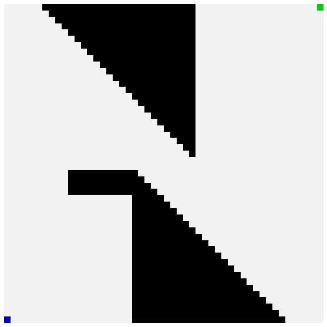

# 启发式什么为什么和如何？

> 原文：<https://towardsdatascience.com/heuristics-what-why-and-how-68aafc7e1e4b?source=collection_archive---------32----------------------->

## 启发式算法在算法开发中的理解和应用

试探法是我们使用的一种近似方法，它不能保证在实现目标时是最优的。在本文中，我将通过一个简单易懂的例子来深入解释我们如何使用启发式算法进行算法开发。所以我将使用 ***A-Star (A*)*** 算法，用一个涉及最短路径的完整例子来说明启发式的使用和实现。

# 确定性方法

确定性方法保证提供最佳解决方案。例如， **Dijkstra 的算法**可以认为是一种确定性算法，用于获得边权重为正的图中任意两点之间的最短路径。

## 作为确定性算法的 Dijkstra 算法

该算法最基本的形式如下。

```
function Dijkstra(Graph, Start)
    vertex_set = {}
    for each vertex v in Graph
        dist[v] = INFINITY
        parent[v] = NULL
    dist[start] = 0 while vertex_set not empty
        u = min dist vertex from vertex_set
        remove u from vertex_set

        for neighbour v of u
            path = dist[u]+length(u,v)
            if path < dist[v]
                dist[v] = path
                parent[v] = u
    return parent, dist
```

我们可以看到，在算法的开始，没有考虑关于目标节点的知识。因此，我们本质上执行到图的每一个其他可通过顶点的最短路径的穷举搜索。想象这张图是你国家的道路网。这能扩展到那个水平吗？Dijkstra 算法的最佳最小优先级队列实现的时间复杂度为 O(|V|+|E|log|V|) 。

# 在 Dijkstra 算法中引入启发式算法

与其穷尽搜索**源** **顶点**的所有邻居，我们还不如挑选邻居，这样**可能**会给我们一条到图中**目标** **顶点**的更短路径。单词**可能**很重要，因为试探法经常以次优输出告终。

> 我们如何猜测一个特定的节点是否会把我们引向一条更短的路径？

这就是启发性的来源。例如，在道路网络的情况下，我们可以假设我们选择的交叉点越近，它到达目标城市的速度可能越快。为此，我们可以利用现成的 GPS 信息来计算出一个不是*那么精英的*，而是从空中两点之间的大致距离。尽管这可能不正确，但考虑到你可能会看到弯道和环形路，我们可以确定移动的大致方向一定是朝着目标城市。

比较上面的猜测，你可能会注意到，如果我们选择了 Dijkstra 的算法，我们也会计算到目标节点的距离，而这些节点不在我们预期目标的方向上。最著名的启发式最短路径算法的可靠实现被称为 **A*** 或 **A-Star 算法**。

# a 星算法

伪代码如下所示。在 [wiki](https://en.wikipedia.org/wiki/A*_search_algorithm) 中阅读更多内容。

```
function AStar(start, end, heuristic=h)
    open_set = {start}
    closed_set = {} # distance so far to node
    distance = lookup_table(default=INFINITY)
    # guess to the end
    guess = lookup_table(default=INFINITY) distance[start] = 0
    guess[start] = h(start) while open_set not empty
        current = node with lowest guess from open_set
        if current is goal: END

        open_set.remove(current)
        closed_set.add(current) for neighbour of current
            score = distance[current]+length(current,neighbour)
            if score < guess[neighbour]
                distance[neighbour] = score
                parent[neighbour] = current
                guess[neighbour] = distance[neighbour]+h(neighbour)
                if neighbour not in closed_set
                    open_set.add(neighbour)
```

上面代码中的一个问题是，您必须扫描一个数组来获得目标节点的最近邻居。但是，如果您想使用到目标节点的距离作为关键字将邻居存储在最小堆中，您可以在 ***O(1)*** 时间内完成此操作。我们可以用数据结构的知识来改进算法，这很简单([阅读这篇文章以了解更多](/8-common-data-structures-every-programmer-must-know-171acf6a1a42))。让我们看看这个算法在 python 中的实现。

# 在 Python 中实现 A-Star

我将在我的算法实现中使用以下导入。

```
import numpy as np
import matplotlib.pyplot as plt # for visualizations
import matplotlib.cm as cm      # for visualizations
from collections import defaultdict
import networkx as nx           # storing the graph structure
import heapq                    # pythons heap implementation
```

我将创建一个包装类来包含图的顶点(节点),这样我就可以在 python 的`heapq`实现中立即使用它们。我覆盖了包装器的`__lt__`函数，这样`heapq`将使用它的`val`属性到`heappush`和`heappop`元素。这个`val`对应于到目标节点的距离。

```
class NodeWrap:
    def __init__(self, nid, dist_to_end):
        self.nid = nid
        self.val = dist_to_end

    def __lt__(self, other):
        return self.val < other.val
```

一旦算法运行并且我们有了遍历的顶点的父顶点，我就使用下面的代码来追踪最短路径。

```
def trace_path(parent_map, end):
    node = end
    path = []
    while (node in parent_map):
        path.append(node)
        node = parent_map[node]
    return path[::-1]
```

## 实现图形和可视化矩阵

因为这是为了学习的目的，所以我认为实时观察算法的运行是非常有趣的。因此，让我们将我们的问题建模如下。假设我们有一个 2D 地形，我们想从左下角到达右上角。我们的道路上有一个黑色的障碍物。



要穿越的地形

我使用下面的代码填充这个地形。这是一个大小为`50x50`的简单矩阵。图像是一个矩阵，有三个通道用于 **RGB** 。所以障碍简单来说就是带`[0, 0, 0]`的索引。

```
mat = np.zeros((50, 50, 3), dtype=np.float32)for x in range(50):
    for y in range(50):
        mat[x, y, 0] = 0.95
        mat[x, y, 1] = 0.95
        mat[x, y, 2] = 0.95
        g.add_node("{},{}".format(x,y), x=x, y=y)# end
mat[49, 0, 0] = .0
mat[49, 0, 1] = .0
mat[49, 0, 2] = 0.8        
# start
mat[0, 49, 0] = .0
mat[0, 49, 1] = 0.8
mat[0, 49, 2] = .0for x in range(20, 50):
    for y in range(20, 50):
        if x>y+5:
            mat[x, y, 0] = .0
            mat[x, y, 1] = .0
            mat[x, y, 2] = .0for x in range(0, 30):
    for y in range(0, 30):            
        if x<y-5:
            mat[x, y, 0] = .0
            mat[x, y, 1] = .0
            mat[x, y, 2] = .0for x in range(26, 30):
    for y in range(10, 20): 
        mat[x, y, 0] = .0
        mat[x, y, 1] = .0
        mat[x, y, 2] = .0
mat_copy = np.copy(mat)
```

## 创建网络 x 图

因为图形操作最好在具有图形功能的类似图形的数据结构上执行，所以让我们将地形迁移到图形上。每个像素将是我们图中的一个 ***节点/顶点*** 。从每个 ***节点/顶点*** 我们可以像棋盘上的女王一样在所有 8 个方向上遍历。在我们的例子中，边是存在的，除非可用的可逆邻居是黑色的。

```
g = nx.Graph()def is_black(arr):
    return sum(arr) == 0

for x in range(50):
    for y in range(50):
        xi = g.nodes["{},{}".format(x,y)]['x']
        yi = g.nodes["{},{}".format(x,y)]['y']
        for xj in range(xi-1, xi+2):
            for yj in range(yi-1, yi+2):
                if xi==xj and yi==yj or \
                    xj<0 or yj<0 or \
                    xj>49 or yj>49: 
                    continue
                # if black not a neighbour
                if is_black(mat[xi, yi]) \
                    or is_black(mat[xj, yj]): 
                    continue
                g.add_edge("{},{}".format(xi,yi), "{}, \      
                               {}".format(xj,yj))
```

## 用检查点实现算法

现在我已经准备好了我的图表，我想实现并运行一个 A-Star。同时，当算法搜索邻居时，我想对初始的 2D 地形进行快照，以便以后可视化。完整的 python 代码如下。这里我使用**欧几里德距离**作为距离启发式，这是从任何节点到目标的猜测。

```
def store_image(world, node, i):
    global mat
    x = world.nodes[node]['x']
    y = world.nodes[node]['y']

    mat[x, y, 0] = 1
    mat[x, y, 1] = .5
    mat[x, y, 2] = .0

    fig = plt.figure(figsize=(10, 10))
    plt.imshow(mat)
    plt.axis('off')
    plt.savefig("im-{}.png".format(i))
    plt.close()def euclidean_dist(world, node1, node2):
    x1 = world.nodes[node1]['x']
    x2 = world.nodes[node2]['x']
    y1 = world.nodes[node1]['y']
    y2 = world.nodes[node2]['y']

    return ((x1-x2)**2 + (y1-y2)**2)**.5def a_star(world, start, end):
    stepper = 1
    open_set = []
    close_set = set()
    parent_map = {}    
    start_node = NodeWrap(start, 0)
    heapq.heappush(open_set, start_node)

    store_image(world, start, stepper)
    stepper += 1 

    cost_to_reach_node = defaultdict(lambda: float('inf'))
    cost_to_reach_node[start] = 0

    guess_to_destination = defaultdict(lambda: float('inf'))
    guess_to_destination[start] = euclidean_dist(world, start, end)

    while len(open_set) > 0:
        current = heapq.heappop(open_set)
        if current.nid == end:
            path = trace_path(parent_map, end) 
            return path
        close_set.add(current.nid)

        for neighbor in world.neighbors(current.nid):
            tentative_score = cost_to_reach_node[current.nid] + \
                      euclidean_dist(world, current.nid, neighbor)
            if tentative_score < cost_to_reach_node[neighbor]:
                parent_map[neighbor] = current.nid
                cost_to_reach_node[neighbor] = tentative_score
                guess_to_destination[neighbor] =     
                          cost_to_reach_node[neighbor] + \
                          euclidean_dist(world, neighbor, end)

                if neighbor not in close_set:
                    neighbor_node = NodeWrap(neighbor,           
                              euclidean_dist(world, neighbor, end))
                    heapq.heappush(open_set, neighbor_node)
                    store_image(world, neighbor, stepper)
                    stepper += 1
```

我们可以使用下面的 runner 代码片段运行上面的算法。注意，我使用了矩阵的副本，因为在算法中我们更新了初始的`mat`对象。

```
path = a_star(g, "49,0", "0,49")# trace path and visualize on terrain
for node in path:
    x = g.nodes[node]['x']
    y = g.nodes[node]['y']

    mat_copy[x, y, 0] = 1
    mat_copy[x, y, 1] = .5
    mat_copy[x, y, 2] = .0fig = plt.figure(figsize=(10, 10))
plt.imshow(mat_copy)
plt.axis('off')
```

## 最终执行并创建 GIF

当我们在动画中看到事情是如何发生的时候，这种美就更加明显了。所以我会把我创作的所有图片组合起来，形成一个华丽的 GIF。我使用下面的代码从我的快照图像中创建 GIF。

```
import imageio
import globanim_file = 'out.gif'with imageio.get_writer(anim_file, mode='I', fps=10) as writer:
    filenames = glob.glob('im-*.png')
    filenames = sorted(filenames, \
        key=lambda x: int(x.replace("im-", "").replace(".png", "")))
    last = -1
    for i,filename in enumerate(filenames):
        frame = 2*(i**0.5)
        if round(frame) > round(last):
            last = frame
        else:
            continue
        image = imageio.imread(filename)
        writer.append_data(image)
    image = imageio.imread(filename)
    writer.append_data(image)
    image = imageio.imread(filename)
    writer.append_data(image)
    image = imageio.imread(filename)
    writer.append_data(image)
```

这样做后，我们将有以下动画。


动画

# 结论

我们可以清楚地看到，遍历发生在一个非常狭窄的搜索空间。这使得搜索速度更快，我们不需要对所有节点进行彻底的搜索。

在大得多的图中，节点标记和索引等技术已经完成，因此不需要将图完全加载到运行时内存中。我希望以后能写更多关于这个话题的文章。现在，我希望你喜欢阅读这篇文章。你可以在这里看到完整的笔记本[。](https://gist.github.com/anuradhawick/a4bde038e039f08fed6195d94704f480)