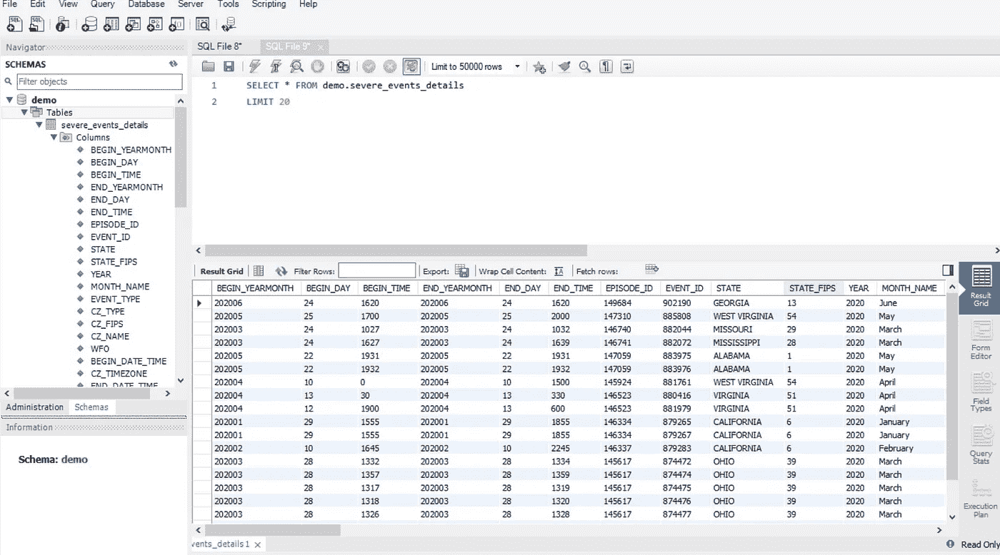
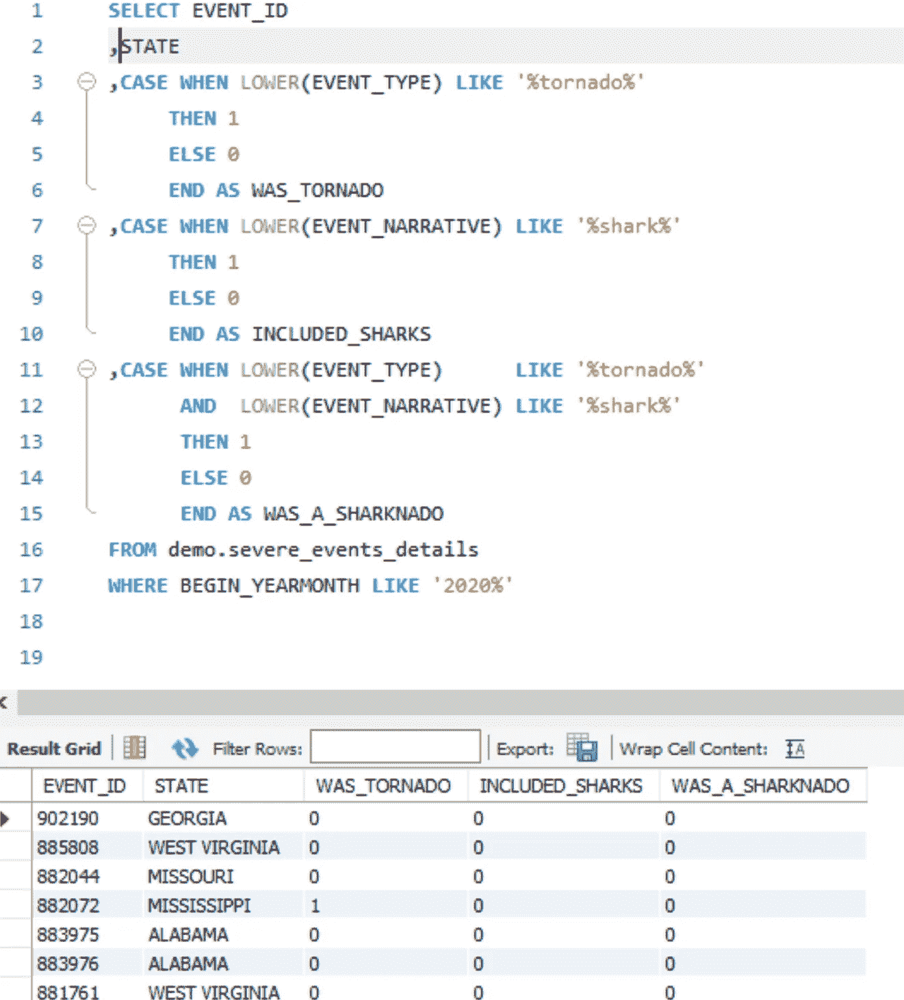
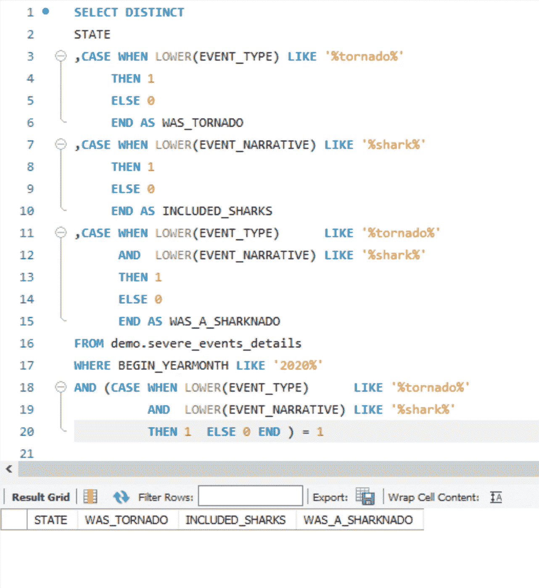

# 嘿，数据，2020 年有鲨鱼吗？

> 原文：<https://towardsdatascience.com/hey-data-were-there-any-sharknados-in-2020-b616932faced?source=collection_archive---------37----------------------->

## 高级 SQL 技术第 1 部分:用 case 语句美化数据


图片由 [maja7777](https://pixabay.com/users/maja7777-148271/?utm_source=link-attribution&utm_medium=referral&utm_campaign=image&utm_content=5009989) 来自 [Pixabay](https://pixabay.com/?utm_source=link-attribution&utm_medium=referral&utm_campaign=image&utm_content=5009989)

真实数据五花八门，乱七八糟。如果您使用 SQL 从数据库中获取数据，您可以在数据到达您之前清除数据。这种技术使得直接从查询结果进行分析变得更加容易，例如，它将减少您以后在 python 脚本中处理它的时间。在某些情况下，使用 case 语句返回标志而不是 varchar 文本将会大大减小输出的大小。

简而言之， [case 语句](https://dev.mysql.com/doc/refman/5.7/en/case.html)类似于 if，else 语句。

```
CASE *case_value*     
WHEN *when_value* 
THEN *statement_list*     
[WHEN *when_value* THEN *statement_list*] ...     
[ELSE *statement_list*] 
END CASE
```

我广泛使用 case 语句来评估数据，以创建新的、更清晰的数据元素。例如，如果一周中的某一天列有“星期三”、“星期三”、“星期三”或“驼峰日”，您可以从查询开始就清除这些内容。

```
case when lower(day_of_week) in (‘wednesday’, ‘wed’, ‘hump day’)        then ‘Wedneday’ 
     when lower(day_of_week) in ('friday', 'fri', 'tgif')
then 'Friday'
......
else day_of_week
end
```

## 数据

在之前的[帖子](https://medium.com/@dawn_moyer/how-to-set-up-an-aws-mysql-database-c33eba8870eb)中，我详细介绍了如何在 AWS 中创建 MySQL 数据库。我收集了美国 2020 年的恶劣天气事件细节。



加载到 MySQL 数据库的恶劣天气事件数据——作者截图

## 这个问题

知道您可以访问恶劣天气事件数据，您的老板问您:

> 2020 年有鲨鱼吗？

这是疯狂的一年，他想去度假。他害怕 Sharknado，并希望避开最近受影响的州。

你提出的问题是:有报道说有鲨鱼的龙卷风的州吗？

## 你的回应

你可以用 case 语句来回答这个问题。您实际上只需要第三个 case 语句，但是前两个是验证的良好实践。



使用 case 语句评估数据—作者截图

您可以查看这个列表，寻找正的 Sharknado 标志， ***或*** 您还可以在 where 子句中使用 case 语句。

简化您的结果:



使用 case 语句过滤结果—作者截图

你可以告诉你的老板，2020 年还没有 Sharknados。