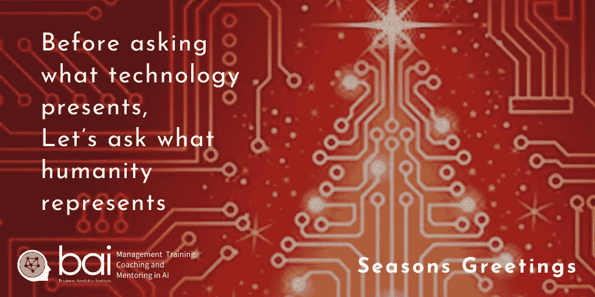

# 嘿 Siri，作为人类意味着什么？

> 原文：<https://towardsdatascience.com/hey-siri-what-does-it-mean-to-be-human-f06fa6e251ce?source=collection_archive---------28----------------------->

## 在提出人工智能可以增强人类潜力之前，问一下是什么将人类与技术的不断进步区分开来可能是有用的。

图片来源:Jess Szmajda

如果人工智能的远见者承诺利用技术改善我们日常生活的几乎每个方面，数据主义的支持者认为，我们与我们生产的模仿我们行为的技术没有什么区别。人类的思想和感情只不过是对环境刺激的程序化生化反应吗？在问机器智能如何让我们变得更好之前，让我们考虑四个独特的人类特征:人类能动性的概念、抽象和移情的能力、人类智能的多种形式以及区分对错的能力。

人类的一个基本特征是人类能动性的概念:做出明智的、不受胁迫的决定，从而独立于我们的环境采取行动的能力。代理通常被归类为潜意识的，非自愿的行为，或有目的的，目标导向的活动。一个人能在多大程度上独立于他/她的环境而行动是有争议的:在决定一个人的行动范围时，社会结构和个人意志的首要地位一直是社会科学中经常讨论的问题。

例如，我们的行为在多大程度上受到我们使用的技术的制约；也就是说，我们在媒体上的交流方式是否不同于在 Twitter、Instagram 或 SnapChat 上？这就是说，我们大多数人都会同意人类至少有某种程度的自由选择:人们是自我组织、积极主动、自我调节的，并进行自我反思，而不是由外部事件塑造和引导的被动有机体。

人类的第二个特征是我们的抽象能力(概念源于经验的概念过程)和移情能力(理解和联系我们周围世界的能力)。抽象让我们按照自己的理想行动，而不是按照移情“基本上是理解他人情感的能力”的事件行动。"

同理心可以是认知的(与思想和理解有关)、情感的(与感觉和知觉有关)或同情的(关注智力和情感)。例如，抽象让我们可以将 HAL 5000、WALL-E 和 RD-D2 都视为机器人，移情让我们可以认同他们在每部电影的故事情节中面临的挑战。

人类的第三个显著特征是我们使用多种形式的智力——我们既能用心灵进行直觉思考，也能用头脑进行逻辑思考。毫无疑问，人类智慧远远不止这两种表现形式，不同的作者谈到了五种、七种甚至九种人类智慧。语言智能唤起了从概念上思考和使用语言探索复杂性的能力。个人内部智能是在日常生活中应用知识时理解自己、自己的想法和感受的能力。

人际智能是指我们理解、联系以及与家人、同事和熟人互动的能力。灵性智能意味着探索有关人类生存和状况的形而上学问题的敏感性和能力。增强人性是否意味着增强其中一种形式的智力，如果是的话，是哪一种？

最后，人性的第四个特征是伦理——帮助我们区分对错的共同价值观。商业道德通常与几个道德概念联系在一起，包括诚实、正直、透明、责任和隐私。数据伦理包括研究和采用尊重基本个人权利和社会价值观的数据实践、算法和应用。

因为技术影响这些道德标准——即人工智能反映了人类决策的愿景、偏见和逻辑，所以我们需要考虑技术在多大程度上可以与它旨在解决的更大的经济和社会挑战相隔离。诸如个人隐私、哪些指标允许我们评估人类进步以及信息和治理之间的关系等新兴问题表明，数据决定了我们如何看待和评估我们周围的世界。

*单单机器智能的进步就能帮助我们理解对人类来说意味着什么吗？*

这篇文章是我们对 Jay Liebowitz 即将出版的“数据分析和人工智能”一书的贡献的一部分。关于数字伦理的进一步想法可以在我们关于[数字伦理](https://www.baieurope.com/ebook-ethics)的电子书中，以及我们在[商业分析研究所](http://baieurope.com)的管理会议、课程和暑期学校中找到。

Lee Schlenker 是商业分析和社区管理教授，也是 BAI [的校长。](http://baieurope.com.)他的 LinkedIn 个人资料可以在[查看](http://www.linkedin.com/in/leeschlenker.)你可以在[的 Twitter 上关注白](https://twitter.com/DSign4Analytics)