# Chrome DevTools 的隐藏功能

> 原文：<https://towardsdatascience.com/hidden-features-of-chrome-devtools-33d9de390dc0?source=collection_archive---------24----------------------->

## 使用这些 Chrome DevTools 提示和技巧，成为一个更高效的 web 开发人员。

如果你是一名 web 开发人员，那么你肯定会花相当多的时间在浏览器、开发工具或 web 控制台上闲逛。检查元素、修改 CSS 或在控制台中运行命令——这些是每个 web 开发人员都知道如何使用浏览器开发工具做的一些基本事情。然而，你可以在浏览器中做更多的事情来使你的调试、开发和网页设计更加有效。这里有几个隐藏的或者不太为人所知的 Chrome DevTools 的特性，你应该知道这些特性，并且你每天都会用到它们…

paweczerwi324ski 在 [Unsplash](https://unsplash.com/?utm_source=unsplash&utm_medium=referral&utm_content=creditCopyText) 上拍摄的照片

# 将数组打印成表格

当在 JavaScript 中处理大量数据时(例如，创建数据可视化)，第一次尝试不会成功，您不可避免地要去 web 控制台查看数据——可能用`console.log`。这将产生 JavaScript 对象(JSON ),在 2D 数组的情况下，它将很难阅读，也很难找到有用的信息。但是有一个简单的解决方法:

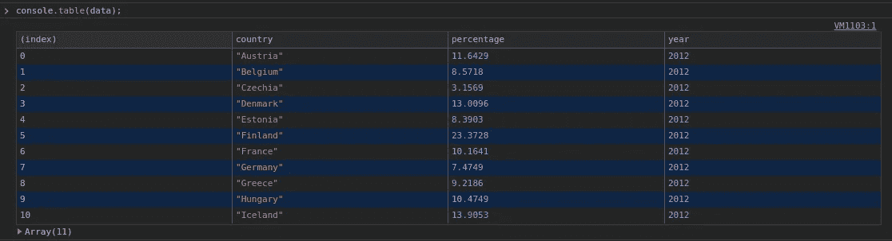

console.table()

所要做的就是用`console.table`代替`console.log`。这个函数可以很容易地显示 1D 和 2D 数组，但是让这个函数特别有用的是，它还可以正确地显示列名，最重要的是，它还允许您按这些列中的每一列进行排序。因此，要获得如上表所示的表格，您需要使用以下格式的数据:

# 使用多光标

每个代码编辑器中最基本的功能和快捷方式之一是多光标和多选择。如果你想像我一样尽可能高效，那么你一定会好好利用这些捷径:

多光标使用`CTRL + Click`:

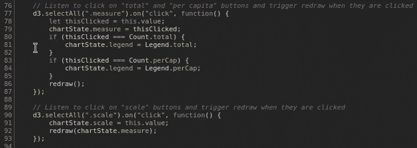

多光标

多光标是有帮助的，但是当你需要选择和替换一个文本的大量出现时，它不是很准确而且有点麻烦。对于那些情况你可以使用更合适的`CTRL + D`快捷键:

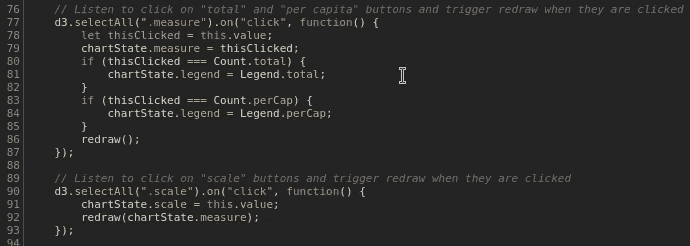

使用 CTRL + D 的多光标

在上面的 GIF 中，你可以看到如何使用`CTRL + D`来选择(也可以选择`CTRL + U`来取消选择)文本的出现，从而轻松地修改或替换它们。

# 使用命令选项板

有很多工具、标签、文件、命令等等。在 *Chrome DevTools* 中，记住每个人的名字或位置可能是不可行的。为此，你可以使用*命令面板*，它可以通过`CTRL + Shift + P`打开。在这个面板中，你可以找到所有的快捷键、面板、控制台设置、标签、设置等等。

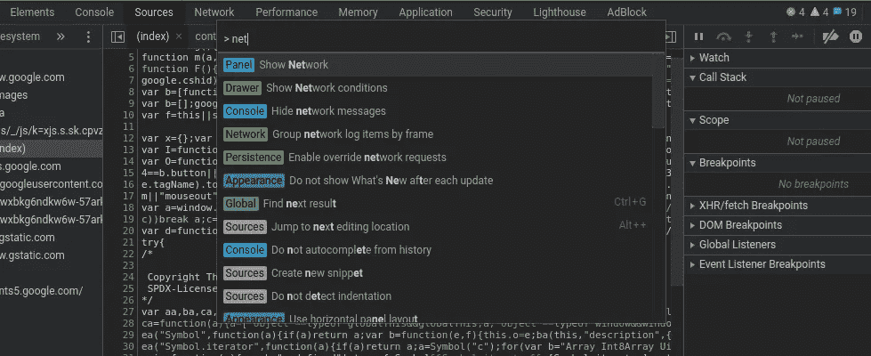

命令选项板

同样，如果你在这个快捷方式中省略了`Shift`而使用了`CTRL + P`，它会给你一个列表，列出所有你可以打开的文件。如果你的网站有很多源文件，这也很方便。

# 方便的颜色选择器

我可能不是唯一一个在 CSS 中无休止地修改字体、颜色等等的人。为了使颜色调整变得简单一点，你可能想要使用*颜色选择器*，你可以通过找到你想要改变颜色的元素并点击它的 CSS 颜色域来打开它。

这是一个很好的功能，但真正的游戏改变者是在*颜色选择器*打开时，只需点击它就可以从网站上选择任何颜色——就像这样:

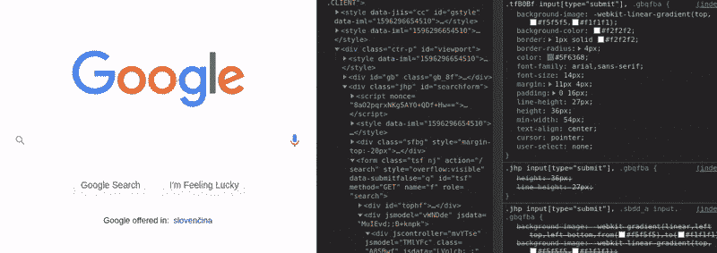

颜色选择器

# 深色模式

从上面的截图和 gif，你可能已经注意到我在 *Chrome DevTools* 中使用了黑暗模式。因此，如果你想知道如何从亮模式切换到暗模式，那么你可以导航到 DevTools 的右上角——点击 *3 个垂直点*图标，然后选择*更多工具*，然后选择*设置*。在设置菜单中选择*偏好*，最后将*主题*设置为*暗*。就是这样！欢迎来到黑暗面！

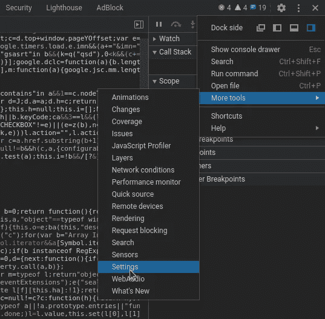

黑暗模式设置

# 查找 CSS 属性的定义位置

使用 CSS 涉及到大量的试验和错误(至少对我来说是这样)，与其在 IDE 中编辑代码和刷新浏览器标签之间来回切换，为什么不节省一些时间并在 DevTools 中完成所有工作呢？一个节省时间的技巧是使用`CTRL + Click`找到 CSS 属性的定义位置，这样您就可以在它的源文件中编辑它:

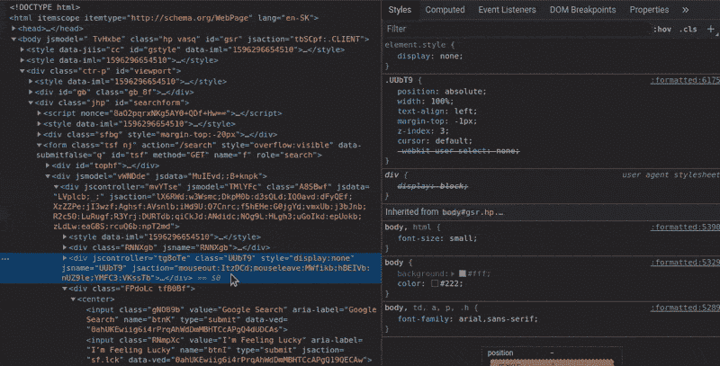

查找 CSS 属性的定义位置

# 使网站在设计模式下可编辑

CSS/Design 的另一个窍门是使用*设计模式*直接编辑网站上的任何东西。无需修改 HTML 和 CSS 源文件——只需点击/突出显示页面上的任何内容并进行更改！要打开这种模式，只需在控制台中键入`document.designMode = "on"`并开始*设计*(嗯，真的只是搞乱任何东西):

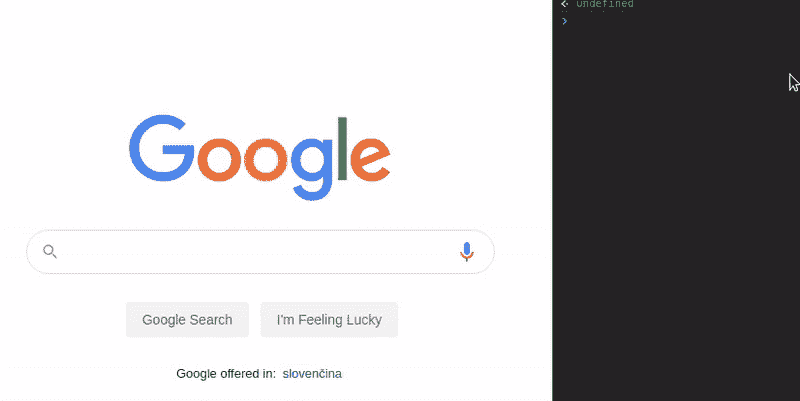

设计模式

# 条件断点

使用 IDE 正确调试浏览器中运行的 JavaScript 通常很难/很烦人。因此，让我们利用 DevTools 调试器，而不是使用 IDE。

在调试器中设置基本断点并不有趣，你肯定知道如何去做。那么*条件断点*呢？有时，您可能有一个循环的*，它迭代超过 1000 条或更多记录，并且您知道 bug 仅在满足特定条件时出现——例如，当所述循环中的`if`语句返回`false`时。为了仅在满足该条件时在断点处停止，我们可以设置*条件断点*:*

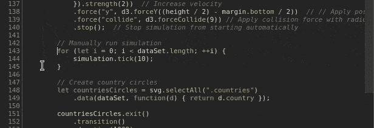

条件断点

我们首先右击现有断点(红点)，然后点击*编辑断点*并插入我们想要的表达式。当这个表达式的值为`true`时，断点将被触发，我们将有机会四处查看。这个条件断点不必只添加在有`if`语句的行上——它可以在任何行上，每次代码执行经过它时，它的表达式都会被求值。

当您在暂停执行期间四处寻找 bug 时，您可能还会考虑将可疑变量添加到 *Watch* 选项卡，这样您就可以在值发生变化时监视它们。要将变量添加到*手表*中，您可以执行以下操作:

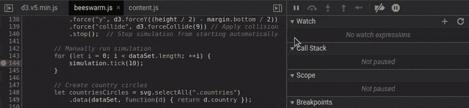

调试器监视

# 模拟慢速互联网

大多数人都知道 DevTools 中的*网络*标签，在这里你可以看到每个功能、操作或文件加载需要多长时间。然而大多数人不知道的是，你也可以使用*网络*选项卡来模拟使用*网络节流*的慢速互联网连接。下面是如何做到这一点:

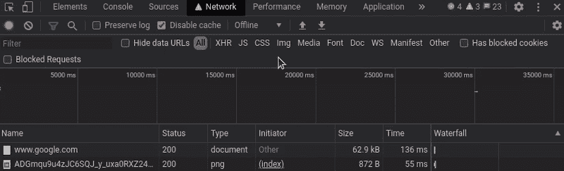

网络节流

在添加和选择这个配置文件后，剩下要做的就是刷新页面，看看它在糟糕的互联网连接下表现如何。注意——通过尝试——你可能会意识到你的网站真的有多慢(有点压抑的个人体验)。

# 衡量网站绩效

说到性能，让我们探索一下 *Chrome DevTools* 在应用分析方面能为我们做些什么。要运行 profiler，我们需要切换到 DevTools 中的 *Performance* 选项卡。在这个选项卡上，我们只需点击`CTRL + Shift + E`。此快捷方式与启动 profiler 同时刷新页面。页面加载后，我们需要再次按下这个快捷键来停止 profiler 记录。

DevTools 探查器

从这里我们可以深入了解网络性能、动画、功能时间等。你可以查看很多东西，但有一个特别的是检查函数计时。要检查这些功能，您可以点击图中的橙色条，并选择底部的*自下而上*选项卡。如果你接着按照*总时间*对它们进行排序，你可能会发现你的代码中有一些花了太多时间才完成的部分。

# 结论

这些只是我最喜欢的一些技巧和诀窍，这绝对不是 *Chrome DevTools* 所有特性的详尽列表。你可能会在 [Chrome DevTools 指南](https://developers.google.com/web/tools/chrome-devtools)中找到许多适合你工作流程的有用特性。此外，我建议继续关注[新功能部分](https://developers.google.com/web/tools/chrome-devtools/updates)的最新更新，它为您的浏览器带来了更多有用的工具。

如果你错过了任何特定的功能，值得检查 Chrome 网络商店上的 [DevTools 扩展](https://chrome.google.com/webstore/category/collection/chrome-dev-tools-extensions)，因为谷歌和用户社区都有额外的工具。如果你不能为你的特定问题找到工具/扩展，也许可以考虑使用 [*扩展 DevTools*](https://developer.chrome.com/extensions/devtools) 教程自己构建一些东西。😉

*本文最初发布于*[*martinheinz . dev*](https://martinheinz.dev/blog/33?utm_source=tds&utm_medium=referral&utm_campaign=blog_post_33)

如果你喜欢这篇文章，你应该看看我下面的其他文章！

 [## 使用蜂群图表实现更好的数据可视化

### 让我们使用 D3.js 创建交互式蜂群图表，以便更好地可视化您的数据。

towardsdatascience.com](/better-data-visualization-using-beeswarm-chart-bb46a229c56b)  [## Python 调试终极指南

### 让我们探索使用 Python 日志记录、回溯、装饰器等等进行调试的艺术…

towardsdatascience.com](/ultimate-guide-to-python-debugging-854dea731e1b)  [## 用 Javascript 实现 2D 物理学

### 让我们在实现真实的 2D 物理模拟和可视化的同时享受一下 JavaScript 的乐趣吧！

towardsdatascience.com](/implementing-2d-physics-in-javascript-860a7b152785)