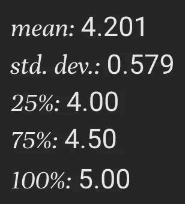
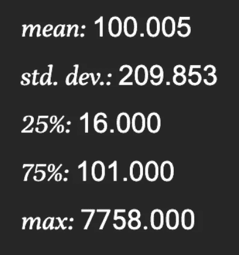
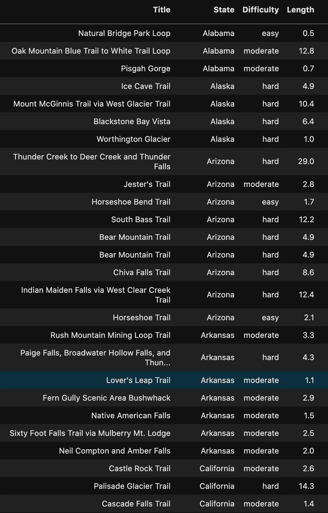
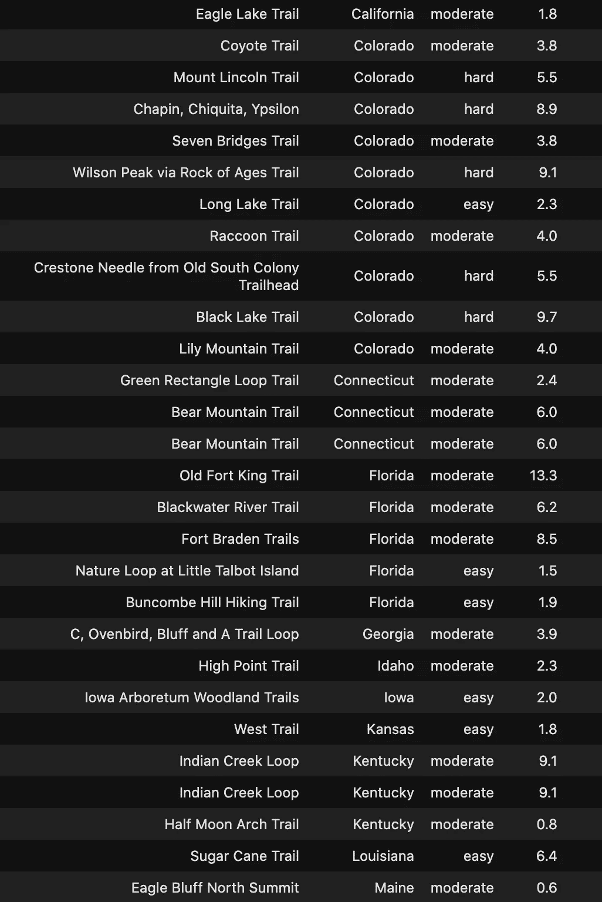
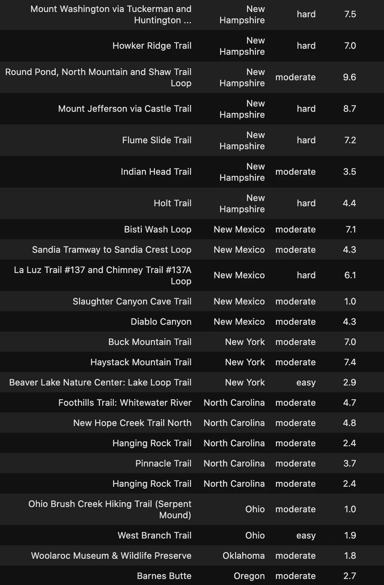

# 隐藏的宝石:寻找美国最好的秘密步道

> 原文：<https://towardsdatascience.com/hidden-gems-finding-the-best-secret-trails-in-america-d9203e8ad073?source=collection_archive---------37----------------------->

## 有了数据科学

(图片来源:David Marcu via [unsplash](https://unsplash.com/s/photos/david-marcu) )

人们想要在荒野中寻找孤独有很多原因，从沉浸在大自然中的治疗效果，到不想在繁忙的小径上造成小径退化和土壤侵蚀。

现在比以往任何时候都更需要户外的缓刑。但在后 COVID 19 的世界里，当在狭窄的小径上经过徒步旅行者时，几乎不可能保持适当的社交距离，因此找到较少人去徒步旅行的小径尤为重要。

我开始了一项任务，利用数据科学和机器学习来寻找美国最好的鲜为人知的小径。

# 方法

如果你和我一样，在你去任何地方或买任何东西之前，你会阅读所有的评论。

当我第一次着手这个项目的时候，我想回答这个问题，“什么样的步道是好的？”也就是说，什么样的特征和统计数据的组合会导致它具有高的总体评级？

不过，我很快就发现，在我搜集和分析的 35，000 条徒步旅行路线中，基本上所有路线都被评为“相当好”——也就是说，平均用户评分为 4.2 分(满分为 5 星)，标准偏差小于 0.6，仅从 5 星评级来看，很难区分哪些路线是优秀的，哪些只是一般。

然而，所有路线之间的巨大差异是，它们的受欢迎程度由每条路线的评论总数来表示。虽然绝大多数的路径只有 100 个左右的评论，但少数几个却有几千个！是什么让这些小径如此受欢迎？

因此，我转而试图预测的不是一条线索的评级，而是通过一个数据驱动的模型来确定一条给定线索的各种特征与其受欢迎程度之间的关系。在寻找共性的过程中，我可以将这个模型应用到冷门的试验中，找出哪些试验符合所有相同的条件，可能会很棒，即使它们还没有被发现。

# 方法学

1.  )用硒和美汤，web scrape 获取全美约 35000 条步道的步道数据。这些信息包括徒步旅行的长度、海拔高度、位置，以及该路线的所有自然特征(如瀑布、野花、路面)的列表。
2.  )清理这些数据并创建一个熊猫数据框架。这包括对所有分类特征列的虚拟变量进行一次性编码。
3.  2)利用 VADER 情感分析模块，通过简单的自然语言处理来分析每个踪迹的文本评论，并确定平均合成分数。
4.  )使用包括 Statsmodels OLS 在内的线性回归建模方法来确定踪迹特征与其受欢迎程度之间的关系。
5.  )通过 LassoCV 执行要素工程和正则化，以移除这些要素之间的多重共线性并优化模型。
6.  )将该模型应用于被描述为“轻度交通”的步道，以找到基于其特征组合而预期会受欢迎的步道，但只是还没有被发现。

# 调查的结果

一个线性回归模型以评论的数量(以及受欢迎程度)作为目标变量来拟合这条线索的统计数据。该模型产生了一个最有影响力的功能列表。这些包括有**费**，有**高情感分析分数**，有**洛基**，有**争夺**和**无阴影**等等。

我是这样解释这些重要特征的:

*   **收费**:如果最受欢迎的步道需要收费，这表明它们可能位于国家公园内。由于许多国家公园因 COVID 而关闭，或者可能非常繁忙，因此寻找替代方案就更加重要。
*   **情感分析评分**:由于所有的线索都有大致相同的评分(5 颗星),很难仅从这个评分中收集到大量关于其质量的可靠信息。通过使用自然语言处理来分析书面文本评论本身，我能够获得一个实际有用的度量标准来确定人们对这条路线的实际感受。分数越高(在-1 =非常消极到+1 =非常积极的范围内)，人们对线索的积极感觉越强，这对寻找隐藏的宝石非常有用。
*   岩石/攀爬/没有树荫:这告诉我非常受欢迎的小径都在树线以上！在那些海拔更高、难度更大的徒步旅行中，你会遇到这些特征。海拔越高，你可能会看到更好的景色！事实证明，人们喜欢这些更难走的路。

该模型的其余部分被优化到 0.19。虽然这不是一个很高的分数，但你可以在下面看到，这是因为踪迹特征和流行度之间的关系并不是线性的。下面的残差图显示了预测的流行值和实际值之间的差异，非常清楚地证明了这一点(如果这是线性相关的，残差将全部落在大约 0！)那么，如果一条小径不具备流行小径的所有特征，那么到底是什么决定了它的流行呢？

我的主要发现是，在浏览线索时，用户首先看到的是评论最多的线索，这导致了某种形式的递归确认偏差。如果所有的步道都有大致相同的评级，用户将转向评论来确定一条步道是否好，将选择有很多评论的步道，从而使非常少的最繁忙的步道变得更加繁忙。与此同时，其他类似的路径可能有大量的机会，但被忽视。

# 那么，是什么让一条小径受欢迎呢？

美国有成千上万的徒步旅行可以在网上搜索到。一般来说，评论最多的小路会得到最多的徒步旅行，因此会有更多的评论；虽然鲜为人知的路径可能只是一个好的，但更难在网站上找到，很难确定他们是否会是一个好的路径，如果他们有这么少的评级。

那么，是什么让一条小径受欢迎呢？最终，*搜索算法做到了。*

是时候打破这种反馈循环，找到一些令人惊叹的替代远足方式，在那里我们可以避开人群。但是你怎么知道一条线索是否值得你花费时间呢？我用机器学习来帮你做这些工作。

我在被指定为“轻度交通”的小径子集上拟合了最佳模型，这些小径的 R 为 0.08。这实际上是令人鼓舞的，考虑到这些是特别挑选出来的*不太受欢迎的*路线，但是根据这些路线的特点，应该会受欢迎。

该项目未来工作的一个潜在领域可能是拟合多项式要素模型，而不是线性模型。对这种方法的早期探索产生了对 0.26 的有希望的 R 改进，但是由于复制特征而引起了一些特征共线性，这将需要通过特征工程来消除。一旦我有了更多的机器学习工具，我期待着继续这项工作！但是我非常激动地向你们展示这份美国最好的鲜为人知的路径列表，作为我的第一个端到端数据科学项目。

# 徒步旅行

看看下面你所在州隐藏的宝石吧！

