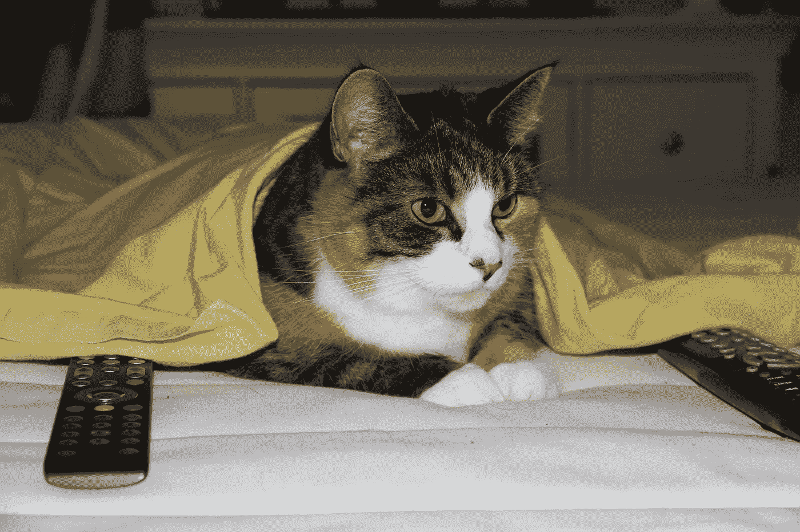
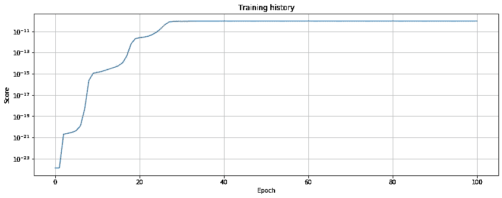

# 隐马尔可夫模型——一个早晨精神错乱的故事

> 原文：<https://towardsdatascience.com/hidden-markov-model-a-story-of-the-morning-insanity-718b34318120?source=collection_archive---------31----------------------->



适马。这里真正的女主角。

# 介绍

在本文中，我们给出了一个隐马尔可夫模型(HMM)的(不)实际应用的例子。这是一个人为构造的问题，我们为一个模型创建一个案例，而不是将一个模型应用到一个特定的案例中…尽管，可能两者都有一点。

在这里，我们将依赖于我们早先开发的代码(参见 [repo](https://github.com/OlegZero13/markeasy) )，以及在早先的文章中讨论过的:“[隐马尔可夫模型——从零开始实现](/hidden-markov-model-implemented-from-scratch-72865bda430e)”，包括数学符号。请随意看一看。我们将要讲述的故事包含了问题的建模，揭示隐藏的序列和模型的训练。

# 让故事开始吧…

想象以下场景:早上 7 点，你正准备去上班。实际上，这意味着你在不同的房间之间疯狂地奔跑。你在每个房间里随意花一些时间，做一些事情，希望在你离开之前把你需要的东西都整理好。

听起来很熟悉？

更糟糕的是，你的女朋友(或男朋友)养猫。小毛球想吃东西。由于早上的拥挤，不确定你是否记得喂它。如果你不这样做，猫会不高兴的…如果你的女朋友发现了，她也会不高兴的。

# 模拟情况

假设你的公寓有四个房间。那就是包括厨房、浴室、客厅和卧室。你在每一个房间里花了一些随机的时间，并以一定的概率在房间之间转换。与此同时，无论你走到哪里，你都可能会发出一些不同的声音。你的女朋友听到了这些声音，尽管她还在睡觉，但她可以推断出你在哪个房间度过你的时间。

所以她每天都这样做。她想确定你确实喂过猫。

然而，因为她不能在那里，她所能做的就是把猫粮袋放在一个房间里，据说你在那里呆的时间最长。希望这能增加你喂饱“野兽”的机会(并拯救你的夜晚)。

## 马尔可夫观点

从马尔可夫的角度来看，有 *N* 个房间是隐藏状态 *Q = {q1，q2，…}* (在我们的例子中 *N = 4* )。每一分钟(或任何其他时间常数)，我们从一个房间过渡到另一个房间*气*在 *t → qj* 在 *t + 1* 。与转变相关联的概率是矩阵**A _ ij*的元素。*

*同时，你的女朋友可以听到明显的噪音:*

*   ***冲水马桶**(最有可能:卫生间)，*
*   ***刷牙声**(最有可能:卫生间)，*
*   ***咖啡机**(最有可能:厨房)、*
*   ***打开冰箱**(极有可能:厨房)，*
*   ***电视广告**(最有可能:客厅)，*
*   ***收音机上的音乐**(最有可能是:厨房)，*
*   ***洗碗**(最有可能:厨房)，*
*   ***洗澡**(最有可能是浴室)，*
*   ***开/关衣柜**(最有可能:卧室)，*
*   ***尴尬的沉默**……(可以是任何地方……)。*

*给定一个*状态 qj* 在 *t* 时它们出现的概率由矩阵 ***B*** 的 *bj(k)* 系数给出。原则上，这些都可能源于你在一个任意的房间(状态)。然而，实际上，当你在厨房的时候，有一点点物理上的机会你扣动了马桶扳机，因此一些 *b* 将接近于零。*

*最重要的是，当你从一个房间跳到另一个房间时，合理的假设是你去哪个房间只取决于你刚刚去过的那个房间。换句话说，当时的状态只取决于时间 *t -1* 时的状态，特别是如果你是一个注意力持续时间像金鱼一样的半脑死亡…*

# *目标*

*对于第一次尝试，让我们假设概率系数是**已知的。**这意味着我们有一个模型λ = ( ***A*** *，* ***B*** *，π)* ，我们的任务是在给定观测序列的情况下估计潜在序列 *X = (x_1，x_2，…)，x_t = q_j* ，对应于寻找 *p(X|O，λ)* 。换句话说，考虑到她所听到的，女友想要确定我们在哪个房间花的时间最多。*

# *初始化*

*先初始化我们的***A*******B***和π。**

**例如，矩阵 ***A*** 被初始化为 **:****

```
**|             |   bathroom |   bedroom |   kitchen |   living room |
|:------------|:----------:|:---------:|:---------:|:-------------:|
| bathroom    |       0.90 |      0.08 |      0.01 |          0.01 |
| bedroom     |       0.01 |      0.90 |      0.05 |          0.04 |
| kitchen     |       0.03 |      0.02 |      0.85 |          0.10 |
| living room |       0.05 |      0.02 |      0.23 |          0.70 |**
```

**矩阵 ***B*** 以类似的方式初始化。对于其他状态，初始概率向量π被设置为`p('bedroom') = 1`和`0`。**

*****A 初始化后，B*** 和π如前文所述被实例化。**

```
**hml = HiddenMarkovLayer(A, B, pi)
hmm = HiddenMarkovModel(hml)**
```

# **模拟**

**定义了 ***A，B*** 和π之后，让我们来看看一个典型的《清晨精神错乱》可能是什么样子的。这里，我们假设整个“马戏”持续 30 分钟，粒度为一分钟。**

```
**observations, latent_states = hml.run(30)
pd.DataFrame({'noise': observations, 'room': latent_states})|  t | noise    | room        |
|:---|:--------:|:-----------:|
|  0 | radio    | bedroom     |
|  1 | wardrobe | bedroom     |
|  2 | silence  | bedroom     |
|  3 | wardrobe | bedroom     |
|  4 | silence  | living room |
|  5 | coffee   | bedroom     |
|  6 | wardrobe | bedroom     |
|  7 | wardrobe | bedroom     |
|  8 | radio    | bedroom     |
|  9 | wardrobe | kitchen     |
| ...| ...      | ...         |**
```

**上表显示了序列的前十分钟。我们可以看到，这有点道理，尽管我们必须注意到，女朋友不知道我们参观了哪个房间。这个序列对她是隐藏的。**

**然而，正如在上一篇文章中提出的，我们可以*猜测*在给定观察结果的情况下，统计上最有利的房间顺序是什么。这个问题用`.uncover`方法解决。**

```
**estimated_states = hml.uncover(observables)
pd.DataFrame({'estimated': estimated_states, 'real': latent_states})|  t | estimated   | real        |
|:---|:-----------:|:-----------:|
|  0 | bedroom     | bedroom     |
|  1 | bedroom     | bedroom     |
|  2 | bedroom     | bedroom     |
|  3 | bedroom     | bedroom     |
|  4 | bedroom     | living room |
|  5 | bedroom     | bedroom     |
|  6 | bedroom     | bedroom     |
|  7 | bedroom     | bedroom     |
|  8 | bedroom     | bedroom     |
|  9 | bedroom     | kitchen     |
| ...| ...         | ...         |**
```

**比较结果，我们得到以下计数:**

```
**|             |   est. time proportion |   real time proportion |
|:------------|-----------------------:|-----------------------:|
| bathroom    |                      1 |                      2 |
| bedroom     |                     18 |                     17 |
| kitchen     |                      4 |                     10 |
| living room |                      8 |                      2 |**
```

**估计时间比例**

**得到的估计给出了 12 个正确的匹配。虽然这看起来不多(只有 40%的准确率)，但它比随机猜测要好 1.6 倍。**

**此外，我们对匹配序列的元素不感兴趣。我们更感兴趣的是找到你呆的时间最长的房间。根据模拟，你在卧室里的时间长达 17 分钟。这一估计与真实序列相差一分钟，相当于约 6%的相对误差。没那么糟。**

**根据这些结果，猫粮站应该放在卧室。**

# **训练模型**

**在最后一节中，我们依赖于一个假设，即转移和观察的内在概率是已知的。换句话说，你的女朋友一定一直在密切关注你，基本上是在收集关于你的数据。否则，她怎么能制定一个模型呢？**

**虽然这听起来完全疯狂，但好消息是我们的模型也是可训练的。给定一系列观察结果，可以训练模型，然后用它来检查隐藏变量。**

**让我们举一个例子，你的女朋友可能在某个疯狂的星期一早上听到了什么。你醒了。完全沉默了大约 3 分钟，你开始在衣柜里找你的袜子。找到你需要的(或不需要的)东西后，你又沉默了五分钟，冲了马桶。紧接着，你冲了个澡(5 分钟)，接着刷牙(3 分钟)，尽管你在中间打开了收音机。完成后，你打开咖啡机，看电视(3 分钟)，然后洗碗。**

**因此，可观察到的序列如下:**

```
**what_she_heard = ['silence']*3 \
+ ['wardrobe'] \
+ ['silence']*5 \
+ ['flushing'] \
+ ['shower']*5 \
+ ['radio']*2 \
+ ['toothbrush']*3 \
+ ['coffee'] \
+ ['television']*3 \
+ ['dishes']

rooms = ['bathroom', 'bedroom', 'kitchen', 'living room']
pi = PV({'bathroom': 0, 'bedroom': 1, 'kitchen': 0,'living room': 0}**
```

**起点是*寝室*，但 ***A*** 和 ***B*** 不详。让我们初始化模型，并在观察序列上训练它。**

```
**np.random.seed(3)

model = HiddenMarkovModel.initialize(rooms, 
	list(set(what_she_heard)))
model.layer.pi = pi
model.train(what_she_heard, epochs=100)

fig, ax = plt.subplots(1, 1, figsize=(10, 5))
ax.semilogy(model.score_history)
ax.set_xlabel('Epoch')
ax.set_ylabel('Score')
ax.set_title('Training history')
plt.grid()
plt.show()**
```

****

**图一。使用 100 个时期的训练历史。训练意味着分数最大化。**

**现在，在模型的训练之后，预测序列如下:**

```
**pd.DataFrame(zip(
	what_she_heard, 
	model.layer.uncover(what_she_heard)), 
	columns=['sounds', 'guess'])|  t | sound      | guess       |
|:---|:----------:|:-----------:|
|  0 | silence    | bedroom     |
|  1 | silence    | bedroom     |
|  2 | silence    | bedroom     |
|  3 | wardrobe   | bedroom     |
|  4 | silence    | bedroom     |
|  5 | silence    | bedroom     |
|  6 | silence    | bedroom     |
|  7 | silence    | bedroom     |
|  8 | silence    | bedroom     |
|  9 | flushing   | bathroom    |
| 10 | shower     | bathroom    |
| 11 | shower     | bathroom    |
| 12 | shower     | bathroom    |
| 13 | shower     | bathroom    |
| 14 | shower     | bathroom    |
| 15 | radio      | kitchen     |
| 16 | radio      | kitchen     |
| 17 | toothbrush | living room |
| 18 | toothbrush | living room |
| 19 | toothbrush | living room |
| 20 | coffee     | living room |
| 21 | television | living room |
| 22 | television | living room |
| 23 | television | living room |
| 24 | dishes     | living room || state (guessed)       |   total time steps |
|:---------------------:|:------------------:|
| bathroom              |                  6 |
| bedroom               |                  9 |
| kitchen               |                  2 |
| living room           |                  8 |**
```

**根据上表，很明显猫粮应该放在卧室里。**

**然而，值得注意的是，这个结果是一个很好的巧合，因为这个模型是从一个完全随机的状态初始化的。因此，我们无法控制它在标签环境中的发展方向。换句话说，隐藏状态的命名对模型来说是抽象的。他们是我们的约定，不是模特的。因此，模型也可以将“淋浴”与“厨房”相关联，将“咖啡”与“浴室”相关联，在这种情况下，模型仍然是正确的，但是为了解释结果，我们需要交换标签。**

**尽管如此，在我们的例子中，模型似乎已经训练输出一些相当合理的东西，而不需要交换名称。**

# **结论**

**希望，我们已经用隐马尔可夫模型方法揭示了早晨精神错乱的整个故事。**

**在这个短篇故事中，我们讲述了两个案例。第一种情况假设概率系数是已知的。使用这些系数，我们可以定义模型并揭示给定观察序列的潜在状态序列。第二个案例代表了相反的情况。概率是未知的，因此必须首先训练模型，以便输出隐藏序列。**

# **结束语**

**这里描述的情况是作者每天面临的真实情况。是的…猫活了下来。；)**

# **还会有更多…**

**我计划把文章带到下一个层次，并提供简短的视频教程。**

**如果您想了解关于视频和未来文章的更新，**订阅我的** [**简讯**](https://landing.mailerlite.com/webforms/landing/j5y2q1) **。你也可以通过填写[表格](https://forms.gle/bNpf9aqZJGLgaU589)让我知道你的期望。回头见！****

***原载于*[*https://zerowithdot.com*](https://zerowithdot.com/hidden-markov-model-morning-insanity/)*。***