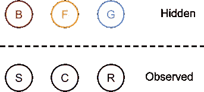
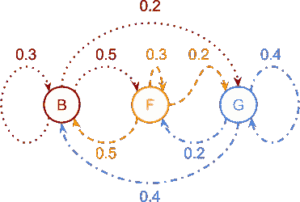
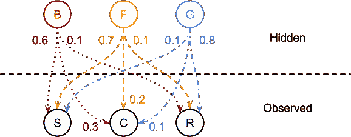
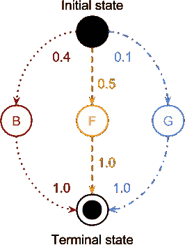
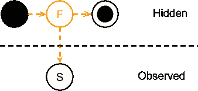
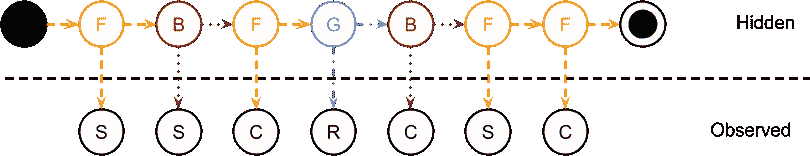
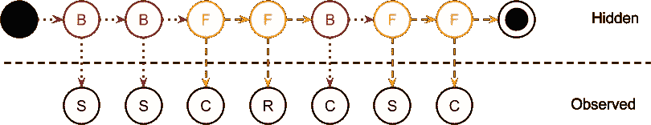
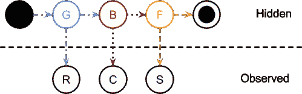

# 隐马尔可夫模型(HMM)——高层次的简单解释

> 原文：<https://towardsdatascience.com/hidden-markov-model-hmm-simple-explanation-in-high-level-b8722fa1a0d5?source=collection_archive---------7----------------------->

## [入门](https://towardsdatascience.com/tagged/getting-started)

## 用直观的例子简单解释 HMM，而不是复杂的数学公式

HMM 是一种非常强大的统计建模工具，用于语音识别、手写识别等。我想使用它，但是当我开始深入研究时，我发现并不是所有的事情都解释得足够清楚，例子也不够简单。关于 HMM 的科学出版物也经常以复杂的方式撰写，缺乏简洁性。所以我决定为我和所有对这个话题感兴趣的人创建一个简单易懂的高层次的 HMM 解释。

# 嗯问题

嗯回答这些问题:

**评估**——可观察到的事情发生的可能性有多大？换句话说，观察序列的概率是多少？

*   正向算法
*   向后算法
*   …

**解码**——观察发生的原因是什么？换句话说，当你有观察序列时，最有可能的隐藏状态序列是什么？

*   维特比算法
*   …

**学习**——我能从现有的观察数据中学到什么？换句话说，如何从观察到的数据中创建 HMM 模型？

*   鲍姆-韦尔奇
*   …

这些问题的答案将在以后的文章中给出。现在我将详细解释 HMM 模型。

# HMM 模型

HMM 模型由这些基本部分组成:

*   **隐藏状态**
*   **观察符号**(或状态)
*   从**初始状态**过渡到初始隐藏状态概率分布
*   转移到**终端状态**概率分布(在大多数情况下，从模型中排除，因为一般情况下所有概率等于 1)
*   **状态转移**概率分布
*   **状态排放**概率分布

在下一节中，我将详细解释这些 HMM 部分。

# 隐藏状态和观察符号

HMM 有两部分:隐藏和观察。隐藏部分由不被直接观察到的隐藏状态组成，它们的存在通过隐藏状态发出的观察符号来观察。

***例 1*** 。你不知道你的女朋友或男朋友是什么心情(心情是隐藏状态)，但是你观察他们的行动(可观察的符号)，并且从你观察的那些行动中你对她或他的隐藏状态做出猜测。

***例 2*** 。你想知道你朋友的活动，但是你只能观察外面的天气。你的朋友的活动是隐藏状态“发射”可观察的符号，这是天气状况。你可能会认为应该是其他方式，天气状况是隐藏的状态，你朋友的活动是可观察的符号，但关键是天气你可以观察，但你朋友的活动你不能，这使得状态是这样的。

你可以看到，在情绪的例子中，观察到的符号实际上是从隐藏状态发出的，而在朋友活动的例子中，观察到的符号就像是你朋友活动的原因。所以观察符号可以像隐藏状态的直接原因，观察符号可以像隐藏状态的结果。可以两者兼得，这就是 HMM 的妙处。

一般来说，你选择那些你无法直接观察到的隐藏状态(情绪、朋友活动等。)并且你选择你可以一直观察的观察符号(动作，天气状况等。).

**隐藏状态和观察状态可视化示例 2。**

您朋友的活动:

*   篮球(乙)
*   足球(女)
*   视频游戏(G)

可观察符号:

*   晴天
*   多云(C)
*   雨天(R)

图表 1。隐藏状态和可观察符号|作者图片

# 状态转移概率分布

当你为你的问题决定隐藏状态时，你需要一个状态转移概率分布来解释隐藏状态之间的转移。一般来说，你可以从一个状态转换到另一个状态或者转换到同一个状态。例如，如果你有 9 个状态，你将需要一个 9×9 的矩阵，这意味着你需要 N×N 的矩阵来表示 N 个状态。

此外，如果你把当前状态的每个转移概率相加，你会得到 1。

表 1。状态转移概率分布表|作者图片

图表 2。状态转移概率分布图|图片由作者提供

状态发射概率分布

你有隐藏的状态，你有观察符号，这些隐藏的和可观察的部分被状态发射概率分布所束缚。这是怎么做到的: ***每次转换到隐藏状态都会放出观察符号*** 。而且，每个隐藏状态都可以发射所有的观察符号，只是发射一个或另一个符号的概率不同。注意，每个隐藏状态的所有发射概率总和为 1。

表二。州排放概率分布表|图片由作者提供

图表 3。州排放概率分布图|图片由作者提供

在图 3 中，你可以直观地看到态发射概率分布。它是表 2 的直接表示。

# 初始/最终状态概率分布

当您有隐藏状态时，还有两个状态与模型不直接相关，但用于计算。它们是:

*   初态
*   终端状态

如前所述，这些状态用于计算。当观察符号序列与隐藏状态相关时，转换到隐藏状态时会发出观察符号，这时有两种情况:观察序列开始和结束。

当观察序列开始时，你已经发射了一个符号，例如 S，但是发射只发生在转换到隐藏状态时，这里初始状态开始起作用。例如，如前所述，你发射了 S 符号，但是这个符号，可以以不同的概率从跃迁发射到所有隐藏状态，那么哪个跃迁到隐藏状态最有可能发射符号呢？在图 3 中，你可以看到转移到特定隐藏状态的概率将发出 S 状态，但从什么状态转移发生，答案是初始状态。这意味着当观察序列开始时，发射符号的初始隐藏状态由初始状态转移概率决定。当你只有一个符号的观察序列时，它是什么样子，如图 5 所示。

现在你知道，当你有观察序列开始时，你需要决定初始隐藏状态，初始状态概率分布有帮助。当您到达观察序列的末尾时，您基本上转换到终止状态，因为每个观察序列都作为单独的单元进行处理。这种转变通常是隐含的，没有明确提到。此外，通常从每个隐藏状态到终态的转移概率等于 1。

图表 4。初始/最终状态概率分布图|作者图片

在图 4 中可以看到，当观察序列开始时，发出第一个观察序列符号最可能隐藏状态是隐藏状态 f

# 观察序列

观察序列是从 1 个符号到 N 个符号的观察符号序列。每个观察序列都被视为独立的单元，没有任何关于过去或未来的知识。因为隐藏状态需要初始和终止状态。

重要注意是，相同的观察序列可以从不同的隐藏状态序列中发出(图 6 和图 7)。除了观测序列必须至少有一个符号(图 5)并且可以是任意长度之外，唯一的条件是观测序列必须是连续的。连续观察序列意味着观察序列不能有任何间隙。

图表 5。观察序列 S |作者提供的图像

图表 6。观察序列 SSCRCSC |图片由作者提供

图表 7。观察序列 SSCRCSC |图片由作者提供

图表 8。观察序列 RCS |图片由作者提供

# 摘要

现在你知道了 HMM 的基本组件，以及 HMM 模型的工作原理和表示方式。而且，你知道观察序列是如何从隐藏态产生的。我希望现在你有高层次的视角。