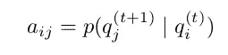

# 隐马尔可夫模型—从头开始实施

> 原文：<https://towardsdatascience.com/hidden-markov-model-implemented-from-scratch-72865bda430e?source=collection_archive---------0----------------------->


酷暑中的短暂停顿。葡萄牙， [2019](https://private.zerowithdot.com/travelling/) 。

我想把这项工作扩展成一系列教程视频。如果你感兴趣，请**订阅**我的[简讯](https://landing.mailerlite.com/webforms/landing/j5y2q1)保持联系。

# 介绍

互联网上充满了很好地解释隐马尔可夫模型(HMM)背后理论的好文章(例如 [1](https://medium.com/@jonathan_hui/machine-learning-hidden-markov-model-hmm-31660d217a61) 、 [2](/probability-learning-vi-hidden-markov-models-fab5c1f0a31d) 、 [3](https://medium.com/@Ayra_Lux/hidden-markov-models-part-1-the-likelihood-problem-8dd1066a784e) 和 [4](https://medium.com/@Ayra_Lux/hidden-markov-models-part-2-the-decoding-problem-c628ba474e69) )。然而，许多这些作品包含了相当数量的相当先进的数学方程。如果想要解释理论，方程是必要的，我们决定将它带到下一个层次，创建一个**温和的一步一步的实际实现**来补充其他人的良好工作。

在这个简短的系列文章*的两篇文章*中，我们将专注于将所有复杂的数学转换成代码。我们的起点是马克·斯坦普写的[文件](https://www.cs.sjsu.edu/~stamp/RUA/HMM.pdf)。我们将使用这篇文章来定义我们的代码(本文)，然后使用一个有点特殊的例子“[晨昏](/hidden-markov-model-a-story-of-the-morning-insanity-718b34318120)”来展示它在实践中的表现。

## 注释

在我们开始之前，让我们回顾一下我们将使用的符号。顺便说一句，如果有些内容你不清楚，也不要担心。我们会握住你的手。

*   *T* -观察序列的长度。
*   *N*——潜在(隐藏)状态的数量。
*   *M*——可观察到的数量。
*   *问* = {q₀，q₁，…} -潜州。
*   *V =* {0，1，…，M — 1} -一组可能的观察值。
*   **一个** -状态转移矩阵。
*   **B** -排放概率矩阵。
*   π-初始状态概率分布。
*   *O* -观察顺序。
*   *X =* (x₀，x₁，…)，x_t ∈ Q -隐态序列。

定义了该集合后，我们可以使用矩阵计算任何状态和观察值的概率:

*   **A** = {a_ij} —开始一个转换矩阵。
*   **B** = {b_j(k)} —为发射矩阵。

与跃迁和观察(发射)相关的概率为:



因此，模型被定义为一个集合:


# 基本定义

因为 HMM 是基于概率向量和矩阵的，所以让我们首先定义表示基本概念的对象。为了有用，对象必须反映某些属性。例如，概率向量的所有元素必须是数字 *0* ≤ x ≤ 1，并且它们的总和必须为 1。因此，让我们设计对象的方式，它们将固有地保护数学属性。

```
import numpy as np
import pandas as pd

class ProbabilityVector:
    def __init__(self, probabilities: dict):
        states = probabilities.keys()
        probs  = probabilities.values()

        assert len(states) == len(probs), 
            "The probabilities must match the states."
        assert len(states) == len(set(states)), 
            "The states must be unique."
        assert abs(sum(probs) - 1.0) < 1e-12, 
            "Probabilities must sum up to 1."
        assert len(list(filter(lambda x: 0 <= x <= 1, probs))) == len(probs), \
            "Probabilities must be numbers from [0, 1] interval."

        self.states = sorted(probabilities)
        self.values = np.array(list(map(lambda x: 
            probabilities[x], self.states))).reshape(1, -1)

    @classmethod
    def initialize(cls, states: list):
        size = len(states)
        rand = np.random.rand(size) / (size**2) + 1 / size
        rand /= rand.sum(axis=0)
        return cls(dict(zip(states, rand)))

    @classmethod
    def from_numpy(cls, array: np.ndarray, state: list):
        return cls(dict(zip(states, list(array))))

    @property
    def dict(self):
        return {k:v for k, v in zip(self.states, list(self.values.flatten()))}

    @property
    def df(self):
        return pd.DataFrame(self.values, columns=self.states, index=['probability'])

    def __repr__(self):
        return "P({}) = {}.".format(self.states, self.values)

    def __eq__(self, other):
        if not isinstance(other, ProbabilityVector):
            raise NotImplementedError
        if (self.states == other.states) and (self.values == other.values).all():
            return True
        return False

    def __getitem__(self, state: str) -> float:
        if state not in self.states:
            raise ValueError("Requesting unknown probability state from vector.")
        index = self.states.index(state)
        return float(self.values[0, index])

    def __mul__(self, other) -> np.ndarray:
        if isinstance(other, ProbabilityVector):
            return self.values * other.values
        elif isinstance(other, (int, float)):
            return self.values * other
        else:
            NotImplementedError

    def __rmul__(self, other) -> np.ndarray:
        return self.__mul__(other)

    def __matmul__(self, other) -> np.ndarray:
        if isinstance(other, ProbabilityMatrix):
            return self.values @ other.values

    def __truediv__(self, number) -> np.ndarray:
        if not isinstance(number, (int, float)):
            raise NotImplementedError
        x = self.values
        return x / number if number != 0 else x / (number + 1e-12)

    def argmax(self):
        index = self.values.argmax()
        return self.states[index]
```

初始化这个对象最自然的方法是使用一个*字典*，因为它将值与唯一的键相关联。不幸的是，字典不提供任何断言机制来约束值。因此，我们构建自定义的 *ProbabilityVector* 对象来确保我们的值行为正确。最重要的是，我们实施以下措施:

*   值的数量必须等于键的数量(我们各州的名称)。虽然这在从字典初始化对象时不是问题，但我们稍后将使用其他方法。
*   所有州的名称必须是唯一的(同样的参数也适用)。
*   概率总和必须为 1(达到一定的容差)。
*   所有概率必须是 0 ≤ p ≤ 1。

确保了这一点，我们还提供了两种可选的方法来实例化`ProbabilityVector`对象(用`@classmethod`修饰)。

1.  我们随机实例化对象——这在训练时会很有用。
2.  我们使用现成的 numpy 数组并在其中使用值，并且只提供状态的名称。

为了方便和调试，我们提供了另外两种请求值的方法。用修饰，它们将 PV 对象的内容作为字典或熊猫数据帧返回。

PV 对象需要满足以下数学运算(为了构建 HMM):

1.  比较(`__eq__`)——要知道任何两个 PV 是否相等，
2.  两个 PV 的逐元素乘法或标量乘法(`__mul__`和`__rmul__`)。
3.  点积(`__matmul__` ) -执行向量矩阵乘法
4.  按数字划分(`__truediv__`)，
5.  `argmax`找出哪个州的概率最高。
6.  `__getitem__`通过按键选择数值。

注意，当一个 PV 乘以一个标量时，返回的结构是一个 numpy 数组，而不是另一个 PV。这是因为乘以 1 以外的任何值都会破坏 PV 本身的完整性。

在内部，这些值存储为大小为(1 × N)的 numpy 数组。


## 例子

```
a1 = ProbabilityVector({'rain': 0.7, 'sun': 0.3})
a2 = ProbabilityVector({'sun': 0.1, 'rain': 0.9})
print(a1.df)
print(a2.df)

print("Comparison:", a1 == a2)
print("Element-wise multiplication:", a1 * a2)
print("Argmax:", a1.argmax())
print("Getitem:", a1['rain'])

# OUTPUT
>>>              rain  sun
    probability   0.7  0.3
                 rain  sun
    probability   0.9  0.1

>>> Comparison: False
>>> Element-wise multiplication: [[0.63 0.03]]
>>> Argmax: rain
>>> Getitem: 0.7
```

## 随机阵

另一个对象是一个`Probability Matrix`，它是 HMM 定义的核心部分。形式上， **A** 和 **B** 矩阵必须是*行随机的*，这意味着每一行的值总和必须为 1。因此，我们可以通过堆叠几个 PV 来定义我们的 PM，我们以保证这种约束的方式构建了这些 PV。

```
class ProbabilityMatrix:
    def __init__(self, prob_vec_dict: dict):

        assert len(prob_vec_dict) > 1, \
            "The numebr of input probability vector must be greater than one."
        assert len(set([str(x.states) for x in prob_vec_dict.values()])) == 1, \
            "All internal states of all the vectors must be indentical."
        assert len(prob_vec_dict.keys()) == len(set(prob_vec_dict.keys())), \
            "All observables must be unique."

        self.states      = sorted(prob_vec_dict)
        self.observables = prob_vec_dict[self.states[0]].states
        self.values      = np.stack([prob_vec_dict[x].values \
                           for x in self.states]).squeeze() 

    @classmethod
    def initialize(cls, states: list, observables: list):
        size = len(states)
        rand = np.random.rand(size, len(observables)) \
             / (size**2) + 1 / size
        rand /= rand.sum(axis=1).reshape(-1, 1)
        aggr = [dict(zip(observables, rand[i, :])) for i in range(len(states))]
        pvec = [ProbabilityVector(x) for x in aggr]
        return cls(dict(zip(states, pvec)))

    @classmethod
    def from_numpy(cls, array: 
                  np.ndarray, 
                  states: list, 
                  observables: list):
        p_vecs = [ProbabilityVector(dict(zip(observables, x))) \
                  for x in array]
        return cls(dict(zip(states, p_vecs)))

    @property
    def dict(self):
        return self.df.to_dict()

    @property
    def df(self):
        return pd.DataFrame(self.values, 
               columns=self.observables, index=self.states)

    def __repr__(self):
        return "PM {} states: {} -> obs: {}.".format(
            self.values.shape, self.states, self.observables)

    def __getitem__(self, observable: str) -> np.ndarray:
        if observable not in self.observables:
            raise ValueError("Requesting unknown probability observable from the matrix.")
        index = self.observables.index(observable)
        return self.values[:, index].reshape(-1, 1)
```

在这里，我们实例化 PM 的方法是向类的构造函数提供一个 PV 的字典。通过这样做，我们不仅确保 PM 的每一行都是随机的，而且还提供了每个**可观察**的名称。

因此，我们的 PM 可以给出任何可观测值的系数数组。数学上，PM 是一个矩阵:


其他方法的实现方式与 PV 类似。

## 例子

```
a1 = ProbabilityVector({'rain': 0.7, 'sun': 0.3})
a2 = ProbabilityVector({'rain': 0.6, 'sun': 0.4})
A  = ProbabilityMatrix({'hot': a1, 'cold': a2})

print(A)
print(A.df)
>>> PM (2, 2) states: ['cold', 'hot'] -> obs: ['rain', 'sun'].
>>>      rain  sun
   cold   0.6  0.4
   hot    0.7  0.3

b1 = ProbabilityVector({'0S': 0.1, '1M': 0.4, '2L': 0.5})
b2 = ProbabilityVector({'0S': 0.7, '1M': 0.2, '2L': 0.1})
B =  ProbabilityMatrix({'0H': b1, '1C': b2})

print(B)
print(B.df)
>>> PM (2, 3) states: ['0H', '1C'] -> obs: ['0S', '1M', '2L'].
>>>       0S   1M   2L
     0H  0.1  0.4  0.5
     1C  0.7  0.2  0.1

P = ProbabilityMatrix.initialize(list('abcd'), list('xyz'))
print('Dot product:', a1 @ A)
print('Initialization:', P)
print(P.df)
>>> Dot product: [[0.63 0.37]]
>>> Initialization: PM (4, 3) 
    states: ['a', 'b', 'c', 'd'] -> obs: ['x', 'y', 'z'].
>>>          x         y         z
   a  0.323803  0.327106  0.349091
   b  0.318166  0.326356  0.355478
   c  0.311833  0.347983  0.340185
   d  0.337223  0.316850  0.345927
```

# 实现隐马尔可夫链

在我们继续计算分数之前，让我们使用 PV 和 PM 定义来实现隐马尔可夫链。

同样，我们将这样做作为一个类，称之为`HiddenMarkovChain`。它将在 **A** 、 **B** 和π处进行分页。稍后，我们将实现更多适用于这个类的方法。

## 计算分数

计算分数意味着在给定我们的(已知)模型λ = ( **A** ， **B** ，π)的情况下，找出特定观察链 *O* 的概率是多少。换句话说，我们对寻找 p(O|λ) 感兴趣。

通过*边缘化*隐藏变量 *X* 的所有可能链，我们可以找到 *p(O|λ)* ，其中 *X = {* x₀， *…}* :


由于 *p(O|X，λ) = ∏ b(O)* (与可观测值相关的所有概率的乘积)和 *p(X|λ)=π ∏ a* (从在 *t* 的 *x* 到在 *t + 1* 的 *x* 跃迁的所有概率的乘积)，我们要寻找的概率(**分数【T45**


这是一种简单的计算分数的方法，因为我们需要计算每个可能的链 *X* 的概率。不管怎样，让我们用 python 来实现它:

```
from itertools import product
from functools import reduce

class HiddenMarkovChain:
    def __init__(self, T, E, pi):
        self.T = T  # transmission matrix A
        self.E = E  # emission matrix B
        self.pi = pi
        self.states = pi.states
        self.observables = E.observables

    def __repr__(self):
        return "HML states: {} -> observables: {}.".format(
            len(self.states), len(self.observables))

    @classmethod
    def initialize(cls, states: list, observables: list):
        T = ProbabilityMatrix.initialize(states, states)
        E = ProbabilityMatrix.initialize(states, observables)
        pi = ProbabilityVector.initialize(states)
        return cls(T, E, pi)

    def _create_all_chains(self, chain_length):
        return list(product(*(self.states,) * chain_length))

    def score(self, observations: list) -> float:
        def mul(x, y): return x * y

        score = 0
        all_chains = self._create_all_chains(len(observations))
        for idx, chain in enumerate(all_chains):
            expanded_chain = list(zip(chain, [self.T.states[0]] + list(chain)))
            expanded_obser = list(zip(observations, chain))

            p_observations = list(map(lambda x: self.E.df.loc[x[1], x[0]], expanded_obser))
            p_hidden_state = list(map(lambda x: self.T.df.loc[x[1], x[0]], expanded_chain))
            p_hidden_state[0] = self.pi[chain[0]]

            score += reduce(mul, p_observations) * reduce(mul, p_hidden_state)
        return score
```

## 例子

```
a1 = ProbabilityVector({'1H': 0.7, '2C': 0.3})
a2 = ProbabilityVector({'1H': 0.4, '2C': 0.6})

b1 = ProbabilityVector({'1S': 0.1, '2M': 0.4, '3L': 0.5})
b2 = ProbabilityVector({'1S': 0.7, '2M': 0.2, '3L': 0.1})

A = ProbabilityMatrix({'1H': a1, '2C': a2})
B = ProbabilityMatrix({'1H': b1, '2C': b2})
pi = ProbabilityVector({'1H': 0.6, '2C': 0.4})

hmc = HiddenMarkovChain(A, B, pi)
observations = ['1S', '2M', '3L', '2M', '1S']

print("Score for {} is {:f}.".format(observations, hmc.score(observations)))
>>> Score for ['1S', '2M', '3L', '2M', '1S'] is 0.003482.
```

如果我们的实现是正确的，那么对于一个给定的模型，所有可能的观察链的所有分值应该加起来是 1。即:


```
all_possible_observations = {'1S', '2M', '3L'}
chain_length = 3  # any int > 0
all_observation_chains = list(product(*(all_possible_observations,) * chain_length))
all_possible_scores = list(map(lambda obs: hmc.score(obs), all_observation_chains))
print("All possible scores added: {}.".format(sum(all_possible_scores)))
>>> All possible scores added: 1.0.
```

确实如此。

# 向前传球得分

用我们上面的方法计算分数有点天真。为了找到特定观察链*或*的数字，我们必须计算所有可能的潜在变量序列 *X* 的分数。这需要 2TN^T 乘法，即使是小数字也需要时间。

另一种方法是计算到时间 t 为止的序列的*部分观测值。*

For 和 *i ∈ {0，1，…，N-1}* 和 *t ∈ {0，1，…，T-1}* :


因此，


和


然后


注意 *α_t* 是一个长度为 *N* 的向量。乘积之和 *α a* 实际上可以写成点积。因此:


其中星号表示元素间的乘法。

通过这种实现，我们将乘法次数减少到 N T，并且可以利用向量化。

```
class HiddenMarkovChain_FP(HiddenMarkovChain):
    def _alphas(self, observations: list) -> np.ndarray:
        alphas = np.zeros((len(observations), len(self.states)))
        alphas[0, :] = self.pi.values * self.E[observations[0]].T
        for t in range(1, len(observations)):
            alphas[t, :] = (alphas[t - 1, :].reshape(1, -1) 
                         @ self.T.values) * self.E[observations[t]].T
        return alphas

    def score(self, observations: list) -> float:
        alphas = self._alphas(observations)
        return float(alphas[-1].sum())
```

## 例子

```
hmc_fp = HiddenMarkovChain_FP(A, B, pi)

observations = ['1S', '2M', '3L', '2M', '1S']
print("Score for {} is {:f}.".format(observations, hmc_fp.score(observations)))
>>> All possible scores added: 1.0.
```

…是的。

# 模拟和收敛

我们再测试一个东西。基本上，我们就拿我们的*λ=(****A****，* ***B*** *，【π】*来说，用它来生成一个随机可观测量的序列，从某个初始状态概率 *π* 开始。

如果期望的长度 *T* 足够大，我们将期望系统收敛到一个序列上，该序列平均起来给出与我们直接从 **A** 和 **B** 矩阵中期望的相同数量的事件。换句话说，对于每一步，跃迁矩阵和发射矩阵以一定的概率分别“决定”下一个状态是什么，以及我们将得到什么样的观察结果。因此，最初看起来像随机事件的东西，平均起来应该反映矩阵本身的系数。让我们也检查一下。

```
class HiddenMarkovChain_Simulation(HiddenMarkovChain):
    def run(self, length: int) -> (list, list):
        assert length >= 0, "The chain needs to be a non-negative number."
        s_history = [0] * (length + 1)
        o_history = [0] * (length + 1)

        prb = self.pi.values
        obs = prb @ self.E.values
        s_history[0] = np.random.choice(self.states, p=prb.flatten())
        o_history[0] = np.random.choice(self.observables, p=obs.flatten())

        for t in range(1, length + 1):
            prb = prb @ self.T.values
            obs = prb @ self.E.values
            s_history[t] = np.random.choice(self.states, p=prb.flatten())
            o_history[t] = np.random.choice(self.observables, p=obs.flatten())

        return o_history, s_history
```

## 例子

```
hmc_s = HiddenMarkovChain_Simulation(A, B, pi)
observation_hist, states_hist = hmc_s.run(100)  # length = 100
stats = pd.DataFrame({
    'observations': observation_hist,
    'states': states_hist}).applymap(lambda x: int(x[0])).plot()
```


图一。马尔可夫过程的一个例子。显示了状态和可观察序列。

# 潜在状态

状态矩阵 **A** 由以下系数给出:


因此，在 *t* +1 时处于状态“1H”的概率等于:


如果我们假设*在*之前处于某个状态 at 的概率是完全随机的，那么 *p(1H) = 1* 和 p(2C) = 0.9，在重正化之后分别给出 0.55 和 0.45。

如果我们计算每个状态出现的次数，并除以序列中元素的数量，随着序列长度的增长，我们会越来越接近这些数字。

## 例子

```
hmc_s = HiddenMarkovChain_Simulation(A, B, pi)

stats = {}
for length in np.logspace(1, 5, 40).astype(int):
    observation_hist, states_hist = hmc_s.run(length)
    stats[length] = pd.DataFrame({
        'observations': observation_hist,
        'states': states_hist}).applymap(lambda x: int(x[0]))

S = np.array(list(map(lambda x: 
        x['states'].value_counts().to_numpy() / len(x), stats.values())))

plt.semilogx(np.logspace(1, 5, 40).astype(int), S)
plt.xlabel('Chain length T')
plt.ylabel('Probability')
plt.title('Converging probabilities.')
plt.legend(['1H', '2C'])
plt.show()
```


图二。概率相对于链长的收敛性。

让我们的`HiddenMarkovChain`类更上一层楼，补充更多的方法。这些方法将帮助我们发现观察序列背后最可能的隐藏变量序列。

# 扩展类

我们已经把α定义为到目前为止部分观察到序列的概率。


现在，我们来定义“相反”的概率。即观察到从 *T - 1* 到 *t* 序列的概率。

对于 *t= 0，1，…，T-1* 和 *i=0，1，…，N-1* ，我们定义:


c ` 1 如前，我们可以 *β(i)* 递归计算:


然后对于 *t ≠ T-1* :


其矢量化形式为:


最后，我们还定义了一个新的量 *γ* 来表示在时间 *t* 的状态 *q_i* ，对于该状态，概率(向前和向后计算)是最大的:


因此，对于任何步骤 *t = 0，1，…，T-1* ，最大似然的状态可以使用下式找到:


```
class HiddenMarkovChain_Uncover(HiddenMarkovChain_Simulation):
    def _alphas(self, observations: list) -> np.ndarray:
        alphas = np.zeros((len(observations), len(self.states)))
        alphas[0, :] = self.pi.values * self.E[observations[0]].T
        for t in range(1, len(observations)):
            alphas[t, :] = (alphas[t - 1, :].reshape(1, -1) @ self.T.values) \
                         * self.E[observations[t]].T
        return alphas

    def _betas(self, observations: list) -> np.ndarray:
        betas = np.zeros((len(observations), len(self.states)))
        betas[-1, :] = 1
        for t in range(len(observations) - 2, -1, -1):
            betas[t, :] = (self.T.values @ (self.E[observations[t + 1]] \
                        * betas[t + 1, :].reshape(-1, 1))).reshape(1, -1)
        return betas

    def uncover(self, observations: list) -> list:
        alphas = self._alphas(observations)
        betas = self._betas(observations)
        maxargs = (alphas * betas).argmax(axis=1)
        return list(map(lambda x: self.states[x], maxargs))
```

# 确认

为了验证，让我们生成一些可观察的序列*或*。为此，我们可以使用我们模型的`.run`方法。然后，我们将使用`.uncover`方法找到最有可能的潜在变量序列。

## 例子

```
np.random.seed(42)

a1 = ProbabilityVector({'1H': 0.7, '2C': 0.3})
a2 = ProbabilityVector({'1H': 0.4, '2C': 0.6})
b1 = ProbabilityVector({'1S': 0.1, '2M': 0.4, '3L': 0.5}) 
b2 = ProbabilityVector({'1S': 0.7, '2M': 0.2, '3L': 0.1})
A  = ProbabilityMatrix({'1H': a1, '2C': a2})
B  = ProbabilityMatrix({'1H': b1, '2C': b2})
pi = ProbabilityVector({'1H': 0.6, '2C': 0.4})

hmc = HiddenMarkovChain_Uncover(A, B, pi)

observed_sequence, latent_sequence = hmc.run(5)
uncovered_sequence = hmc.uncover(observed_sequence)|                    | 0   | 1   | 2   | 3   | 4   | 5   |
|:------------------:|:----|:----|:----|:----|:----|:----|
| observed sequence  | 3L  | 3M  | 1S  | 3L  | 3L  | 3L  |
| latent sequence    | 1H  | 2C  | 1H  | 1H  | 2C  | 1H  |
| uncovered sequence | 1H  | 1H  | 2C  | 1H  | 1H  | 1H  |
```

正如我们所看到的，最有可能的潜在状态链(根据算法)与实际引起观察的潜在状态链并不相同。这是可以预料的。毕竟每个观察序列只能以一定的概率显现，依赖于潜序列。

下面的代码评估了产生我们的观察序列的不同潜在序列的可能性。

```
all_possible_states = {'1H', '2C'}
chain_length = 6  # any int > 0
all_states_chains = list(product(*(all_possible_states,) * chain_length))

df = pd.DataFrame(all_states_chains)
dfp = pd.DataFrame()

for i in range(chain_length):
    dfp['p' + str(i)] = df.apply(lambda x: 
        hmc.E.df.loc[x[i], observed_sequence[i]], axis=1)

scores = dfp.sum(axis=1).sort_values(ascending=False)
df = df.iloc[scores.index]
df['score'] = scores
df.head(10).reset_index()|    index | 0   | 1   | 2   | 3   | 4   | 5   |   score |
|:--------:|:----|:----|:----|:----|:----|:----|--------:|
|        8 | 1H  | 1H  | 2C  | 1H  | 1H  | 1H  |     3.1 |
|       24 | 1H  | 2C  | 2C  | 1H  | 1H  | 1H  |     2.9 |
|       40 | 2C  | 1H  | 2C  | 1H  | 1H  | 1H  |     2.7 |
|       12 | 1H  | 1H  | 2C  | 2C  | 1H  | 1H  |     2.7 |
|       10 | 1H  | 1H  | 2C  | 1H  | 2C  | 1H  |     2.7 |
|        9 | 1H  | 1H  | 2C  | 1H  | 1H  | 2C  |     2.7 |
|       25 | 1H  | 2C  | 2C  | 1H  | 1H  | 2C  |     2.5 |
|        0 | 1H  | 1H  | 1H  | 1H  | 1H  | 1H  |     2.5 |
|       26 | 1H  | 2C  | 2C  | 1H  | 2C  | 1H  |     2.5 |
|       28 | 1H  | 2C  | 2C  | 2C  | 1H  | 1H  |     2.5 |
```

上面的结果显示了潜在序列的排序表，给出了观察序列。实际的潜在序列(引起观察的序列)位于第 35 位(我们从零开始计算索引)。

```
dfc = df.copy().reset_index()
for i in range(chain_length):
    dfc = dfc[dfc[i] == latent_sequence[i]]

dfc
|   index | 0   | 1   | 2   | 3   | 4   | 5   |   score |
|:-------:|:----|:----|:----|:----|:----|:----|--------:|
|      18 | 1H  | 2C  | 1H  | 1H  | 2C  | 1H  |     1.9 |
```

# 训练模型

是时候展示训练程序了。形式上，我们感兴趣的是找到*λ=(****A****，* ***B*** *，π)* ，使得给定期望的观察序列 *O* ，我们的模型λ将给出最佳拟合。

# 扩展类

这里，我们的起点是我们之前定义的`HiddenMarkovModel_Uncover`。我们将增加新的方法来训练它。

知道了我们的潜在状态 *Q* 和可能的观察状态 *O* ，我们就自动知道了矩阵 **A** 和 **B** 的大小，由此得到 *N* 和 *M* 。但是，我们需要确定 *a* 和 *b* 和 *π* 。

对于 *t = 0，1，…，T-2* 和 *i，j =0，1，…，N -1* ，我们定义“双γ”:


*γ(i，j)* 是 *q* 在 *t* 到 *t* + 1 的转移概率。用 *α、*β、 **A、**、 **B、**来写，我们有:


现在，从实现的角度考虑，我们希望避免同时循环遍历 *i、j* 和 *t* ，因为这会非常慢。幸运的是，我们可以对等式进行矢量化:


有了 *γ(i，j)* 的等式，我们可以计算


要找到*λ=(****)A****，* ***B*** *，【π】*，我们做

对于 *i = 0，1，…，N-1* :


或者


对于 *i，j = 0，1，…，N-1:*


对于 *j = 0，1，…，N-1* 和 *k = 0，1，…，M-1:*


```
class HiddenMarkovLayer(HiddenMarkovChain_Uncover):
    def _digammas(self, observations: list) -> np.ndarray:
        L, N = len(observations), len(self.states)
        digammas = np.zeros((L - 1, N, N))

        alphas = self._alphas(observations)
        betas = self._betas(observations)
        score = self.score(observations)
        for t in range(L - 1):
            P1 = (alphas[t, :].reshape(-1, 1) * self.T.values)
            P2 = self.E[observations[t + 1]].T * betas[t + 1].reshape(1, -1)
            digammas[t, :, :] = P1 * P2 / score
        return digammas
```

有了补充了`._difammas`方法的“层”,我们应该能够执行所有必要的计算。然而，将该层的“管理”委托给另一个类是有意义的。事实上，模型训练可以概括如下:

1.  初始化 **A** 、 **B** 和π。
2.  计算 *γ(i，j)* 。
3.  更新模型的 **A** 、 **B** 和π。
4.  我们重复 2。第三。直到分数 *p* (O|λ)不再增加。

```
class HiddenMarkovModel:
    def __init__(self, hml: HiddenMarkovLayer):
        self.layer = hml
        self._score_init = 0
        self.score_history = []

    @classmethod
    def initialize(cls, states: list, observables: list):
        layer = HiddenMarkovLayer.initialize(states, observables)
        return cls(layer)

    def update(self, observations: list) -> float:
        alpha = self.layer._alphas(observations)
        beta = self.layer._betas(observations)
        digamma = self.layer._digammas(observations)
        score = alpha[-1].sum()
        gamma = alpha * beta / score 

        L = len(alpha)
        obs_idx = [self.layer.observables.index(x) \
                  for x in observations]
        capture = np.zeros((L, len(self.layer.states), len(self.layer.observables)))
        for t in range(L):
            capture[t, :, obs_idx[t]] = 1.0

        pi = gamma[0]
        T = digamma.sum(axis=0) / gamma[:-1].sum(axis=0).reshape(-1, 1)
        E = (capture * gamma[:, :, np.newaxis]).sum(axis=0) / gamma.sum(axis=0).reshape(-1, 1)

        self.layer.pi = ProbabilityVector.from_numpy(pi, self.layer.states)
        self.layer.T = ProbabilityMatrix.from_numpy(T, self.layer.states, self.layer.states)
        self.layer.E = ProbabilityMatrix.from_numpy(E, self.layer.states, self.layer.observables)

        return score

    def train(self, observations: list, epochs: int, tol=None):
        self._score_init = 0
        self.score_history = (epochs + 1) * [0]
        early_stopping = isinstance(tol, (int, float))

        for epoch in range(1, epochs + 1):
            score = self.update(observations)
            print("Training... epoch = {} out of {}, score = {}.".format(epoch, epochs, score))
            if early_stopping and abs(self._score_init - score) / score < tol:
                print("Early stopping.")
                break
            self._score_init = score
            self.score_history[epoch] = score
```

## 例子

```
np.random.seed(42)

observations = ['3L', '2M', '1S', '3L', '3L', '3L']

states = ['1H', '2C']
observables = ['1S', '2M', '3L']

hml = HiddenMarkovLayer.initialize(states, observables)
hmm = HiddenMarkovModel(hml)

hmm.train(observations, 25)
```


图 3。训练过程中的得分函数示例。

# 确认

让我们看看生成的序列。“需求”顺序是:

```
|    | 0   | 1   | 2   | 3   | 4   | 5   |
|---:|:----|:----|:----|:----|:----|:----|
|  0 | 3L  | 2M  | 1S  | 3L  | 3L  | 3L  |RUNS = 100000
T = 5

chains = RUNS * [0]
for i in range(len(chains)):
    chain = hmm.layer.run(T)[0]
    chains[i] = '-'.join(chain)
```

下表总结了基于 100000 次尝试(见上文)的模拟运行，以及出现的频率和匹配观察的数量。

底线是，如果我们真的训练了模型，我们应该会看到它产生类似我们需要的序列的强烈趋势。让我们看看它是否会发生。

```
df = pd.DataFrame(pd.Series(chains).value_counts(), columns=['counts']).reset_index().rename(columns={'index': 'chain'})
df = pd.merge(df, df['chain'].str.split('-', expand=True), left_index=True, right_index=True)

s = []
for i in range(T + 1):
    s.append(df.apply(lambda x: x[i] == observations[i], axis=1))

df['matched'] = pd.concat(s, axis=1).sum(axis=1)
df['counts'] = df['counts'] / RUNS * 100
df = df.drop(columns=['chain'])
df.head(30)
---
|---:|---------:|:----|:----|:----|:----|:----|:----|----------:|
|  0 |    8.907 | 3L  | 3L  | 3L  | 3L  | 3L  | 3L  |         4 |
|  1 |    4.422 | 3L  | 2M  | 3L  | 3L  | 3L  | 3L  |         5 |
|  2 |    4.286 | 1S  | 3L  | 3L  | 3L  | 3L  | 3L  |         3 |
|  3 |    4.284 | 3L  | 3L  | 3L  | 3L  | 3L  | 2M  |         3 |
|  4 |    4.278 | 3L  | 3L  | 3L  | 2M  | 3L  | 3L  |         3 |
|  5 |    4.227 | 3L  | 3L  | 1S  | 3L  | 3L  | 3L  |         5 |
|  6 |    4.179 | 3L  | 3L  | 3L  | 3L  | 1S  | 3L  |         3 |
|  7 |    2.179 | 3L  | 2M  | 3L  | 2M  | 3L  | 3L  |         4 |
|  8 |    2.173 | 3L  | 2M  | 3L  | 3L  | 1S  | 3L  |         4 |
|  9 |    2.165 | 1S  | 3L  | 1S  | 3L  | 3L  | 3L  |         4 |
| 10 |    2.147 | 3L  | 2M  | 3L  | 3L  | 3L  | 2M  |         4 |
| 11 |    2.136 | 3L  | 3L  | 3L  | 2M  | 3L  | 2M  |         2 |
| 12 |    2.121 | 3L  | 2M  | 1S  | 3L  | 3L  | 3L  |         6 |
| 13 |    2.111 | 1S  | 3L  | 3L  | 2M  | 3L  | 3L  |         2 |
| 14 |    2.1   | 1S  | 2M  | 3L  | 3L  | 3L  | 3L  |         4 |
| 15 |    2.075 | 3L  | 3L  | 3L  | 2M  | 1S  | 3L  |         2 |
| 16 |    2.05  | 1S  | 3L  | 3L  | 3L  | 3L  | 2M  |         2 |
| 17 |    2.04  | 3L  | 3L  | 1S  | 3L  | 3L  | 2M  |         4 |
| 18 |    2.038 | 3L  | 3L  | 1S  | 2M  | 3L  | 3L  |         4 |
| 19 |    2.022 | 3L  | 3L  | 1S  | 3L  | 1S  | 3L  |         4 |
| 20 |    2.008 | 1S  | 3L  | 3L  | 3L  | 1S  | 3L  |         2 |
| 21 |    1.955 | 3L  | 3L  | 3L  | 3L  | 1S  | 2M  |         2 |
| 22 |    1.079 | 1S  | 2M  | 3L  | 2M  | 3L  | 3L  |         3 |
| 23 |    1.077 | 1S  | 2M  | 3L  | 3L  | 3L  | 2M  |         3 |
| 24 |    1.075 | 3L  | 2M  | 1S  | 2M  | 3L  | 3L  |         5 |
| 25 |    1.064 | 1S  | 2M  | 1S  | 3L  | 3L  | 3L  |         5 |
| 26 |    1.052 | 1S  | 2M  | 3L  | 3L  | 1S  | 3L  |         3 |
| 27 |    1.048 | 3L  | 2M  | 3L  | 2M  | 1S  | 3L  |         3 |
| 28 |    1.032 | 1S  | 3L  | 1S  | 2M  | 3L  | 3L  |         3 |
| 29 |    1.024 | 1S  | 3L  | 1S  | 3L  | 1S  | 3L  |         3 |
```

这是我们不想让模型创建的序列。

```
|     |   counts | 0   | 1   | 2   | 3   | 4   | 5   |   matched |
|----:|---------:|:----|:----|:----|:----|:----|:----|----------:|
| 266 |    0.001 | 1S  | 1S  | 3L  | 3L  | 2M  | 2M  |         1 |
| 267 |    0.001 | 1S  | 2M  | 2M  | 3L  | 2M  | 2M  |         2 |
| 268 |    0.001 | 3L  | 1S  | 1S  | 3L  | 1S  | 1S  |         3 |
| 269 |    0.001 | 3L  | 3L  | 3L  | 1S  | 2M  | 2M  |         1 |
| 270 |    0.001 | 3L  | 1S  | 3L  | 1S  | 1S  | 3L  |         2 |
| 271 |    0.001 | 1S  | 3L  | 2M  | 1S  | 1S  | 3L  |         1 |
| 272 |    0.001 | 3L  | 2M  | 2M  | 3L  | 3L  | 1S  |         4 |
| 273 |    0.001 | 1S  | 3L  | 3L  | 1S  | 1S  | 1S  |         0 |
| 274 |    0.001 | 3L  | 1S  | 2M  | 2M  | 1S  | 2M  |         1 |
| 275 |    0.001 | 3L  | 3L  | 2M  | 1S  | 3L  | 2M  |         2 |
```

正如我们所看到的，我们的模型倾向于生成与我们需要的序列相似的序列，尽管精确的序列(与 6/6 匹配的序列)已经位于第 10 位！另一方面，根据该表，前 10 个序列仍然与我们请求的序列有些相似。

为了最终验证我们的模型的质量，让我们将结果与*出现频率*一起绘制出来，并将其与新初始化的模型进行比较，该模型应该给我们完全随机的序列——只是为了进行比较。

```
hml_rand = HiddenMarkovLayer.initialize(states, observables)
hmm_rand = HiddenMarkovModel(hml_rand)

RUNS = 100000
T = 5

chains_rand = RUNS * [0]
for i in range(len(chains_rand)):
    chain_rand = hmm_rand.layer.run(T)[0]
    chains_rand[i] = '-'.join(chain_rand)

df2 = pd.DataFrame(pd.Series(chains_rand).value_counts(), columns=['counts']).reset_index().rename(columns={'index': 'chain'})
df2 = pd.merge(df2, df2['chain'].str.split('-', expand=True), left_index=True, right_index=True)

s = []
for i in range(T + 1):
    s.append(df2.apply(lambda x: x[i] == observations[i], axis=1))

df2['matched'] = pd.concat(s, axis=1).sum(axis=1)
df2['counts'] = df2['counts'] / RUNS * 100
df2 = df2.drop(columns=['chain'])

fig, ax = plt.subplots(1, 1, figsize=(14, 6))

ax.plot(df['matched'], 'g:')
ax.plot(df2['matched'], 'k:')

ax.set_xlabel('Ordered index')
ax.set_ylabel('Matching observations')
ax.set_title('Verification on a 6-observation chain.')

ax2 = ax.twinx()
ax2.plot(df['counts'], 'r', lw=3)
ax2.plot(df2['counts'], 'k', lw=3)
ax2.set_ylabel('Frequency of occurrence [%]')

ax.legend(['trained', 'initialized'])
ax2.legend(['trained', 'initialized'])

plt.grid()
plt.show()
```


图 4。模型训练后的结果。虚线代表匹配的序列。线条代表特定序列的出现频率:已训练的模型(红色)和刚初始化的模型(黑色)。初始化导致序列的几乎完美的均匀分布，而训练的模型对可观察的序列给出强烈的偏好。

看来我们已经成功实施了训练程序。如果我们观察这些曲线，那么*初始化的仅*模型以几乎相等的概率生成观察序列。完全是随机的。然而，经过训练的模型给出的序列与我们期望的序列高度相似，而且频率要高得多。尽管真正的序列仅在总运行的 2%中被创建，但是其他相似的序列被生成的频率大致相同。

# 结论

在本文中，我们提出了一个逐步实现的隐马尔可夫模型。我们通过采用第一原则方法创建了代码。更具体地说，我们已经展示了通过方程表达的概率概念是如何作为对象和方法实现的。最后，我们通过发现分数、揭示潜在变量链和应用训练程序来演示模型的使用。

PS。我为这里糟糕的方程式表达道歉。基本上，我需要全部手动完成。然而，请随意阅读我的博客上的这篇文章。在那里，我处理了它；)

# 还会有更多…

我计划把文章带到下一个层次，并提供简短的视频教程。

如果您想了解关于视频和未来文章的更新，**订阅我的** [**简讯**](https://landing.mailerlite.com/webforms/landing/j5y2q1) **。你也可以通过填写[表格](https://forms.gle/bNpf9aqZJGLgaU589)让我知道你的期望。回头见！**