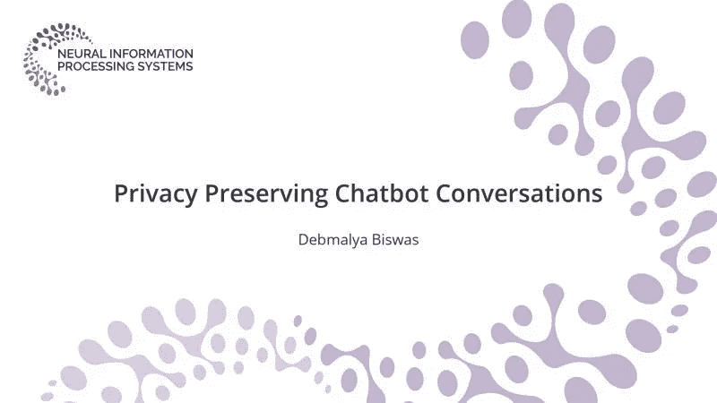
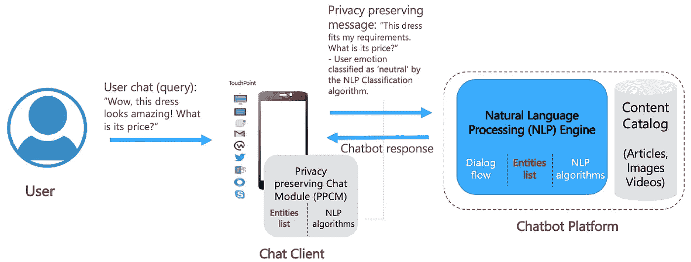
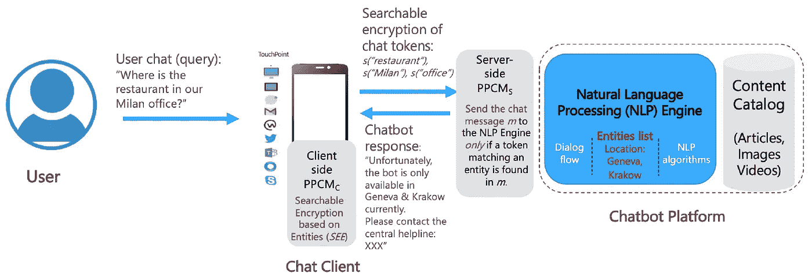

# 聊天机器人对话的隐私风险

> 原文：<https://towardsdatascience.com/hidden-privacy-risks-of-chatbot-conversations-881dbeeb98a?source=collection_archive---------30----------------------->

## 基于实体过滤和可搜索加密的隐私保护自然语言处理

**摘要** *。聊天机器人越来越受欢迎，在不同的垂直领域得到越来越多的采用，例如健康、银行、约会；用户与聊天机器人分享越来越多的私人信息——研究已经开始强调聊天机器人的隐私风险。在这篇文章中，我们提出了两种聊天机器人会话的隐私保护方法。第一种方法应用基于“实体”的隐私过滤和转换，并且可以直接应用于应用(客户端)端。然而，它需要了解聊天机器人的设计才能启用。我们提出了第二个基于可搜索加密的方案，它能够保护用户聊天隐私，而不需要任何聊天机器人设计的知识。最后，我们基于一个真实的员工帮助台聊天机器人给出了一些实验结果，验证了所提出方法的必要性和可行性。*

该论文在 2020 年第 34 届 **NeurIPS** 隐私保护机器学习联合研讨会([PPML-普里姆](https://ppml-workshop.github.io/))上发表。( [pdf](https://ppml-workshop.github.io/ppml20/pdfs/Biswas.pdf) ) ( [SlidesLive 视频录制](https://slideslive.com/38940945/privacy-preserving-chatbot-conversations))。

# 一.导言

聊天机器人被吹捧为“下一个交互层”，这意味着我们目前通过与网站/应用程序交互来消费信息的方式在许多情况下将被聊天机器人(对话)取代。最近的一份 Forrester 报告[1]对聊天机器人的最新发展水平总结如下:

“尽管消费者对聊天机器人有着复杂的感觉和强烈的反对，但企业理解聊天机器人的价值，并继续将其作为客户支持的主要参与渠道。新冠肺炎疫情的影响增强了组织使用聊天机器人改善服务和参与以及缓解危机局势的决心。在过去的两年中，聊天机器人技术供应商也迅速将对话计算应用于跨领域和垂直领域的客户服务。”

聊天机器人的研究主要集中在提高底层自然语言处理(NLP)的精度[2]，[3]，这样聊天机器人在理解和响应用户查询方面更加精通。

> 聊天机器人越来越受欢迎，在不同的垂直领域得到越来越多的应用，例如健康、银行、约会等。，用户用聊天机器人分享越来越多的隐私信息；研究已经开始强调聊天机器人的隐私风险。

然而，提议的方法仅限于明确共享的个人身份信息(PII)，例如信用卡号码、银行账户详情、健康状况、约会偏好；以及局限于传统软件安全技术的解决方案，例如存储加密和多因素认证。虽然安全基础知识是绝对需要的，但是文献中还没有解决用户提出的开放式查询的更高级和隐含的隐私风险。

例如，让我们考虑下面的两个用例来理解这种隐私风险的重要性:

***用例 1。*** 情绪分析的隐私风险:情绪分析基本上是一个 NLP 分类任务，它允许聊天机器人根据用户的聊天响应(例如，在帮助台机器人中使用的)来确定用户的(当前)情绪，以便机器人能够根据用户的情绪来调整其响应。

虽然这样做是出于“好的”原因，但现在让我们考虑它们在电子商务场景中的使用。通过动态定价，机器人可以根据用户非常“热情”的查询报出更高的价格。

> 比如“哇，这件衣服真好看！它的价格是多少？”可能会导致比更中性的查询更高的报价:“这件衣服符合我的要求。它的价格是多少？”

***用例 2。*** 开放式查询(基于位置):让我们考虑开放式查询相对于用户位置所带来的隐私风险。大多数聊天机器人通常是为特定地区设计/部署的。例如，人力资源信息机器人可能是为公司有办事处的地方设计的，类似地，电子商务机器人也将只部署在供应商目前运送其产品的那些国家。鉴于此，诸如“嗨，我现在在日内瓦。到日内瓦的运费是多少？”鉴于供应商不在瑞士交货，不必要地泄露了用户的位置。

> 在组织方面，一个人力资源聊天机器人由外包供应商维护(在云平台上)，部署在日内瓦和克拉科夫；员工经常会问:“我们米兰办公室的餐厅在哪里？”可能会向供应商透露公司员工最近经常出差到米兰办公室。

传统的安全机制，例如限制对聊天机器人日志的访问(通过加密、访问控制策略等。)是不充分的；因为需要分析日志来持续改进机器人[7]。

为了解决聊天机器人对话带来的上述隐私风险，

> 我们在本文中提出了两种隐私保护方法:基于“实体”的(I)可应用于客户端/应用程序端的隐私过滤和转换(第 II-B 节)，以及(II)可独立于聊天机器人设计应用的可搜索加密(第 II-D 节)。

实施/验证结果见第二-C 节，第三节总结了本文件，并为今后的工作提供了一些方向。

# 二。隐私保护聊天

## A.聊天机器人基础知识

我们首先提供一些当前聊天机器人如何工作的背景。在理想的情况下，给定一个自然语言的用户查询，机器人会做出如下响应:

1.  理解用户意图；
2.  从知识库中检索相关内容；
3.  合成答案并回复用户(同样，用自然语言)；
4.  保留对话内容，以回答用户的任何后续问题。

不幸的是，众多的技术限制使我们无法实现上述工作流程。如今的企业聊天机器人(例如基于 [IBM Watson Assistant](https://www.ibm.com/cloud/watson-assistant) 、 [AWS Lex](https://aws.amazon.com/blogs/machine-learning/building-better-bots/) 、[微软 LUIS](https://azure.microsoft.com/en-us/services/cognitive-services/language-understanding-intelligent-service/) 、[谷歌 Dialogflow](https://cloud.google.com/dialogflow) 的聊天机器人)首先需要通过提供一组问题、问题变体及其对应的答案来进行训练。这些问题可以分为“意图”几类。问题变体，在机器人术语中称为“话语”，指的是最终用户可以提出相同问题的样本变体。这个想法是提供 5 到 10 个这样的话语(每个问题)作为输入，基于此，机器人将有希望能够理解问题的 50 种不同的变化。大多数机器人引擎使用统计(例如 tf-idf、词袋)和深度学习(例如 BERT)技术的混合来执行意图匹配和情感分析。当没有符合 30%以上置信度(可配置)的意图时，聊天机器人会返回一个后备答案。对于所有其他情况，引擎会随响应一起返回相应的可信度。

## B.基于实体的隐私保护

在本节中，我们概述了基于“实体”的隐私保护方法。除了“意图”和“话语”，定制聊天机器人的一个重要部分是提供“实体”[8]。在用例 2 中概述的人力资源机器人的上下文中，实体指特定于领域的词汇，例如，它们可以指办公室位置；并可用于根据用户(查询)位置定制聊天机器人响应。

基于实体的方法通过称为隐私保护聊天模块(PPCM)的模块应用于客户端/应用程序侧。PPCM 的设计依赖于对原始聊天机器人内容和聊天机器人平台所使用的底层 NLP 技术的了解。例如，参考用例 2，PPCM 需要知道在原始聊天机器人设计中使用的实体列表(允许的办公室位置)，以便它可以相应地应用必要的隐私保护措施。PPCM 解决方案架构如图 1 所示。它应用了基于过滤和转换的隐私保护技术来解决用户聊天隐私问题。

图一。PPCM 建筑强调基于实体的隐私保护—用例 1(图片由作者提供)

*   *过滤*:对于用例 2，参考用户查询:“我们米兰办公室的餐厅在哪里？”，PPCM 使用与聊天机器人 NLP 引擎相同的文本提取技术来推断“米兰”是“位置”实体类型的值。随后过滤/删除查询，使其不会被发送到后端 NLP 引擎，并向用户转发适当的消息。
*   *转换*:为了抵消用例 1 中突出的定价劣势，PPCM 需要将原始的用户查询调整为具有相同语义的更“中性”的响应；使得经转换的查询的用户情感也被聊天机器人 NLP 引擎分类为“中性”,如图 1 所示。抽象形式的转换也可以应用于用例 2 中的“位置”实体类型，其中“米兰”被抽象为“欧洲的某个地方”,以解决用户聊天隐私问题。

## C.确认

我们在日内瓦和克拉科夫办事处的员工可以使用的帮助台聊天机器人上验证了提议的基于实体的隐私保护方法。聊天机器人是在 IBM Watson Assistant 上开发的，有大约 400 个意图，涵盖了一系列与办公设备、交通、餐馆、休闲等相关的主题。设施。意向配置文件可在([链接](https://www.dropbox.com/s/d50qnnqtfdxdokz/OfficeChatbot_400intents.xlsx?dl=0))获得。聊天机器人现已上线 6 个多月，我们注意到聊天机器人在日内瓦和克拉科夫的新员工、短期员工和正式员工中同样受欢迎，这使我们的测试受众达到约 5000 名独立用户。

我们基于对前 10000 个提出的查询的分析报告了一些观察结果。

> 这些结果验证了我们的假设，即许多员工仍然会像对人类一样对聊天机器人说话。他们不是直接提问，而是先提供一些背景知识来开始提问。

以下是一些示例查询(已编辑以删除公司特定信息):

> “救命，我的手机 outlook 又卡住了。服务台在哪里？”“开完第十次会议后，我感到压力很大。Y 餐厅的菜单是什么？”
> “你好，我是雅加达办事处的。这座大楼里的邮局在哪里？”
> “这里的健身课程和我在伦敦上的一样吗？”

不用说，从员工精神状态(HR)的角度来看，前两个问题是敏感的——揭示了员工在压力和痛苦方面的情绪。最后两个查询不必要地暴露了雇员的基本位置。我们注意到几乎 20%的查询中都嵌入了这种隐私敏感信息。

为了解决上述隐私问题，我们用 Python 实现了一个 PPCM 客户端，使用 AWS Lex 进行情感分析。虽然 Lex 不同于 [IBM Tone Analyzer](https://www.ibm.com/watson/services/tone-analyzer/) ，聊天机器人用于情感分析的 API 它们都以 0 到 1 之间的值返回情感。因此，我们能够交叉验证情感值，并表明不同的 NLP 引擎可以用于聊天机器人和 PPCM，只要它们具有“相似”的功能。由于 location 是这里唯一的隐私敏感实体，我们可以将其实现为基于位置值字典的解析器。在这两种情况下，情感值大于特定阈值的隐私敏感查询和不支持的实体(位置)都得到了令人满意的处理。

在性能方面，我们能够在允许的 2 秒响应时间内处理两个 API 调用。唯一的缺点是由于额外的 PPCM API 调用，成本加倍。然而，聊天机器人 API 调用越来越便宜，如果成本成为瓶颈，可以利用开源 NLP/聊天机器人引擎，如 [RASA](https://rasa.com/) 。

## D.基于可搜索加密的分布式隐私保护

我们现在处理聊天机器人实现是封闭的(黑盒)的场景——主要适用于外部聊天机器人。我们提出了一个基于可搜索加密的方案，能够保护用户聊天隐私，而不需要任何聊天机器人设计和 NLP 引擎算法的知识。

可搜索加密(SE) [9]是一种保护敏感数据的技术，同时保留了在服务器端搜索的能力(云[10])。SE 允许服务器搜索加密数据，而不会泄漏明文数据中的信息。SE 的两个主要分支是可搜索对称加密(SSE)和带有关键字搜索的公钥加密(PEKS)。在这项工作中，我们关注 PEKS，它允许许多知道公钥的用户生成密文，但只允许私钥持有者创建陷门。

基于[11]中的 PERK 方案，我们为(聊天)实体(见)提出了一个基于*可搜索加密的方案。它由以下多项式时间随机化算法组成:*

*   *KGEN(1^k)* 输出一个公私钥对: *(A_pub，A_priv)* 。
*   *SENC(A_pub，w，m)* 在实体 *w* 和公钥 *A_pub* 下输出聊天消息 *m* 的可搜索加密 *s_w* 。
*   *DOOR(A_priv，w)* 输出一个陷门 *t_w* ，允许通过实体 *w* 进行搜索。
*   *TEST(A_pub，s_w，t _ w’)*如果*w*=*w’*则输出消息 *m* 。

加密方案 *SEE = (KGEN，SENC，门，测试)*在假设判定性双线性 Diffie-Hellman (DBDH)问题难以解决的情况下，在随机预言模型中抵抗选择明文攻击是语义安全的【12】。

注意，在这种情况下，PPCM 是分布式的，因此我们将 PPCM 的客户端和服务器(云)端组件分别称为 *PPCM_C* 和 *PPCM_S* 。解决方案架构如图 2 所示。

图二。分布式 PPCM 突出基于实体的搜索加密—用例 2(图片由作者提供)

给定*见*方案，启用隐私保护聊天的 PPCM 步骤如下:

*初始化*

1.  手机聊天 App ( *PPCM_C* )和聊天机器人平台( *PPCM_S* )，分别简称为 *C* 和 *P* ，运行算法 *KGEN(1^k)* 生成它们的公私钥对: *(C_pub，C_priv)* 和 *(P_pub，P_priv)* 。
2.  *C* 为实体列表 *L* 中的所有实体 *w* 生成陷门 *t_w = DOOR(C_priv，w)* ，并发送给 *P* 。

*针对每个用户的聊天消息 m:*

1.  *C* 解析 *m* 提取 *W_m* 中的所有 tokens(单词) *m* 。然后它为 *W_m* 中的每个令牌 *w* 生成一个可搜索的加密 *s_w = SENC(C_pub，W，m)* 。
2.  *C* 向 *S* 发送 *W_m* 中所有令牌 *w* 的可搜索加密 *s_w* 对应的列表 *S_w* 。
3.  对于 *L* 中的每个实体*w*,*P*将其陷门值 *t_w* 与由 *C* 共享的可搜索加密值 *s_w* 进行比较。(仅)在成功匹配时， *P* 获得聊天消息 *m = TEST(C_pub，s_f，t_f)* 并基于其设计的对话流使用聊天机器人响应对其进行处理(就像在没有隐私约束的情况下通常会做的那样)。

如果匹配不成功，P 会回复一条“错误处理”消息，并且永远不会看到用户的原始聊天消息，从而保护了用户隐私。

# 三。结论

我们在本文中概述了两种基于(聊天)实体执行隐私保护对话的方法——应用哪种方法取决于 chatbot 设计和实现架构的透明度(仅客户端/应用程序端与分布式部署)。我们希望，通过解决聊天机器人中日益增长的隐私风险问题，提议的方法将导致企业更多地采用聊天机器人。

# 参考

1.  动词 （verb 的缩写）Srinivasan，A. Sharma，D. Hong，S. Dangi 和 R. Birrell，“对话聊天机器人买家指南”，Forrester，2020 年。
2.  I. V. Serban、C. Sankar、M. Germain、S. Zhang、Z. Lin、S. Subramanian、T. Kim、M. Pieper、S. Chandar、N. R. Ke、S. Rajeshwar、A. de Brebisson、J. M. R. Sotelo、D. Suhubdy、V. Michalski、A. Nguyen、J. Pineau 和 Y. Bengio，“深度强化学习聊天机器人”，ArXiv，第 abs/1709.02349 卷
3.  B.Hancock，A. Bordes，P.-E. Mazaré和 J. Weston，“从部署后的对话中学习:喂饱自己，聊天机器人！”2019.
4.  discover.bot，“聊天机器人安全:将客户隐私放在第一位”，2019 年。
5.  僵尸工具，“如何让你的聊天机器人 GDPR 兼容”，2020 年。
6.  B.Ondrisek，“聊天机器人的隐私和数据安全”，Medium，2020 年。
7.  E.Ricciardelli 和 D. Biswas，“基于强化学习的自我改进聊天机器人”，第四届强化学习和决策制定多学科会议(RLDM)，2019 年。
8.  W.Shalaby，A. Arantes，T. G. Diaz 和 C. Gupta，“从大规模特定领域知识库构建聊天机器人:挑战和机遇”，ArXiv，第 abs/2001.00100 卷，2020 年。
9.  Y.王，王，陈，“安全可搜索加密:一个调查”，通讯杂志。Inf。Netw。，第 1 卷，第 52–65 页，2016 年。
10.  D.Biswas 和 K. Vidyasankar，“移动服务的隐私保护和交易广告”，《计算》，第 96 卷，第 613–630 页，2014 年。
11.  D.Biswas，S. Haller 和 F. Kerschbaum，“保护隐私的外包分析”，第 12 届 IEEE 商业和企业计算会议，2010 年，第 136-143 页。
12.  D.Boneh，G. D. Crescenzo，R. Ostrovsky 和 G. Persiano，“使用关键字搜索的公钥加密”，2004 年密码技术理论和应用国际会议，第 506–522 页。