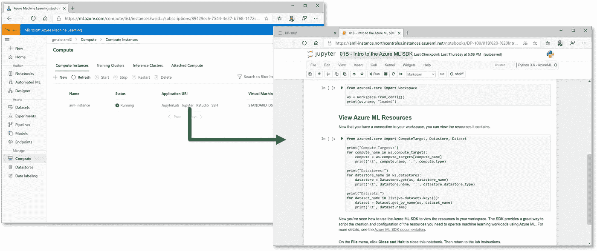
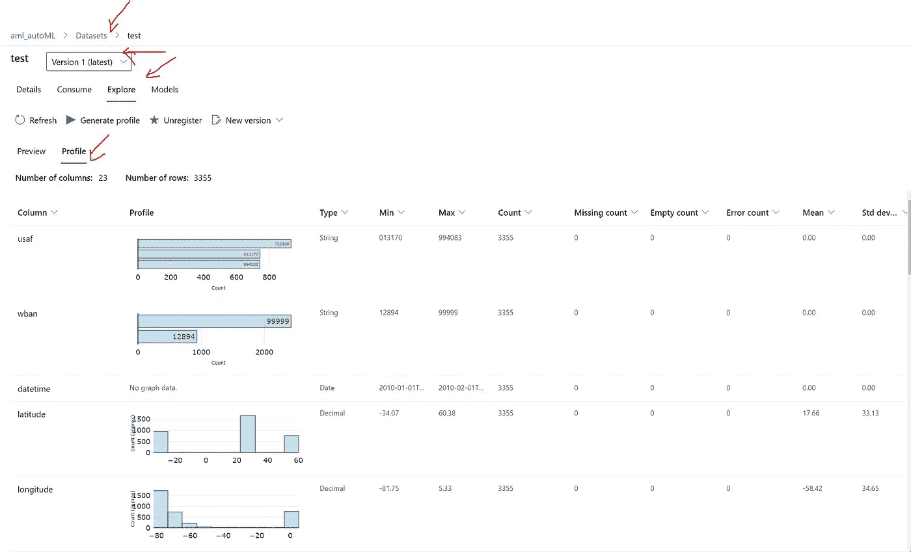
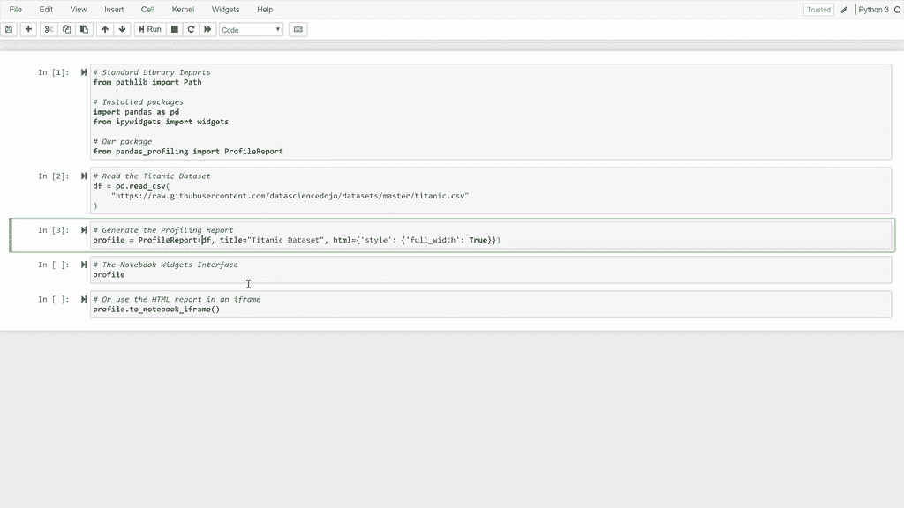

# Azure 机器学习 SDK 中运行 AutoML 实验的隐藏技巧

> 原文：<https://towardsdatascience.com/hidden-tricks-for-running-automl-experiment-from-azure-machine-learning-sdk-915d4e3f840e?source=collection_archive---------19----------------------->

*自动化机器学习*是机器学习社区中一个快速发展的领域，它使用户能够尝试多种算法并对他们的数据进行预处理转换。与可扩展的基于云的计算相结合，可以找到性能最佳的数据模型，而无需大量耗时的手动反复试验。

这篇博客简要概述了如何从 Azure 机器学习 SDK 运行 AutoML 实验。

# 自动化机器学习任务和算法

Azure Machine Learning 包括对自动化机器学习的支持，称为 [AutoML](https://docs.microsoft.com/en-us/azure/machine-learning/concept-automated-ml) ，作为 Azure 云产品之一，通过[Azure Machine Learning studio](https://ml/azure.com)中的可视界面，或者使用[SDK](https://docs.microsoft.com/en-us/python/api/overview/azure/ml/?view=azure-ml-py&preserve-view=true)提交实验。SDK 使数据科学家能够更好地控制自动化机器学习实验的设置，而可视化界面更容易用于代码经验较少或没有代码经验的用户。

Azure 机器学习为以下类型的机器学习任务训练模型:

*   分类
*   回归
*   时间数列预测法

此外，Azure AutoML 包括对这些任务的许多常用算法的支持，包括:

## 分类算法

*   逻辑回归
*   光梯度推进机
*   决策图表
*   随机森林
*   朴素贝叶斯
*   线性支持向量机(SVM)
*   XGBoost
*   深度神经网络(DNN)分类器
*   其他…

## 回归算法

*   线性回归
*   光梯度推进机
*   决策图表
*   随机森林
*   弹性网
*   拉斯·拉索
*   XGBoost
*   其他…

## 预测算法

*   线性回归
*   光梯度推进机
*   决策图表
*   随机森林
*   弹性网
*   拉斯·拉索
*   XGBoost
*   其他…

有关支持的算法的完整列表，请参见文档中的[如何定义机器学习任务](https://aka.ms/AA70rrr)。

# 使用 SDK 配置自动化机器学习实验

虽然[用户界面](https://docs.microsoft.com/en-us/azure/machine-learning/tutorial-first-experiment-automated-ml)提供了一种直观的方式来为您的自动化机器学习实验选择选项，但使用 SDK 可以为用户提供更大的灵活性来设置实验和监控运行。在这里，我列出了指导用户通过 SDK 运行 AutoML 的七个步骤。

# 步骤 1:创建计算目标

在 Azure 机器学习中，*计算目标*是运行实验的物理或虚拟计算机。

将实验运行分配给特定计算目标的能力有助于您通过以下方式实施灵活的数据科学生态系统:

*   代码可以在本地或低成本计算上开发和测试，然后移动到更具可扩展性的计算上，以满足生产工作负载的需求。
*   您可以在计算目标上运行最适合其需求的单个进程。例如，通过使用基于 GPU 的计算来训练深度学习模型，并切换到更低成本的纯 CPU 计算来测试和注册训练好的模型。

云计算的核心优势之一是能够通过只为您使用的东西付费来管理成本。在 Azure 机器学习中，您可以通过定义计算目标来利用这一原则:

*   按需启动，不再需要时自动停止。
*   基于工作负载处理需求自动扩展。

有关计算目标的完整文档，请查看此处:

Azure Machine Learning 包括在工作空间中创建*计算实例*的能力，以提供一个开发环境(Jupyter Notebook、Jupyer Lab、RStudio 和 SSH)，该环境由工作空间中的所有其他资产管理。



[Azure 机器学习概述(微软官方文档)](https://docs.microsoft.com/en-us/azure/machine-learning/overview-what-is-machine-learning-studio)

# 步骤 2:为 Python 安装 Azure 机器学习 SDK

```
pip install azureml-sdk
```

SDK 包括可选的额外功能*,这些功能不是核心操作所必需的，但在某些情况下会很有用。例如，notebooks extra 包括用于在 Jupyter 笔记本中显示详细输出的小部件，automl extra 包括用于自动化机器学习培训的包，explain extra 包括用于生成模型解释的包。要安装 extras，请在括号中指定它们，如下所示:*

```
*pip install azureml-sdk[notebooks, automl,explain]*
```

*更多信息:关于为 Python 安装 Azure 机器学习 SDK 的更多信息，请参见 [SDK 文档](https://aka.ms/AA70rq7)。此外，您应该知道 SDK 会定期更新，并查看最新版本的[发行说明。](https://aka.ms/AA70zel)*

# *步骤 3:指定培训数据*

*自动化机器学习旨在使您能够简单地带来您的数据，并让 Azure Machine Learning 找出如何最好地从中训练一个模型。*

*在 Azure Machine Learning studio 中使用自动化机器学习用户界面时，可以创建或选择一个 Azure Machine Learning [*数据集*](https://aka.ms/AA6zxeb) 作为自动化机器学习实验的输入。*

*使用 SDK 运行自动化机器学习实验时，可以通过以下方式提交数据:*

*   *指定*训练数据*的数据集或数据帧，包括待预测的特征和标签。*
*   *可选地，指定将用于验证训练模型的第二个*验证数据*数据集或数据帧。如果没有提供，Azure Machine Learning 将使用训练数据应用交叉验证。*

*或者:*

*   *指定包含训练特征的 dataset、dataframe 或 numpy 数组的 *X* 值，以及相应的标签值的 *y* 数组。*
*   *或者，指定用于验证的 *X_valid* 和 *y_valid* 数据集、数据帧或 *X_valid* 值的 numpy 数组。*

*提示 1: AML 具有数据分析的嵌入功能，允许用户浏览他们注册的数据集:*

**

*如何监控 AML 中的数据集([微软官方文档](https://docs.microsoft.com/en-us/azure/machine-learning/how-to-monitor-datasets))*

*如果您想在您的 SDK 实验中拥有这个特性，您可以使用实际的 python 包(`pandas_profiling`)并且在安装这个包之后，生成[profile report，运行:*

```
*profile = ProfileReport(df, title="Pandas Profiling Report")*
```

*这可以通过简单地显示报告来实现。在 Jupyter 笔记本中，运行:*

```
*profile.to_widgets()*
```

*HTML 报告可以包含在 Jupyter 笔记本中:*

**

*包熊猫 _ 剖析([官方 Github 回购)](https://pandas-profiling.github.io/pandas-profiling/docs/master/index.html)*

*运行以下代码:*

```
*profile.to_notebook_iframe()*
```

**

*包熊猫 _ 简介([Github 官方回购)](https://pandas-profiling.github.io/pandas-profiling/docs/master/index.html)*

## *保存报告*

*如果您想生成一个 HTML 报告文件，将`ProfileReport`保存到一个对象并使用`to_file()`函数:*

```
*profile.to_file("your_report.html")*
```

*或者，您可以获取 json 格式的数据:*

```
**# As a string*
json_data = profile.to_json()*# As a file*
profile.to_file("your_report.json")*
```

**

*包熊猫 _ 剖析([官方 Github 回购)](https://pandas-profiling.github.io/pandas-profiling/docs/master/index.html)*

# *步骤 4:连接到工作区*

*在 Python 环境中安装 SDK 包后，您可以编写代码来连接到您的工作空间并执行机器学习操作。连接到工作区的最简单方法是使用工作区配置文件，该文件包括 Azure 订阅、资源组和工作区详细信息，如下所示:*

```
*{     
      "subscription_id": "<subscription-id>",     
      "resource_group": "<resource-group>",     
      "workspace_name": "<workspace-name>" 
}*
```

*要使用配置文件连接到工作区，可以使用 SDK 中 workspace 类的 from_config 方法，如下所示:*

```
*from azureml.core import Workspacesubscription_id = '<subscription-id>'
resource_group  = '<resource-group>'
workspace_name  = '<workspace-name>'try:
    ws = Workspace(subscription_id = subscription_id, resource_group = resource_group, workspace_name = workspace_name)
    ws.write_config()
    print('Library configuration succeeded')
except:
    print('Workspace not found')*
```

# *步骤 5:配置自动化机器学习实验*

*用户界面提供了一种直观的方式来为您的自动化机器学习实验选择选项。使用 SDK 时，您有更大的灵活性，并且可以使用 AutoMLConfig 类设置实验选项，如以下示例所示:*

```
*automl_settings = {
    "n_cross_validations": 3,
    "primary_metric": 'average_precision_score_weighted',
    "enable_early_stopping": **True**,
    "max_concurrent_iterations": 2, *# This is a limit for testing purpose, please increase it as per cluster size*
    "experiment_timeout_hours": 0.25, *# This is a time limit for testing purposes, remove it for real use cases, this will drastically limit ablity to find the best model possible*
    "verbosity": logging.INFO,
}

automl_config = AutoMLConfig(task = 'classification',
                             debug_log = 'automl_errors.log',
                             compute_target = compute_target,
                             training_data = training_data,
                             label_column_name = label_column_name,
                             **automl_settings
                            )*
```

# *步骤 6:提交自动化机器学习实验*

*像任何科学学科一样，数据科学包括运行*实验*；通常是为了探索数据或构建和评估预测模型。在 Azure 机器学习中，实验是一个命名的过程，通常是脚本或管道的运行，它可以生成指标和输出，并在 Azure 机器学习工作区中被跟踪。*

*一个实验可以用不同的数据、代码或设置运行多次；Azure Machine Learning 跟踪每次运行，使您能够查看运行历史并比较每次运行的结果。*

*您可以像提交任何其他基于 SDK 的实验一样提交自动化机器学习实验:*

```
*from azureml.core.experiment import Experiment

automl_experiment = experiment(ws,'automl_experiment')
automl_run = automl_experiment.submit(automl_config)
automl_run.wait_for_completion(show_output=True)*
```

# *步骤 7:检索最佳运行及其模型*

*你可以很容易地在 Azure Machine Learning studio 中确定最佳运行，并下载或部署它生成的模型。要使用 SDK 以编程方式实现这一点，您可以使用如下示例所示的代码:*

```
*best_run, fitted_model = automl_run.get_output()
print(best_run)
print(fitted_model)*
```

# *提示 2:实验运行上下文*

*除了最佳模型，当您提交一个实验时，您使用它的*运行上下文*来初始化和结束 Azure Machine Learning 中跟踪的实验运行，如以下代码示例所示:*

```
*automl_run = experiment.start_logging()run = automl_run.get_context() # allow_offline=True by default, so can be run locally as well    
...    
run.log("Accuracy", 0.98)    
run.log_row("Performance", epoch=e, error=err)*
```

# *日志记录指标*

*每个实验都会生成日志文件，其中包含在交互执行期间将被写入终端的消息。这使您能够使用简单的`print`语句将消息写入日志。但是，如果您想要记录命名的度量，以便在运行之间进行比较，您可以通过使用 Run 对象来实现；它提供了一系列专门用于此目的的日志功能。其中包括:*

*   *日志:记录单个命名值。*
*   *log_list:记录一个命名的值列表。*
*   *log_row:记录一个有多列的行。*
*   *log_table:将字典记录为表格。*
*   *log_image:记录图像文件或绘图。*

> **更多信息:有关实验运行期间记录指标的更多信息，请参见 Azure 机器学习文档中的* [*Monitor Azure ML 实验运行和指标*](https://aka.ms/AA70zf6) *。**

# *检索和查看记录的指标*

*您可以查看 Azure Machine Learning studio 中运行的实验记录的指标，或者使用笔记本中的 RunDetails 小部件，如下所示:*

```
*from azureml.widgets import RunDetails
RunDetails(automl_run).show()*
```

*您还可以使用 Run 对象的 get_metrics 方法检索指标，该方法返回指标的 JSON 表示，如下所示:*

```
*best_run_metrics = best_run.get_metrics() # or other runs with runID
for metric_name in best_run_metrics:
     metric = best_run_metrics[metric_name]
     print(metric_name, metric)*
```

*run 的另一个好方法是`get_properties`,它允许您从服务中获取运行的最新属性，并返回一个 dict 类型，可以查询特定的属性，如迭代、算法名、类名和许多其他需要提取的有用特性。*

*另一个有用的方法`get_status`返回的常见值包括“正在运行”、“已完成”和“失败”。*

```
*while automl_run.get_status() not in ['Completed','Failed']: 
    print('Run {} not in terminal state'.format(atoml_run.id))
    time.sleep(10)* 
```

*下面的代码示例展示了`list`方法的一些用法。*

```
*favorite_completed_runs = automl_run.list(experiment, status='Completed', tags = 'favorite')all_distinc_runs = automl_run.list(experiment)and_their_children = automl_run.list(experiment, include_children=True)only_script_runs = Run.list(experiment,, type=ScriptRun.RUN_TYPE)*
```

*有关方法的完整列表，请参见 Azure ML API [*文档*](https://docs.microsoft.com/en-us/python/api/azureml-core/azureml.core.run(class)?view=azure-ml-py) 。*