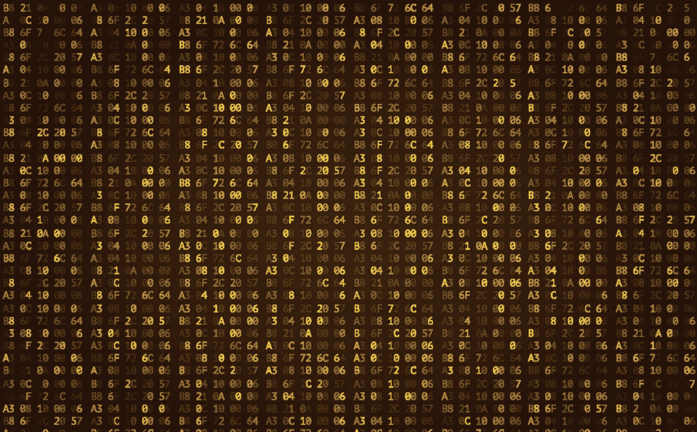
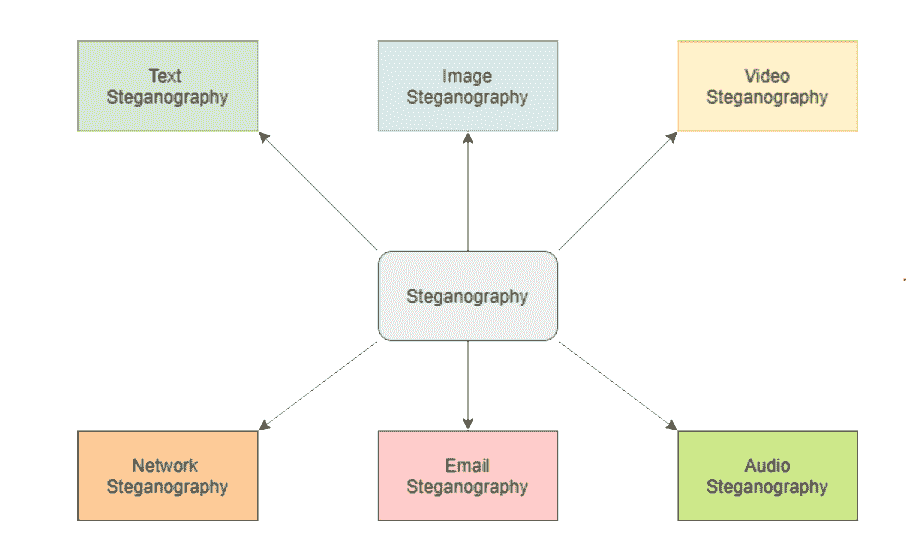
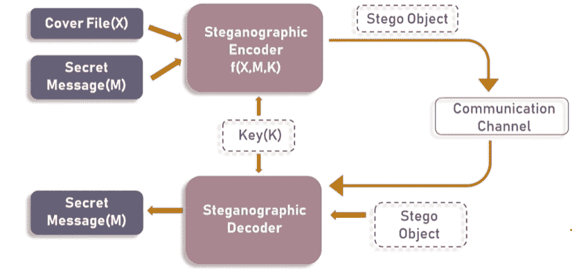
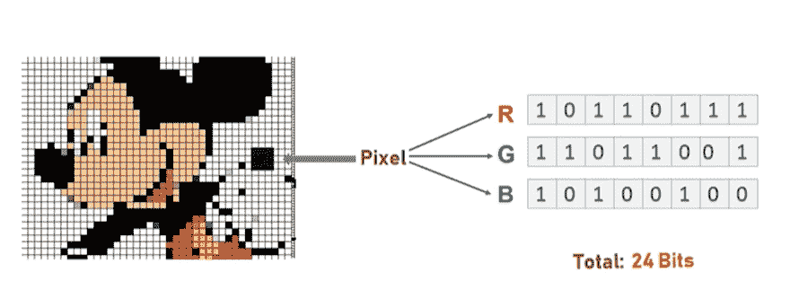
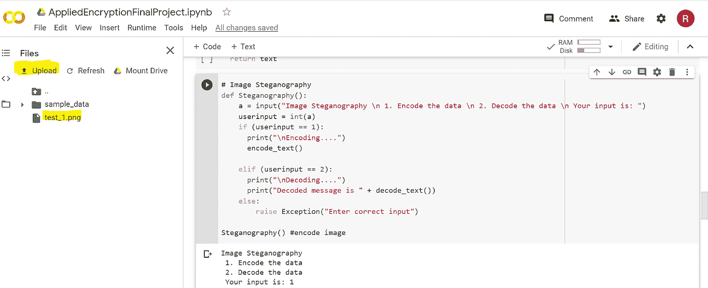
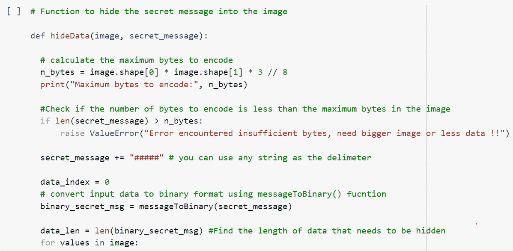
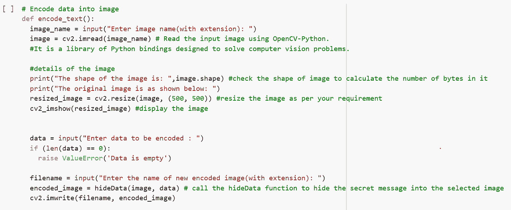
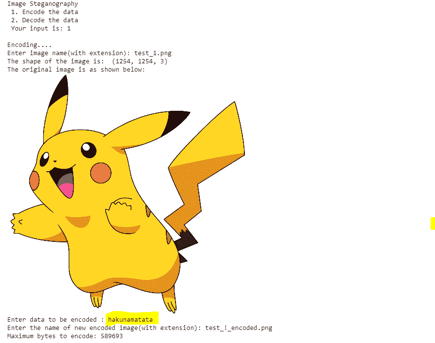
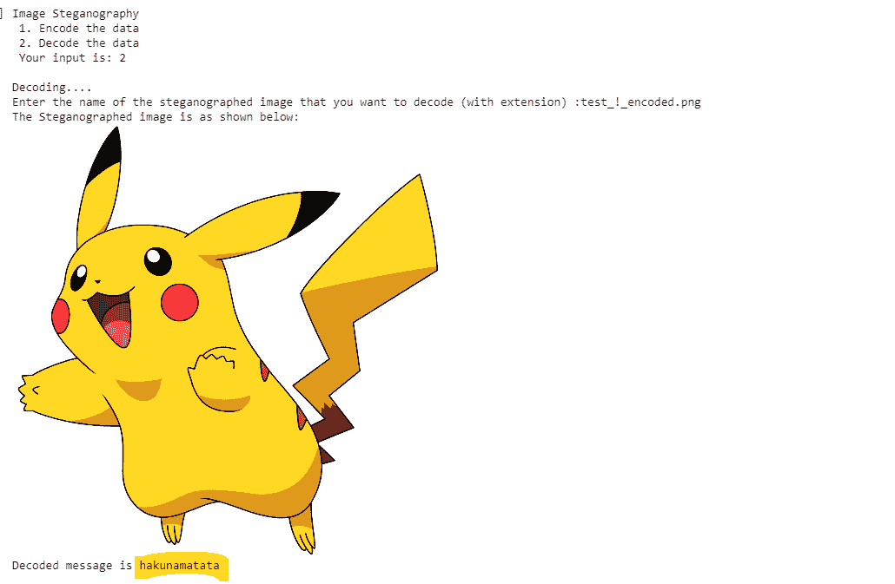

# 基于 Python 的图像隐写术

> 原文：<https://towardsdatascience.com/hiding-data-in-an-image-image-steganography-using-python-e491b68b1372?source=collection_archive---------2----------------------->

图片来源 [UMassAherst](https://blogs.umass.edu/Techbytes/2018/10/30/hiding-in-plain-sight-with-steganography/) 文章

## 理解 LSB 图像隐写术并使用 Python 实现！

> 今天，世界正在见证前所未有的数据爆炸。我们每天产生的数据量确实令人难以置信。福布斯文章**“我们每天创造多少数据？”**指出，以我们目前的速度，每天大约有 [2.5 万亿字节的数据](https://www.domo.com/learn/data-never-sleeps-5?aid=ogsm072517_1&sf100871281=1)产生，但随着物联网(IoT)的增长，这一速度只会加快。仅在过去的两年里，世界上 90%的数据都是由。这个值得重读！

数据。本质上，现代计算世界围绕着这个词。但是它到底有什么吸引人的地方呢？在当今世界，企业已经开始意识到数据就是力量，因为它有可能预测客户趋势，增加销售额，并将组织推向新的高度。随着技术的快速发展和数据的不断创新，保护数据安全已成为我们的首要任务。随着每天成千上万的消息和数据在互联网上从一个地方传输到另一个地方，数据共享正在增加。数据的保护是发送者最关心的问题，我们以一种只有接收者能够理解的秘密方式加密我们的信息是非常重要的。

在本文中，我们将了解什么是最低有效位隐写术，以及我们如何使用 python 来实现它。

# **什么是隐写术？**

隐写术是将秘密消息隐藏在较大消息中的过程，以这种方式，某人无法知道隐藏消息的存在或内容。隐写术的目的是保持双方之间的秘密通信。与隐藏秘密消息内容的加密术不同，隐写术隐藏了消息被传递的事实。虽然隐写术不同于密码学，但两者之间有许多相似之处，一些作者将隐写术归类为密码学的一种形式，因为隐藏通信是一种秘密消息。

# **使用隐写术优于密码学？**

到目前为止，密码学在保护发送者和接收者之间的秘密方面一直有其最终的作用。然而，如今除了加密之外，越来越多地使用隐写技术来为隐藏的数据添加更多的保护层。与单独使用[密码术](https://en.wikipedia.org/wiki/Cryptography)相比，使用隐写术的优势在于，预期的秘密消息不会引起对其自身作为审查对象的注意。显而易见的加密信息，无论如何无法破解，都会引起人们的兴趣，而且在那些[加密](https://en.wikipedia.org/wiki/Encryption)是非法的国家，这些信息本身可能会被定罪。[1]

# **隐写术的类型**

隐写术工作已经在不同的传输介质上进行，如图像、视频、文本或音频。

作者图片

# **基本隐写模型**

截图来自 Edureka [隐写术](https://www.edureka.co/blog/steganography-tutorial)教程

如上图所示，原始图像文件(X)和需要隐藏的秘密消息(M)都被输入到隐写编码器中。隐写编码函数 f(X，M，K)通过使用最低有效位编码等技术将秘密消息嵌入到封面图像文件中。生成的隐写图像看起来与您的封面图像文件非常相似，没有明显的变化。这就完成了编码。为了恢复秘密信息，隐写对象被送入隐写解码器。[3]

本文将帮助您使用 Python 实现图像隐写术。它将帮助你编写一个 Python 代码，使用一种叫做[最低有效位](https://www.sciencedirect.com/topics/computer-science/least-significant-bit)的技术来隐藏文本消息。

# **最低有效位隐写术**

我们可以将数字图像**描述为一组有限的数字值，称为像素。像素是图像中最小的单个元素，包含代表给定颜色在任何特定点的亮度的值。所以我们可以把一幅图像想象成一个包含固定数量的行和列的像素矩阵(或二维数组)。**

最低有效位(LSB)是一种技术，其中每个像素的最后一位被修改并替换为秘密消息的数据位。

Edureka [隐写术](https://www.edureka.co/blog/steganography-tutorial)教程的照片致谢

Edureka 的照片[隐写术](https://www.edureka.co/blog/steganography-tutorial)教程

从上面的图像可以清楚地看出，如果我们改变 MSB，它将对最终值产生较大的影响，但如果我们改变 LSB，对最终值的影响是最小的，因此我们使用最低有效位隐写术。

## **LSB 技术如何工作？**

每个像素包含红、绿、蓝三个值，这些值的范围从 **0 到 255** ，换句话说，它们是 8 位值。[4]让我们举一个例子来说明这种技术是如何工作的，假设您想要将消息“**嗨**”隐藏到一个具有以下像素值的 **4x4** 图像中:

**[(225，12，99)，(155，2，50)，(99，51，15)，(15，55，22)，(155，61，87)，(63，30，17)，(1，55，19)，(99，81，66)，(219，77，91)，(69，39，50)，(18，200，33)，(25，54，190)]**

使用[ASCII 表](http://www.asciitable.com/)，我们可以将秘密消息转换成十进制值，然后转换成二进制值: **0110100 0110101。**现在，我们逐个迭代像素值，在将它们转换为二进制后，我们依次用该消息位替换每个最低有效位(例如，225 是 11100001，我们用第一个数据位(0)替换最后一位，右边的位(1)以此类推)。这只会将像素值修改+1 或-1，根本不会引起注意。执行 LSBS 后得到的像素值如下所示:

**[(224，13，99)，(154，3，50)，(98，50，15)，(15，54，23)，(154，61，87)，(63，30，17)，(1，55，19)，(99，81，66)，(219，77，91)，(69，39，50)，(18，200，33)，(25，54，190)]**

# **使用 Python 隐藏图像中的文本**

在本节中，我们可以找到使用 Python 代码的隐藏和显示过程的一步一步。打开一个[谷歌协作笔记本](https://colab.research.google.com/notebooks/intro.ipynb)并遵循以下步骤:

在开始编写代码之前，您可以使用左侧菜单栏中的上传选项上传您想要用于隐写术的图像(png)。

作者照片

第一步:导入所有需要的 python 库

**第二步:**定义一个将任意类型的数据转换为二进制的函数，我们会用这个在编解码阶段将秘密数据和像素值转换为二进制。

步骤 3: 写一个函数，通过改变 LSB 来隐藏秘密信息到图像中

**步骤 4:** 定义一个函数，从隐写图像中解码隐藏消息

**步骤 5:** 将输入的图像名称和秘密消息作为用户输入，并调用 hideData()对消息进行编码的函数

**步骤 6:** 创建一个函数，要求用户输入需要解码的图像名称，并调用 showData()函数返回解码后的消息。

**第七步:**主要功能()

**输出/结果:**

对邮件进行编码:

解码信息:

如果你对代码感兴趣，可以在 [Github](https://github.com/rroy1212/Image_Steganography/blob/master/ImageSteganography.ipynb) 上找到我的笔记本。

# 参考资料:

1.  [https://towards data science . com/steganography-hiding-a-image-inside-another-77 ca 66 B2 ACB 1](/steganography-hiding-an-image-inside-another-77ca66b2acb1)
2.  [https://www.edureka.co/blog/steganography-tutorial](https://www.edureka.co/blog/steganography-tutorial)
3.  [https://www . Forbes . com/sites/Bernard marr/2018/05/21/how-mud-data-do-we-create-every-day-the-mind-blowing-stats-every one-should-read/# 191 d0b 0160 ba](https://www.forbes.com/sites/bernardmarr/2018/05/21/how-much-data-do-we-create-every-day-the-mind-blowing-stats-everyone-should-read/#191d0b0160ba)
4.  [https://www . uk essays . com/essays/computer-science/steganography-uses-methods-tools-3250 . PHP](https://www.ukessays.com/essays/computer-science/steganography-uses-methods-tools-3250.php)
5.  [https://www . thepythoncode . com/article/hide-secret-data-in-images-using-steganography-python](https://www.thepythoncode.com/article/hide-secret-data-in-images-using-steganography-python)
6.  [https://www.youtube.com/watch?v=xepNoHgNj0w&t = 1922s](https://www.youtube.com/watch?v=xepNoHgNj0w&t=1922s)