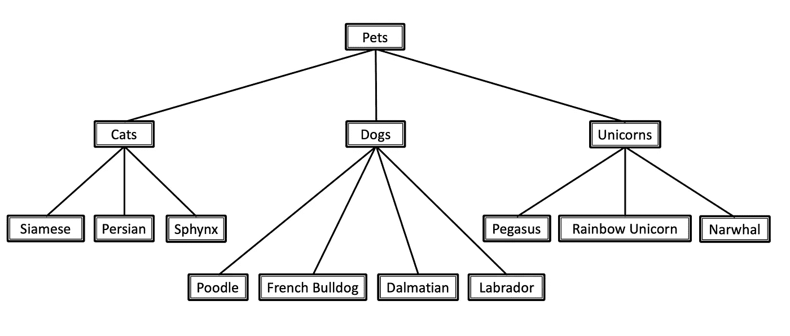

# 局部分类器的层次分类:你必须知道的调整和技巧

> 原文：<https://towardsdatascience.com/hierarchical-classification-by-local-classifiers-your-must-know-tweaks-tricks-f7297702f8fc?source=collection_archive---------45----------------------->

## 分级分类集成模型的最佳实践。

你有没有一个[层次分类](/https-medium-com-noa-weiss-the-hitchhikers-guide-to-hierarchical-classification-f8428ea1e076)的任务，只是乞求一个机器学习模型？你是否已经决定选择一个局部分类器的集合，甚至决定了[对于那个任务](/https-medium-com-noa-weiss-the-hitchhikers-guide-to-hierarchical-classification-f8428ea1e076)来说最好的局部分类器结构？你的键盘准备好了吗，手指准备好了吗？嗯，现在就一分钟。你可能想坐下来。

如果你读过我在[之前关于等级分类的](/https-medium-com-noa-weiss-the-hitchhikers-guide-to-hierarchical-classification-f8428ea1e076) [帖子](/hierarchical-classification-with-local-classifiers-down-the-rabbit-hole-21cdf3bd2382)，你肯定已经了解了所有的基础知识。然而，有一些重要的最后细节你应该让自己熟悉。无论是**如何选择你的训练样本和特征集**，如何**避免错误传播**，还是**处理分类不一致的方法** — **这是你在实现你的第一个现实生活中的层次模型**之前想要阅读的一篇文章。

# 在我们开始之前

分层局部分类器的主题很长，理解下面描述的复杂性需要您熟悉:

1.  [数据分类&层次分类](/https-medium-com-noa-weiss-the-hitchhikers-guide-to-hierarchical-classification-f8428ea1e076)
2.  [分级局部分类器及其不同结构](/hierarchical-classification-with-local-classifiers-down-the-rabbit-hole-21cdf3bd2382)

如果不是这样，那就继续读下去吧。没事的。我们会等的。

在这篇文章中，正如我之前的一样，我将根据常见宠物的分类给出例子:

常见家养宠物的分类。我听说彩虹独角兽很难家养。

# 谈正事

你正在建立你自己的层次集合模型吗？您是否已经定义了您的数据分类法，挑选了您最喜欢的局部分类器结构，卷起袖子，准备好开始着手进行模型破解了吗？

你就快到了，冠军。但是在您打开数据科学引擎之前，还有几个要点需要您花时间考虑。

# 1.不一致性校正方法

***“嗯……为什么我的模型输出坚持这个例子是一只暹罗犬？”***

正如你已经知道的(如果你不知道，你为什么不继续点击[这里](/hierarchical-classification-with-local-classifiers-down-the-rabbit-hole-21cdf3bd2382)，局部分类器集成模型可以吐出一些不一致的结果。

根据您的用例，您可能不希望您的测试集示例同时被标记为“Unicorn”和“French Bulldog”，也不希望父节点分类器说*不*而它的一个子节点投票*赞成*。不同层次的系综之间的不一致是我们非常希望避免的。那么，我们应该怎样做呢？

有几个方法——其中一些不必要地复杂。我将为您节省一些麻烦，并描述最简单和最直观的，考虑到手头的问题最有意义的:

## 第一种不一致的情况:不同层次的预测相互矛盾

*(例如:“假”代表狗，“真”代表狮子狗)。*

解决方案:**类预测自顶向下的方法。** 在测试阶段，您从分类树的顶部开始，并且每次向下一级，您只考虑作为预测类的后代的局部分类器。
有点太抽象了？让我们看几个例子，然后:

*   **每父节点局部分类器(LCPN)** :你有一只动物。它是什么物种，哦，如此强大的一级分类器？是一只狗？太好了。让我们只将这个特定的例子发送到“狗”本地分类器，然后——不需要咨询“猫”和“独角兽”的分类器。
*   **每节点局部分类器(LCN)** :又一个动物！万岁！让我们看看它是一只猫，一只狗，还是一只独角兽。猫分类器说“是”，狗分类器说“不是”，独角兽分类器说“是”？非常好。接下来，我们将只考虑不同品种的猫和独角兽的本地分类器。狗品种可以坐在这一个。(当然，这个例子只适用于多标签的情况。还有，你有没有想过独角兽猫长什么样？[点击风险自担](https://www.google.com/search?tbm=isch&q=unicorn+cat))。

## 第二个不一致的场景:一个标签问题的几个叶节点标签

*(例如:一只彩虹-独角兽-法国-牛头犬)。*

您正在使用 LCN ( *每个节点的本地分类器*)，但是您的问题是单标签问题？嗯，首先，我不知道你为什么要这样做——LCPN(*每个父节点的本地分类器* ) 结构只是坐在那里，等待——但是如果你决定这样做，并且你在同一级别的多个本地分类器对同一个示例说“是”，这里是你要做的:**选择可信度最高的那个。**

是的，就这么简单。“独角兽”和“狗”都在争称号？向每个分类器询问一个置信度得分，并且只考虑更有把握的那个的答案。有点像现实生活，不是吗？

(该解决方案假设您也使用上述自顶向下的分类预测，只将示例发送到结果为肯定的父分类器的子分类器。如果不是，就应该)。

# 2.错误传播

***“等等！误差传播呢？如果这些父节点分类器中的一个给出了假阳性，我们如何避免将错误向下传播？”***

初级的，我亲爱的读者。我们**用信任来阻挡**。根据您的用例及其所需的确定性水平，确定一个阈值，如果预测的置信度得分没有达到阈值，则停止分类过程，并且不将该样本发送到该分类器的子节点。

不过，这种解决方案也是有代价的:最终的预测可能不太具体(例如，“猫”而不是“Sphynx 猫”)，并且取决于您的具体问题和业务需求，您的最终用户可能对此不满意。

# 3.LCN 量词的正反例

***“我正在构建一个每节点局部分类器的集成模型。每个二元分类器的训练集应该是什么样的？***

当谈到 LCN(每个节点的本地分类器)方法时，如何训练本地分类器可能不是显而易见的，这些分类器都是二进制的。我们应该把什么样的例子作为正面的例子来喂它？哪些是负面的？

有几种不同的政策，每一种都有其合理性和独特之处。你很幸运，我费了很大劲才找到了对 LCN 来说最有意义的一个，因为其他的都有点难以理解，而且没有任何明显的好处。

它被称为“ ***兄弟姐妹政策*** ”，并且*它将类 X 的正面例子定义为属于类 X 及其子类的那些，将负面例子定义为属于类 X 的兄弟姐妹类以及它们自己的子类的那些。*

举例？当然:
说我想训练我的“狗”分类器。在这种情况下，我的**正面例子**将是那些既属于一般“狗”类(假设有一些例子，我知道它们是狗，但不知道是哪个品种)，又属于它的所有特定品种(斑点狗、拉布拉多等)的狗。).
我的**反面例子**，另一方面，将会是所有的猫和所有的独角兽(我必须说，这听起来很棒)。

明白了吗？很好。让我们继续下一个调整。

# 4.相同与不同的特性/算法

***“我应该对我的集成中的所有局部分类器使用相同的基础算法吗？同样的功能集怎么样？”***

这个简单:**不**。

有大量证据表明，针对不同子问题的不同算法和特性可以提供更好的结果。这很有道理。你不会期望一个“它喵喵叫吗”的特性能很好的区分不同品种的狗，你会吗？

# 最后一个音符

如果你已经走了这么远，你已经准备好了。你有你的本地分类器结构吗？你的正反例子？不一致和错误传播问题都解决了？等等，你忘了什么吗？

一旦你建立了你的层次模型，你将会想要知道它做得有多好。虽然平面分类问题的性能指标是众所周知的——但当涉及到层次问题时，就不那么简单了。

所以，开始构建你的模型吧，但如果你也想测量它的性能，请查看我的下一篇文章。这将是一个爆炸。

Noa Weiss 是特拉维夫的一名人工智能机器学习顾问。

*资料来源* : C.N. Silla & A.A. Freitas， [*跨不同应用领域的层次分类综述*](https://link.springer.com/article/10.1007/s10618-010-0175-9) (2011)，*数据挖掘与知识发现*，22(1–2):182–196