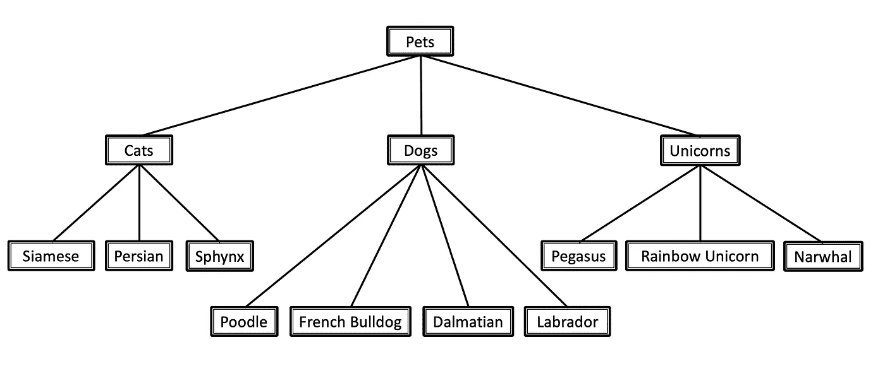

# 使用局部分类器的层次分类:掉进兔子洞

> 原文：<https://towardsdatascience.com/hierarchical-classification-with-local-classifiers-down-the-rabbit-hole-21cdf3bd2382?source=collection_archive---------9----------------------->

## 构建您的第一个层次分类模型？这篇文章是给你的。

分层数据无处不在。作为数据科学家，我们已经习惯于将其扁平化，忽略数据的自然分类，以便我们可以轻松地将其输入到我们的机器学习模型中。但是他们说，还有另一种方法。一个保存隐藏在层级中的珍贵信息的人。它可以帮助我们设计更加(人工)智能的分类模型，并更好地捕捉每个预测类别的独特性。

[设计层次分类模型时，有一些标准方法](/https-medium-com-noa-weiss-the-hitchhikers-guide-to-hierarchical-classification-f8428ea1e076)。在这里，我们将集中讨论其中之一:建立一个由层次结构的局部分类器组成的集成模型。这种方法可以用不同的方式实现，每种方式都有自己的优点和缺点。在接下来的大约 1000 个单词中，我将介绍每个局部分类器结构的优缺点、它可能带来的独特挑战以及它最适合解决哪些问题。

换句话说，**这篇文章是关于你应该为你自己的层次分类项目选择哪种局部分类器结构的。**好奇？太好了。那我们就开始吧。

# 在我们开始之前

掌握层次分类器的来龙去脉，确实需要一些背景知识。我会尽我所能让这篇文章尽可能的简单易懂。然而，如果你发现自己在纠结数据分类学和层次分类的核心概念，你应该[继续读下去](/https-medium-com-noa-weiss-the-hitchhikers-guide-to-hierarchical-classification-f8428ea1e076)——相信我，这是一本引人入胜的书。

在这篇文章中，我将根据常见宠物的分类给出一些例子:

常见家养宠物的分类。我一直想要一只独角鲸，但是我哥哥过敏。

# 本地分类器的不同结构(哪一个是最公平的)

哦，层次结构的局部分类器。这些聪明的集成模型建立了一个更小的分类器层次结构，从而以一种简单而迷人的方式抓住了层次分类的本质。如此迷人，我说的对吗？

如果你正在读这篇文章，你可能已经被它们不可否认的吸引力所吸引，这意味着你现在面临一个困难的问题:你应该选择哪种可用的结构？

别担心，你来对地方了。让我们来看看我们快乐的选择。

善意的提醒-三位选手是:

*   **每个节点的局部分类器(LCN)**
*   **每个父节点的本地分类器(LCPN)**
*   **每级局部分类器(LCL)**

## 每个节点的本地分类器(LCN)

这种情况下，每个节点都有一个二元分类器(例如:每个“猫”、“狗”、“独角兽”、“暹罗”、“波斯”等等都有一个单独的分类器；在我们家养宠物的例子中，我们总共有 13 个二元分类器。它也是文献中使用最多的一种，这使它成为真正的舞会佳丽。那么，你应该考虑哪些利弊呢？

**优点:**

*   这种方法就是**天生的多标签**。它通过传统的单标签算法实现了这一点，而没有设计和实现多标签算法的复杂性。(不过，你不必使用多个标签——在单标签问题的情况下，你可以简单地只分配可信度最高的标签——在我的下一篇文章中会详细介绍)。

**缺点:**

*   **前后矛盾**问题。如果“猫”的本地分类器投了反对票，而“波斯”的本地分类器投了赞成票，那该怎么办？如果“独角兽”和“法国斗牛犬”都是阳性呢？(假设独角牛头犬不幸不存在于我们的世界)。当使用 LCN 方法时，这些都是非常可能的结果。这不是一个无法解决的问题——事实上，我将在接下来的帖子中介绍一个简单的方法来避免它——但这是一个需要注意的问题，或者你应该准备好一些不一致的结果。
*   与其他局部分类器方法相比，LCN 要大得多，因为它需要更多的局部分类器。

## 每父节点本地分类器(LCPN)

这是其中每个父节点(例如，“狗”)得到一个多类分类器(例如:一个确定狗的品种)。

**优点:**

*   首先，这是一堆东西中最直观的一个，我相信这是有价值的。因为我们数据科学家不是在真空中工作，而且我们经常需要与同事或客户交流我们的工作，所以让我们的模型以一种其他人可以容易理解的方式构建是一个巨大的“地狱，是的”。
*   由于只有和父节点一样多的本地分类器，这种方法比前一种方法更加精简，更容易实现。

**缺点:**

*   还记得上次方法中的**不一致性**问题吗？嗯，这次也是这样。但是，同样，解决方案相当简单(将在我的下一篇文章中解决，非常非常快——我不会让你坐太久)。

## 每层本地分类器(LCL)

这是一个为分类法的每一层都有一个多类分类器的例子。在我们的例子中，这意味着一个分类器区分猫、狗和独角兽，另一个分类器区分所有的叶节点类:特定的狗、猫和独角兽品种。

这种方法在文献中是最少使用的。此外，它主要用作基线比较方法。让我们看看为什么:

**优点:**

*   这是一台 **lean** ，意思是分类机。嗯，很瘦。这么瘦。很少分类器。更少的代码行。

**缺点:**

*   还记得那个**不一致**的问题吗？这个问题不再那么容易解决了。没有什么可以阻止您在第一个分类器中使用“Cat ”,然后在第二个分类器中使用“Pegasus”。对此没有什么可做的——至少没有真正深入到野兽的肚子里。
*   在分类法的**深层**，分类器可能有太多的类别**可供选择。例如，如果在我们的例子中有更多的物种，第二个分类器可能必须在 3 个猫品种、4 个狗品种、3 只神奇的独角兽、几只沙鼠、几只雪貂和两种小马中进行区分。有点过了，你不觉得吗？**
*   这种方法完全忽略了训练中的亲子关系，嗯，这很愚蠢。这些关系可能包含非常有价值的信息——这不正是我们最初进入层级结构的全部原因吗？

## 开门见山，好吗？我应该使用哪种结构？

我承认，我一开始就有偏见。LCL 从来都不是我最喜欢的，我也怀疑过 LCN。但是最后一个通过了——如果你有一个多标签的问题，它是自然的选择。它可能有点笨重，但它弥补了它给多种标签的优雅轻松(从没想过你会有一只波斯猫也是一只狮子狗，你有吗？).

如果这是一个单一标签的问题，我会选择 LCPN 方法。它很直观，不太笨重，它做它需要做的事情。它的不一致性问题也很容易解决——而且这个解决方案也非常直观。

# 就这样了，伙计们

如果您已经做到了这一步，那么您应该已经知道哪种局部分类器结构最适合您的项目。

尽管如此，仍然有一些问题需要解决:[如何处理不一致和错误传播，你应该如何定义你的正面和负面训练示例](/hierarchical-classification-by-local-classifiers-your-must-know-tweaks-tricks-f7297702f8fc)，甚至如何尝试测量这样一个结构奇怪的模型。这些都将在我的[下一篇](/hierarchical-classification-by-local-classifiers-your-must-know-tweaks-tricks-f7297702f8fc)帖子中得到解答——敬请期待。

一如既往，我欢迎问题、反馈和特殊要求——请在评论区分享。如果你喜欢你在这里学到的东西，那就把这种快乐付诸实践吧:你的第一个层次分类模型正等着你呢。

***诺亚·维斯是一名人工智能&机器学习顾问，总部位于特拉维夫。***

*资料来源* : C.N. Silla & A.A. Freitas， [*跨不同应用领域的层次分类综述*](https://link.springer.com/article/10.1007/s10618-010-0175-9) (2011)，*数据挖掘与知识发现*，22(1–2):182–196