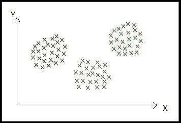
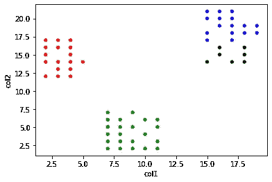
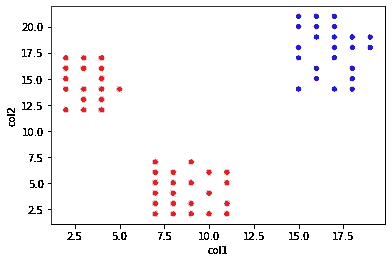
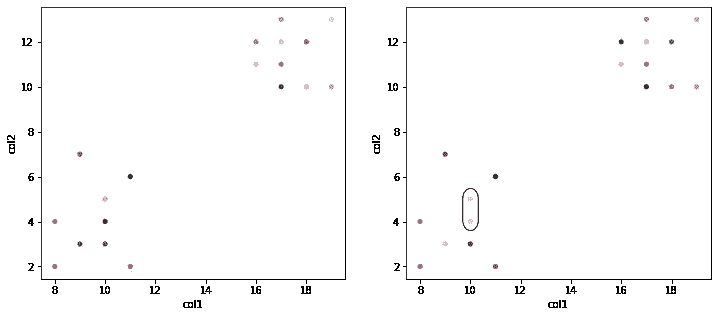
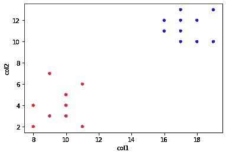

# 等级聚类:凝聚和分裂——解释

> 原文：<https://towardsdatascience.com/hierarchical-clustering-agglomerative-and-divisive-explained-342e6b20d710?source=collection_archive---------4----------------------->

## 聚集和分裂聚类算法及其实现综述

卢卡斯·布拉塞克在 [Unsplash](https://unsplash.com?utm_source=medium&utm_medium=referral) 上的照片

层次聚类是一种聚类分析方法，用于将相似的数据点聚类在一起。分层聚类遵循自顶向下或自底向上的聚类方法。

# 什么是集群？

聚类是一种无监督的机器学习技术，它将群体分成几个聚类，使得同一聚类中的数据点更相似，而不同聚类中的数据点不相似。

*   同一簇中的点彼此更接近。
*   不同簇中的点相距很远。

(图片由作者提供)，样本二维数据集

在上面的二维数据集样本中，可以看到数据集形成了 3 个相距很远的聚类，并且同一聚类中的点彼此靠近。

除了层次聚类之外，还有几种聚类算法，如 k-Means 聚类、DBSCAN 等。阅读下面的文章，了解什么是 k-means 聚类以及如何实现它。

 [## 了解 K-means、K-means++和 K-medoids 聚类算法

### 了解 K-means、K-means++和 K-Medoids 聚类算法及其关系的概述。这篇文章…

towardsdatascience.com](/understanding-k-means-k-means-and-k-medoids-clustering-algorithms-ad9c9fbf47ca) 

在本文中，您可以了解层次集群及其类型。

有两种类型的层次聚类方法:

1.  分裂聚类
2.  凝聚聚类

# 分裂聚类:

分裂聚类算法是一种自上而下的聚类方法，最初，数据集中的所有点都属于一个聚类，并且当一个聚类在层次结构中向下移动时，会递归地执行分裂。

## 分裂聚类的步骤:

1.  最初，数据集中的所有点都属于一个单独的聚类。
2.  将集群划分为两个最不相似的集群
3.  递归地进行以形成新的聚类，直到获得期望数量的聚类。

(图片作者)，**第一张图片:**所有的数据点都属于一个聚类，**第二张图片:** 1 个聚类从前一个单个聚类中分离出来，**第三张图片:**再有 1 个聚类从前一组聚类中分离出来。

在上面的样本数据集中，观察到有 3 个彼此相距很远的聚类。所以我们在得到 3 个集群后就停止了。

即使开始进一步分离更多的簇，下面是获得的结果。

(图片由作者提供)，样本数据集分为 4 个聚类

## 如何选择拆分哪个集群？

检查每个分类的误差平方和，并选择具有最大值的分类。在下面的二维数据集中，当前，数据点被分成 2 个聚类，为了进一步将其分成第 3 个聚类，找出红色聚类和蓝色聚类中每个点的误差平方和(SSE)。

(图片由作者提供)，样本数据集分为 2 个聚类

具有最大 SSE 值的聚类被分成 2 个聚类，从而形成新的聚类。在上面的图像中，可以观察到红色星团有较大的 SSE，因此它被分成两个星团，总共形成三个星团。

## 如何拆分上面选择的集群？

一旦我们决定了分割哪个集群，那么问题就出现了，如何将选择的集群分割成两个集群。一种方法是使用[沃德标准](https://en.wikipedia.org/wiki/Ward%27s_method)来追踪作为分割结果的 SSE 标准差异的最大减少。

## 如何处理噪音或异常值？

由于离群值或噪声的存在，可能导致形成其自己的新聚类。为了处理数据集中的噪声，使用阈值来确定终止标准，这意味着不生成太小的聚类。

# 凝聚聚类:

凝聚聚类是一种自下而上的方法，最初，每个数据点都是自己的一个聚类，随着层次结构的向上移动，更多的聚类对被合并。

## 聚集聚类的步骤:

1.  最初，所有的数据点都是它自己的一个集群。
2.  取两个最近的集群，将它们连接起来形成一个集群。
3.  递归地进行第 2 步，直到获得所需的聚类数。

(图片由作者提供)，**第一张图:**所有的数据点都是它自己的一个聚类，**第二张图:**两个最近的聚类(被一个黑色椭圆包围)结合在一起形成一个单独的聚类。

在上面的样本数据集中，观察到两个集群彼此相距甚远。所以我们在得到 2 个集群后就停止了。

(图片由作者提供)，样本数据集分为两个聚类

## 如何将两个集群连接成一个集群？

为了获得期望数量的聚类，聚类的数量需要从最初的 n 个聚类减少(n 等于数据点的总数)。通过计算两个聚类之间的相似性来组合它们。

有一些方法用于计算两个聚类之间的相似性:

*   两个聚类中最近的两个点之间的距离。
*   两个集群中两个最远点之间的距离。
*   两个聚类中所有点之间的平均距离。
*   两个簇的质心之间的距离。

选择上述任何一种相似性度量标准都有一些优点和缺点。

## 实施:

(作者代码)

# 结论:

在本文中，我们讨论了凝聚和分裂层次聚类算法的深入直觉。分层算法的缺点是空间和时间复杂度大，不适用于大数据集。

> 感谢您的阅读