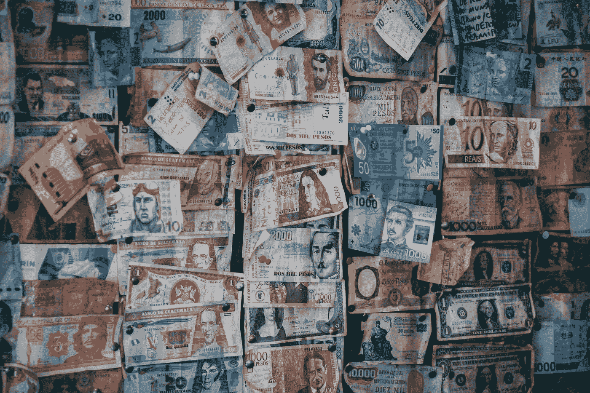
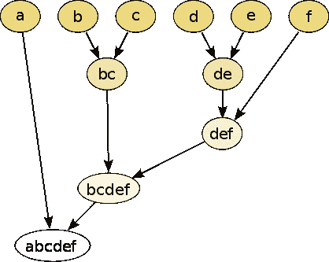
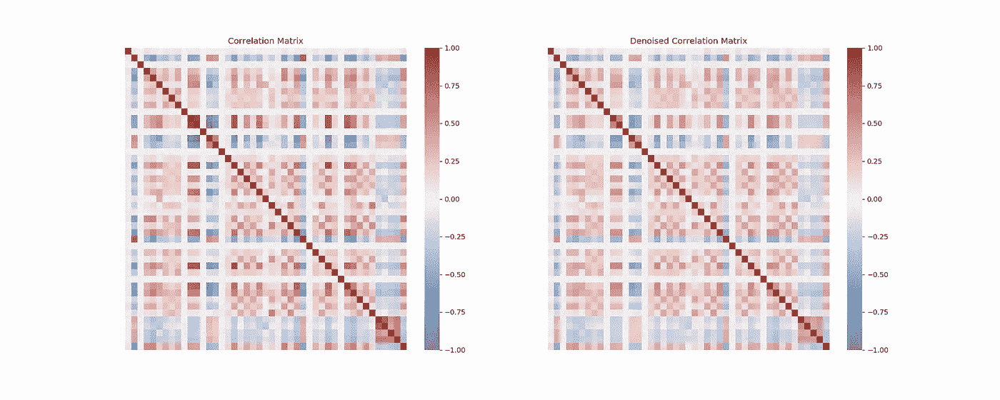
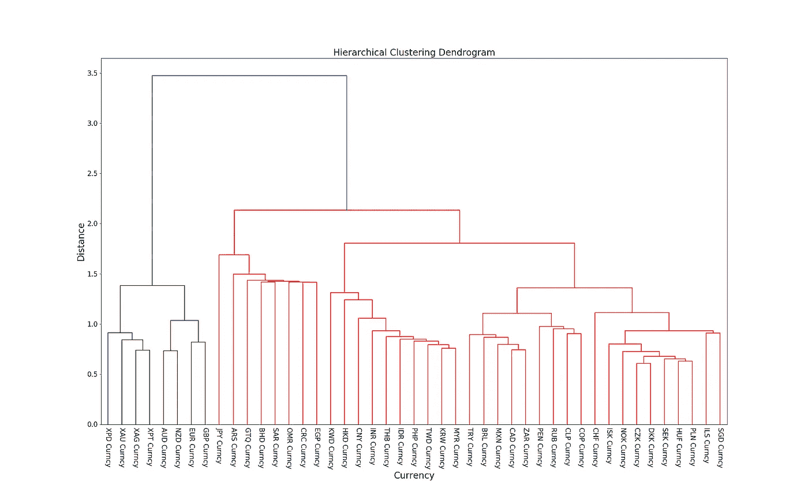
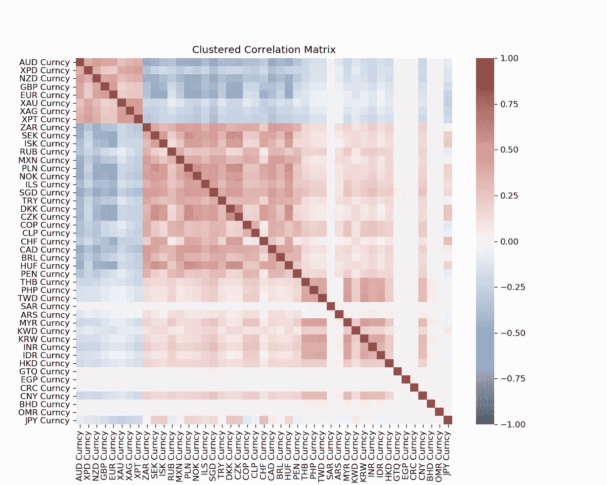
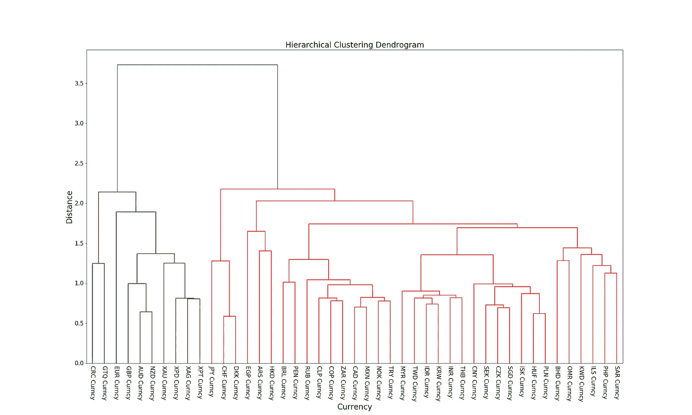
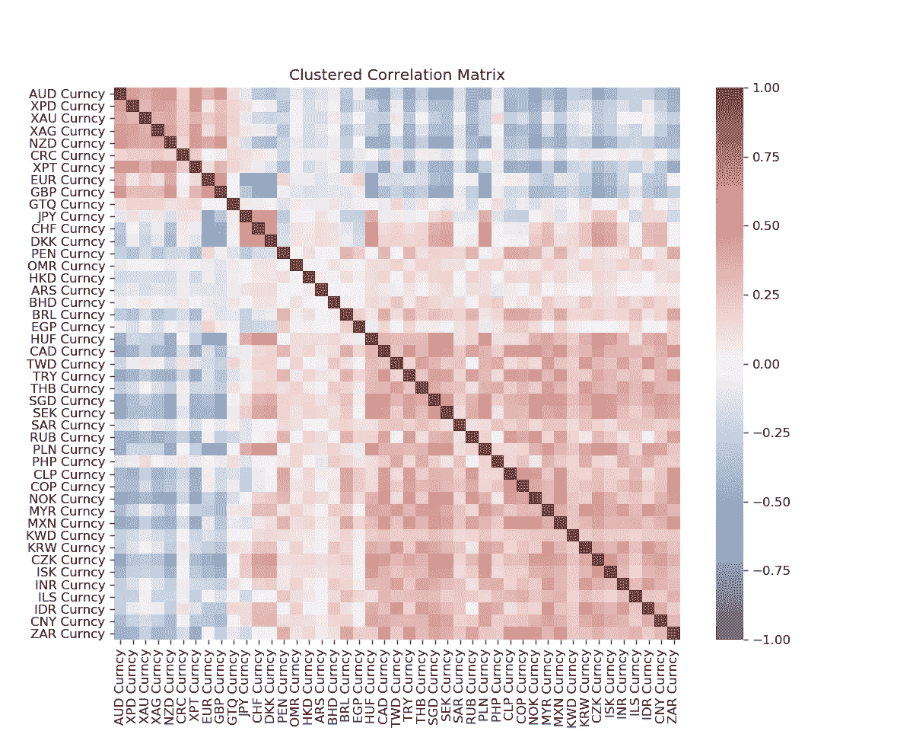

# 等级聚类:在世界货币中的应用

> 原文：<https://towardsdatascience.com/hierarchical-clustering-an-application-to-world-currencies-a24c12940a7e?source=collection_archive---------58----------------------->

Geronimo Giqueaux 在 [Unsplash](https://unsplash.com?utm_source=medium&utm_medium=referral) 上的照片

*亚洲货币的走势一致吗？新兴市场总体情况如何？像澳元和加元这样的商品货币也有密切的关系吗？或者还有其他我们不知道的更近的关系吗？*

层次聚类是一种技术，用于沉淀变量宇宙中的统计关系。它要么采用自上而下的分裂方法，要么采用自下而上的聚合方法。在这个分析中，我使用了凝聚层次聚类技术来挑战和验证广泛使用的货币分组/配对，这是资产经理和交易者所熟悉的。

**凝聚层次聚类**

来源:维基百科。凝聚层次聚类算法的图形表示

好了，这里有一个关于凝聚层次聚类算法的快速注释。该算法首先将所有变量标记为单独的聚类。然后，它继续识别最接近的聚类以形成更大的聚类，并且结果聚类被类似地视为初始聚类。这种情况重复发生，直到形成一个包含所有变量的最终聚类。

所以在某种程度上，集群形成的顺序告诉你它们之间的接近程度。因此，产生的结构，称为树状图，在使用的变量之间有一个紧密的层次结构。

**去噪相关矩阵**
为了帮助我们研究相互依赖结构，我使用了 45 种货币和贵金属衍生的相关矩阵。

然而，众所周知，金融数据噪声特别大，这种噪声往往会馈入估计的相关矩阵。为了锐化我们想要的信号，需要降低噪声水平。所使用的技术改编自马科斯·洛佩兹·德·普拉多(Marcos Lopez de Prado)的《面向资产管理者的机器学习》。

首先，我们通过 PCA(主成分分析)将相关矩阵分解成其特征值和特征向量。然后使用第一个 *n 个*主分量重构去噪的相关矩阵，其中 *n* 通过最小化特征值的理论 Marcenko-Pastur 概率密度函数和经验导出的概率密度函数之间的误差平方和来确定。

原始相关矩阵(左)和去噪相关矩阵(右)

去噪后，我们可以继续进行分析，并将分层聚类应用于得到的相关矩阵。

**结果**
首先，让我们看看这些货币在过去十年(2010 年 1 月至 2019 年 12 月)的树状图。

10 年期的货币树状图

从最左边的聚类中，我们看到该算法将贵金属(铂、银、金和钯)分组在一起。除此之外，我们还有 NZD/AUD(新西兰元和澳大利亚元)和 EUR/GBP(欧洲元和英镑)的组合。

在中间，我们看到了另一个聚类，其中所有的新兴亚洲货币都被分组在一起。MYR 与韩国最接近，那么 MYR 与韩国的聚类与 TWD、菲律宾、印度尼西亚、泰国、印度卢比、CNY 和 HKD 相似。几乎所有的亚洲新兴市场货币都属于这一类，除了新加坡元(SGD ),有趣的是，该算法认为新加坡元与以色列谢克尔(ILS)最为相似。

其他新兴市场货币，如 ZAR、特里、MXN 和 BRL，也与铜、CLP、RUB 和 PEN 聚集在一起。

这些结果(大部分)并不令人意外，也验证了长期以来的观点，即某些货币会一起交易，就像新兴市场亚洲集团一样。

通过层次聚类分析确定的两组不同货币的聚类相关矩阵

然而，当我们审视今年发生的事情时，这个故事发生了转折。使用从 2020 年 1 月 1 日到 2020 年 5 月 15 日的 YTD(年初至今)数据，我们应用相同的技术，得出另一个树状图。

本年迄今货币树状图

在上面的树状图中，我们看到了货币分组的一点变动。在深入研究之前，我们首先注意到，新西兰元/澳元、欧元/英镑和贵金属之间的关系是稳定的，并保留在这个新的数据集中。

接下来，如果我们看看中间，新兴市场亚洲集团现在只有 6 个成员，CNY，新加坡，HKD 和 PHP 被排除在外。最令人惊讶的结果是，菲律宾比索现在与沙特里亚尔最为相似，交易方式类似于中东货币群(沙特里亚尔、伊尔斯、科威特第纳尔、OMR、BHD)。

此外，另一点需要注意的是，日元现在与瑞士法郎聚集在一起，这或许表明了这两种货币在全球疫情和衰退中的避险资产地位。

YTD 货币回报的聚类相关矩阵

在 YTD 聚类相关矩阵中，我们现在看到三个不同的聚类。第一个属于贵金属，新西兰元/澳元，欧元/英镑。第二组仅包含日元、瑞士法郎和 DKK，最后一组包含其余货币。

**结论**然而，从年初至今的数据来看，这些关系可能会破裂，尤其是在新冠肺炎疫情爆发这样的特殊时期。使用数据挖掘技术使我们能够超越偏见，客观地看待市场。