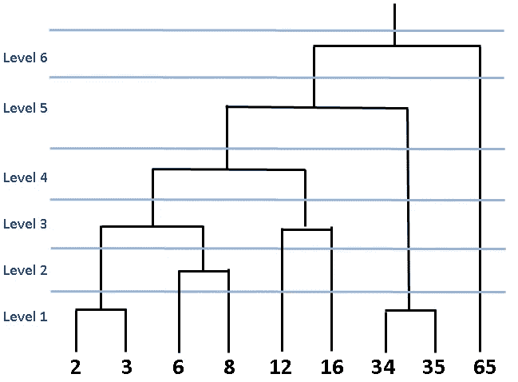
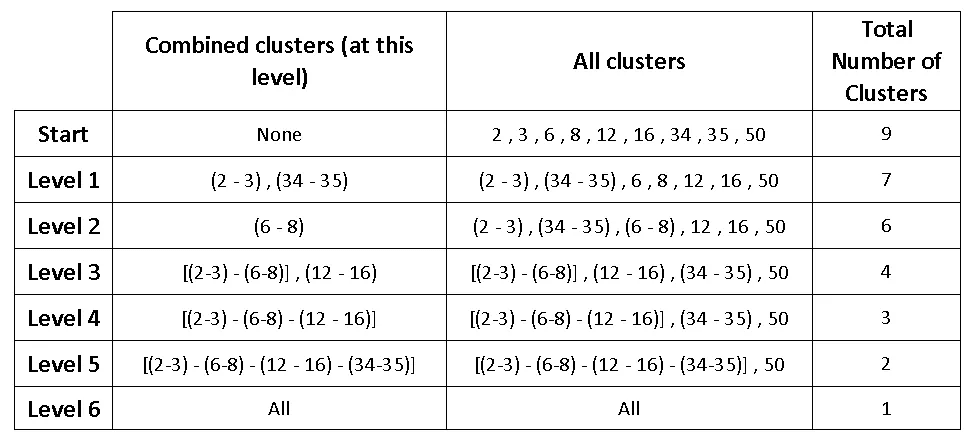
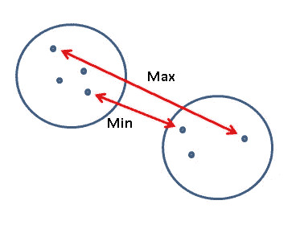
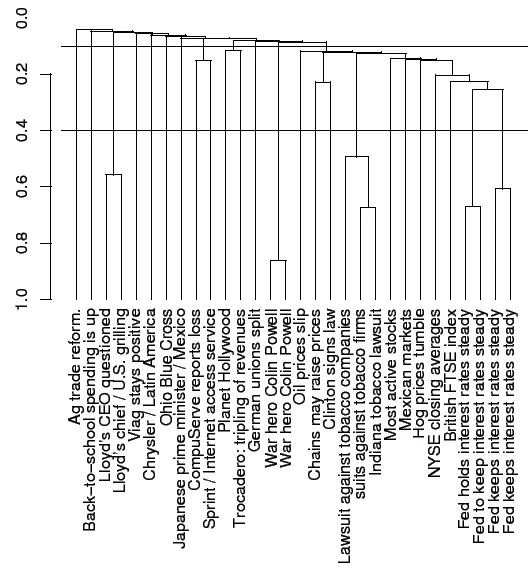
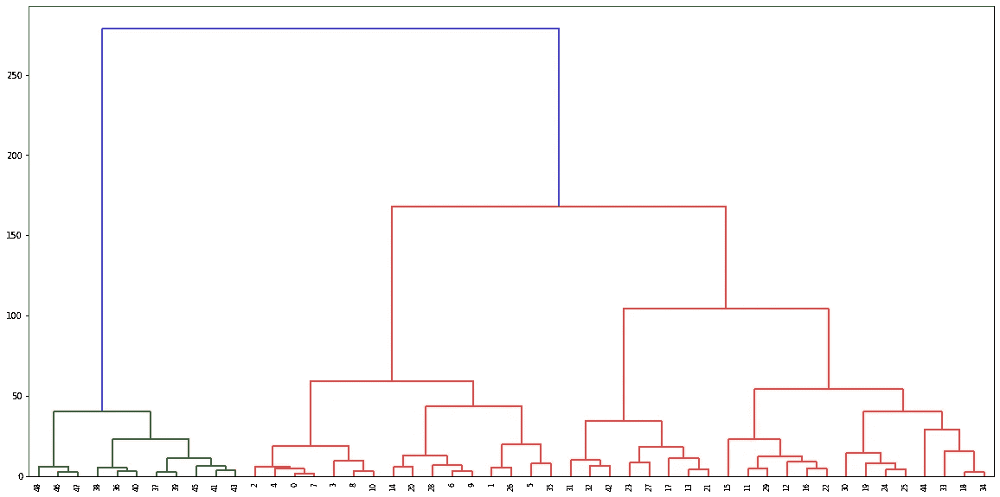

# 分层聚类—已解释

> 原文：<https://towardsdatascience.com/hierarchical-clustering-explained-e58d2f936323?source=collection_archive---------4----------------------->

## 理论解释和科学学习范例

聚类算法是无监督的机器学习算法，因此没有与数据点相关联的标签。聚类算法寻找数据点之间的相似性或不相似性，以便可以将相似的数据点分组在一起。有许多不同的方法和算法来执行集群任务。在这篇文章中，我将介绍一种常见的方法，即**层次聚类**。


由[梅尔·普尔](https://unsplash.com/@melipoole?utm_source=unsplash&utm_medium=referral&utm_content=creditCopyText)在 [Unsplash](https://unsplash.com/s/photos/clusters?utm_source=unsplash&utm_medium=referral&utm_content=creditCopyText) 上拍摄

聚类简单地说就是将相似的事物组合在一起。然而，这并不像听起来那么简单。与聚类相关的挑战之一是，我们几乎总是不知道数据集内的聚类(或组)数量。

分层聚类的优点之一是我们不必指定聚类的数量(但是我们可以)。简短的介绍之后，让我们深入细节。

分层聚类意味着通过迭代分组或分离数据点来创建聚类树。有两种类型的分层聚类:

*   凝聚聚类
*   分裂聚类


# **凝聚聚类**

聚集聚类是一种自下而上的方法。每个数据点首先被假定为一个单独的聚类。然后迭代地组合相似的聚类。让我们看一个例子来解释清楚这个概念。

我们有一个由 9 个样本组成的数据集。我选择与这些样本相关的数字来演示相似性的概念。在每次迭代(或级别)中，最接近的数字(即样本)被组合在一起。如下图所示，我们从 9 个集群开始。最接近的在第一级被组合，然后我们有 7 个集群。与蓝线相交的黑线的数量代表簇的数量。



系统树图

上图称为**树状图**，这是一个表示基于树的方法的图表。在层次聚类中，树状图用于可视化聚类之间的关系。

随着我们往上走，随着更多样本的合并，聚类的数量会减少。在级别 6 之后，所有样本被合并到一个大的聚类下。



这是一个非常简单的数据集来说明目的，但现实生活中的数据集显然更复杂。我们提到“最近的数据点(或聚类)”被组合在一起。但是算法如何识别最接近的呢？在 [scikit-learn](https://scikit-learn.org/stable/modules/generated/sklearn.cluster.AgglomerativeClustering.html) 中实现了 4 种不同的方法来测量相似性:

1.  **沃德连锁**:最小化被合并的聚类的方差。目标是簇形心周围的总方差增加最少。
2.  **平均连锁:**两个聚类中每个数据点的平均距离。
3.  **完全(最大)连锁:**两个聚类中所有数据点之间的最大距离。
4.  **单一(最小)连锁:**两个聚类中所有数据点之间的最大距离。

> 默认选择是 ward's linkage，它适用于大多数数据集。



完整(最大)和单一(最小)联动

层次聚类的优点之一是我们不必预先指定聚类的数量。但是，将所有数据点合并到一个聚类中是不明智的。我们应该在某个时候停止组合集群。Scikit-learn 为此提供了两个选项:

*   达到一定数量的簇后停止( **n_clusters** )
*   设置联动阈值(**距离 _ 阈值**)。如果两个聚类之间的距离超过阈值，这些聚类将不会被合并。

# **分裂聚类**

分裂聚类在现实生活中并不常用，所以我将简单地提到它。简单而清晰的解释是**分裂聚类**是凝聚聚类的反义词。我们从一个包含所有数据点的巨大集群开始。然后数据点被分成不同的簇。这是一种自上而下的方法。

# **利弊**

我将尝试解释层次聚类的优点和缺点，以及与 k-means 聚类(另一种广泛使用的聚类技术)的比较。

**赞成者**

*   不需要预先指定集群的数量。必须为 k-means 算法指定聚类数。
*   借助于树状图，它很容易实现和解释。
*   总是生成相同的聚类。k-均值聚类可能会产生不同的聚类，这取决于质心(聚类的中心)是如何初始化的。

**缺点**

*   与 k-means 相比，这是一种较慢的算法。分层聚类需要很长时间来运行，尤其是对于大型数据集。

# **层次聚类应用**

如果基础数据具有某种层次结构，分层聚类是有用的，并且会给出更好的结果。

分层聚类的一些常见用例:

*   遗传或其他生物数据可以用来创建一个树状图，以代表突变或进化水平。[种系发生树](https://en.wikipedia.org/wiki/Phylogenetic_tree)用于显示基于相似性和差异性的进化关系。如维基百科所述:

> 一个**进化树**或**进化树**是一个分支[图](https://en.wikipedia.org/wiki/Diagram)或[树](https://en.wikipedia.org/wiki/Tree_(graph_theory))，显示了各种生物[物种](https://en.wikipedia.org/wiki/Species)或其他实体之间的[进化](https://en.wikipedia.org/wiki/Evolution)关系，基于它们的物理或遗传特征的相似性和差异性。

这些树也被用来区分不同类型的病毒。

*   层次聚类也用于对文本文档进行分组。然而，由于数据的高维性，这是一项非常复杂的任务。



[使用层次聚类对文档进行聚类](https://nlp.stanford.edu/IR-book/html/htmledition/hierarchical-agglomerative-clustering-1.html)

*   层次聚类的另一个常见用例是**社交网络分析。**
*   分层聚类也用于**异常值检测。**

# **Scikit 学实现**

我将使用在 scikit learn 的数据集模块下可用的 iris 数据集。让我们从导入数据集开始:

```
import pandas as pd
import numpy as np
from sklearn.datasets import load_irisiris = load_iris()
X = iris.data
```

虹膜数据集包括 150 个数据点。我将只使用前 50 个数据点，以便树状图看起来更清楚。

```
X = X[:50, :]X.shape
(50, 4)
```

然后引入凝聚聚类类，建立模型。

```
from sklearn.cluster import AgglomerativeClusteringmodel = AgglomerativeClustering(distance_threshold=0, n_clusters=None)
```

请记住，如果 distance_threshold 参数不为 None，则 n_cluster 参数必须为 None。我不设置任何条件，只是为了可视化一个完整的树。

下一步是使模型符合数据:

```
model = model.fit(X)
```

在绘制树状图之前，我们可以使用可用的方法检查模型的细节:

```
# Number of clusters
model.n_clusters_
50# Distances between clusters
distances = model.distances_distances.min()
0.09999999999999964distances.max()
3.828052620290243
```

Scikit learn 不提供树状图，所以我们将使用 [SciPy](https://docs.scipy.org/doc/scipy/reference/index.html) 包中的[树状图](https://docs.scipy.org/doc/scipy/reference/generated/scipy.cluster.hierarchy.dendrogram.html#scipy.cluster.hierarchy.dendrogram)。

```
from scipy.cluster.hierarchy import dendrogram
from scipy.cluster import hierarchy
```

我们首先创建一个关联矩阵:

```
Z = hierarchy.linkage(model.children_, 'ward')
```

我们使用模型中的孩子和一个链接标准，我选择它作为“病房”链接。

```
plt.figure(figsize=(20,10))dn = hierarchy.dendrogram(Z)
```



叶子的标签是数据点的索引。

我们可以通过调整**距离 _ 阈值**或**n _ 集群**参数来控制集群的数量。让我们检查计算出的集群之间的距离:

```
model.distances_
array([0.1       , 0.1       , 0.1       , 0.1       , 0.14142136,        0.14142136, 0.14142136, 0.14142136, 0.14142136, 0.14142136,        0.14142136, 0.17320508, 0.17320508, 0.18257419, 0.2       ,        0.2081666 , 0.21602469, 0.21602469, 0.25819889, 0.27568098,        0.28284271, 0.29439203, 0.29439203, 0.31358146, 0.31464265,        0.31622777, 0.33166248, 0.33665016, 0.34641016, 0.36968455,        0.40620192, 0.42229532, 0.43969687, 0.43969687, 0.46726153,        0.54772256, 0.59441848, 0.6244998 , 0.6363961 , 0.66269651,        0.77628542, 0.81873887, 0.85556999, 0.90998199, 1.10513951,        1.25399362, 1.37126983, 1.91875287, 3.82805262])
```

距离按升序排列。如果我们可以将 distance _ thresold 设置为 0.8，则聚类数将为 9。有 8 个距离大于 0.8，因此，当组合时，将形成 9 个集群。

```
model = AgglomerativeClustering(distance_threshold=0.8, n_clusters=None)model = model.fit(X)model.n_clusters_
9
```

感谢您的阅读。如果您有任何反馈，请告诉我。

# **参考文献**

*   [https://NLP . Stanford . edu/IR-book/html/html edition/hierarchical-agglomerate-clustering-1 . html](https://nlp.stanford.edu/IR-book/html/htmledition/hierarchical-agglomerative-clustering-1.html)
*   [https://en.wikipedia.org/wiki/Phylogenetic_tree](https://en.wikipedia.org/wiki/Phylogenetic_tree)