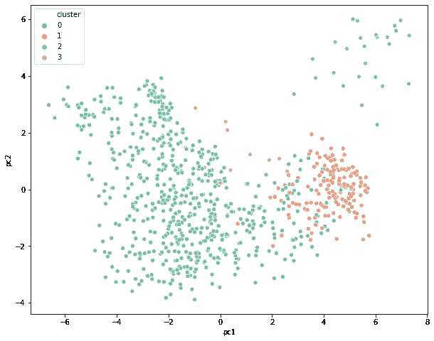

# Python 中使用树状图和共生相关的层次聚类

> 原文：<https://towardsdatascience.com/hierarchical-clustering-in-python-using-dendrogram-and-cophenetic-correlation-8d41a08f7eab?source=collection_archive---------8----------------------->

## 将集群组织为分层树

Pierre Bamin 在 [Unsplash](https://unsplash.com?utm_source=medium&utm_medium=referral) 上拍摄的照片

# 介绍

在本文中，我们将研究 K 均值聚类的另一种方法，通常称为层次聚类。分层聚类技术不同于 K 均值或 K 模式，其中聚类机制如何工作的底层算法是不同的。k 均值依赖于质心和欧氏距离的组合来形成聚类，另一方面，层次聚类使用凝聚或分裂技术来执行聚类。层次聚类允许使用树状图来可视化聚类，树状图有助于通过有意义的分类法更好地解释结果。创建一个树状图不需要我们预先指定聚类的数量。

> 像 R、Python 和 SAS 这样的编程语言允许层次聚类处理分类数据，使得带有分类变量的问题语句更容易处理。

# 层次聚类中的重要术语

## 链接方法

假设在聚类(a)中有(a)原始观测值 a[0]，…，a[| a | 1]，在聚类(b)中有(b)原始对象 b[0]，…，b[| b | 1]，那么为了组合这些聚类，我们需要计算两个聚类(a)和(b)之间的距离。假设有一个点(d)还没有被分配给任何一个聚类，我们需要计算聚类(a)到(d)以及聚类(b)到(d)之间的距离。

现在，聚类中通常有多个点，需要不同的方法来计算距离矩阵。链接决定了如何计算聚类之间的距离，即点到聚类的距离。常用的连接机制概述如下:

1.  单一关联-计算每对聚类中最相似成员之间的距离，然后根据最短距离合并聚类
2.  平均关联-计算一个聚类的所有成员与不同聚类中所有其他成员之间的距离。然后利用这些距离的平均值来决定哪些聚类将合并
3.  完全链接-计算每对聚类中最不相似成员之间的距离，然后根据最短距离合并聚类
4.  中间联系—类似于平均联系，但我们使用中间距离，而不是使用平均距离
5.  Ward Linkage 使用方差分析方法来确定聚类之间的距离
6.  质心连接-通过取分配给聚类的所有点的平均值来计算每个聚类的质心，然后使用该质心来计算到其他聚类的距离

这些距离计算公式如下图 1 所示。

图一。上述连杆机构的距离公式。图像信用——由作者开发

## 距离计算

两个或多个聚类之间的距离可以使用多种方法来计算，最常用的是欧几里德距离。然而，其他距离度量，如闵可夫斯基、城市街区、汉明、雅克卡、切比雪夫等。也可以与分层聚类一起使用。下面的图 2 概述了不同的距离度量如何影响层次聚类。

图二。距离计算和链接对集群形成的影响。图片来源:图片来源——GIF via gfy cat。

## 系统树图

树状图用于表示特征空间中对象之间的关系。它用于显示特征空间中每对顺序合并的对象之间的距离。在决定适合数据集的聚类数量之前，系统树图通常用于研究等级聚类。两个聚类组合的距离称为树状图距离。树状图距离是两个或更多个聚类是不相交的还是可以组合在一起形成一个聚类的度量。

图 3。使用中位数作为连锁类型的层次聚类。图片来源——由作者使用 Jupyter 笔记本开发

图 4。使用平均值作为链接类型的层次聚类的树状图。图片来源——由作者使用 Jupyter 笔记本开发

图 5。使用 Complete 作为链接类型的层次聚类的树状图。图片来源——由作者使用 Jupyter 笔记本开发

## 共生系数

上面的图 3、图 4 和图 5 表明了链接的选择如何影响集群的形成。直观地查看每一个树状图来确定哪个聚类链接工作得最好是具有挑战性的，并且需要大量的人工工作。为了克服这一点，我们引入了同伦系数的概念。

假设有两个群集，a 和 b，点 A₁、A₂和 A₃在群集 a 中，点 B₁、B₂和 B₃在群集 b 中。现在，要使这两个群集分开，点 A₁、A₂和 a 以及点 b、b 和 b 也应该彼此远离。Cophenet 指数是特征空间中的点的距离和树状图上的距离之间的相关性的度量。它通常采用数据中所有可能的点对，并计算点之间的欧几里德距离。(保持不变，与我们选择的链接算法无关)。然后，它计算聚类 A & B 组合的树状图距离。如果这些点之间的距离随着聚类之间的树状图距离而增加，则 Cophenet 指数更接近 1。

图 6。层次聚类中不同链接方法的 Cophenet 指数。图片来源——由作者使用 Jupyter 笔记本开发

# 决定聚类的数量

不像 K 均值算法使用肘形图来确定聚类数，在分层聚类中没有统计技术来确定聚类数。然而，一种常见的方法是分析树状图，并寻找在更高的树状图距离上组合的组。让我们看看下面的例子。

图 7。平均连锁法的系统聚类树状图。图片来源——由作者使用 Jupyter 笔记本开发

图 7 说明了当树在树状图距离为 3 处被切割时，存在 5 个聚类。总的想法是，所有 5 组聚类在一个高得多的树状图距离上组合，因此可以作为单独的组进行分析。我们也可以使用轮廓指数分数来验证这一点。

# 结论

在任何聚类工作中，决定聚类的数量都是一项单调乏味的任务。由于商业方面的业务更侧重于从这些组中获得一些意义，因此在二维空间中可视化集群并检查它们是否彼此不同是很重要的。这可以通过 PCA 或因子分析来实现。这是一种广泛使用的机制，用于向不同的利益相关者呈现最终结果，使每个人都更容易消费输出。

图 8。使用两种不同链接技术的层次聚类的聚类图。图片来源——由作者使用 Jupyter 笔记本开发

*关于作者:高级分析专家和管理顾问，帮助公司通过对组织数据的商业、技术和数学的组合找到各种问题的解决方案。一个数据科学爱好者，在这里分享、学习、贡献；你可以和我在* [*上联系*](https://www.linkedin.com/in/angel-das-9532bb12a/) *和* [*上推特*](https://twitter.com/dasangel07_andy)*；*