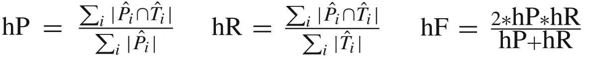
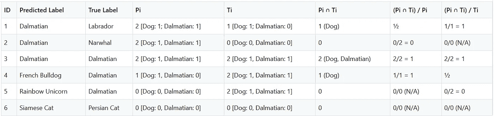

# 分层性能指标以及在哪里可以找到它们

> 原文：<https://towardsdatascience.com/hierarchical-performance-metrics-and-where-to-find-them-7090aaa07183?source=collection_archive---------21----------------------->

## 如何衡量你的层次分类模型的性能？

考尔德 B 在 Unsplash 上拍摄的照片

分层机器学习模型是一个顶级技巧。正如在 [之前的](/hierarchical-classification-with-local-classifiers-down-the-rabbit-hole-21cdf3bd2382) [帖子](/hierarchical-classification-by-local-classifiers-your-must-know-tweaks-tricks-f7297702f8fc)中所讨论的[，在设计我们的模型时考虑数据的自然分类是非常值得的。我们能够使用它们，使我们的模型更智能、更准确，而不是变平并忽略那些内部层次。](/https-medium-com-noa-weiss-the-hitchhikers-guide-to-hierarchical-classification-f8428ea1e076)

“更准确”，我说——然而，他们是吗？我们怎么知道？毕竟，我们是从事科学的人，我们期望大胆的主张能得到数据的支持。这就是为什么我们有性能指标。无论是精确度、f1 分数，还是我们关注的任何其他可爱的指标——如果在我们的模型中使用层次提高了它们的性能，指标应该显示出来。

问题是，如果我们使用常规的性能指标(为平面、一级分类设计的指标)，我们又会忽略数据的自然分类。

如果我们做等级制度，那就一路做下去。如果我们决定庆祝我们的数据的分类，并按照它的形象构建我们的模型，这也需要成为衡量其性能的一部分。

我们如何做到这一点？答案就在下面。

# 在我们开始之前

这篇文章是关于测量为分层分类设计的机器学习模型的性能。它假设你知道所有这些单词的意思。如果没有，查看一下[我的](/https-medium-com-noa-weiss-the-hitchhikers-guide-to-hierarchical-classification-f8428ea1e076) [之前的](/hierarchical-classification-with-local-classifiers-down-the-rabbit-hole-21cdf3bd2382) [帖子](/hierarchical-classification-by-local-classifiers-your-must-know-tweaks-tricks-f7297702f8fc)上的话题。尤其是[介绍主题](/https-medium-com-noa-weiss-the-hitchhikers-guide-to-hierarchical-classification-f8428ea1e076)的那个。真的。在学习如何测量之前，你会想知道什么是等级分类。这是一个很明显的问题。

在这篇文章中，我将根据常见宠物的分类给出一些例子:

常见家养宠物的分类。我的邻居刚刚收养了最可爱的小飞马。

# 哦，这么多指标

因此，我们已经有了一整套层次结构的局部分类器，随时准备执行我们的命令。我们如何评价他们？

这不是一个微不足道的问题，解决办法也不明显。正如我们在本系列前面的问题中看到的，不同的项目需要不同的处理方式。最佳指标可能会有所不同，这取决于项目的具体要求和限制。

总而言之，主要有三种选择。让我们介绍他们，好吗？

参赛者们，带着他们所有的优雅和荣耀:

## 实际的一个:平面分类度量

这些都是我们都知道并喜爱的分类指标(精确度、召回率、f 值——你能想到的),应用起来…嗯，很简单。

与最初的“扁平分类”方法相同(在本系列的[第一篇文章中有所描述)，这种方法完全忽略了层级。只考虑最终的叶节点预测(在我们的家养宠物例子中，这些是特定的品种)，它们都被认为是平等的类，没有对兄弟类和非兄弟类的任何特殊处理。](/https-medium-com-noa-weiss-the-hitchhikers-guide-to-hierarchical-classification-f8428ea1e076)

这种方法很简单，但显然不理想。我们不希望不同等级的错误以同样的方式受到惩罚(如果我把飞马误认为独角鲸，那还不如误认为拉布拉多来得糟糕)。此外，没有一种明显的方法来处理最终预测不是叶节点预测的情况——如果您实现了前面提到的 [**置信阻塞**](/hierarchical-classification-by-local-classifiers-your-must-know-tweaks-tricks-f7297702f8fc) 方法，这种情况肯定会发生。

## 潮人一号:定制尺码

不满意平坦的指标，并感觉到指尖有创意的火花？您可以想象出您自己的特殊度量，它特别适合您独特的用例雪花。

当模型需要适应一些不寻常的业务约束时，这可能是有用的。例如，如果你真的不在乎错误地将狗识别为独角兽，但 Sphynx 猫必须被正确地发现或完全失控，你可以相应地设计你的度量标准，给不同的错误或多或少的权重。

## 自命不凡的一个:常规分类指标的特定于层次的变体

这些都是众所周知的精度，召回和 f 分数指标的变化，特别是适应分层分类。

请原谅我在你的大致方向上抛出一些数学符号:

分别定义了层次精度(hP)、层次召回率(hR)和层次 f-measure (hF)。

然而，这一切意味着什么呢？

**Pi** 是由每个测试实例 I 的**预测的**最具体的类(或多个类，在多标签问题的情况下)及其所有祖先类组成的集合； **Ti** 是由测试例 I 的**真**最特定类及其所有祖先类组成的集合；当然，每个总和是在所有测试集示例上计算的**。**

这一个有点难解开，所以如果你发现自己困惑，检查一下附录，在那里我会更详细地解释。

现在，如果您已经用**非强制叶节点预测**实现了您的模型(意味着预测的最具体级别不一定是最深的级别)，那么需要进行一些调整；我不会在这里深入探讨，但是如果你想了解更多，请告诉我。

# 哪个指标是最佳匹配？

永恒的问题。正如我之前提到的，没有一个显而易见的答案，但这里有我自己对这个问题的想法:

*   **Flat** **metrics:** 这是一个足够简单的方法，但是它丢失了层次结构信息，如果您首先经历了构建层次集成模型的麻烦，您可能会认为这些信息很重要。*我建议只对那些超快超脏的项目使用扁平指标，因为时间限制是一个很大的因素。*
*   **定制的、独特的指标:**可能更合适，但你要付出时间和努力。此外，由于您将使用未经同行评审的指标，您可能会错过一些重要的东西。只有当手头的项目有非常独特的需求，并且在评估模型性能时应该考虑到这些需求时，我才会推荐定制的度量标准。
*   **常见分类指标的层次版本:**这种方法有些直观(一旦你掌握了它的窍门)，对于一个层次模型来说很有意义。然而，它可能不是最适合您自己的用例(例如，没有为最深类的正确/错误预测增加权重——这在某些用例中可能很重要)。它还需要一些额外的实现时间。总而言之，我认为这是一个足够好的预制解决方案，应该是大多数项目的首选。

# 最后

没有性能指标，机器学习模型什么都不是，分层模型需要它们自己的特殊照顾。没有一个最好的方法来度量基于层次的分类:不同的方法各有利弊，每个项目都有自己最适合的方法。如果您已经做到了这一步，那么您很有希望知道哪种方法最适合您的方法，并且一旦您开始使用它，现在就可以测量您的模型了。

这篇文章总结了我关于层次分类模型的四篇系列文章。如果您已经阅读了所有这些内容，那么您应该拥有设计、构建和衡量一个出色的层次分类项目所需的所有工具。我希望你尽可能充分利用它。

*该系列的前几篇文章:*

1.  [*分层分类*](/https-medium-com-noa-weiss-the-hitchhikers-guide-to-hierarchical-classification-f8428ea1e076)
2.  [*用局部分类器进行分层分类:下兔子洞*](/hierarchical-classification-with-local-classifiers-down-the-rabbit-hole-21cdf3bd2382)
3.  [*通过局部分类器进行层次分类:你的必知妙招&招数*](/hierarchical-classification-by-local-classifiers-your-must-know-tweaks-tricks-f7297702f8fc)

Noa Weiss 是一名人工智能机器学习顾问，总部位于特拉维夫。

# 附录

搞不清那些讨厌的等级指标？我是来帮忙的。

在下面的表格中，我回顾了“普通家养宠物”层次模型的模拟结果，**查看了“大麦町”类的度量**(记住:精确度、召回率和 f 分数度量是按类计算的，将标签(预测的和真实的)视为二进制)。

我看了几个例子，检查了每个例子对精确度和召回分数的贡献。记住——最终的精确/回忆分数是所有这些例子的总和。

一次揭开一只狗的层级指标的神秘面纱。

***评论举例*** :

1.  *将一个不同的品种错误地归类为一只斑点狗:召回得满分(因为“狗”的部分被正确识别)，但精确度只有半分(因为“狗”是正确的，但预测的“斑点狗”标签是错误的)。召回不会受到负面影响，因为此处遗漏的“拉布拉多”标签不属于此处测量的[狗、斑点狗]类别。*
2.  将独角鲸错误分类为斑点狗——精确度为零(因为“狗”和“斑点狗”预测标签都是错误的)，但召回指标不受影响，因为真正的独角鲸标签与[狗，斑点狗]类别的测量无关。
3.  *完美预测——预测和回忆都加分。*
4.  *将一只达尔马提亚狗错误地归类为不同的品种:精确度指标得满分(因为“狗”分类器是两个分类器中唯一正确的)，但召回率只有半分(因为“狗”标签被正确识别，但“达尔马提亚”标签被遗漏)。*
5.  一只达尔马提亚狗被误归类为彩虹独角兽:召回率为 0(因为狗和达尔马提亚狗的标签都被遗漏了)，但精确度分数不受影响。
6.  *这个例子没有告诉我们任何关于狗/斑点狗分类器的表现，所以它不影响分数是显而易见的。*

*资料来源* : C.N. Silla & A.A. Freitas， [*跨不同应用领域的层次分类综述*](https://link.springer.com/article/10.1007/s10618-010-0175-9) (2011)，*数据挖掘与知识发现*，22(1–2):182–196