# 分层强化学习:封建网络

> 原文：<https://towardsdatascience.com/hierarchical-reinforcement-learning-feudal-networks-44e2657526d7?source=collection_archive---------37----------------------->

## 让电脑看到更大的画面

约翰·西门子在 [Unsplash](https://unsplash.com?utm_source=medium&utm_medium=referral) 上拍摄的照片

每个任务都可以自然地分成子任务。当我们准备晚餐时，我们不会微观管理我们手的每一个小动作。相反，我们将任务分成更小的部分(取出原料、切割、烹饪、上菜)，然后，我们专注于如何单独完成每一项任务。这种分解的概念启发了强化学习的分层方法。具体来说，封建网络(FuNs)通过使用模块化神经网络在经理和工人之间划分计算。经理给员工分配局部的、具体的目标，以达到最佳的学习效果。与此同时，经理学会了如何最优地*分配*这些子目标，以最好地完成一个“更大的”任务。

在这篇文章中，我们概述了封建网络背后的架构、直觉和数学。

照片由 [Jehyun Sung](https://unsplash.com/@jaysung?utm_source=medium&utm_medium=referral) 在 [Unsplash](https://unsplash.com?utm_source=medium&utm_medium=referral) 上拍摄

# FuN 的建筑

FuN 是一个模块化的神经网络(MNN ),由两个独立的网络组成:经理和工人。这里，我们描述一个具有**离散动作空间**的环境。

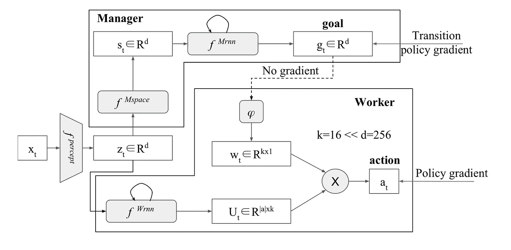

有趣的模块化神经网络架构

该架构可能看起来很密集，因此下面是图表上每个节点所代表的内容:

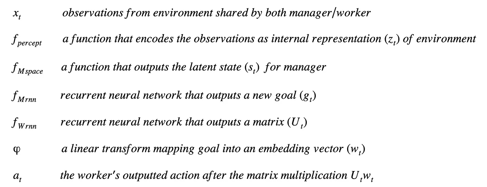

变量定义

退一步仔细分析发生了什么是有用的。给定一个学习任务，我们在两个实体之间分配劳动:MNN 的“经理”和“工人”部分。我们可以看到，变量 *z* 只是我们观察的另一种表示， *x.* 换句话说， *z* 携带的信息与 *x，*相同，只是变量不同而已！我们将相同信息传递给员工和经理，但两者处理信息的方式略有不同。

## 经理

在接收到 *z 之后，*管理器通过将 *z* 传递给另一个函数来创建一个不同的潜在状态( *s* )。这种潜在状态是环境的另一种表现形式，但是在更高的维度上。管理者在比工作者更高维的向量空间中操作，以编码管理者如何考虑更大的画面而不仅仅是局部信息。

然后，管理者将这种潜在状态( *s* )推入一个递归神经网络(RNN)中，从而输出一个员工要实现的目标。此目标代表员工状态的**相对变化。更正式地说:**

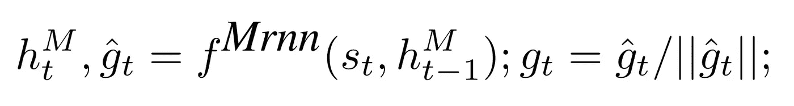

经理 RNN 转发功能

其中 *h* 代表 RNN 的隐藏州。目标正常化后，我们做一些特别的事情。我们**在有限的时间范围内汇集所有的目标*c*，然后将结果无偏差地传递到线性转换中。这有效地从经理的向量空间转换到员工的向量空间，并对经理分配的先前 *c* 目标的表示进行编码。**

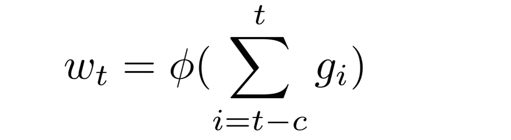

线性变换后的汇集

向量 *w* 有 *k* 个维度和两个关键属性:

*   由于变换没有偏差，它永远不会产生一个不变的非零向量。因此，员工永远不会忽视经理的投入。总有一些“意义”需要工人去提取。
*   由于合用，经理的条件随着时间平滑地变化。这可以防止员工无法理解或处理的目标的任何不稳定变化。

约翰·施诺布里奇在 [Unsplash](https://unsplash.com?utm_source=medium&utm_medium=referral) 拍摄的照片

## 工人

一旦工作者接收到 *z，*它就将 *z* 传递到不同的递归神经网络中。然而，工作者的 RNN 输出矩阵，而不是输出向量。该矩阵有几行和 k 列，行数等于可能的动作数。

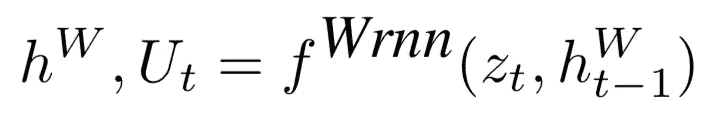

工人 RNN 前进函数

其中每个 *h* 代表 RNN 的隐藏状态。为了开发关于为什么我们输出矩阵而不是向量的直觉，我们看下面的等式:

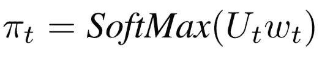

工人的行动输出

这个输出是工人行动的概率分布。然而，让我们换一个稍微不同的视角。假设如果我们选择了相应的动作，那么 *U* 的每一行都对结果状态进行编码。然后，如果我们查看向量 *Uw* ，每个元素都是一行 *U* 和编码目标 *w.* 之间的点积，将点积视为相似性的度量，并且知道 SoftMax 保留相对排序，则该向量具有与实现经理目标的概率成比例的**元素，前提是工人选择该行动。**因此，根据这种分布对动作进行采样是有意义的。

整个转发过程如下图所示。

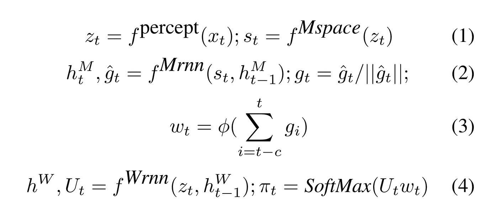

趣味前进

# 它是如何学习的

金伯利农民在 [Unsplash](https://unsplash.com?utm_source=medium&utm_medium=referral) 上拍摄的照片

让我们考虑一下这个。在执行一个动作后，我们会得到一个奖励和另一组观察结果。然后，我们*可以*通过优化工人采取的行动，用 TD-learning 对整个 MNN 进行日常培训。之后，我们也将这些梯度传播给经理。然而，这违背了分层学习的目的，因为管理器的输出 *g* 将**失去所有语义**。这将使乐趣与任何其他网络没有区别，因为 g 只是成为另一个内在的潜在变量。因此，我们改为独立培训经理和工人。

## 经理

直觉上，我们希望经理给员工的目标不仅是随着时间的推移回报最大化，而且是员工可以实现的**。**因此，我们最大化员工状态变化和经理设定的目标之间的相似性度量。

根据以下等式更新 MNN 的经理部分:

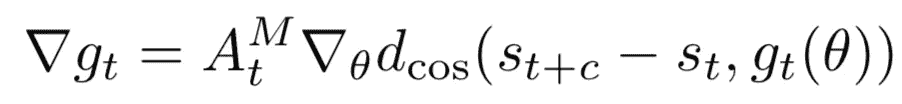

经理政策更新方程式

其中 d_cos 代表两个向量之间的余弦相似度， *A* 是管理者的优势函数， *c* 代表管理者的眼界。通过将相似性度量乘以优势函数，该更新规则**有效地找到了可行性和回报之间的最佳平衡。**使用经理的内部价值函数计算优势，并以类似于其他演员-评论家算法的方式进行更新。经理的奖励函数是根据手头的任务来定义的。

照片由 [sol](https://unsplash.com/@solimonster?utm_source=medium&utm_medium=referral) 在 [Unsplash](https://unsplash.com?utm_source=medium&utm_medium=referral) 上拍摄

## 工人

我们希望鼓励员工遵循经理设定的目标。因此，让我们来定义一种内在奖励:

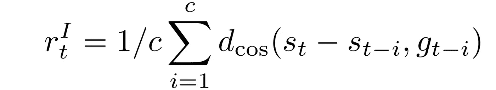

工人内在报酬

这种奖励是员工在有限的时间范围内对经理指示的平均遵循程度。该算法被训练成最大化由环境奖励和给定的内在奖励组成的加权和。利用这些，我们训练工人的价值函数，类似于管理者。然后，我们使用以下内容更新员工的策略:

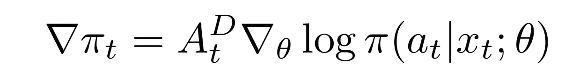

员工政策更新公式

其中我们最大化由优势函数缩放的对数概率。这类似于典型的演员-评论家算法。

该算法指出，经理和员工可能有不同的折扣系数。因此，员工可以更关注眼前的、当地的回报，而经理则关注长期的事件。

# 结果呢

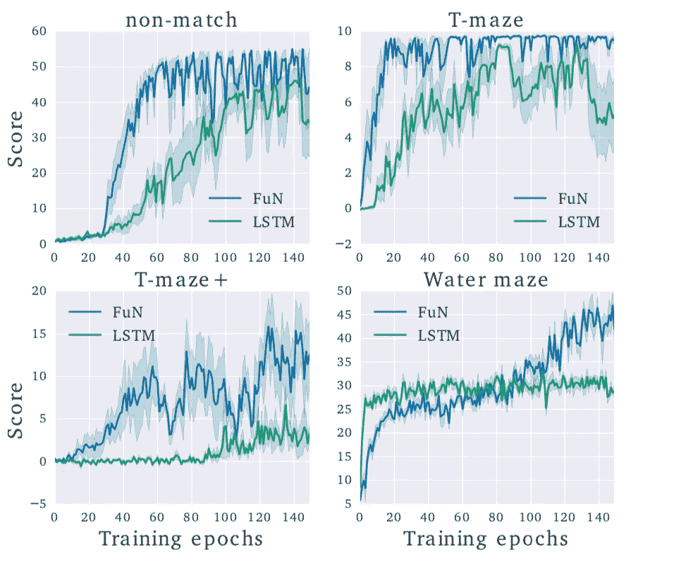

DeepMind 实验室迷宫的有趣表演

FuNs [1]上的论文使用了许多实验来展示算法的鲁棒学习能力，最著名的是在 Montezuma 的《复仇》和 DeepMind Lab 的游戏上。使用 A3C 训练的递归 LSTM 网络作为基线，在这两个实验中，FuN 优于其他方法。

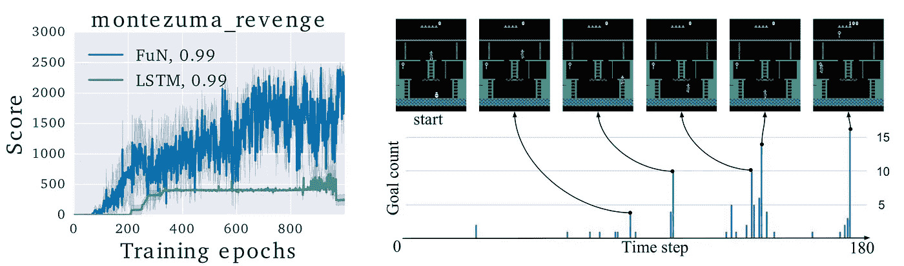

关于蒙特祖马复仇的有趣表演

更令人难以置信的是，乐趣从语义上学习有意义的子目标。在上面的可视化图中，高柱代表经理持续管理的目标，每个目标对应于游戏中的大“转折点”。

# 就是这样！

封建网络为强化学习提供了一个巨大的垫脚石，让代理能够自主分解任务，产生语义上有意义的结果。下一次，我们将探索如何将这个算法扩展到各种多代理框架。

## 参考

[1] A. Vezhnevets，S. Osindero，T. Schaul，N. Heess，M. Jaderberg，D. Silver，K. Kavukcuoglu，[封建等级强化网络](https://dl.acm.org/doi/10.5555/3305890.3306047)学习(2017)，ICML‘17 .

> 从经典到最新，这里有讨论多代理和单代理强化学习的相关文章:

 [## OpenAI 的 MADDPG 算法

### 多主体 RL 问题的行动者批评方法

towardsdatascience.com](/openais-multi-agent-deep-deterministic-policy-gradients-maddpg-9d2dad34c82)  [## DeepMind 的虚幻算法解释

### 最佳深度强化学习

towardsdatascience.com](/how-deepminds-unreal-agent-performed-9-times-better-than-experts-on-atari-9c6ee538404e)