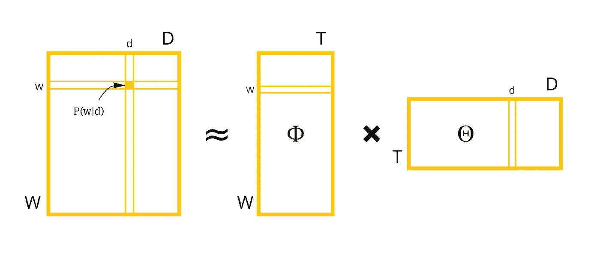
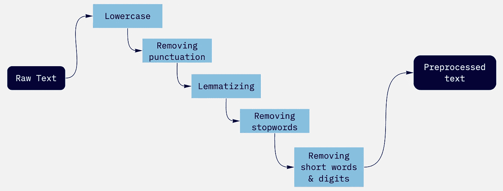
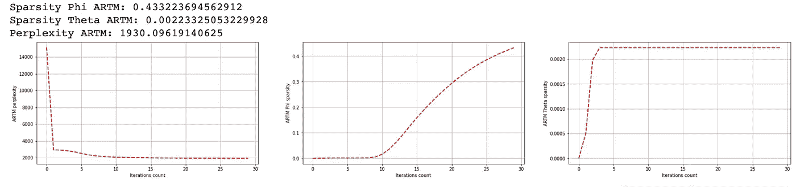
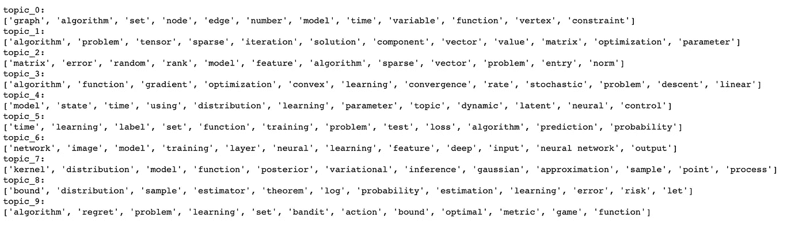
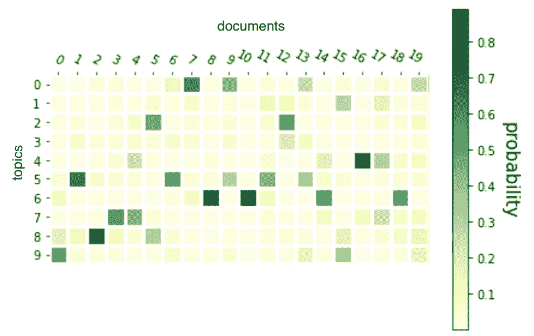
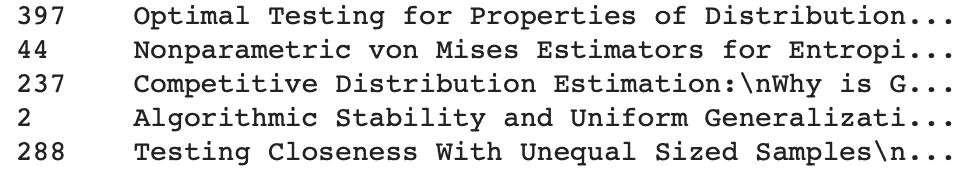
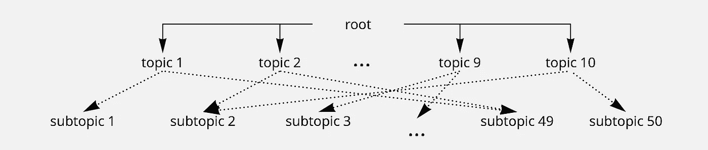
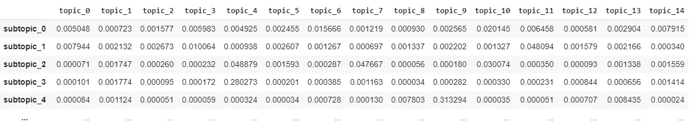

# 基于 BigARTM 库的层次主题建模

> 原文：<https://towardsdatascience.com/hierarchical-topic-modeling-with-bigartm-library-6f2ff730689f?source=collection_archive---------15----------------------->


照片由 Unsplash 上的 Alina Grubnyak 拍摄

主题建模是一种统计建模，用于发现文档集合中的抽象“主题”。LDA(潜在狄利克雷分配)是最流行和最广泛使用的工具之一。然而，我将展示一个替代工具 BigARTM，它为主题建模提供了大量的机会(例如特殊的度量和正则化)。

首先，让我们制定我们的任务。最初，我们有文档中单词的分布，但是我们需要得到主题-单词分布和主题-文档分布。所以，这只是一个随机矩阵分解的任务。



作者的米罗形象

我将使用 NIPS 文件来说明图书馆的原则。

```
df = pd.read_csv(‘./papers.csv’)
all_texts = df.PaperText
all_texts[111]
```

***'* 差分私有子空间聚类\n 宁王、于和阿提辛格\ n 机器学习部… *'***

我们从用流水线预处理数据**开始:**



作者的米罗形象

预处理流水线

***'* 差分私有子空间聚类王艺凝王玉祥阿尔提辛格机器学习部……*'***

现在，我们已经准备好对句子进行分词，获得一个单词包，并进行主题建模。顺便说一句，n-grams 有时对于这个目的非常有用。它们有助于提取成熟的表达方式，更好地理解每个主题。我决定只得到二元模型，但是，你可以选择任何数字。我们将选择文档中出现频率最高的文档。

创造二元模型

**10349**

**['机器学习'，'神经网络'，'下界'，'国际会议'，'上界']**

二元模型似乎很有用，它将帮助我们区分不同的主题。所有的预处理都已经完成，所以我们可以移动到我们的模型。要做到这一点，我们必须创建一个包含文档单词的矩阵，模型将它作为输入。

## ARTM 模型

创建矩阵“文档上的单词”

ARTM 图书馆为你提供了影响学习过程的巨大功能。例如，它允许添加各种正则化器来控制学习过程，并将 phi 和 theta 矩阵变得更加稀疏。在顶层模型中，我添加了一个用于 theta 矩阵的稀疏正则化器和一个去相关器，它可以激发 phi 稀疏性。

此外，我们可以指定我们想要用于评估的度量(这里有 Perxplexity 和 matrices sparstities)。我们添加这些正则项是为了让主题更容易理解，但是我们必须小心翼翼地做，这样只会稍微减少困惑。

让我们看看主要措施:



作者图片

我们现在还可以观看我们已经获得的主题

```
for topic_name in model_artm.topic_names: 
    print(topic_name + ': ' +  model_artm.score_tracker['TopTokensScore'].last_tokens[topic_name])
```



作者图像

每个文档的主题矩阵相当稀疏，所以我们得到了我们所需要的。



作者图片

阅读与特定主题相关的文章会很方便。所以在这里我们可以获得一个按主题概率排序的文章列表。



作者图片

## 建筑层次结构

我们得到的主题似乎相当模糊，尽管我们可以看到它们之间的差异。如果我们对某个特定的主题感兴趣，我们可能想看看这个主题的副主题，并缩小搜索范围。出于这样的目的，我们可以构建一个看起来像树的模型层次结构。我们将只使用一个额外的 50 个主题的水平



作者的米罗形象



作者图片

副标题中的一些单词示例:

**['风险'，'经验'，'度量'，'类'，'推广'，'假设'，'距离'，'估计量'，'性质'，'证明'，'有界'，'预期']，**

**['活动'，'试验'，'神经元'，'尖峰'，'刺激'，'放电'，'神经科学'，'情境'，'潜在'，'反应'，'亚单位'，'放电率']，**

**['训练'，'特征'，'标签'，'对象'，'损失'，'输出'，'分类'，'地图'，'建议'，'数据集'，'输入'，'区域']**

看起来更好！话题开始更加具体。因此，我们可以查看与我们感兴趣的主题最相关的副主题。

```
def subtopics_wrt_topic(topic_number, matrix_dist):
   return matrix_dist.iloc[:, topic_number].sort_values(ascending = False)[:5]subtopics_wrt_topic(0, subt)
```

***subtopic _ 7 0.403652***

***subtopic _ 58 0.182160***

***subtopic _ 56 0.156272***

***副主题 _13 0.118234***

***subtopic _ 47 0.015440***

我们可以像以前一样选择副主题文档。

感谢阅读。我希望我简要地介绍了这个库的功能，但是如果你想更详细地介绍，可以参考文档，其中有很多附加信息和有用的技巧(模态、正则化、输入格式等等)。).

期待听到任何问题。