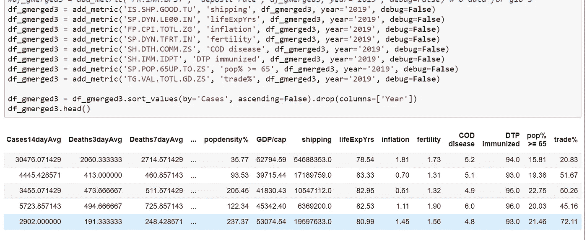

# 基于 SNE 和 DBSCAN 的高维聚类

> 原文：<https://towardsdatascience.com/high-dimension-clustering-w-t-sne-dbscan-dcec77e6a39b?source=collection_archive---------18----------------------->

## 浏览真实世界的数据科学案例—挑战和见解

全球病例——它已经扩散..像病毒一样！

聚类是一组无监督的机器学习方法，用于根据数据的特征将数据分组在一起。例如，使用国家信息(人口统计、社会指标、经济指标等)+ COVID 数据，我们能确定日本更像印度、美国还是波兰吗？

我们将使用 K-Means 和 DBSCAN 聚类模型以及 PCA 和 t-SNE 降维方法进行评估。*回顾我上一篇关于* [***熊猫的文章，使用的是上个月的 COVID***](https://medium.com/analytics-vidhya/learning-pandas-via-covid-analysis-79228efb5413) *数据集。*

# 数据挑战

不出所料，良好的数据始终是首要问题。新冠肺炎已有 2 到 3 个月的历史，数据集面临成长的烦恼。我必须管理的典型事务:

*   周末有数据缺失— *数据人周末不工作*？？
*   列标题错误(日期格式突然改变！)
*   文件格式转换——从拉丁语到 UTF 语&一个随机出现/消失的字节顺序标记(BOM)
*   文件交付时间不一致(数小时后重新编辑文件)
*   不同的源有不同的连接键(“俄罗斯”对“俄罗斯联邦”*当没有可用的 ISO 国家代码时*)
*   某些国家+指标组合缺少数据

每个问题都有一个解决方案/窍门——我们将讨论其中的一些。关键点——你必须有一个嵌入式的**数据质量保证流程**作为你的工作流程/管道的一部分。

下面是我们如何从约翰·霍普斯金的 COVID 数据开始:

初始数据集-约翰·霍普斯金数据集的国家级确诊病例和死亡病例

# 应用窗口函数

我希望每天(国防部)都有病例变化，但数据一致性是个问题(有些天他们没有报告病例，而是把它们集中到第二天，这让国防部很紧张..).取 3 天、7 天、21 天的平均值将有助于平滑每日利率。

Pandas 有一个*滚动*窗口函数，使计算 n 天窗口变得容易:

计算各种滚动平均数(病例和死亡的每日变化)

这有助于消除像圣马力诺这样的小国的懒惰的卫生部门专员在星期六/星期日报告 0 例病例并等到星期一才报告的周末。我为我的目标数据集创建了 3–7–14 个滚动平均值。

使用滚动窗口平滑

# 添加经济和统计指标

我想要更多的特征，如人口和人口密度、铁路和航班数量、通货膨胀率、医院床位等，来添加到我的分析中。WorldBank.org 有一个很长的指标列表，使用我编写的一些函数，很容易获取并合并到我们的数据集中:

破解代码以提取单个指示器(我使用 csv API 而不是 json，因此需要解压缩)

使用添加度量值(..)我们可以运行一系列调用，向我的数据集中添加一系列不同的指标:

每行代表一个国家(第一行是美国，然后是西班牙、意大利、法国和德国)

我增加了 25 个特征——丰富到可以把国家聚集在一起？运行关联矩阵是可视化我们的特征和潜在识别缺陷的好方法:

特征之间的相关性。你真正要做的就是。数据帧上的 corr()！

## 观察结果:

*   航班和铁路与 COVID 高度相关
*   GDP、航运、老年人口适度相关
*   污染、生育率和因疾病死亡人数高的国家呈低度负相关
*   也许病例、死亡及其 3-7-14 天的变异有太多的相关性…

但这就像一个科学实验，所以我们需要假设，测试，验证，并可能再次尝试！

# 缩放至标准化数值范围

大多数 ML 模型需要“缩放”输入，即值的标准化范围。人口以百万为单位，但其他值以小数或%为单位会导致模型偏差。

请注意，美国人口为 3.22 亿→比例为 1.809，西班牙人口为 4600 万→ 0.0267

# 25 维→2 降维(主成分分析和 t-SNE)

聚类分析模型不适用于维数很大的情况(大= 3+)。[维度的诅咒](https://en.wikipedia.org/wiki/Curse_of_dimensionality)详述了它——*tldr；*数据变得稀疏，用于确定彼此“接近”的点的距离算法不再有效。

我们的 25 维数据集可以折叠成 2 维，同时通过使用 **PCA** (主成分分析)或 t**-SNE**(t-分布式随机邻居嵌入)保留关键特征信息。25 →2 维缩减的下图:

二维 PCA 与 t-SNE(在我的 COVID+数据集上)——让你想起 CT 扫描？

主成分分析是一种古老而可靠的方法，而 t-SNE 是最新的东西(你可以从上面的图中看出原因)。解释 PCA & t-SNE 超出了本文的范围。但是参考 Pranay Dave 的[9] nice 俏皮话描述*的一些差异:*

> *****PCA****本质上的工作原理是通过*******分******尽可能基于最高变化域********
> 
> *********【TSNE】****本质上是通过* **分组** ***分*** ***尽可能接近*** *的特点来分*******

# *****聚类(K 均值和 DBSCAN)*****

*****聚类利用您的数据，系统地确定相似性，并将其分组为“聚类”。K-Means 是久经考验的真实模型，而 DBSCAN 是这个街区的新成员之一。*****

*****我为 K-Means vs DBSCAN 创建了自己的一行程序(请随意引用我的话):*****

> *****" **K-Means** 需要选择 K 个聚类，随机尝试各种聚类中心，直到为每个聚类找到到相邻点的全局最佳距离。"*****
> 
> *****" **DBSCAN** 在随机点开始一个新的聚类，并递归地同化ε-范围内的邻居——迭代更多的新聚类，直到所有点都被同化。"*****

*****如下图所示——使用 t-SNE 处理后的数据——K-Means 和 DBSCAN 都可以工作，但 DBSCAN 可以更好地移除噪声点和隔离聚类。两个模型的超参数的微调需要测试(反复试验)。*****

**********

# *****将它们放在一起(模糊减少+聚类)*****

*****所以我们有:*****

*   *****COVID 数据—按国家和日期列出的病例和死亡*****
*   *****计算出的 COVID 3–7–14 DoD 增量*****
*   *****增加了国家级数据，如人口、就业、污染等*****
*   *****使用 t-SNE 将 25 维减少到 2 维*****
*   *****使用 DBSCAN 聚类将国家分为不同的颜色组*****

*****接下来，我们将介绍最后两步——t-SNE 和 DBSCAN 参数的调整以及最终的可视化。*****

## *****t-SNE 调谐:*****

*****SKLearn 的 t-SNE 函数有 1 个超参数要调:**困惑**！多么愚蠢的名字，但它是合适的，因为它是一种模糊(令人费解)的方式来调整#局部与全局点。显然，视觉反复试验是选择正确设置的最佳方式[6]。*****

**********

*****简单的代码产生了一系列不同的困惑的情节*****

*****我尝试了 10-90 的数值范围乘以 10。嗯..挑哪一个..我猜你想要一个 w/可视分割/某种类型的集群。我不得不认为有比这种眼球法更好的方法，但是 30 看起来不错。*****

**********

*****t-SNE 带着不同的困惑——就像随机的墨迹..选一个和你说话的！*****

## *****DBSCAN 调谐:*****

*****这两个超参数是 **eps** 和 **min_samp** ，用于调整集群的数量。设置 **eps** 设置一个簇可以寻找相邻点的半径或最大距离。 **min_samp** param 定义了符合聚类要求的 **eps** 范围内的最小点数。它们一起决定簇的数量和簇的形状。*****

*****注意 DBSCAN 不需要声明每个点-移除一些没有 min_samp 邻居的异常值或在另一个聚类的 eps 范围内的异常值(显示为非彩色点)。与 K-Means 相比，这是一个关键特性/优势。*****

**********

*****构建 n-samp 和 m-eps 参数的可视矩阵的代码*****

**********

*****Hmmm 好乱，挑哪个？我喜欢 eps:1.25 samp:3*****

# *****总装*****

*****通过*困惑*调整使用 **t-SNE** 进行降维后，应用**DBS can**w/hyper-parameters*EPS*和 *min_samples —* 我们应用国家标签并放大以查看哪些国家聚集在一起。我们可以观察(添加所有标签是有噪声的，所以我添加了一个随机集):*****

**********

*****不要介意颜色的变化，这是随机过程的一部分…*****

## *****观察结果:*****

*   *****美国、法国和意大利紧密地聚集在绿色区域(G10 似乎聚集在一起)*****
*   *****俄罗斯、加拿大、中国、印度等被剔除——为什么？*****
*   *****中国和印度在右下方——有意思？*****
*   *****日本和白俄罗斯、波兰等分在一组——奇数？*****
*   *****相当多的国家按地理位置分组(巧合的是，中东、东南亚、拉丁美洲——为什么？)*****

# *****进一步分析/潜在问题和作业*****

*****嵌入 t-SNE 的尺寸/特征的选择可能比参数的调整更重要。如果有更多的时间，我会专注于确保我们的模型输入有正确的特性。*****

## *****下一步(如果你选择接受任务):*****

*   *****放弃一些高度相关的特征(如 3–7–14 天的病例/死亡)*****
*   *****衡量每个特性的影响(可以应用 LIME 或 Shapley 吗？)*****
*   *****尝试在一个 3-D 互动的情节上可视化(PlotLy/Seaborn 有更好的 3D 素材)*****
*   *****添加不同的指标或其他 COVID 病例数据*****

*****尝试所有这些方法，并在你的结果中留下评论。如果你有数据机器人或 H2O，你的生活将会大大简化:)*****

*****玩得开心！*****

# *****参考资料:*****

*   *****[0] — **介绍有 COVID** 的熊猫，作者 [Doug Foo](https://medium.com/analytics-vidhya/learning-pandas-via-covid-analysis-79228efb5413)*****
*   *****[1] — **本文代码/笔记本**，在 [GitHub](https://github.com/dougfoo/machineLearning/blob/master/covid/COVID-global-clustering.ipynb) 上*****
*   *****[2] — **约翰·霍普斯金**全球 COVID 数据，在 [GitHub](https://github.com/CSSEGISandData/COVID-19.git) 上*****
*   *****[3] — **USAfacts** 美国地区 COVID 数据，关于[USAfacts.org](https://usafacts.org/visualizations/coronavirus-covid-19-spread-map/)*****
*   *****[4] — **国家指标**，载于[世界银行](https://data.worldbank.org/indicator)*****
*   *****[5] — **降维**，作者 [DJ Sarkar](/the-art-of-effective-visualization-of-multi-dimensional-data-6c7202990c57?source=bookmarks---------1------------------) (他是 DS/ML 文章的忠实粉丝)*****
*   *****[6] — **微调 t-SNE** ，作者[克里斯·奥拉](https://distill.pub/2016/misread-tsne/)*****
*   *****[7] — **PCA 和 K-Means 教程，**作者 [Dmitriy Kavyazin](https://medium.com/@dmitriy.kavyazin/principal-component-analysis-and-k-means-clustering-to-visualize-a-high-dimensional-dataset-577b2a7a5fe2)*****
*   *****[8] — **聚类介绍视频**，希利&麦金尼斯在 [Youtube](https://www.youtube.com/watch?v=ayZQj4llUSU&t=1824s) 上发布*****
*   *****[9] — **PCA vs t-SNE** ，作者[普拉纳夫·戴夫](/pca-vs-tsne-el-clásico-9948181a5f87)*****