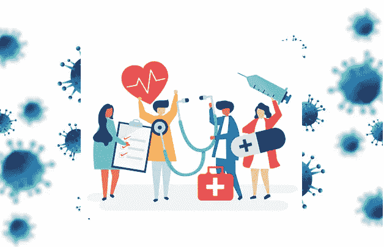
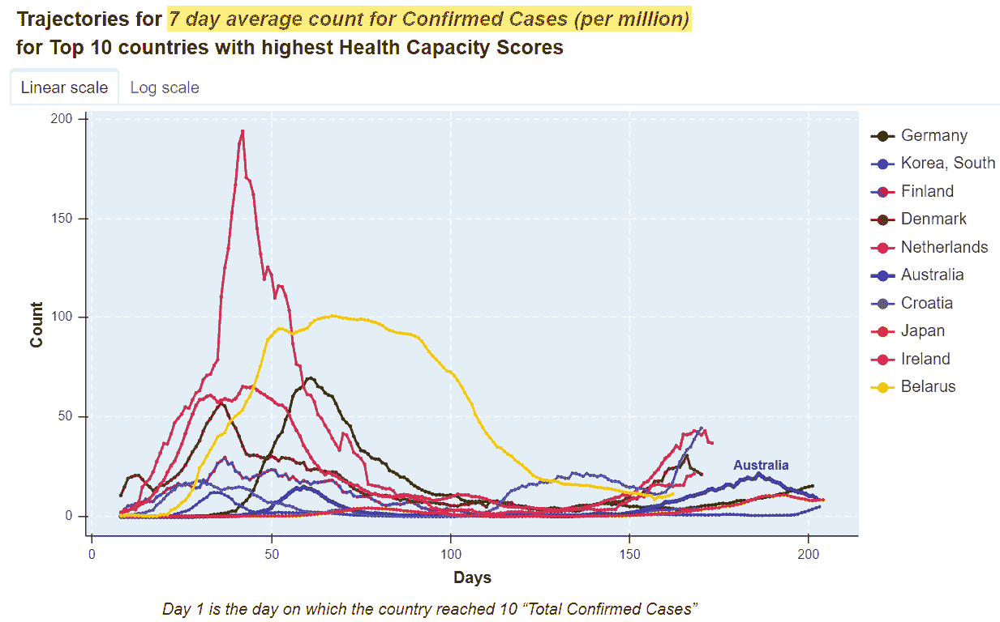
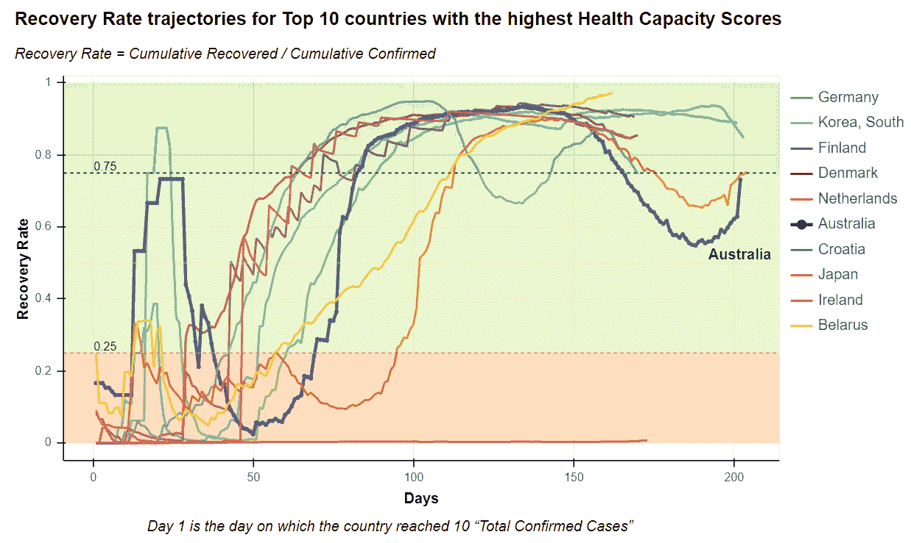
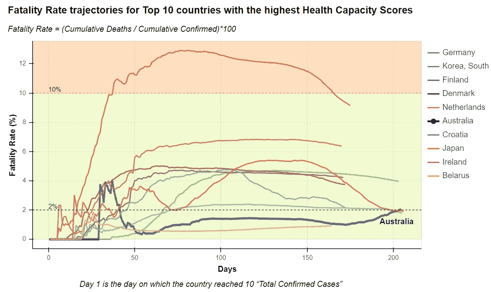
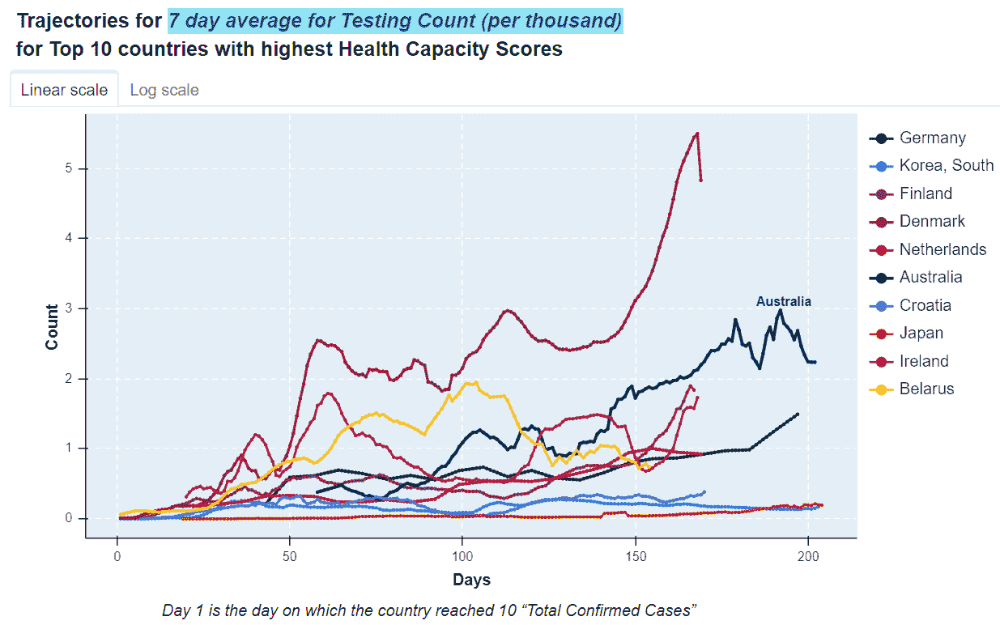
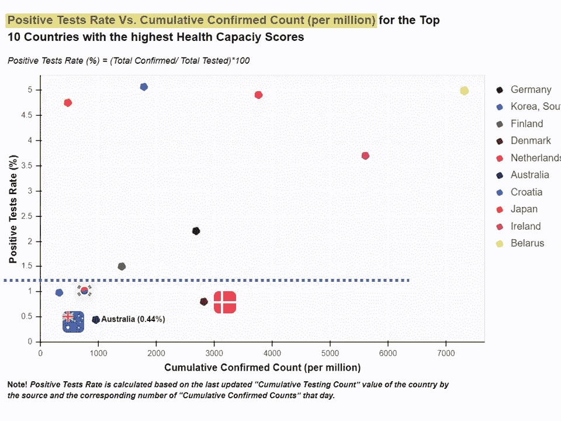

# 高医疗能力是抗击新冠肺炎的一个重要因素

> 原文：<https://towardsdatascience.com/high-healthcare-capacity-is-an-important-factor-in-combating-covid-19-b78dcb0b74e9?source=collection_archive---------76----------------------->

## 比较新冠肺炎对澳洲和其他拥有顶级医疗保健能力的国家的影响

图片来源:freepik

*作者:纳米塔·希巴&凯瑟琳·洛佩斯*

自从新冠肺炎疫情于 2019 年 12 月在中国爆发以来，整个世界都在与这场前所未有的疫情进行斗争。不同国家在不同时期实施了封锁、关闭边境、宵禁等措施。由于没有一个国家对此做好充分准备，这些国家的卫生保健能力受到了不同程度的挑战。在平息了第一波之后，澳大利亚(像许多其他国家一样)不幸地经历了第二波。这给我们世界级的卫生系统带来了巨大的压力。

> 没有一个国家具备足够的卫生能力来应对这一挑战，包括像澳大利亚这样在诊所、医院和社区护理中心拥有顶级**卫生能力的国家**。

# 数据

我们在本次研究中使用的新冠肺炎公共数据如下:

*   确诊病例、死亡病例、痊愈病例数据来自[约翰·霍普斯金大学](https://github.com/CSSEGISandData/COVID-19/tree/master/csse_covid_19_data/csse_covid_19_time_series)
*   测试数据来自[我们的世界中的数据](https://github.com/owid/covid-19-data/tree/master/public/data/testing)
*   人口和人口密度数据来自[世界人口统计](https://www.worldometers.info/world-population/population-by-country/)
*   来自全球健康安全指数网站[的健康能力得分](https://www.ghsindex.org/)，这是该国诊所、医院和社区护理中心的健康能力指数

# **包括澳大利亚在内的卫生能力最高的 10 个国家**

澳大利亚在卫生能力得分最高的前 10 个国家(德国、南韩、芬兰、丹麦、澳大利亚、荷兰、克罗地亚、日本、爱尔兰和白俄罗斯)中排名第 ***第 5***，即**诊所、医院和社区护理中心的卫生能力**，这是 **:** 的一项指标

*   ***更广泛的医疗保健系统可用的人力资源:*** *每 10 万人拥有的医生；每 10 万人拥有护士和助产士；更新卫生人力战略，解决人力资源短缺问题*
*   ***设施容量:*** *每 10 万人医院床位数；隔离高传染性疾病患者的国内能力*

# 基于确诊病例数的比较

在澳大利亚，与其他 9 个国家相比，第一波新冠肺炎开始并达到高峰的时间相对较晚。如下图 1 所示，澳大利亚和德国的确诊病例数(每百万)在这两个国家出现首例 10 例确诊病例后一个月左右开始急剧上升。

在曲线变平之前，包括澳大利亚、韩国和芬兰在内的这 10 个国家中的 50%已经成功地将第一波的规模限制在每百万确诊病例的 7 天平均计数的非常低的数字(~50)。虽然一些国家如爱尔兰在第一波中经历了大量的病例，但是这些国家中的大多数已经成功地控制了第二波，每百万人中确诊的病例数较低。澳大利亚、荷兰和丹麦已经正式进入第二波。

图 1:所列 10 个国家每百万确诊病例的 7 天平均计数

# 基于回收率的比较

尽管这些国家的确诊病例总数存在差异，但第一波期间的恢复率显示出显著下降，但随后大多数国家在 3 个月内收敛到 90%左右。然而，当第二波袭击澳大利亚时，恢复率再次下降，很可能是由于大量新的确诊病例。如下图 2 所示，澳大利亚和日本在经历了一段时间的下降后，恢复速度有所提高。较低的恢复率可能表明社区中存在大量活跃病例。更好的卫生保健能力当然有助于照顾患病人口和提高康复率，但这并不能提供保证。

图 2:列出的 10 个国家的回收率

# 基于致死率的比较

在第一波下降后，澳大利亚在 10 个国家中实现了几乎最低的死亡率，这反映了该国装备良好的医疗保健系统的力量，包括可用的人力资源和所需的设施能力，这有助于治疗大多数患者，从而降低了死亡人数。然而，由于死亡发生在感染开始/检测之后，与当前活跃病例相对应的死亡的真实值可能会在一段时间后得知，因此，由于澳大利亚第二波流行，死亡率可能会在未来
天进一步上升，如下图 3 所示。

图 3:列出的 10 个国家的死亡率

# 基于测试的比较

检测的重要性已经在世界范围内得到认可，拥有高医疗保健能力的国家通常具有进行大量检测的优势。如下图 4 所示，描述了 10 个国家每千人 7 天的平均累积检测次数，很明显，随着时间的推移，澳大利亚逐渐但显著地增加了检测次数。最近的趋势表明，与该集团中的其他国家相比，澳大利亚的每千人检测制度更加严格，这使澳大利亚成为仅次于丹麦的第二个国家，丹麦从疫情开始就一直在进行严格的检测。

图 4:列出的 10 个国家的每千人 7 天测试计数

大量的检测有助于在向其他人的传播尚未发生或仅限于少量传播的早期阶段识别阳性病例，从而通过及时追踪、隔离和检疫控制潜在的传播。由于大量测试可能无法提供信心或疾病传播程度的清晰图像，我们还研究了测试阳性率，即所有测试中总阳性病例的比率。下图 5 显示，与其他 9 个国家相比，澳大利亚除了达到最低的检测阳性率(0.44%)外，还进行了大量的千人检测。韩国(0.98%)和丹麦(0.80%)是另外两个检测阳性率非常低(低于 1%)的国家，由于对较低的传播率有较高的信心，它们对安全重新开放社区相对更有把握。虽然澳大利亚正在经历第二波疫情，但一旦我们能够控制热点地区(如墨尔本)的新增病例，并提供广泛的检测和高卫生能力，我们也将处于社区重新开放的有利位置。

图 5:10 个国家的阳性检测率

# 摘要

总结我们的研究结果，与世界上卫生能力最好的其他国家相比，澳大利亚在控制新冠肺炎确诊病例方面做得相对较好。除此之外，澳大利亚在进行大量检测方面也做得很好，实现了
最低的检测阳性率，并且与该集团的其他国家相比，将死亡率保持在较低的水平。然而，尽管我们装备精良，准备充分，拥有强大的医疗体系，但我们不能在与新冠肺炎的战斗中休息和放松。

> 在疫情期间，我们应该感谢有一流的医疗保健系统支持我们，我们都会照顾好自己，并保持受到保护，在这场与新冠肺炎的战斗中尽我们的一份力量来保护澳大利亚的安全！

[*Namita Chhibba*](https://www.linkedin.com/in/namita-chhibba-2308/)*是一位年轻、上进、鼓舞人心的数据科学家，他和我一样热衷于探索数据和利用新冠肺炎数据获得见解，并帮助人们更好地了解新冠肺炎。*

*欢迎访问*[*ka ggle repo*](https://www.kaggle.com/namitachhibba/covid-19-data-analytics-project)*，我们欢迎您的反馈和意见。*