# 面向机器的高中数学:微分编程

> 原文：<https://towardsdatascience.com/high-school-math-for-machines-differentiable-code-5f588140b148?source=collection_archive---------43----------------------->


子符号人工智能的符号:梯度(∇)代表关于机器学习系统所有参数的导数，是梯度下降算法的核心。(来源:半脑来自 [Seanbatty (Pixabay)](https://pixabay.com/de/illustrations/k%C3%BCnstliche-intelligenz-ai-roboter-2228610/) ，作者修改加框)

可微分编程让机器学习世界运转起来。PyTorch、TensorFlow 和任何其他现代机器学习框架在实际学习时都依赖于它。任何对人工智能感兴趣的人都有足够的理由去熟悉可微分编程。我们邀请您跟随我们，通过两个部分来解释推动当今人工智能行业大部分发展的概念框架。不需要博士！

可微分编程对机器学习至关重要，因为它是梯度下降的基础，梯度下降是一系列优化算法，在机器学习模型的训练中做繁重的工作。形容词*可微分*来源于名词*微分，*计算导数的数学过程。是的，你高中微积分课上学到的好的老导数。事实上，当涉及到人工智能时，你会在高中数学上取得惊人的进步。比如我们下面会看到，名字*梯度下降*中的*梯度*本质上是导数的集合。

为了使用梯度下降训练一个中等规模的深度神经元网络(DNN)，你必须计算*许多*导数。这就是为什么训练效率取决于高效区分的能力。进入*自动*微分(AD)。AD 是计算机计算导数的方式。AD，尤其是其所谓的反向模式(又名反向传播)，是当前人工智能淘金热背后的算法驱动力。没有它，严肃的机器学习应用将是不可行的——更不用说盈利了——即使是在现代的云基础设施上。事实上，如果你看到一个深层神经元网络在任何地方运行，它已经被反向模式 AD 训练过了。

今天的帖子将回答以下问题:

*   什么是软件 2.0，为什么可微分编程的概念可能比机器学习更重要？
*   我高中的微积分课和梯度下降(机器学习的工作马)有什么关系？
*   区分代码是什么意思？我们怎么可能计算一段 Python、Scala 或 C 代码的导数呢？
*   为什么差异化可以而且应该自动化？

# 软件 2.0，或填空编程

随着机器学习在 2010 年代末成为常态，Yann LeCun 或 Andrej Karpathy 等人工智能名人推广了软件 2.0 的想法:如果神经元网络这种特殊的计算机程序可以根据足够的训练数据来学习它们的最佳参数，那么我们为什么不设计所有的*程序来根据描述它们正确行为的数据来优化它们自己呢？*

为了说明这个想法，想象所有可能的程序的空间——巨大的程序空间，其中每个可能的计算机程序都由一个点来表示。软件 2.0 不是修复整个程序，而是选择程序空间的一个子集——一个可参数化的可能程序类——并让计算机在这个类中找到最佳选择。这就是安德烈·卡帕西所说的[【填空编程】](https://twitter.com/karpathy/status/1000488820372996096)。你定义框架，软件 2.0 描绘画面。

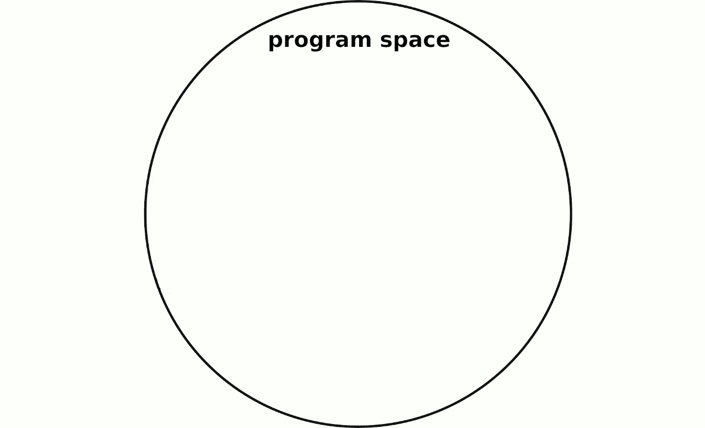

*可区分程序在程序空间的子集内自动优化。(受* [*软件 2.0*](https://medium.com/@karpathy/software-2-0-a64152b37c35) *启发，A. Karpathy，2017)(来源:作者)*

但是你如何向计算机解释你认为什么是最佳的呢？在这里，事实证明，计算机毕竟与人类软件开发人员没有什么不同。比起对软件需求的模糊口头解释，大多数开发人员更喜欢客观可测试的规范，准备集成到自动化测试套件中。因此，当我们为我们的软件 2.0 提供一大组测试时，计算机系统地尝试各种具体的程序，描绘出它的程序空间子集。对于这些程序中的每一个，它通过满足测试套件的程度来衡量它离最佳程序有多远。

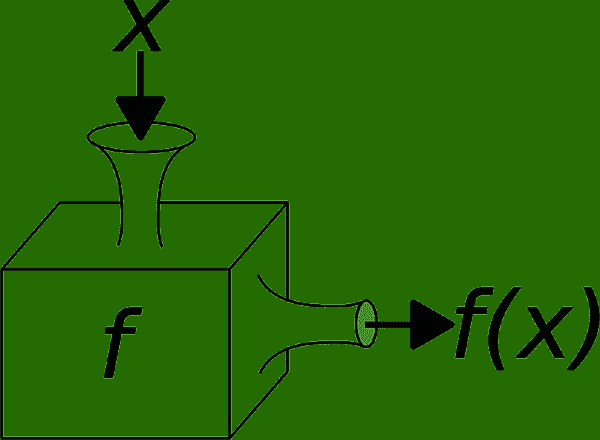

从测试人员的角度来看程序。(来源:作者)

为了让这种方法工作，我们必须通过使用一种特殊的测试来帮助计算机，所谓的*软单元测试* (SUT)。SUT 基本上是你常规的单元测试，唯一的区别是它不会给你一个二元的反应(绿灯表示成功，红灯表示失败)，而是计算一个分数来量化你离期望值有多远。例如，测试加法时，SUT 会告诉你 2+2=4.1 比 2+2=-11 的误差小。

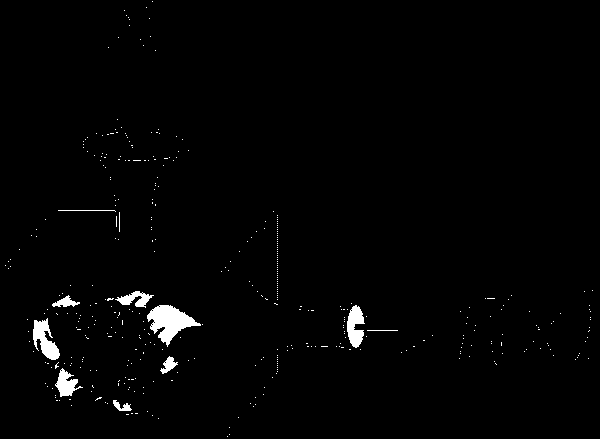

*把黑匣子切开，露出它的内部参数。(来源:作者)*

从测试人员的角度来看，程序是一个将输入转换成输出的黑匣子。给定一些输入 *x* ，它产生一个输出 *f* ( *x* )。当然，如果你打开黑盒，你会发现大量的内部参数。在传统的程序中，所有这些参数都是固定值。然而，在软件 2.0 中，通过调整这些参数，程序在程序空间中“移动”。


经过 n 次软单元测试的软件 2.0 程序调整其内部参数，以匹配输出 f(xᵢ和期望 yᵢ.(来源:作者)

每个 SUT 包括一个输入 *x* 和一个输出 *y* 。输入被插入到程序中，程序从中产生输出 *f* ( *x* )。将此输出与预期结果进行比较，当两个值大致相等时，将获得高分。比较的结果被反馈到软件 2.0 算法中，在该算法中，比较的结果被用于调整参数以逐渐提高测试分数。 *y*

在一次相对短暂的炒作之后，术语软件 2.0 并没有像发明者希望的那样成为热门词汇。然而，如果你在过去十年中接近过机器学习人群，你可能听说过软件 2.0 的最相关的子类:*可微分代码*，有时写成∂Code („∂是部分微分的象征)。

软件 2.0 一般描述自优化代码，而可微分代码是通过梯度下降方法自优化的代码。可区分代码如何帮助我们优化程序？天真地，我们可以随机尝试各种参数设置，直到我们合理地确定我们可以忍受剩余的误差。但这至少有两个主要问题。首先，程序空间的完全参数化子集通常是巨大的。即使只有一个连续的参数，理论上我们有无限多的选择。第二，每当我们找到一个看似不错的解决方案时，我们怎么能确定它旁边没有更好的解决方案呢？

这些都是古老的问题，绝不是机器学习所特有的。在数学中，这样的优化问题比比皆是。站在牛顿和莱布尼茨这样的巨人的肩膀上，我们可以用今天高中的数学知识来理解其中的大部分。

为了说明这些问题及其解决方案，让我们先来看一看可微编程。

# 第一可微程序

*(本节思路改编自* [*可微函数编程*](https://www.youtube.com/watch?v=igRLKYgpHy0) *，N. Welsh，2018)*

想象你必须写一个相当简单的程序。要求如下:程序必须接受单个浮点数作为输入参数 *x* 。从这个输入，它必须产生一个输出 *y* ，另一个浮点。给你 200 个描述所需行为的软单元测试。每个测试由一个输入 *x* 和一个期望输出 *ŷ* 的对( *x* ， *y* )定义。

因为单元测试是软的，所以必须有一个衡量程序在每次测试中表现好坏的标准。为此，我们引入了评分标准

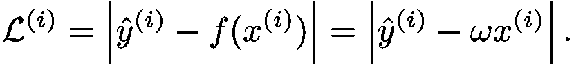

公制𝓛⁽ⁱ⁾是第 *i* 次测试的所谓*损失*。最理想的情况是，它应该是零，因为这样输入 *x* ⁽ⁱ⁾将完全匹配预期输出 *ŷ* ⁽ⁱ⁾.我们程序的整体测试套件性能指标𝓛就是所有 200 个𝓛⁽ⁱ⁾的总和，或者，用数学家的 for-loop 来说，

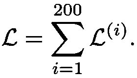

𝓛越小，我们的整体表现越好。由于测试是成对的数字，我们可以在一个二维图中可视化所有 200 个，输入在 *x* 轴上，输出在 *y* 轴上。让我们假设您的测试数据如下图所示:

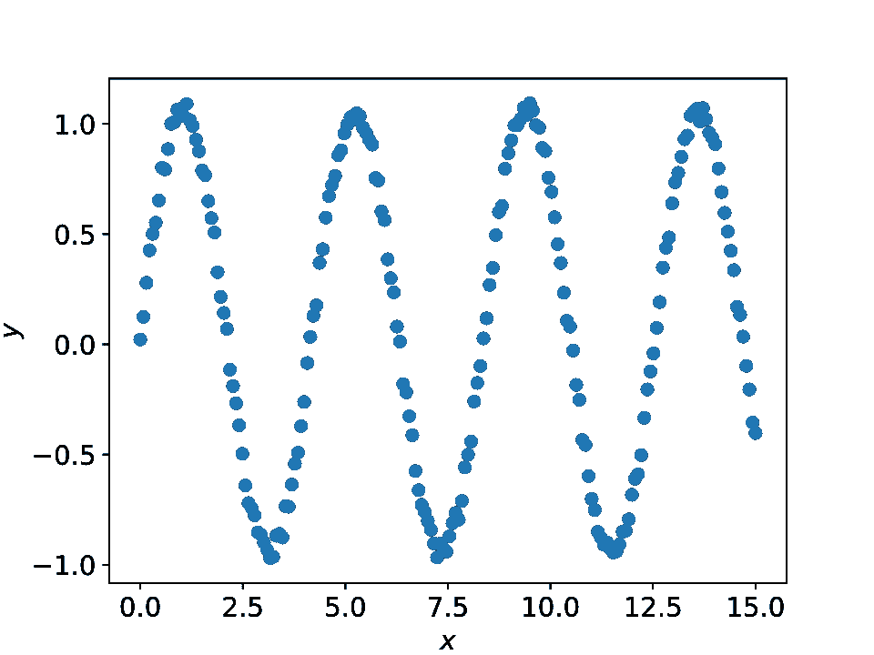

200 个软单元测试的图表。每个点代表一对输入和期望输出。(来源:作者)

现在，在您将开发任务交给算法之前，还有最后一个重大决策要做:选择一个合适的程序空间连续子集来搜索最优值。

考虑到测试套件中输入-输出关系的正弦性质，我们有一种预感

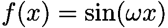

可能是个不错的选择。该函数中只有一个内部参数: *ω* (这是一个小写的“omega”)，表示正弦的频率。因此，我们看到的是程序空间的一维子集，你可以把它想象成从 *ω* =-∞到 *ω* =∞的一条线，就像*x*-轴从 *x* =-∞到 *x* =∞。

每个可能的 *ω-* 值对应我们程序的另一个版本 *f* ( *x* )。假设我们将 *ω* 设为 12.345，那么我们的程序就变成了

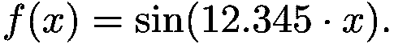

所以，我们来试一试吧！让我们选择一些*ω*-值，看看我们是否不能满足所有那些单元测试。

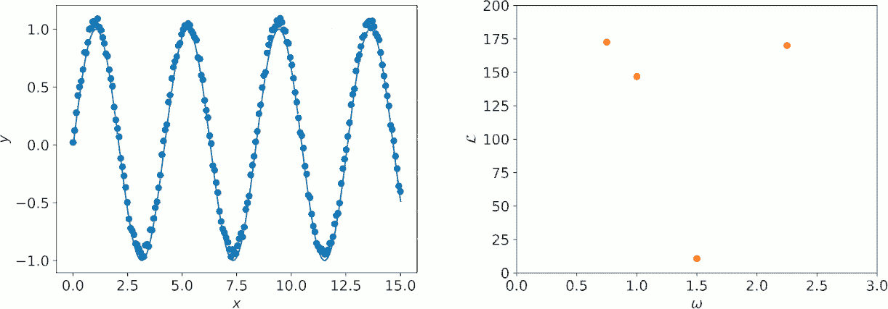

*测试参数值ω=0.75、2.25、1.0 和 1.5 的套件性能。左:程序的输出(实线)与预期的输出(圆点)。在一帧中，左侧的三个橙色条表示三个示例点的逐点误差ℒ⁽ⁱ⁾。右图:每个ω值的𝓛-score。*

通过看上面的动画， *ω* = 1.5 是目前为止最好的结果。但是，比如说，在 1.54321，会有更好的解决方案吗？在这个例子中，没有。然而在现实中，通过随机选择，你可能已经尝试了几十或几百次来找到一个足够好的解决方案，你可能仍然没有达到非常接近正确的 1.5。

如何才能走出这个困境？考虑损失度量𝓛.这个函数中的参数，也就是*未知数*是什么？尽管有 200 个 *x* - *y* 对，𝓛的结构非常简单。不可否认，对于一个人来说，写出 200 项的总和(每个 SUT 一项)有点难，但是对于计算机来说，200 项的总和并不比两项的总和更可怕。剩下的就是一个简单的单参数函数，𝓛( *ω* 。如果你看看上面的定义，你会发现它完全由测试套件的 x⁽ⁱ⁾-和ŷ⁽ⁱ⁾-values.决定这意味着，根本不需要随机采样参数值。你已经知道了函数在*每一点的值！*你可以很容易地绘制出𝓛( *ω* )，就像其他任何函数一样:

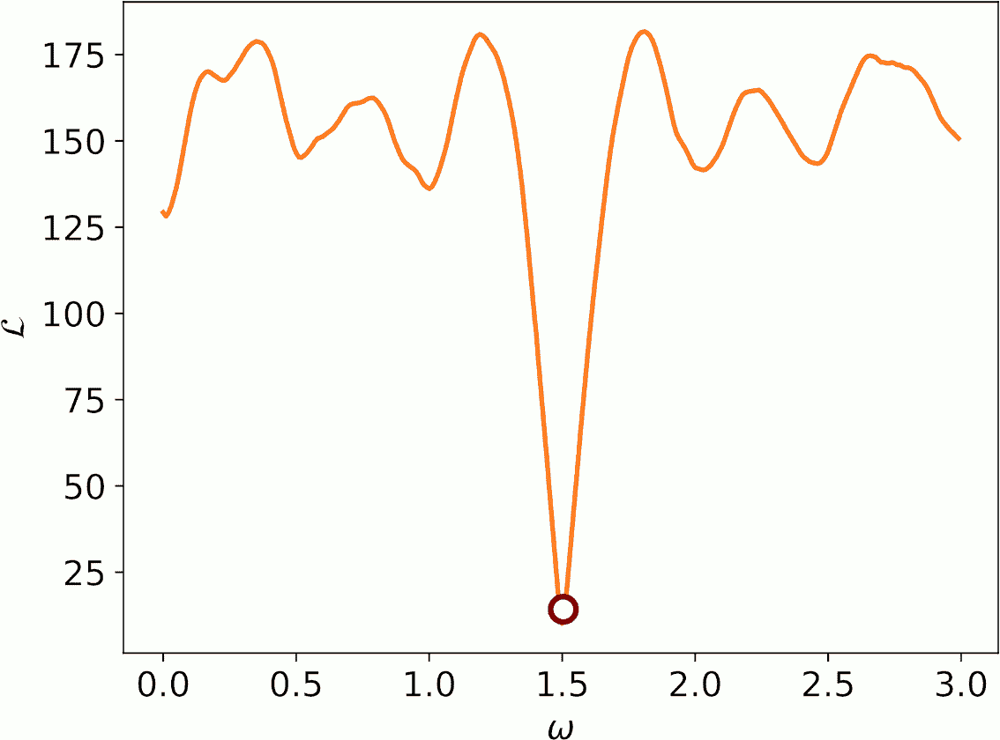

*程序的整体测试套件性能(损失分数)作为频率参数ω的函数。(来源:作者)*

因此，要找到最优的 *ω* ，只需找到函数𝓛( *ω* 的最小值。寻找极小值——等一下，我们在高中微积分课上不是一直在这么做吗？确实如此。这与衍生品有关。幸运的是，𝓛( *ω* 不仅结构简单，而且*可微*。术语*可微*的意思是你可以计算𝓛( *ω* 的导数。事实上，我们在这里的小例子被称为*可微*编程的全部原因是，我们想要优化的函数𝓛( *ω* 是可微的，让我们刷新微积分记忆，看看导数如何帮助我们系统地优化。

# 微积分概述

函数 *f* ( *x* )在点 *x* 的导数测量函数的局部斜率。你可以把导数看作一个工具，它总是告诉你函数的上下位置。事实是，要理解梯度下降和可微规划的基本思想，你只需要知道这些。

更正式地说，如果对参数的导数大于 0，这意味着你将通过增加参数来上坡。如果小于 0，说明你会通过增加参数走下坡路。

为了了解导数与斜率的关系，让我们看看它的定义。通常，导数被写成*f*’(读作:“eff prime”)并被定义为数学极限的形式

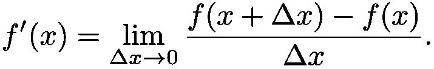

你可以把导数想象成一条从点( *x* 、 *f* ( *x* ))到(*x*+*δx*、*f*(*x*+*δx*))的直线的斜率，随着你减少水平距离*δx、*使这些点越来越靠近。在数学极限 *x* 、 *f* ( *x* ))到(*x*+*δx*、*f*(*x*+*δx*))随着水平距离*δx、δx→0*的减小，点实际上是合并的。

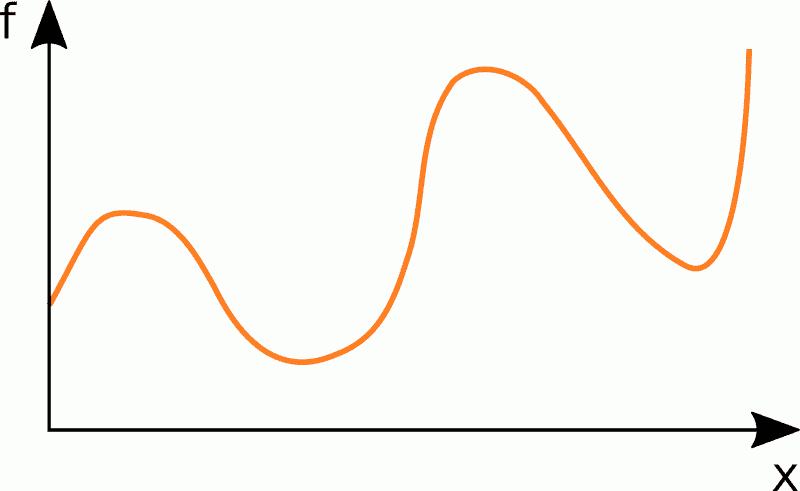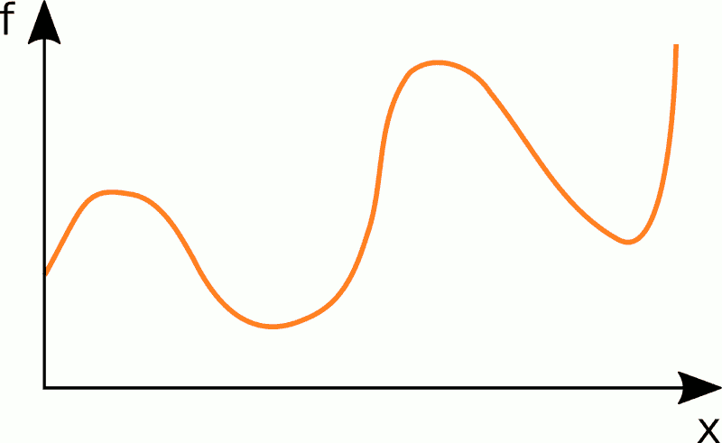

左:*导数是连接两点的直线在所述两点间消失距离的极限内的斜率。右图:斜率是高度变化除以位置变化，即*δf*/δx .(来源:作者)*

于是，斜率很自然地被定义为

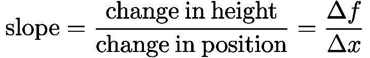

导数如此有用的原因之一是，在极值点——最小值，函数的谷底，最大值，函数的波峰——导数总是正好为 0。从绘制函数的最小值和最大值的斜率可以直接看出这一点。


*在最小值和最大值中，斜率为零(水平)，即 f′= 0。(来源:作者)*

更棒的是！导数不仅告诉你，你现在是在最小值还是最大值，它还告诉你在哪个方向可以找到一个！*方向*这里的字面意思是你沿着 *x* 轴移动的方向，即你是否增加或减少参数 *x* 。

这是怎么回事？正如本节介绍中所承诺的，衍生工具是一种工具，它可以让你在任何时候知道什么是上涨，什么是下跌。如果你想最大化函数值，也就是你想找到你周围的最高点，那你就往上走。

这到底是什么意思？考虑你目前处于参数值 *x₀* 。在那里，局部导数是*f*'(*x₀*)。如果导数大于零，这意味着增加 *x* 你上升，减少 *x* 你下降。那么，你怎么做才能更接近你的目标，最高点呢？你增加 *x* 。更精确地说，通过在正斜率方向上迈出一步，选择新的参数值 *x* :

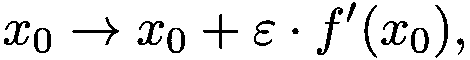

其中 *ɛ* 量化了你的步长。在机器学习行话中，步长被称为[学习速率](https://en.wikipedia.org/wiki/Learning_rate)。

这个公式自动涵盖了相反的情况，即导数小于零。负的*f*’意味着对于更大的 *x* ，你下降，远离你的目标，最高点。因此，在负*f*'(*x₀*)时，向上意味着向更小的**x*-值迈进一步。如果你想最小化函数值，你进行类似的操作，只是现在你采取*ɛ*-向负斜率(下坡)方向的步骤:*

*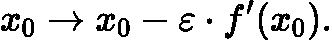*

*该过程如下图所示。*

***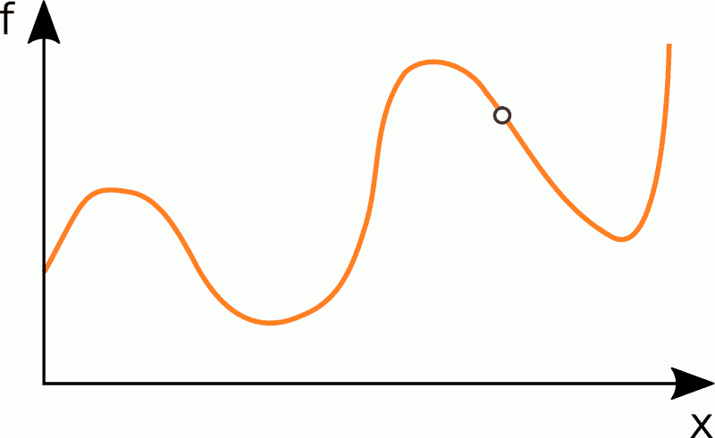*

**导数用于迭代寻找局部最大值(左)或最小值(右)。(来源:作者)**

*敏锐的读者会注意到这种方法的几个问题。首先，你只会找到最接近你的起点的最小值或最大值。在上面的例子中，如果你碰巧开始更靠近 *x* ₘᵢₙ,₂，而不是 *x* ₘᵢₙ,₁，使用所述方法的最小化将总是把你带到 *x* ₘᵢₙ,₂，而不是 *x* ₘᵢₙ,₁，尽管这将是一个更低的点，即*更好的点。**

*这是一个众所周知的问题，源于导数本身的局部性质，也是一个难题。每一种基于导数的方法都有这个固有的缺点。这个问题甚至更大，尤其是在更高维度中，因为除了最小值和最大值之外，还有鞍点，其他具有*f*′= 0 属性的实体，它们会干扰你对最优解的追求。*

*不幸的是，到目前为止，人类还没有一种已知的方法来判断是否存在一个更好的点，更不用说如何系统地找到它了。已经发明了大量的工具来至少缓解这个问题，但是一个通用的解决方案可能还需要很长时间。*

*第二个问题是步长的选择 *ɛ* 。如果它太大，你就有超调的风险，也就是说，你可能会跳过一个最优值，而不是接近它。另一方面，如果它太小，你可能不得不采取许多步骤来接近最佳值。更糟糕的是，步长实际上不是 *ɛ* 而是*ɛ*⋅*f*’因此与导数的值成比例。因为在极值点，当你接近它时，导数变为零，导数会变得越来越小，这反过来导致你的步长越来越小。为了克服这种减速和过冲问题，在实际应用中，自适应地选择ɛ*。**

# *向更高维度的旅行*

*但是，当我们不是只有一个参数，而是通常有成百上千个参数时，现实不是更复杂吗？不，不是真的。事实上，将上一节描述的方法从一个维度推广到任意多个维度几乎是令人惊讶的容易。*

*让我们从一维到二维开始。那相当于从单参数函数 *f* ( *x* )到双参数函数 *f* ( *x* ， *y* )。就像 *f* ( *x* )的图是二维的(一维为输入 *x* ，一维为输出 *f* ( *x* ))，而 *f* ( *x* ， *y* )的图是三维的(两个输入+一个输出)。你可以把它想象成一幅风景，把 *f* ( *x* ， *y* )想象成一幅高度图。*

*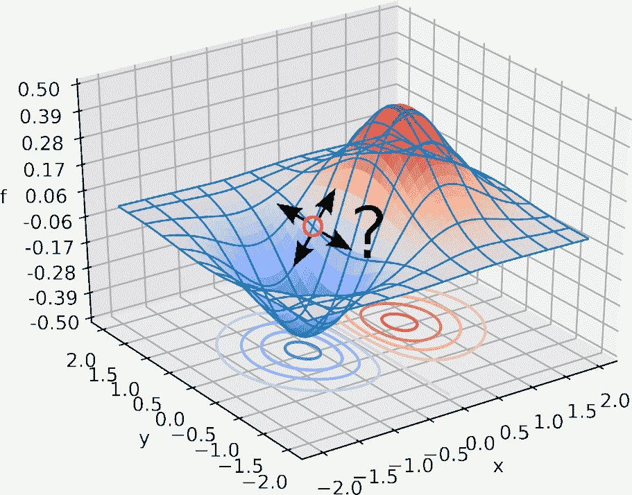*

**“风景”由一个二维函数 f(x，y)定义。(来源:作者)**

*我们正在尝试做和我们之前在一维中做的一样的事情，也就是找到一个局部最优。假设我们正在寻找一个局部最小值。我们在一维情况下的逻辑仍然完全适用:为了接近下一个局部最小值，应该走下坡路。但为此我们需要知道斜率。我们如何计算二维的斜率？*

*比如在 *x* ₀ *x* =-0.5 处平行于*y*-轴的直线，可以看做常数为 *x* =-0.5 的函数*y*₀*g*(*y*)=*f*(-0.5， *y* )。这意味着在任意点( *x* ，y)，我们可以将二维函数分割成两个一维函数。我们已经知道如何得到一个一维函数的斜率！我们简单地计算它的导数。*

*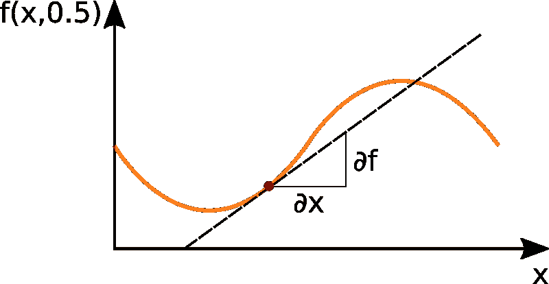**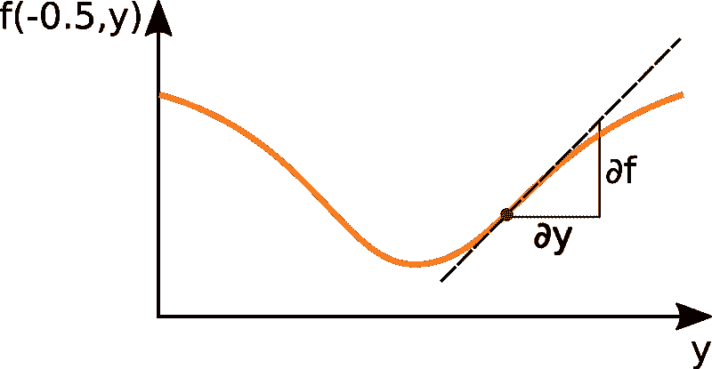*

**在点(-0.5，0.5)垂直穿过 f(x，y)-风景，平行于 x 轴(左)，平行于 y 轴(右)。(来源:作者)**

*但是首先，我们必须稍微改进一下我们的符号。既然有不止一个变量，符号 *f* 变得模糊不清，因为不清楚导数是关于 *x* 还是 *y* 。为了消除歧义，有一个更通用的符号。表示相对于 *x* 的导数*

*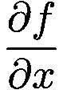*

*相对于 *y* 的导数为*

*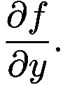*

*符号 [∂有很多名字](https://en.wikipedia.org/wiki/%E2%88%82#Names_and_coding)，比如“die”、“doh”或者——我最喜欢的——“dabba”，等等。但由于它是一个程式化的字母 d，你可以简单地把它读作“dee ”,而关于 *x* 的导数读作“dee eff dee ex”。如果你不习惯多元微积分，你可能会对一个分数突然被用来概括一个简单的质数符号感到困惑。这是很自然的，因为正如我们在上一节看到的，导数*是*的一个分数:*

*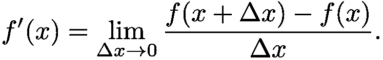*

*在极限过程的框架中，您可以将分子 *∂f* 解释为 *f* 的差，将分母 *∂x* 解释为 *x* 的差。*

*确定了符号之后，我们如何将两个 1-D 导数组合回一个二维实体，这样我们就可以知道在哪个方向改变我们的参数( *x* ， *y* )？*

*这是微积分的伟大奇迹之一，只要你做足够小的步骤，你甚至不需要把它们结合起来。如果你沿着 y 方向迈出一小步，就像在一维情况下一样，也就是说，*

*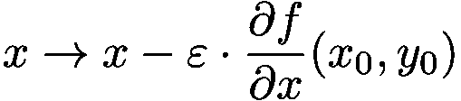*

*在 *x* 方向上的另一小步，同样，就像在一维空间中一样，也就是说，*

*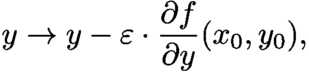*

*你已经有效地向正确的方向做了一个二维移动，直接向最小值移动。就步长而言，什么样的*足够小*？严格来说，只有当步长是数学家所说的*无穷小*，即*无限小*时，两个一维步长才与一个二维步长相同。然而，我们在这里非常安全，因为忽略有限步长的 *x* -和 *y* 维度的相互作用所产生的误差随着步长的增大而增大。这意味着当你增加步长时，你会在混合维误差变得显著之前很久就感觉到来自单参数导数的误差(因为前者是𝒪( *ɛ* 的量级，而后者是𝒪( *ɛ* 的量级，并且 *ɛ* 很小)。*

*当然，有一种更好、更简洁的方式来表达你实际上在为每个维度做同样的事情。首先，您可以定义 *x* 和 *y* 的简写:*

*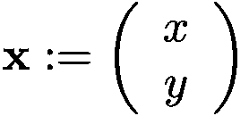*

*第二，函数的所有 1-D 导数的集合，梯度*由 *∇ f* 表示，在 2-D 中定义为**

*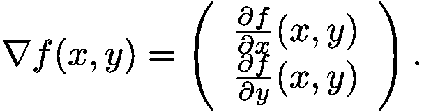*

*因此，您可以将两个一维优化步骤写成一个二维步骤:*

*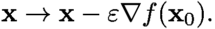*

*既然我们已经看到了如何将一个二维问题完美地分解成两个一维问题，那么还有什么能阻止我们进入三维、42 维或任何其他可以想象的维数呢？什么都不会！*

*考虑任意正整数维度 *N.* 再次使用变量的简写*

*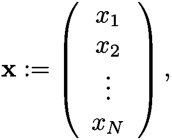*

**N* 维的斜率可以写成 *N* 一维斜率的组合:*

*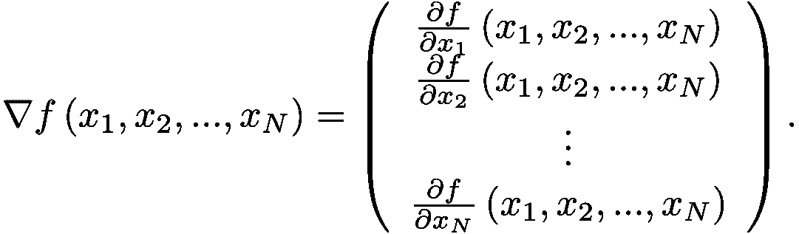*

*此外，以这种方式编写，在 *N* -D 中的优化步骤看起来与在 2d 中完全一样:*

**

*在这一点上，也许你认为计算高维导数的机制并不困难，毕竟，但是你仍然不太适应在 N 维空间中思考。如果是这样，不要担心，你在好公司！就像艾的元老之一 Geoffry Hinton 建议的那样:*

> *为了处理 14 维空间中的超平面，想象一个 3 维空间并大声对自己说 14。每个人都这样做。*
> 
> *Geoffry Hinton(在他存档的 Coursera MOOC，[讲座 2c:认知的几何观点](https://www.cs.toronto.edu/~hinton/coursera/lecture2/lec2c.mp4))，大约 1:00 分钟)*

*为了理解关于梯度的一切，你总是可以求助于像我们上面的例子中那样的三维景观，梯度下降就是沿着这种景观的山丘走下去。如果你甚至在 3d 中仍然为可视化梯度下降而挣扎，来自[losslandcape.com](https://losslandscape.com)的人们为你制作了[一个美丽的动画(带有俗气的画外音)](https://www.youtube.com/watch?v=Q3pTEtSEvDI)。*

# *区分一些代码*

*现在我们已经谈了很多关于一维或多维数学函数的导数。但是一段计算机代码的导数是什么呢？让我们看看一些具体的编程语言，计算一些实际的代码导数。接下来，你要么应该熟悉初等函数的导数，比如 x、sin(x)和 exp(x)，要么[手边有参考文献](https://en.wikipedia.org/wiki/Derivative#Rules_for_basic_functions)。*

*例如，考虑用 Python 实现的这个简单函数:*

```
*def f(x: float) -> float:
    return 3.0 * x*
```

*该函数实现了数学函数*f*(*x*)= 3*x*。在微积分课上，计算它的导数是最简单的任务:*f*'(*x*)= 3。那么，在 Python 中，导数的最佳可能实现是什么样的呢？这个怎么样:*

```
*def fprime(x: float) -> float:
    return 3.0*
```

*这可以被公正地称为可能的最佳实现。它计算机器精度的导数值。人们甚至可以说，这个导数实际上是*精确的*，并且只有它在给定的 *x* 处的评估引入了机器精度的近似值。*

*让我们看看另一个例子，这次是在 Scala 中:*

```
*def g(x: Double): Double =
    math.sin(x)*
```

*再次考虑这里实现的数学函数:*g*(*x*)= sin(*x*)。这个重要但初等的函数的导数简单来说就是*g*'(*x*)= cos(*x*)。所以我们的 Scala 函数 **g(x: Double): Double** 的导数应该是这样的:*

```
*def gprime(x: Double): Double =
    math.cos(x)*
```

*这是最后一个例子，这次是用 C 语言，以确保我们理解正确:*

```
*float h(float x) {
    return exp(x) + 1.0/x;
}*
```

*我们需要一个函数 **float hprime(float x)。**会是什么样子？再次从代码中实现的实际数学函数开始*

*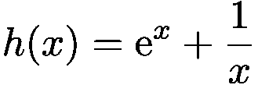*

*应用基本的微分法则，我们得到*

*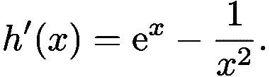*

*这可以很容易地在 C 中再次实现！*

```
*float hprime(float x) {
    return exp(x) - 1.0/powf(x, 2);
}*
```

*很简单，实现一个数学函数的代码的导数就是这个函数的导数的实现。*

# *复杂的函数不过是简单函数的链*

*到目前为止，还不需要自动化。上一节示例中的导数可以简单地手工实现。但是更复杂的函数呢？每一个函数，无论多么复杂，都是由简单的运算组成的。为了说明如何从简单到复杂，让我们从*

**

*函数 *h(x* )可以看作是两个函数后续应用的结果*

*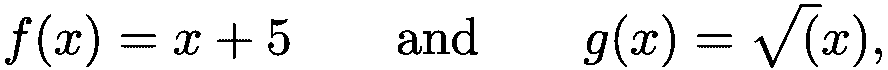*

*从这里可以看出:*

*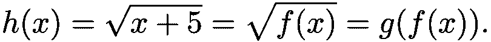*

*通过将一个函数的结果插入到另一个函数中来创建新函数被称为*函数组合*。有一个特殊的符号可以让你避免迷失在所有这些括号中:*

*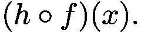*

*让我们更进一步，将 *h* ( *x* )插入另一个函数*

*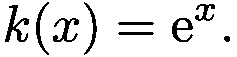*

*结果将会是*

*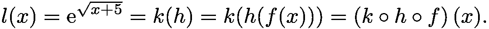*

*当然，我们可以无限期地继续这个游戏，组合越来越多的功能:*

*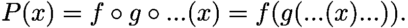*

*有趣的是，函数可以由初等函数组成，这一事实也允许我们由这些初等函数的导数组成它的导数。你可能记得这是高中微积分的另一个概念，叫做 [*链式法则*](https://en.wikipedia.org/wiki/Chain_rule) :*

*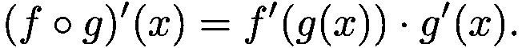*

*如果 *g* ( *x* )本身是一个复合，链规则可以递归应用，以区分任意长的复合链。*

*因此，只要我们知道如何区分相对较小的一组初等函数，如 sin( *x* )、exp( *x* )、log( *x* )和 *xⁿ* ，以及基本运算，如函数的和与积，链式法则为我们提供了计算任何函数的导数的简单方法，无论它有多复杂。*

*你现在可以用这个方法手动计算任何函数的导数，比如在一张纸上，然后用代码实现结果。从数学上来说，这种方法没有错。然而，实际上，即使你只有一个中等复杂的函数，例如，几十个因子的乘积，每个因子都由几个连锁的初等函数组成，这个过程也会变得冗长而容易出错。对于严肃的应用程序，例如，由成千上万个基本操作组成的 DNN 的训练，手工方法将是荒谬的。这回避了一个老问题，当面对大量繁琐的工作时，这个问题总是会出现:[别人不能做吗？](https://comb.io/UhsQJO)

是的，电脑可以！要让计算机区分任何可微分的函数，我们只需教会它如何区分简单的运算和链式法则——就大功告成了！*

*链式法则的应用是一个纯粹的机械过程，我们可以很容易地将其转化为算法并交给计算机。这就是*自动*差异化背后的理念。它可以通过多种方式实现，例如使用预处理器生成微分函数的实际代码，就像我们在上面的例子中手动完成的一样。更常见的方法是在运行时观察你的程序，在所谓的*磁带*上记录基本操作的序列(或者说图形),然后动态地计算磁带代码的导数。*

# *结论*

*今天的博文到此结束。我们已经了解了软件 2.0 的概念及其当前最重要的化身，差异化编程。在刷新了我们的高中微积分知识之后，我们已经看到了如何利用导数来针对得分函数进行迭代优化，也就是说，我们已经了解了梯度下降的本质。看例子，我们已经看到实现数学函数的代码的导数是所述函数的导数的实现。最后，我们展示了如何使用链式法则将任意函数的微分转化为纯机械过程，为自动微分开辟了道路。我希望你喜欢这篇博文，甚至可能学到一些新东西。*

*在后续的文章中，我们将更深入地探究可微分编程的算法细节，并关注以下几点:*

*   *自动微分(AD)如何工作*
*   *什么是正向模式和反向模式(反向传播)自动区分(AD)*
*   *为什么梯度下降*需要*反模式广告*
*   *如何计算 for 循环、条件和其他控制结构的导数*
*   *除了机器学习之外，还有什么可区分的编程可以使用*

*与此同时，您可能希望查看以下精彩的演示，以进一步深入了解差异化编程的世界:*

*   *Ryan P. Adams，[你应该用自动微分](https://www.youtube.com/watch?v=sq2gPzlrM0g)，2016*
*   *Matthew J. Johnson，[自动微分](http://videolectures.net/deeplearning2017_johnson_automatic_differentiation)，深度学习暑期学校 Montreal 2017*
*   *诺尔·威尔士，[可微函数编程](https://www.youtube.com/watch?v=igRLKYgpHy0)，Scala Days 2018*
*   *Viral B. Shah，[可微分编程——深度神经网络的一个令人兴奋的概括](https://www.youtube.com/watch?v=6V75lblJ2ns)，PyData Delhi 2019*

*最后但同样重要的是，如果你想深入了解广告背后的数学，那么我有一个特别的奖励给你:*

*   *Conal Elliott，[自动微分的简单本质](https://www.youtube.com/watch?v=ne99laPUxN4)，微软研究院 Talk (2018)*

**原载于 2020 年 5 月 11 日*[*https://consilica . de*](https://consilica.de/how-differentiable-code-makes-the-machine-learning-world-go-round-part-one/)*。**