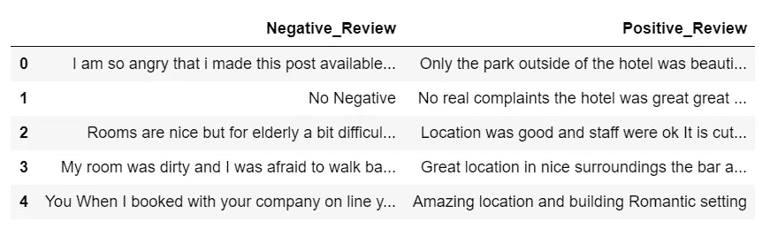
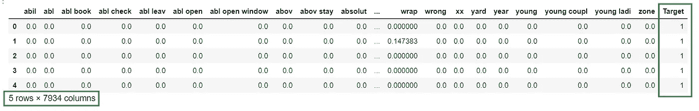
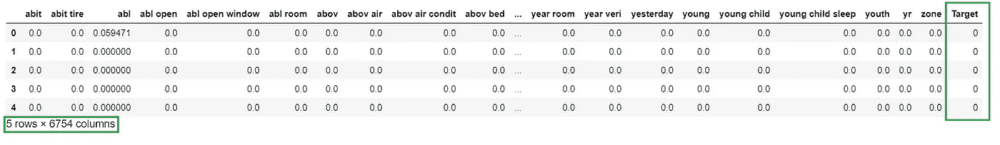
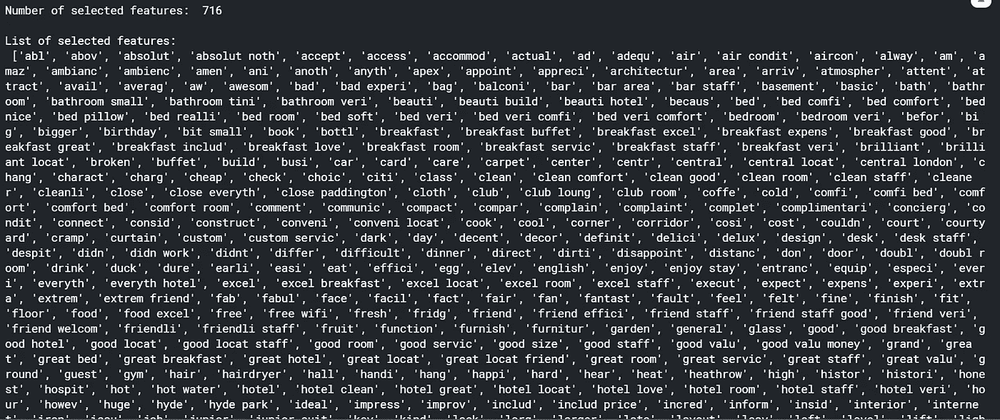
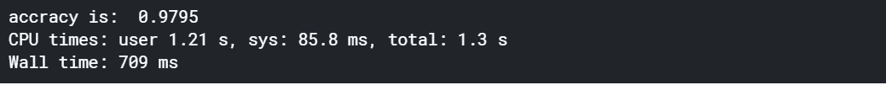
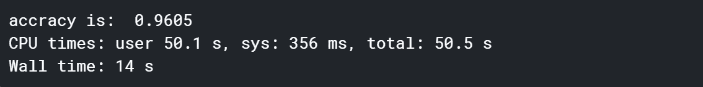

# LDA 和 TF-IDF 在文本分类中具有更高的准确率和更少的处理时间

> 原文：<https://towardsdatascience.com/higher-accuracy-and-less-process-time-in-text-classification-with-lda-and-tf-idf-d2d949e344c3?source=collection_archive---------14----------------------->


帕特里克·托马索在 [Unsplash](/?utm_source=unsplash&utm_medium=referral&utm_content=creditCopyText) 上的照片

## 文本分类中特征选择方法的实现

变量或特征的大小被称为数据集的维度。在文本分类方法上，特征的大小可以列举很多。在这篇文章中，我们将使用线性判别分析-LDA 实现 tf-idf 分解降维技术。

我们在这项研究中的途径:

1.正在准备数据集

2.将文本转换为特征向量

3.应用过滤方法

4.应用线性判别分析

5.构建随机森林分类器

6.结果比较

所有的源代码和笔记本都已经上传到这个 [Github 仓库](https://github.com/Qmoein/LDA-Text-Classification)。

# 问题定式化

提高文本分类的准确性和减少处理时间。

# 数据探索

我们使用来自 Kaggle 数据集的“欧洲 515，000 酒店评论数据”。这些数据是从 Booking.com 搜集来的。文件中的所有数据对每个人都是公开的。数据最初归 Booking.com 所有，你可以通过 Kaggle 上的这个简介下载。我们需要的数据集包含 515，000 条正面和负面评论。

# 导入库

我们用过的最重要的库是 Scikit-Learn 和 pandas。

```
import numpy as np
import pandas as pd
import matplotlib.pyplot as plt
import seaborn as sns
import requests
import jsonfrom sklearn.feature_extraction.text import TfidfVectorizer
from sklearn.model_selection import train_test_split 
from sklearn.ensemble import RandomForestClassifier
from sklearn.feature_selection import VarianceThreshold
from sklearn.metrics import accuracy_score, roc_auc_score
from sklearn.preprocessing import StandardScaler
from nltk.stem.snowball import SnowballStemmer
from string import punctuation
from textblob import TextBlob
import re
```

# 正在准备数据集

我们将只研究两类，积极的和消极的。因此，我们为每个类别选择 5000 行，并将它们复制到 Pandas 数据帧中(每个部分 5000 行)。我们在这个项目中使用了 Kaggle 的笔记本，因此数据集被加载为本地文件。如果您正在使用其他工具或作为脚本运行，您可以下载它。让我们看一下数据集:

```
fields = ['Positive_Review', 'Negative_Review']
df = pd.read_csv(
    '../input/515k-hotel-reviews-data-in-europe/Hotel_Reviews.csv',
    usecols= fields, nrows=5000)df.head()
```



## **使用 NLTK SnowballStemmer 对单词进行词干分析:**

```
stemmer = SnowballStemmer('english')
df['Positive_Review'] = df['Positive_Review'].apply(
    lambda x:' '.join([stemmer.stem(y) for y in x.split()]))df['Negative_Review'] = df['Negative_Review'].apply(
    lambda x: ' '.join([stemmer.stem(y) for y in x.split()]))
```

## **删除停用词:**

用[countwordsfree.com](https://countwordsfree.com/stopwords/english/json)列表理解和 pandas.DataFrame.apply 排除停用词

```
url = "[https://countwordsfree.com/stopwords/english/json](https://countwordsfree.com/stopwords/english/json)"
response = pd.DataFrame(data = json.loads(requests.get(url).text))
SW = list(response['words'])df['Positive_Review'] = df['Positive_Review'].apply(
    lambda x: ' '.join([word for word in x.split() if word not in (SW)]))df['Negative_Review'] = df['Negative_Review'].apply(
    lambda x: ' '.join([word for word in x.split() if word not in (SW)]))
```

## **移除数字并初始化数据集:**

```
df_Positive = df['Positive_Review'].copy()
df_Positive = df_Positive.str.replace('\d+', '')df_Negative = df['Negative_Review'].copy()
df_Negative = df_Negative.str.replace('\d+', '')
```

# 将文本转换为特征向量

单词包和 TF-IDF 是用于检测文档主题的两种方法。它们之间的区别是，BoW 使用一个词在文档中出现的次数作为度量，而 TF-IDF 在检测主题时给每个词一个权重。换句话说，在 TF-IDF 中，使用单词分数而不是单词计数，因此我们可以说 TF-IDF 测量相关性，而不是频率。

在这一部分，我们为每一列使用了 Scikit-Learn TfidfVectorizer，并为矢量化构建了一个 N 元模型，该模型可用作估计器的输入。然后，我们添加一个目标列，对于正面评价，给定值为“1”，对于负面评价，给定值为“0”。注意，我们定义了“min_df=2”。

```
tfidf = TfidfVectorizer(min_df=2,max_df=0.5, ngram_range=(1,3))
features = tfidf.fit_transform(df_Positive)df_Positive = pd.DataFrame(
    features.todense(),
    columns=tfidf.get_feature_names()
)df_Positive['Target'] = '1'
df_Positive.head()
```



如您所见，结果显示了 7，934 个特征，这是一个很大的数字，在目标列中有值“1”。

对于负面评价，我们也会这样做:

```
tfidf = TfidfVectorizer(min_df=2,max_df=.05, ngram_range=(1,3))
features = tfidf.fit_transform(df_Negative)df_Negative = pd.DataFrame(
    features.todense(),
    columns=tfidf.get_feature_names()
)df_Negative['Target'] = '0'
df_Negative.head()
```



有 6，754 个特征，负面评价的目标值为“0”。现在我们将通过追加一个到另一个来合并这两个数据集。共同特征将被认为是一个，但目标是不同的。

```
df = df_Positive.append(df_Negative)
df.shape
#out[] (10000, 12676)
```

因此，最终数据集有 10，000 个实例(每个实例有 5，000 个实例)和 12，676 个要素，这意味着‭2,012 要素是相互的((7934+6754)-12676)。

```
#change the value of NaN to Zero
df = df.fillna(0)
```

## 定义训练/测试分割:

```
#define x and y:
x = df.drop('Target',axis=1)
y = df['Target']x.shape, y.shape
#out[] ((10000, 12675), (10000,))#define train-test-slpit:
x_train, x_test, y_train, y_test = train_test_split(
    x, y, test_size = 0.2, random_state = 0, stratify = y)
```

# 应用过滤方法-移除常量要素

常量要素是数据集中所有输出仅包含一个值的要素。所以他们不能给我们任何有价值的信息来帮助分类器。因此，最好将它们移除。

```
constant_filter = VarianceThreshold(threshold = 0.0002)
constant_filter.fit(x_train)
feature_list = x_train[x_train.columns[
    constant_filter.get_support(indices=True)]]print('Number of selected features: ' ,len(list(feature_list)),'\n')
print('List of selected features: \n' ,list(feature_list))
```



您可以看到所选功能的列表。它显示了之前被词干化的 716 个单词的数量。这个列表可以帮助我们通过分析列表及其项目与我们的主题(正面和负面评论)的联系来分析我们输出的质量。

```
x_train_filter = constant_filter.transform(x_train)
x_test_filter = constant_filter.transform(x_test)x_train_filter.shape, x_test_filter.shape, x_train.shape
#out[] ((8000, 716), (2000, 716), (8000, 12675))
```

因此，结果显示，94.35%的特征是不变的，而模型丢弃了它们。因此，我们删除了 11，959 个特征，这是一个相当大的数字。所以我们必须定义一个新的训练，测试数据帧:

```
x_train_filter = pd.DataFrame(x_train_filter)
x_test_filter = pd.DataFrame(x_test_filter)
```

# 应用过滤方法-移除相关要素

相关特征是在线性空间中彼此接近的特征。移除它们的函数写在下面。

```
def get_correlation(data, threshold):
    corr_col = set()
    cormat = data.corr()
    for i in range(len(cormat.columns)):
        for j in range(i):
            if abs(cormat.iloc[i,j]) > threshold:
                colname = cormat.columns[i]
                corr_col.add(colname)
    return corr_colcorr_features = get_correlation(x_train_filter, 0.70)
```

然后，在移除相关特征之后，我们定义新的数据帧。结果显示我们去除了 23 个相关特征。

```
x_train_uncorr = x_train_filter.drop(labels= corr_features, axis = 1)
x_test_uncorr = x_test_filter.drop(labels= corr_features, axis = 1)
x_train_uncorr = pd.DataFrame(x_train_uncorr)
x_test_uncorr = pd.DataFrame(x_test_uncorr)
x_train_uncorr.shape, x_test_uncorr.shapeout[] ((8000, 693), (2000, 693), (8000, 716))
```

# 应用线性判别分析— LDA


伊万·弗拉尼奇在 [Unsplash](/s/photos/offroad?utm_source=unsplash&utm_medium=referral&utm_content=creditCopyText) 上的照片

现在，我们准备在数据集上建立 LDA 模型，进行特征选择，然后在其上运行随机森林分类器。

```
from sklearn.discriminant_analysis import LinearDiscriminantAnalysis as LDAlda = LDA(n_components=1)
x_train_lda = lda.fit_transform(x_train_uncorr, y_train)
x_test_lda = lda.fit_transform(x_test_uncorr, y_test)
```

# 构建随机森林分类器(RFC)

它是一种元估计器，将多个决策树分类器拟合到数据集的各个子样本上，并使用平均来提高预测精度和控制过拟合。

```
def runRandomForest(x_train, x_test, y_train, y_test):
    clf = RandomForestClassifier(n_estimators=100, random_state=0, n_jobs=-1)
    clf.fit(x_train, y_train)
    y_pred = clf.predict(x_test)
    print ('accracy is: ', accuracy_score(y_test, y_pred))
```

使用 LDA 模型运行随机森林分类器:

```
#Run calssifier **using** LDA model
%%time
runRandomForest(x_train_lda, x_test_lda, y_train, y_test)
```



LDA 模型的准确度为 97.95%，壁时间约为 709 毫秒。在非 LDA 模型中，结果仍可接受，这是因为 tf-idf 矢量化效果很好。但是正如你在墙下面看到的，时间是 14 秒，比 LDA 模型慢 19.74 倍。

```
##Run calssifier **without** using LDA model
%%time
runRandomForest(x_train, x_test, y_train, y_test)
```



所有的源代码和笔记本都已经上传到这个 [Github 库](https://github.com/Qmoein/LDA-Text-Classification)中。我期待听到任何反馈。[联系我。](mailto:moein.ghodsi@gmail.com)

此外，你可以在这里阅读更多关于 NLP“文本分类:来自 5 个 Kaggle 竞赛的所有提示和技巧”[。](https://neptune.ai/blog/text-classification-tips-and-tricks-kaggle-competitions)