# 高阶数值微分方程(Python)

> 原文：<https://towardsdatascience.com/higher-order-numeric-differential-equations-python-bc23dd148a0b?source=collection_archive---------16----------------------->

## 这篇文章展示了如何在 python 中使用高阶方法求解微分方程，以最小化截断误差并更快地收敛。

根据题目的性质，需要对微积分和基本编程有所了解。

# 进口

安装来自 https://www.anaconda.com/distribution/的巨蟒

```
import numpy as np
import matplotlib.pyplot as plt
from mpl_toolkits.mplot3d import Axes3D # For 3D Plotting of Systems
```

# 遵守代码

我鼓励你在 Google colab 上试验一下代码，链接是[这里](https://colab.research.google.com/drive/14KT0sLGFphRF_QeL8e3by7tfNY0xkzq5)或者[https://colab . research . Google . com/drive/14kt 0 slgfphrf _ qel 8 E3 by 7 tfny 0x kzq 5](https://colab.research.google.com/drive/14KT0sLGFphRF_QeL8e3by7tfNY0xkzq5)

# 背景

提供一些背景知识，说明为什么我们关心截断误差，以及为什么我们需要使用高阶方法来实现更低的截断误差

## [基本泰勒展开式](https://en.wikipedia.org/wiki/Taylor_series)

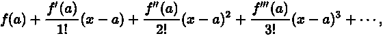

如果你对泰勒展开式感到困惑，我推荐 [3blue1brown 关于这个主题的视频](https://www.youtube.com/watch?v=3d6DsjIBzJ4)

## 什么是截断误差？

从微积分我们知道截断误差是泰勒级数的下一项，展开式的第(n+1)项。也就是说，它们是作为部分和逼近一个无穷和的误差。

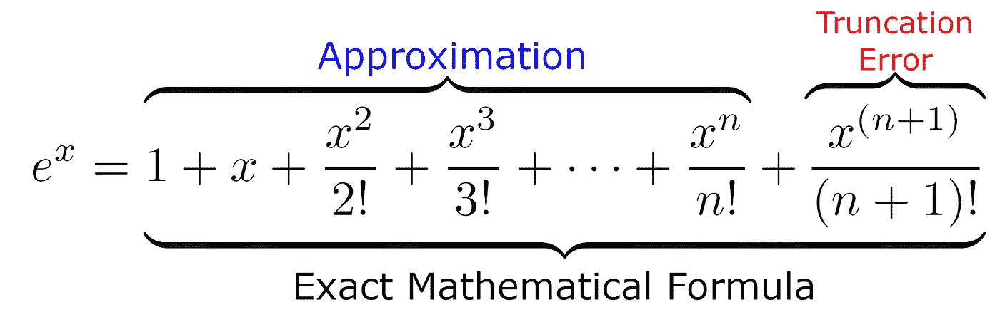

就计算机而言，有一个术语叫做机器ε或双精度。超过这个精度，计算机就无法区分两个数字。这是机器ε的截断误差，虽然在数学中不被认为是精确的结果，仍然是近似值，但在科学计算中被认为是精确的。

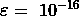

机器 Epsilon

## [欧拉法](https://en.wikipedia.org/wiki/Euler_method)

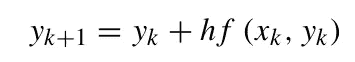

在上式中，h 或 dx 是时间步长。该方程的截断误差为 O(h ),这意味着要将误差从 e-8 减小到 e-10，新的时间步长必须比旧的时间步长小 e-2。这使得欧拉方法的精度增加极其缓慢。

# 动机

## 为什么收敛速度很重要？

现在有人可能会问，为什么收敛速度很重要。除了更高的收敛速度会减少大型计算的等待时间这一事实之外，还有另一个原因。原因是我们面临的另一个误差，叫做舍入误差。

> **舍入误差**、[【1】](https://en.wikipedia.org/wiki/Round-off_error#cite_note-1)也称为**舍入误差**、[【2】](https://en.wikipedia.org/wiki/Round-off_error#cite_note-2)是给定[算法](https://en.wikipedia.org/wiki/Algorithm)使用精确算法产生的结果与相同算法使用有限精度舍入算法产生的结果之间的差异。

这实质上意味着我们做的每一个计算，每一个时间步，都会有一点点误差。时间步长越多，我们执行的计算越多，舍入误差就越大。存在一个舍入误差将超过截断误差的点，执行更多的计算将使结果值不准确。

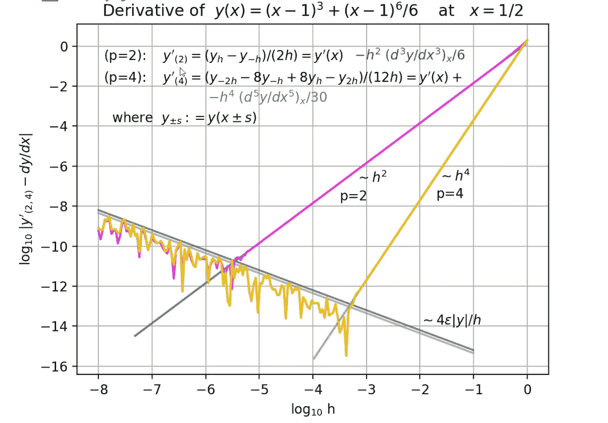

上面的例子突出了两种不同近似的截断误差和舍入误差，一种用紫色表示截断误差～h，另一种用黄色表示截断误差~h⁴。

## 低阶方法的问题(欧拉方法)

请注意，在上图中，截断误差为 2 ~h 阶的紫色图(类似于欧拉法)比高阶的黄色图精度低得多(截断误差更高)。

这是因为误差仅以二次方式缩放，也就是说，如果将时间减少一半，误差会减少四分之一。而 4 阶的高阶方法，同样将时间步长减少一半，所得误差将减少十六分之一。

# 寻找高阶方法

这种方法适用于任何订单；然而，在本帖中，我们将重点关注 4 阶方法，特别是 RK4。

如果我们将泰勒展开式扩展到我们所希望的阶，我们将得到高阶方法。

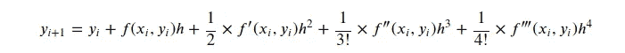

[四阶龙格-库塔法](https://www.youtube.com/watch?v=hGN54bkE8Ac)

然而，通常很难对微分方程进行微分以得到 d/dx(f(x))，但是不同的数学家发现了不同的四阶方法，本文将重点介绍的一种方法是由 Runge 发现的，它被称为 RK4。

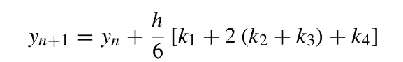

RK4 方法

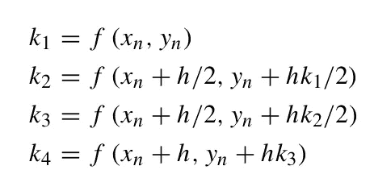

RK4 坡度估计值/权重

该函数具有截断误差~O(h⁴，这意味着从 e-8 移动到 e-10，时间步长的差异将是∜(e-2，这将使计算量低得多。

在这篇文章中，我不会太深入地研究数学，因为我相信在计算机科学中有很多实际的应用可以在不深入理解基础数学的情况下实现。我链接了下面的资源来帮助更好地理解[数学。](https://www.youtube.com/watch?v=hGN54bkE8Ac)

# 解微分方程

最后，有趣的部分开始了，所以我们必须选择我们要解决的微分方程系统。我将展示一个更复杂的微分方程系统的例子，因为这将涵盖解决更简单的系统所需的技能。

我们今天要求解的系统是洛伦兹系统，更普遍的说法是蝴蝶效应。

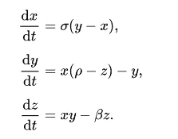

[洛伦兹系统](https://en.wikipedia.org/wiki/Lorenz_system)

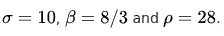

常量的值

[https://gist . github . com/cryogenic planet/04f 4f 580581488516662795373 e5d 859](https://gist.github.com/CryogenicPlanet/04f4f580581488516662795373e5d859)

上面的代码片段执行单个时间步长的操作，即 dt 以向量的形式在[dx，dy，dz]中移动。把它看作一个向量运算会更容易理解，这就是 NumPy 的亮点，它允许你把这个时间步长作为一个向量函数来求解。

上面的函数是一个通用的 rk4，时间步长，它对于高效求解高阶微分方程是必不可少的，然而，为了求解 Lorenz 系统，我们需要设置一些其他函数来使用这个公式。

首先，让我们用洛伦兹系统的常数建立函数 dx，dy，dz

```
# Constants of the Lorenz System
b = 8/3
s = 10
r = 28# Functions dx,dy,dz of the Lorenz Systemdef dx(t,x,y,z):
    return s*(y-x)def dy(t,x,y,z):
    return x*(r-z) -ydef dz(t,x,y,z):
    return x*y - b*z
```

现在做一个函数来计算洛伦兹系统的点

[https://gist . github . com/cryogenic planet/e 07988808d 14 be 57334 C1 ef 6d 8112 e 09](https://gist.github.com/CryogenicPlanet/e07988808d14be57334c1ef6d8112e09)

最后，我们可以从退出部分开始，图形化和可视化数据。

# 以 3D 方式可视化数据

这里我们将使用我们之前导入的 Axes3D 模块。

```
#Calling the previous function arbitrary start pointsx,y,z = lorenz(0,1,1.05,0,0.01)
fig = plt.figure(figsize=(12,10))# This is how we set the 3D plot
ax = fig.gca(projection='3d')# Plotting the values
ax.plot(x, y, z, lw=0.5,alpha=0.7)

# Plotting the final values
ax.scatter(x[-1],y[-1],z[-1],color=(1,0,0))#Very slightly different starting values
x_1,y_1,z_1 = lorenz(0,0.9,1.04,0,0.01)#Plotting slightly different starting values
ax.scatter(x_1[-1],y_1[-1],z_1[-1],color=(0,0,0))#Setting Axis Titles
ax.set_xlabel("X Axis")
ax.set_ylabel("Y Axis")
ax.set_zlabel("Z Axis")
ax.set_title("Lorenz Attractor")
```

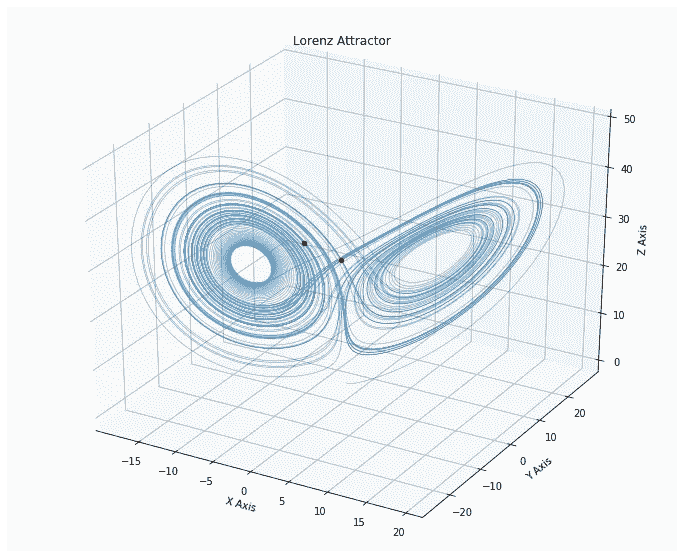

上面函数调用的情节

这凸显了洛伦兹系统固有的混沌现象，即略微不同的起始值会产生截然不同的终点。同样，这篇文章不是关于洛伦兹系统的资源，你可以在这里了解更多[https://en.wikipedia.org/wiki/Lorenz_system](https://en.wikipedia.org/wiki/Lorenz_system)

# 概述

*   创建你的微分方程作为函数
*   用 RK4 作为向量求解微分方程组
*   创建 rk4 中所有点的列表
*   使用 Axis3D 和 matplotlib 绘制 3D 点

再一次，我强烈建议您亲自尝试一下这些代码，您可以登录[https://colab . research . Google . com/drive/14kt 0 slgfphrf _ qel 8 E3 by 7 tfny 0x kzq 5](https://colab.research.google.com/drive/14KT0sLGFphRF_QeL8e3by7tfNY0xkzq5)